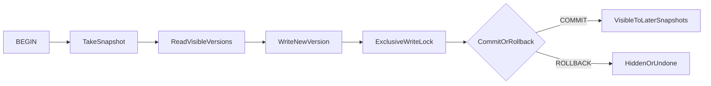
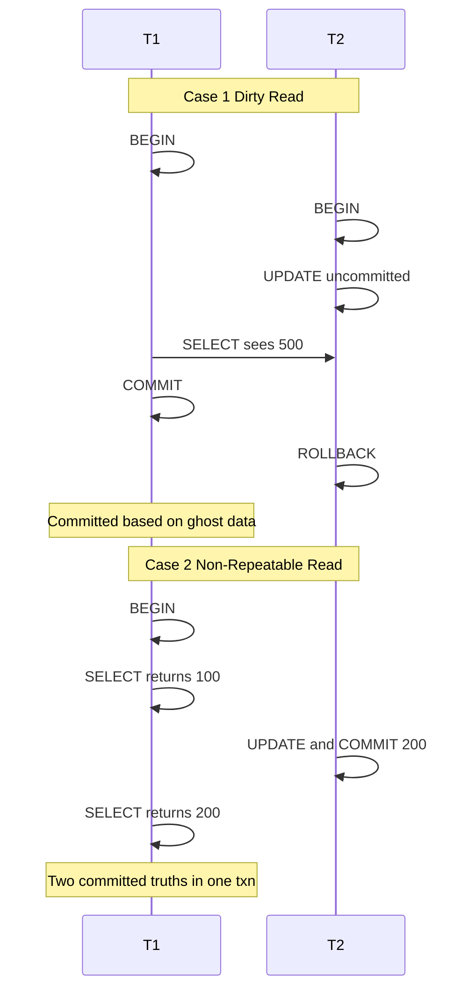
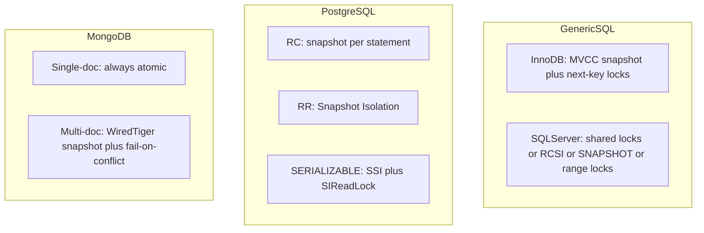
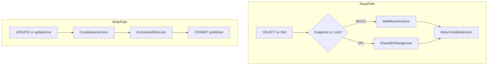

# Isolation — Interview Notes (SQL, PostgreSQL, MongoDB)

> **Course:** Fundamentals of Database Engineering — Sec 2: ACID  
> **Goal:** Understand isolation deeply enough to explain concurrency anomalies, isolation levels, MVCC vs locks, and how PostgreSQL, generic SQL (InnoDB/SQL Server), and MongoDB each implement isolation — for a final-year CSE interview.

> **Prerequisite:** [8-what-is-a-transaction.md](8-what-is-a-transaction.md) introduces isolation at a high level. [9-Atomicity.md](9-Atomicity.md) covers rollback and in-flight visibility from the atomicity angle. **This note goes deep only on Isolation.**

---

## 1. One-Minute Interview Definition

**Isolation** means concurrent transactions do not interfere with each other in ways that break your application's assumptions — **within the limits of the isolation level you chose**. The database still runs many transactions at once; isolation controls **what each one is allowed to see** while others are in flight.

Think of a **restaurant with two tables paying at the same time**:

1. Table A's waiter is counting the tip jar to split the bill.
2. Table B's waiter adds change to the same jar mid-count.
3. **Isolation** is the rule about whether Table A's waiter may count money Table B has not yet stamped on the receipt, or money Table B might take back if their payment fails.

**Say this in an interview:**

> *"Isolation is the tunable I in ACID. It does not mean 'no concurrency' — it means each transaction sees a controlled view of the database while others run. You pick a level from Read Committed to Serializable, trading throughput for protection against dirty reads, non-repeatable reads, phantoms, lost updates, and write skew. Modern engines mostly use MVCC for reads and locks or optimistic conflict detection for writes."*

---

## 2. Isolation in Depth — What It Guarantees (and What It Does Not)

| Aspect | Explanation |
|--------|-------------|
| **Definition** | Concurrent transactions behave **as if** they ran in some serial order — or, at lower levels, as if certain bad interleavings never happened. |
| **Analogy** | Two cashiers at the same counter: isolation decides whether you see another table's pencil scribble, their stamped receipt, or a frozen photocopy of the ledger from when you walked in. |
| **What the engine does** | Uses **MVCC** (multiple row/document versions + snapshots), **locks** (shared/exclusive/range), or **optimistic checks** (SSI, write-conflict abort) to control visibility and write conflicts. |
| **What it does NOT do** | Isolation does **not** replace application logic. A bank transfer still needs atomicity. Business rules like "balance ≥ 0" are **consistency** — often enforced with the right isolation **plus** correct SQL. |
| **Isolation vs Atomicity** | Atomicity = all-or-nothing for **one** transaction. Isolation = **between** transactions. |
| **Isolation vs Consistency** | Consistency = valid state → valid state. Isolation is one **tool** to get there under concurrency. |

### The Tip-Jar Analogy (In-Flight Transactions)

| Real-world | Database |
|------------|----------|
| Waiter writing a new total in **pencil** on a scratch pad | Uncommitted write in buffer pool / WiredTiger cache |
| Another waiter **reading** that pencil number | Dirty read (if allowed) |
| Cashier **stamping** the receipt (committed) | `COMMIT` — version becomes visible to later snapshots |
| Waiter **tearing up** the scratch pad | `ROLLBACK` — version hidden or undone |
| Photocopy of the ledger from when you entered | MVCC **snapshot** — frozen view of committed data |

**Key insight:** in-flight work is **pencil**, not **ink**. Isolation decides whether other transactions may read the pencil.

---

## 3. Sequential Thinking — How Isolation Works for In-Flight Transactions

Use this step order when an interviewer asks: *"What happens when two transactions run at the same time?"*

```
Step 1 → BEGIN / START TRANSACTION
         Engine assigns: PostgreSQL XID, InnoDB trx id, MongoDB session + WiredTiger txn

Step 2 → Take a SNAPSHOT (when depends on isolation level)
         • READ COMMITTED (PG, SQL Server RCSI): new snapshot at each statement
         • REPEATABLE READ / SNAPSHOT: one snapshot for the whole transaction
         • MongoDB multi-doc: snapshot at transaction start (readConcern: snapshot)

         Snapshot contents (conceptually):
         • PostgreSQL: (xmin, xmax, xip_list) — active in-flight XIDs at snapshot time
         • InnoDB: read view — list of trx ids that were active
         • WiredTiger: point-in-time view of in-memory data

Step 3 → READ: engine walks versions, picks latest VISIBLE to this snapshot
         Skip version if creating txn is in xip_list (still in flight)
         Skip version if creating txn aborted
         Writer always sees its own uncommitted versions

Step 4 → WRITE: engine creates NEW version (does not overwrite in place)
         PostgreSQL: new heap tuple with xmin = current XID; old tuple gets xmax
         InnoDB: new row version + undo log for old version
         MongoDB: new document version in WiredTiger cache (invisible outside session until commit)

Step 5 → WRITE LOCK: exclusive lock on row/document so no dirty WRITE can happen
         Even READ UNCOMMITTED allows dirty reads — but not dirty writes

Step 6 → COMMIT: mark XID committed (clog / undo commit / journal record)
         Now visible to snapshots taken AFTER this commit

Step 7 → ROLLBACK: hide or undo versions — other sessions never saw them (at RC+)
```

### PostgreSQL Visibility Rules (Interview Gold)

For each row version, PostgreSQL checks:

1. **xmin aborted?** → invisible (as if never written).
2. **xmin in my snapshot's xip_list (still in flight)?** → invisible to others (writer sees own).
3. **xmin committed before my snapshot?** → candidate to be visible.
4. **xmax set?** If deleter committed before snapshot → invisible.

**Side effect:** long-running transactions hold old snapshots → **VACUUM cannot reclaim dead tuples** → bloat → more I/O. This is a real production cost of isolation, not just theory.



---

## 4. Concurrency Anomalies — Name Them Correctly

Interviewers love when you distinguish anomalies precisely. **Two scenarios from the course are different anomalies:**

### Case 1 — Dirty Read

| Time | Transaction T1 | Transaction T2 |
|------|----------------|----------------|
| t1 | `BEGIN` | |
| t2 | | `BEGIN` (starts after T1) |
| t3 | | `UPDATE accounts SET balance = 500 WHERE id = 1` *(uncommitted)* |
| t4 | `SELECT balance FROM accounts WHERE id = 1` → **500** | |
| t5 | `COMMIT` *(based on 500)* | |
| t6 | | `ROLLBACK` *(500 never officially existed)* |

**Anomaly:** T1 read **pencil** that T2 erased. T1's committed decision is based on data that never became truth.

**Analogy:** You split the tip jar using a number Table B wrote in pencil, then Table B tore up their slip.

### Case 2 — Non-Repeatable Read / Inconsistent Snapshot

| Time | Transaction T1 | Transaction T2 |
|------|----------------|----------------|
| t1 | `BEGIN` | |
| t2 | `SELECT balance WHERE id = 1` → **100** | |
| t3 | | `BEGIN` |
| t4 | | `UPDATE ... SET balance = 200; COMMIT` |
| t5 | `SELECT balance WHERE id = 1` → **200** | |
| t6 | `COMMIT` | |

**Anomaly:** Both values were **committed truth** at the time T1 read them — but T1 saw **two different truths** in one transaction because T2 committed in between. If T1 also read other rows earlier, half the transaction can reflect "before T2" and half "after T2" → **inconsistent snapshot**.

**Analogy:** You counted the jar at 3:00 PM (100). Another table paid and got a stamped receipt at 3:01 PM (200). You count again at 3:02 PM and wonder why the jar changed — **not** because someone showed you pencil, but because reality changed mid-checkout.

> **Do NOT call Case 2 a dirty read.** Dirty = uncommitted. Case 2 = committed data changed between reads.

### Full Anomaly Reference

| Anomaly | One-line definition | Your case / example |
|---------|---------------------|---------------------|
| **Dirty read** | Read another txn's **uncommitted** write | Case 1 |
| **Dirty write** | Overwrite another txn's **uncommitted** write | Blocked by engines via exclusive write locks |
| **Non-repeatable read** | Same **row**, two reads, different **committed** values | Case 2 (same row) |
| **Inconsistent snapshot** | Different statements in one txn see different commit points | Case 2 (multi-row / multi-statement) |
| **Phantom read** | Same **range** query returns new/missing rows | `SELECT * FROM orders WHERE status='open'` returns 3 rows, then 4 |
| **Lost update** | Two txns read same value; both write; one overwrite vanishes | Both read 100, both write 110 — one +10 lost |
| **Write skew** | Each txn updates different rows; together they break an invariant | Two doctors both see one on-call, both go home — zero on call |
| **Serialization anomaly** | Committed result impossible in any serial order | Write skew is the classic SI example |



---

## 5. Isolation Levels — What Each Prevents

### 5.1 SQL Standard Minimum (ISO/IEC 9075)

| Isolation Level | Dirty Read | Non-Repeatable Read | Phantom Read | Lost Update (RMW) | Write Skew |
|-----------------|------------|---------------------|--------------|-------------------|------------|
| **Read Uncommitted** | Allowed | Possible | Possible | Possible | Possible |
| **Read Committed** | Prevented | Possible | Possible | Possible | Possible |
| **Repeatable Read** | Prevented | Prevented | Possible | Possible | Possible |
| **Serializable** | Prevented | Prevented | Prevented | Prevented | Prevented |

**Snapshot Isolation** is not in the ISO standard but appears in SQL Server, MongoDB, and (as PostgreSQL's Repeatable Read). It prevents dirty, non-repeatable, and phantom reads on the snapshot — but **write skew remains possible**.

### 5.2 What Each Engine Actually Implements

| Engine | Default | Read Uncommitted | Read Committed | Repeatable Read | Snapshot | Serializable |
|--------|---------|------------------|----------------|-----------------|----------|--------------|
| **PostgreSQL** | RC | **Same as RC** (no dirty reads) | Statement-level snapshot | **= Snapshot Isolation** (no phantoms) | *(RR)* | **SSI** (optimistic, abort + retry) |
| **InnoDB (MySQL)** | RR | Real dirty reads possible | Fresh snapshot per statement; **no gap locks** | MVCC snapshot for plain SELECT; next-key locks on locking reads | *(RR behavior)* | Plain SELECT → `LOCK IN SHARE MODE` |
| **SQL Server** | RC | Dirty reads (`NOLOCK`) | Shared locks, or **RCSI** (statement snapshot) | Range locks held to commit | **`SNAPSHOT`** (needs `ALLOW_SNAPSHOT_ISOLATION`) | Key-range locks (pessimistic) |
| **MongoDB** | N/A | **No RU** | `readConcern: local/majority` (non-txn) | N/A | **`readConcern: snapshot`** + `w: majority` in txn | **Not offered** (no write-skew detection) |

### 5.3 Which Level Fixes Which Problem (Quick Reference)

| Problem | Minimum level (standard) | Practical fix in code |
|---------|--------------------------|------------------------|
| Dirty read | Read Committed | RC+ everywhere except SQL Server `NOLOCK` |
| Non-repeatable read | Repeatable Read / Snapshot | PG RR, SQL Server SNAPSHOT, MongoDB txn snapshot |
| Phantom read | Serializable (standard) | PG RR already prevents; InnoDB RR + locking read; SQL Server Serializable |
| Lost update | Not automatic at any level | `UPDATE SET col = col + n`, `SELECT FOR UPDATE`, optimistic version column |
| Write skew | Serializable | PG `SERIALIZABLE` (SSI), pessimistic locks, or app-level sentinel row |

---

## 6. How MVCC Solves Dirty Reads and Case 2

### MVCC One-Liner

> Each write creates a **new version**. A reader picks the latest version **visible to its snapshot**. Uncommitted versions are invisible to others. **Case 1** disappears at Read Committed and above. **Case 2** disappears when the snapshot is taken **once per transaction** (Repeatable Read / Snapshot), not once per statement (Read Committed).

### MVCC vs Locks (When Each Wins)

| Mechanism | Readers block writers? | Writers block readers? | Best for |
|-----------|------------------------|------------------------|----------|
| **MVCC snapshots** | No | No (for plain reads) | High-read OLTP |
| **Shared locks (2PL)** | Sometimes | Sometimes | Pessimistic RC/RR |
| **Exclusive row locks** | N/A | Yes (writers) | Prevent lost updates |
| **Gap / range locks** | Inserts blocked | — | Phantom prevention (InnoDB, SQL Server) |
| **SSI predicate locks** | No (non-blocking) | No | Serializable without blocking readers |

### Dirty Write (Case 1 Alternate Reading)

If T1 writes uncommitted and T2 tries to overwrite the same row — **all three engines block this** with an exclusive write lock or write conflict, even when dirty **reads** are allowed (InnoDB RU). You cannot silently stomp another transaction's in-flight write.

---

## 7. Case 1 & Case 2 — Code Demos (Two Sessions)

### Setup (all engines)

```sql
CREATE TABLE accounts (
  id   INT PRIMARY KEY,
  name TEXT,
  balance NUMERIC(10,2)
);
INSERT INTO accounts VALUES (1, 'Alice', 100.00);
```

---

### 7.1 Case 1 — Dirty Read Demo

#### SQL Server / InnoDB at READ UNCOMMITTED

```sql
-- Session 1                          -- Session 2
SET TRANSACTION ISOLATION LEVEL READ UNCOMMITTED;
START TRANSACTION;                    START TRANSACTION;
                                      UPDATE accounts SET balance = 500 WHERE id = 1;
SELECT balance FROM accounts          -- uncommitted pencil
  WHERE id = 1;  -- may see 500
COMMIT;                               ROLLBACK;
-- T1 committed using 500 that never existed
```

#### PostgreSQL (READ UNCOMMITTED ≡ READ COMMITTED)

```sql
-- Session 1                          -- Session 2
BEGIN;                                BEGIN;
                                      UPDATE accounts SET balance = 500 WHERE id = 1;
SELECT balance FROM accounts
  WHERE id = 1;  -- sees 100 (old committed version)
                                      ROLLBACK;
COMMIT;
-- Dirty read prevented: uncommitted xmin in xip_list → invisible
```

#### MongoDB (multi-document transaction)

```javascript
// Session 1
const s1 = db.getMongo().startSession();
s1.startTransaction({ readConcern: { level: "snapshot" }, writeConcern: { w: "majority" } });

// Session 2 — uncommitted write inside its own session (invisible outside)
const s2 = db.getMongo().startSession();
s2.startTransaction({ readConcern: { level: "local" }, writeConcern: { w: "majority" } });
s2.getDatabase("bank").accounts.updateOne({ _id: 1 }, { $set: { balance: 500 } });
// NOT committed yet

// Session 1 read — does NOT see 500 (uncommitted changes invisible outside s2)
s1.getDatabase("bank").accounts.findOne({ _id: 1 });  // balance: 100

s2.abortTransaction();
s1.commitTransaction();
```

**Resolution:** Read Committed+ / MVCC visibility. MongoDB: uncommitted txn data invisible outside the session.

---

### 7.2 Case 2 — Non-Repeatable Read Demo

#### PostgreSQL at READ COMMITTED (default — anomaly ALLOWED)

```sql
-- Session 1                          -- Session 2
BEGIN;                                BEGIN;
SELECT balance FROM accounts
  WHERE id = 1;  -- 100
                                      UPDATE accounts SET balance = 200 WHERE id = 1;
                                      COMMIT;
SELECT balance FROM accounts
  WHERE id = 1;  -- 200 (different committed value!)
COMMIT;
```

#### PostgreSQL at REPEATABLE READ (anomaly PREVENTED)

```sql
BEGIN ISOLATION LEVEL REPEATABLE READ;
SELECT balance FROM accounts WHERE id = 1;  -- 100 (snapshot frozen)
-- Session 2 commits balance = 200
SELECT balance FROM accounts WHERE id = 1;  -- still 100
COMMIT;
```

#### InnoDB at REPEATABLE READ (plain SELECT — anomaly PREVENTED)

```sql
START TRANSACTION;  -- default RR
SELECT balance FROM accounts WHERE id = 1;  -- 100
-- Session 2 commits 200
SELECT balance FROM accounts WHERE id = 1;  -- still 100 (consistent nonlocking read)
COMMIT;
```

#### MongoDB with snapshot read concern

```javascript
const session = db.getMongo().startSession();
session.startTransaction({
  readConcern:  { level: "snapshot" },
  writeConcern: { w: "majority" }
});
const accounts = session.getDatabase("bank").accounts;

accounts.findOne({ _id: 1 });  // balance: 100
// Another session commits balance: 200
accounts.findOne({ _id: 1 });  // still 100 — same snapshot
await session.commitTransaction();
```

**Resolution:** Transaction-level snapshot (RR / Snapshot / MongoDB snapshot). Read Committed takes a **new** snapshot per statement — Case 2 still possible.

---

## 8. Phantom Reads — Definition, Demo, Resolution

### Definition

Re-run the **same range query** in one transaction; the **set of rows** changes because another transaction **inserted or deleted** matching rows and committed.

**Analogy:** You count "all open tables" twice during one shift. Between counts, a new table sat down — a **phantom** guest at an open table.

### Demo

```sql
-- Session 1 (RR or Serializable)     -- Session 2
BEGIN;
SELECT COUNT(*) FROM orders
  WHERE status = 'open';  -- 3
                                      INSERT INTO orders (status) VALUES ('open');
                                      COMMIT;
SELECT COUNT(*) FROM orders
  WHERE status = 'open';  -- 4 at RC; still 3 at PG RR / InnoDB plain SELECT RR
COMMIT;
```

### How Each Engine Prevents Phantoms

| Engine | Mechanism | Interview sentence |
|--------|-----------|-------------------|
| **InnoDB RR** | Plain `SELECT`: MVCC snapshot hides new inserts. `SELECT FOR UPDATE`: **next-key lock** (record + gap) blocks inserts into range | "Phantoms blocked on locking reads by gap locks; plain SELECT uses snapshot" |
| **PostgreSQL RR** | **Snapshot Isolation** — snapshot at first statement; later inserts invisible | **"PostgreSQL RR has no phantoms because it implements Snapshot Isolation, not because it uses gap locks."** |
| **SQL Server Serializable** | **Key-range locks** on scanned range until commit | Pessimistic — blocks concurrent inserts |
| **PostgreSQL Serializable** | **SSI** predicate locks (`SIReadLock`) — non-blocking, abort on conflict | Optimistic serializable |
| **MongoDB snapshot txn** | WiredTiger snapshot — inserts after snapshot start invisible | No gap locks; snapshot-based like PG RR |

### InnoDB Trap (Interview Gotcha)

In **Repeatable Read**, do **not** mix nonlocking `SELECT` with `UPDATE` / `SELECT FOR UPDATE` in one transaction:

- Nonlocking `SELECT` → first-read **snapshot** (old committed data).
- Locking `UPDATE` / `FOR UPDATE` → reads **latest committed** row.

MySQL docs explicitly warn these two views are **inconsistent**. If you need one coherent view, use Serializable or lock everything you will read.

---

## 9. Lost Updates — Read-Modify-Write Race

### The Problem

| Time | T1 | T2 |
|------|----|----|
| t1 | `SELECT balance` → 100 | |
| t2 | | `SELECT balance` → 100 |
| t3 | `UPDATE SET balance = 110` | |
| t4 | `COMMIT` | |
| t5 | | `UPDATE SET balance = 110` |
| t6 | | `COMMIT` |
| **Result** | balance = 110 | One +10 increment **lost** (should be 120) |

**Analogy:** Two waiters both read "tip jar = $100", each adds $10 in their head, both write $110. One $10 vanishes.

### Resolution 1 — Atomic Update (Best Default)

```sql
-- SQL / PostgreSQL / InnoDB — no read-modify-write in app
UPDATE accounts
SET balance = balance + 10
WHERE id = 1;
```

```javascript
// MongoDB — single-document atomic
db.accounts.updateOne({ _id: 1 }, { $inc: { balance: 10 } });
```

### Resolution 2 — Pessimistic Locking (`SELECT FOR UPDATE`)

```sql
-- SQL / PostgreSQL / InnoDB
BEGIN;
SELECT balance FROM accounts WHERE id = 1 FOR UPDATE;  -- locks row
-- compute new balance in app
UPDATE accounts SET balance = 120 WHERE id = 1;
COMMIT;
```

```sql
-- PostgreSQL extras
SELECT ... FOR UPDATE NOWAIT;      -- fail immediately if locked
SELECT ... FOR UPDATE SKIP LOCKED; -- skip locked rows (job queues)
```

```javascript
// MongoDB — no SELECT FOR UPDATE; use findOneAndUpdate inside transaction
const session = db.getMongo().startSession();
session.startTransaction({ readConcern: { level: "snapshot" }, writeConcern: { w: "majority" } });
const col = session.getDatabase("bank").accounts;

const doc = col.findOne({ _id: 1 });  // snapshot read
col.updateOne({ _id: 1, balance: doc.balance }, { $set: { balance: doc.balance + 10 } });
// Or: col.findOneAndUpdate({ _id: 1 }, { $inc: { balance: 10 } });  // preferred

session.commitTransaction();
```

**InnoDB note:** `SELECT FOR UPDATE` in RR reads the **latest committed** version, not the old snapshot — this is intentional so you increment the real current value.

### Resolution 3 — Optimistic Concurrency (Version Column)

```sql
BEGIN;
SELECT balance, version FROM accounts WHERE id = 1;  -- 100, v=3
UPDATE accounts
SET balance = 110, version = 4
WHERE id = 1 AND version = 3;
-- if rows_affected = 0 → someone else won → retry
COMMIT;
```

```sql
-- PostgreSQL REPEATABLE READ — first committer wins on conflicting UPDATE
BEGIN ISOLATION LEVEL REPEATABLE READ;
UPDATE accounts SET balance = balance + 10 WHERE id = 1;
-- concurrent UPDATE on same row after our snapshot → ERROR:
-- could not serialize access due to concurrent update
ROLLBACK;  -- retry whole transaction
```

```javascript
// MongoDB — WriteConflict inside transaction → app must retry
try {
  session.startTransaction({ readConcern: { level: "snapshot" }, writeConcern: { w: "majority" } });
  // ... read + write ...
  session.commitTransaction();
} catch (e) {
  if (e.hasErrorLabel("TransientTransactionError")) { /* retry */ }
  session.abortTransaction();
}
// Outside transactions: WiredTiger auto-retries write conflicts transparently
```

---

## 10. Write Skew — Why Snapshot Is Not Serializable

Two doctors must be on call; both read "one other on call", both set themselves off → **zero** on call. Each transaction alone is valid; together they violate the invariant.

```sql
-- PostgreSQL SERIALIZABLE (SSI) — one txn aborts with:
-- ERROR: could not serialize access due to read/write dependencies
BEGIN ISOLATION LEVEL SERIALIZABLE;
SELECT count(*) FROM doctors WHERE on_call = true;  -- 1
UPDATE doctors SET on_call = false WHERE name = 'Alice';
COMMIT;
```

**MongoDB snapshot transactions do NOT detect write skew.** Workaround: lock a sentinel document, embed the invariant in one document, or use explicit `findOneAndUpdate` on a constraint row.

---

## 11. Why Locks Exist, Why They Are Expensive, Who Uses What

### Why Databases Use Locks

| Purpose | Example |
|---------|---------|
| Prevent **dirty writes** | Exclusive lock on row being updated |
| Implement **pessimistic** isolation | Shared lock on read (SQL Server RC) |
| Prevent **lost updates** | `SELECT FOR UPDATE` |
| Prevent **phantoms** | Gap / key-range / next-key locks |
| Protect **schema** | `ACCESS EXCLUSIVE` during `DROP TABLE` |
| **SSI conflict detection** | PostgreSQL `SIReadLock` (non-blocking predicate lock) |

### Why Locks Are Expensive

| Cost | Explanation |
|------|-------------|
| **Memory** | Lock manager tracks every held lock; escalation when count grows |
| **Blocking** | Session waits → latency; connection pool exhaustion |
| **Deadlocks** | Cycle of waits → engine aborts one victim → retry |
| **Escalation** | Row locks → page → table → everyone blocked |
| **Disk I/O** | PostgreSQL `SELECT FOR UPDATE` can **write** to mark tuple locked |
| **Vacuum / purge blocked** | Long snapshots + locks hold old versions → bloat / undo growth |
| **idle_in_transaction** | Holding locks while waiting for user input — production killer |

### Lock Types by Engine

| Lock type | SQL Server | InnoDB | PostgreSQL | MongoDB |
|-----------|------------|--------|------------|---------|
| Shared (S) | Yes | `LOCK IN SHARE MODE` | `FOR SHARE` | Intent shared (IS) at db/collection |
| Exclusive (X) | Yes | Row X on UPDATE | `FOR UPDATE` | Document-level write lock |
| Update (U) | Yes | — | — | — |
| Intent (IS/IX) | Yes | IX on table | RowExclusive on table | IS/IX global/db/collection |
| Gap | — | Yes (RR locking reads) | — | No |
| Next-key | — | Record + gap (RR) | — | No |
| Key-range | Serializable | — | — | No |
| Predicate (SSI) | — | — | `SIReadLock` | No |
| Advisory | — | — | `pg_advisory_lock` | — |

**MongoDB specifics:** WiredTiger uses **optimistic concurrency** for most ops — conflicts → **write conflict** → auto-retry outside txns; **fail + app retry** inside multi-doc txns. Multi-doc txns wait max ~5ms for collection locks (`maxTransactionLockRequestTimeoutMillis`) then abort.

---

## 12. How Each Engine Implements Isolation Differently



| Concept | InnoDB / SQL Server | PostgreSQL | MongoDB |
|---------|---------------------|--------------|---------|
| **Default** | RR (InnoDB) / RC (SQL Server) | RC | Single-doc atomic; multi-doc uses readConcern |
| **Read path** | MVCC + optional shared locks | Pure MVCC snapshots | WiredTiger point-in-time snapshot |
| **Uncommitted visibility** | RU allows dirty read (InnoDB) | Never (RU = RC) | Never outside owning session |
| **Phantom prevention** | Gap/next-key (locking reads) | SI at RR; SSI at Serializable | Snapshot txn |
| **Serializable** | Pessimistic range locks | Optimistic SSI | Not available |
| **Conflict on write** | Wait for lock | Wait or abort (RR+) | Fail-on-conflict + retry |
| **In-flight isolation** | Undo + read view | xmin/xmax + clog + snapshot | Session-private until commit |

### PostgreSQL SERIALIZABLE = SSI (Optimistic)

- Runs on **snapshots** like RR — readers don't block writers.
- Adds **predicate locks** (`SIReadLock`) — track what was read; **do not block**.
- Detects **dangerous structure** (rw-antidependency cycle) → abort one txn (`SQLSTATE 40001`).
- Application **must retry** on serialization failure.

**Why Serializable is usually optimistic (OCC/SSI):**

Classic **Strict Two-Phase Locking** (SQL Server / InnoDB Serializable) holds **range locks until commit** → readers block writers, writers block readers, deadlocks rise, throughput drops.

**SSI** lets everyone proceed on snapshots, monitors conflicts, pays retry cost only on **rare** dangerous patterns. PostgreSQL chose SSI because its community expects **"readers don't block writers"** from MVCC.

### Pessimistic Serializable — `SELECT FOR UPDATE` Pattern (All Three Engines)

Use when you **know** the hot row/range and prefer **blocking** over **abort + retry**.

#### SQL / PostgreSQL — inventory reservation

```sql
BEGIN;
SET TRANSACTION ISOLATION LEVEL READ COMMITTED;  -- or SERIALIZABLE

-- Lock the product row before deciding stock
SELECT stock FROM products WHERE id = 42 FOR UPDATE;

-- App checks stock >= qty, then:
UPDATE products SET stock = stock - 1 WHERE id = 42;

INSERT INTO orders (product_id, qty) VALUES (42, 1);
COMMIT;
```

#### InnoDB at SERIALIZABLE

```sql
SET TRANSACTION ISOLATION LEVEL SERIALIZABLE;
START TRANSACTION;
SELECT stock FROM products WHERE id = 42;  -- implicitly LOCK IN SHARE MODE
UPDATE products SET stock = stock - 1 WHERE id = 42;
COMMIT;
```

#### MongoDB — sentinel / findOneAndUpdate lock

```javascript
const session = db.getMongo().startSession();
try {
  session.startTransaction({
    readConcern:  { level: "snapshot" },
    writeConcern: { w: "majority" }
  });
  const products = session.getDatabase("shop").products;

  // Pessimistic: atomic read-modify on one document
  const result = products.findOneAndUpdate(
    { _id: 42, stock: { $gte: 1 } },
    { $inc: { stock: -1 } },
    { returnDocument: "after" }
  );
  if (!result) throw new Error("Out of stock");

  session.getDatabase("shop").orders.insertOne({ productId: 42, qty: 1 });
  session.commitTransaction();
} catch (e) {
  session.abortTransaction();
  if (e.hasErrorLabel("TransientTransactionError")) { /* retry whole txn */ }
}
```

#### Retry loop for serialization / write-conflict errors

```javascript
async function runWithRetry(fn, maxRetries = 5) {
  for (let i = 0; i < maxRetries; i++) {
    try {
      return await fn();
    } catch (e) {
      const retry =
        e.code === "40001" ||  // PostgreSQL serialization_failure
        e.hasErrorLabel?.("TransientTransactionError");
      if (!retry || i === maxRetries - 1) throw e;
    }
  }
}
```

---

## 13. SQL Server — SNAPSHOT vs RCSI (Extra for "Generic SQL")

| Feature | RCSI (`READ_COMMITTED_SNAPSHOT=ON`) | SNAPSHOT isolation |
|---------|-------------------------------------|-------------------|
| **Scope** | Replaces default RC | Explicit `SET ISOLATION LEVEL SNAPSHOT` |
| **Snapshot timing** | **Per statement** | **Per transaction** |
| **Case 2 possible?** | Yes (like PG RC) | No (like PG RR) |
| **Setup** | Database option | `ALLOW_SNAPSHOT_ISOLATION ON` |
| **Azure SQL default** | RCSI ON | — |

---

## 14. MongoDB Read Concerns — Mapping to SQL Mental Model

| readConcern | Behavior | SQL-ish name | Notes |
|-------------|----------|--------------|-------|
| `local` | Latest on node; may not be majority-durable | Weak RC | Default for non-txn reads on primary |
| `majority` | Majority-acknowledged data | Durable RC | Needs replica set |
| `snapshot` | Single point-in-time across shards (in txn) | **Snapshot Isolation** | Requires `w: majority` commit for guarantee |

**Rules of thumb:**

- Multi-doc txn: always `{ readConcern: "snapshot", writeConcern: { w: "majority" } }`.
- Single-doc update with `$inc`: isolation level irrelevant — **always atomic**.
- No `READ UNCOMMITTED`. No true `SERIALIZABLE`.
- Write skew: use sentinel document, embed invariant, or explicit lock field.

---

## 15. Side-by-Side Summary Diagram



---

## 16. How to Use This in an Interview

### 16.1 Decision Guide — Which Level When?

| Your requirement | Pick this |
|------------------|-----------|
| "Don't show uncommitted garbage" | **Read Committed** (PG/SQL Server default) or MongoDB `majority` |
| Same row stable for whole checkout | **Repeatable Read / Snapshot** (PG RR, SQL Server SNAPSHOT, MongoDB `snapshot` txn) |
| Range query stable + block new inserts into range | **Serializable** or explicit **`SELECT FOR UPDATE`** on parent |
| Two writers increment same counter | **`UPDATE col = col + n`** or **`$inc`** — not isolation alone |
| Invariant across different rows (write skew) | **PG SERIALIZABLE (SSI)** or pessimistic lock on sentinel row |
| High read, rare conflict, hate blocking | **PG SSI** over `FOR UPDATE` everywhere |
| Known hot row, contention guaranteed | **Pessimistic `FOR UPDATE`** |

### 16.2 60-Second Spoken Answer

> *"Isolation controls what concurrent transactions see while others are in flight. It's tunable: Read Committed prevents dirty reads by showing only committed data — PostgreSQL and MongoDB never allow dirty reads. Repeatable Read and Snapshot freeze a view for the whole transaction, preventing non-repeatable reads and phantoms on that snapshot — PostgreSQL's Repeatable Read is actually Snapshot Isolation, which is why it has no phantoms without gap locks.*
>
> *Lost updates aren't fixed by isolation alone if the app does read-then-write — you need atomic UPDATE, SELECT FOR UPDATE, or optimistic versioning. Serializable prevents write skew too; PostgreSQL uses optimistic SSI that aborts and retries, while SQL Server and InnoDB often use pessimistic range locks.*
>
> *MongoDB single-document writes are always atomic. Multi-document transactions use WiredTiger snapshots with fail-on-conflict — closest to Snapshot Isolation, not Serializable. I pick RC for most OLTP, Snapshot/RR when a report must not change mid-transaction, and Serializable or FOR UPDATE when business invariants demand it."*

### 16.3 Answer Ladder — If They Go Deeper

| Question | Answer direction |
|----------|------------------|
| *"Case 1 vs Case 2?"* | Case 1 = dirty read (uncommitted). Case 2 = non-repeatable read (committed changed mid-txn). |
| *"How does MVCC prevent dirty reads?"* | Uncommitted xmin in xip_list → invisible to other snapshots. |
| *"Why no phantoms in PG Repeatable Read?"* | Snapshot Isolation at transaction start — inserts after snapshot invisible. **Not gap locks.** |
| *"InnoDB RR vs PG RR?"* | Both use snapshots for plain SELECT. InnoDB adds next-key locks on locking reads. PG RR = SI; phantoms already blocked. |
| *"Lost update at Repeatable Read?"* | Still possible with read-modify-write. Use atomic UPDATE or FOR UPDATE. PG RR aborts conflicting UPDATE (first committer wins). |
| *"SSI vs SELECT FOR UPDATE?"* | SSI: no blocking, rare abort + retry. FOR UPDATE: blocks upfront, no surprise abort, worse concurrency. |
| *"MongoDB isolation level?"* | No ISO knob. `snapshot` + `w:majority` ≈ Snapshot Isolation. Single-doc always atomic. |
| *"Why are locks expensive?"* | Memory, blocking, deadlocks, escalation, idle-in-transaction, VACUUM blocked by long snapshots. |
| *"Dirty write?"* | Blocked by exclusive write locks even when dirty reads allowed. |
| *"Can MongoDB do Serializable?"* | No write-skew detection. Use sentinel doc lock or embed data. |

---

## 17. Cheat Sheet (Glance Before the Interview)

1. **Isolation** = tunable visibility between concurrent transactions; not "no concurrency."
2. **Case 1** = dirty read (uncommitted). **Case 2** = non-repeatable read (committed changed).
3. **MVCC** = new version per write; snapshot picks visible versions; readers don't block writers.
4. **Read Committed** = no dirty reads; new snapshot per statement (PG) → Case 2 possible.
5. **Repeatable Read / Snapshot** = one snapshot per txn → no non-repeatable reads on snapshot.
6. **PG Repeatable Read** = Snapshot Isolation → **no phantoms** (stronger than SQL standard).
7. **Lost update** = fix with atomic `UPDATE` / `$inc`, not isolation level alone.
8. **Write skew** = needs Serializable or explicit pessimistic lock; MongoDB snapshot is not enough.
9. **PG Serializable** = SSI (optimistic, `40001` retry). SQL Server/InnoDB Serializable = pessimistic range locks.
10. **MongoDB** = single-doc atomic always; multi-doc `readConcern: snapshot` + retry on WriteConflict.

---

## 18. Sources

- [PostgreSQL: Transaction Isolation (13.2)](https://www.postgresql.org/docs/current/transaction-iso.html)
- [PostgreSQL: Explicit Locking (13.3)](https://www.postgresql.org/docs/current/explicit-locking.html)
- [SQL Server: SET TRANSACTION ISOLATION LEVEL](https://learn.microsoft.com/en-us/sql/t-sql/statements/set-transaction-isolation-level-transact-sql)
- [InnoDB: Transaction Isolation Levels](https://dev.mysql.com/doc/refman/8.0/en/innodb-transaction-isolation-levels.html)
- [InnoDB: Consistent Nonlocking Reads](https://dev.mysql.com/doc/refman/8.0/en/innodb-consistent-read.html)
- [InnoDB: Phantom Rows / Next-Key Locking](https://dev.mysql.com/doc/refman/8.0/en/innodb-next-key-locking.html)
- [MongoDB: Transactions](https://www.mongodb.com/docs/manual/core/transactions/)
- [MongoDB: Read Concern "snapshot"](https://www.mongodb.com/docs/manual/reference/read-concern-snapshot/)
- [MongoDB: WiredTiger Storage Engine](https://www.mongodb.com/docs/manual/core/wiredtiger/)
- [MongoDB: FAQ Concurrency](https://www.mongodb.com/docs/manual/faq/concurrency/)
- Berenson, Bernstein, et al. (1995) — *A Critique of ANSI SQL Isolation Levels* (Snapshot Isolation vs ANSI lattice; write skew)
- Ports & Grittner (2012) — *Serializable Snapshot Isolation in PostgreSQL*
- [PostgreSQL README-SSI](https://github.com/postgres/postgres/blob/master/src/backend/storage/lmgr/README-SSI)
