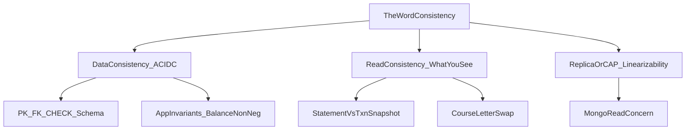
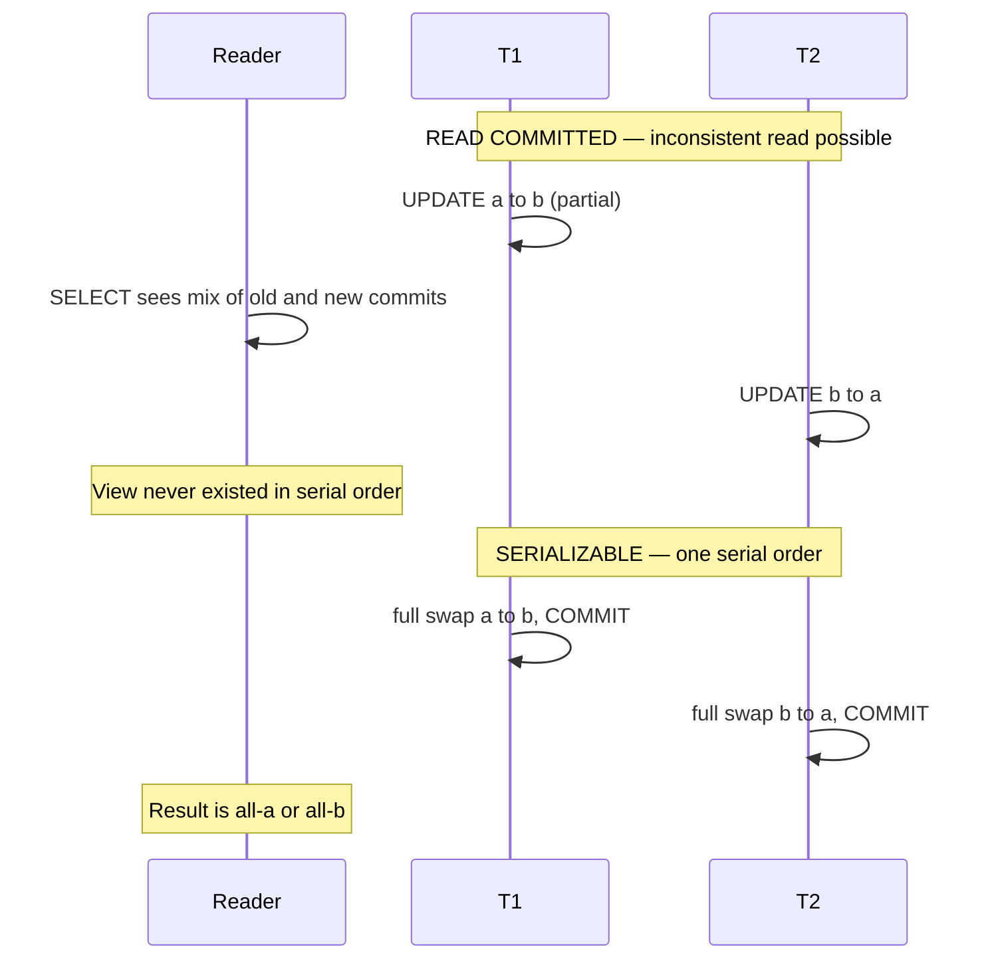
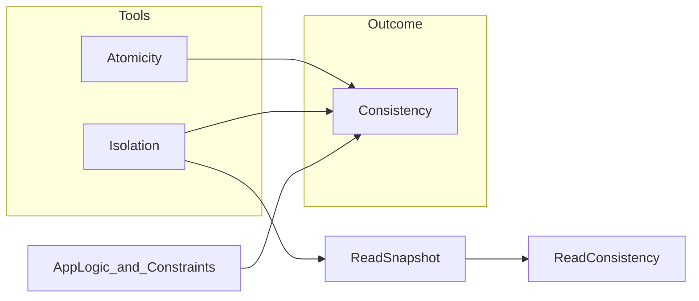
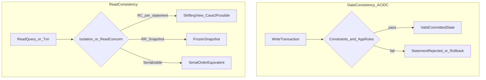

# Consistency — Interview Notes (SQL, PostgreSQL, MongoDB)

> **Course:** Fundamentals of Database Engineering — Sec 2: ACID  
> **Goal:** Understand **consistency of data** (ACID C) and **consistency of a read** (coherent snapshot) deeply enough to explain them in a final-year CSE interview — with working code for PostgreSQL, generic SQL (InnoDB), and MongoDB.

> **Prerequisite:** [8-what-is-a-transaction.md](8-what-is-a-transaction.md) §2.2 introduces ACID Consistency at a high level. [9-Atomicity.md](9-Atomicity.md) covers all-or-nothing. [10-Isolation.md](10-Isolation.md) covers isolation levels and MVCC — **this note does not re-teach isolation**; it shows how isolation and constraints together produce consistency.

---

## 1. One-Minute Interview Definition

**Consistency is the most overloaded word in databases.** In an interview, split it before answering:

| Meaning | One line | Who enforces it |
|---------|----------|-----------------|
| **Consistency of data (ACID C)** | Every committed transaction leaves the database in a **valid** state — constraints and business invariants hold | DB engine (declared constraints) + application (business rules) |
| **Consistency of a read** | One query or transaction sees a **coherent snapshot**, not a mash-up of two commit points | Isolation level / MVCC / read concern |
| **Replica consistency (CAP-C)** | What a reader on a replica sees relative to the primary — linearizability, majority, eventual | Replication protocol + read concern |

Think of a **restaurant after a busy dinner shift**:

1. **Data consistency (ACID C):** After every table pays, the cash drawer still balances, no dish is sold that is not on the menu, and inventory is not negative. The **rules of the restaurant** still hold.
2. **Read consistency:** A manager photocopies the **entire ledger at 11:00 PM** and audits it. Another manager flips pages **while waiters are still writing** — half the ledger is from before Table B paid, half from after. Same committed rows, but the **view is incoherent**.
3. **Replica consistency:** The manager calls the **branch kitchen** for tonight's totals. The branch may be a few minutes behind the main kitchen — that is a replica lag problem, not a CHECK constraint problem.

**Say this in an interview:**

> *"Consistency in ACID means valid state to valid state — the database enforces PK, FK, CHECK, NOT NULL, and the application must preserve business invariants like 'balance ≥ 0' using correct transactions plus isolation. That's different from read consistency: at Read Committed, each statement can see a different commit point, so a multi-row report can be internally inconsistent even when every row is committed and every constraint passes. Serializable or a transaction-level snapshot fixes the read side. MongoDB splits this further: schema validation for data rules, readConcern snapshot for multi-document point-in-time reads."*



---

## 2. Sequential Thinking — Which "C" Is the Interviewer Asking?

Use this ladder **before** naming isolation levels or read concerns:

```
Step 1 → Listen for the keyword
         • "invariant", "constraint", "balance can't go negative", "FK violation"
           → DATA consistency (ACID C)
         • "same query twice", "report doesn't add up", "inconsistent snapshot", "letter swap"
           → READ consistency
         • "replica lag", "stale read", "read your writes", "linearizable"
           → REPLICA / CAP consistency

Step 2 → For DATA consistency, ask: is the rule in the schema or in the app?
         • Schema: CHECK, NOT NULL, UNIQUE, FK, EXCLUDE, triggers
         • App only: "order can't ship before payment" — not a default FK
         • Cross-row under concurrency: schema + isolation / locking

Step 3 → For READ consistency, ask: one statement or one transaction?
         • One statement at RC: fresh snapshot per statement (PG, InnoDB RC)
         • Whole transaction: RR / Snapshot / Serializable / MongoDB snapshot txn
         • Non-transactional cursor: may not be point-in-time (MongoDB default find)

Step 4 → Check whether constraints alone are enough
         • Two concurrent withdrawals from $100: each UPDATE passes CHECK alone
         • Need SELECT FOR UPDATE, atomic UPDATE, Serializable, or version column
         • See [10-Isolation.md](10-Isolation.md) for lost update / write skew

Step 5 → Pick the engine knob
         • PostgreSQL: constraints + isolation + SET CONSTRAINTS DEFERRED
         • InnoDB: constraints + consistent nonlocking read (MVCC)
         • MongoDB: $jsonSchema + unique index + readConcern snapshot txn
```

---

## 3. Data Consistency in Depth — Valid State to Valid State (ACID C)

| Aspect | Explanation |
|--------|-------------|
| **Definition** | If the database is in a valid state before a transaction, and the transaction is written correctly, the database is in a valid state after commit. |
| **Analogy** | After the table pays, the cash drawer still matches the menu rules — you cannot sell a dish that does not exist or end with negative inventory. |
| **What the engine does** | Enforces **declared** constraints at insert/update (and at commit for deferrable FK/UNIQUE). Rejects violating statements with an error. |
| **What the app must do** | Define and preserve **business invariants** the engine cannot infer: "total money conserved," "at least one doctor on call," "order shipped only after payment authorized." |
| **What it does NOT do** | ACID C does **not** mean "every read sees the latest write everywhere." That is read/replica consistency. |
| **Relation to A and I** | **Atomicity** prevents partial application. **Isolation** prevents concurrent interleavings from breaking invariants. **Consistency** is the **outcome** when A + I + correct logic are in place. |

### Who Owns Which Rule?

| Rule type | Example | Enforced by |
|-----------|---------|-------------|
| **NOT NULL** | Every account has a name | DB |
| **UNIQUE / PK** | One email per user | DB |
| **FOREIGN KEY** | Order references existing customer | DB |
| **CHECK** | `price > 0`, `balance >= 0` | DB (per row, at write time) |
| **Cross-row invariant** | Sum of credits = sum of debits | App + Serializable or explicit locks |
| **Process invariant** | Ship only after payment | App (workflow), optionally triggers |

### PostgreSQL Nuance (Interview Gold)

- `CHECK` constraints are checked **immediately** on row insert/update — they **cannot** safely reference other rows (use FK, triggers, or app logic).
- `SET CONSTRAINTS ... DEFERRED` applies only to **deferrable** `UNIQUE`, `PRIMARY KEY`, `REFERENCES`, and `EXCLUDE` — **not** to `NOT NULL` or `CHECK`.
- For global checks (e.g., two-table sum), PostgreSQL docs recommend **Serializable** transactions for all consistency-critical reads/writes, or **`SELECT FOR UPDATE` / `LOCK TABLE`** on non-serializable paths.

---

## 4. Read Consistency in Depth — Coherent Snapshot vs Shifting View

| Aspect | Explanation |
|--------|-------------|
| **Definition** | A read operation (or transaction) returns data as if taken from **one point in time** — not half before commit A and half after commit B. |
| **Analogy** | Photocopy the **whole ledger at 11:00 PM** vs flip pages while waiters are still writing. |
| **Mechanism** | MVCC snapshot (PostgreSQL, InnoDB), isolation level, MongoDB `readConcern: "snapshot"` in transactions. |
| **Not the same as ACID C** | Every row you read can be **committed and constraint-valid** while the **set of rows** is still an impossible interleaving. |

### Statement Snapshot vs Transaction Snapshot

| Mode | When snapshot is taken | Multi-statement read consistency |
|------|------------------------|----------------------------------|
| **Read Committed** (PG default, InnoDB RC) | **Each statement** | Different statements can see different commit points → **inconsistent snapshot** possible |
| **Repeatable Read / Snapshot** (PG RR, InnoDB RR, MongoDB snapshot txn) | **Start of transaction** (first query) | Same row / same snapshot for whole txn |
| **Serializable** | RR + conflict detection | Serializable schedule; PG SSI may abort with `40001` |

### InnoDB "Consistent Nonlocking Read"

InnoDB's default **REPEATABLE READ** uses MVCC: plain `SELECT` reads from the snapshot established at the **first read** in the transaction. In **READ COMMITTED**, each consistent read gets a **fresh** snapshot.

**Trap:** Mixing nonlocking `SELECT` with `UPDATE` / `SELECT FOR UPDATE` in one InnoDB RR transaction gives **two different views** — MySQL docs warn this is inconsistent. Lock everything you will read, or use Serializable.

---

## 5. Sequential Thinking — The Course Letter-Swap Example

From the course (`read.pdf`): table with six rows of letters.

```
Initial:  aa, bb, bb, bb, aa, aa
T1:       change all 'a' → 'b'
T2:       change all 'b' → 'a'
```

### READ COMMITTED — Inconsistent Read (Constraints Still Pass)

```
Step 1 → T1 BEGIN; T2 BEGIN (both at READ COMMITTED)

Step 2 → T1 runs: UPDATE letters SET val = 'b' WHERE val = 'a'
         Rows 1, 5, 6 become 'b'.  T1 not committed yet.

Step 3 → T2 runs its UPDATE (sees T1's uncommitted rows? NO — MVCC hides uncommitted)
         OR T1 COMMITs first → rows 1,5,6 are 'b'

Step 4 → T2: UPDATE letters SET val = 'a' WHERE val = 'b'
         Converts all 'b' rows to 'a' — but timing matters:
         • If T1 finished first: T2 flips everything that was 'b' including T1's new 'b's
         • Interleaved statement snapshots: T1 may flip some rows, T2 flip others mid-scan

Step 5 → A reader at RC between commits can SELECT and see:
         bb, aa, bb, bb, aa, bb  — a mix that never existed in ANY serial order

Step 6 → Every row is committed. No CHECK violated. But the READ is inconsistent.
```

**Analogy:** Two painters repainting a sign — one changes all red to blue, one changes all blue to red. You photograph the sign **mid-paint**. Every letter is legitimately painted, but the photo is not a picture of any finished sign state.

### SERIALIZABLE (or strict serial order) — Consistent Read

```
Step 1 → T1 and T2 cannot commit in an order that produces an impossible mix

Step 2 → Serial order T1 then T2:
         aa,bb,bb,bb,aa,aa → all b → all a → aa,aa,aa,aa,aa,aa

Step 3 → Serial order T2 then T1:
         aa,bb,bb,bb,aa,aa → all a → all b → bb,bb,bb,bb,bb,bb

Step 4 → Final state is always ALL 'a' or ALL 'b' — equivalent to some serial execution
```



---

## 6. Data Consistency — Code (Three Engines)

### 6.1 Setup (Shared Story — Bank Accounts)

```sql
-- PostgreSQL / InnoDB (MySQL 8+)
CREATE TABLE accounts (
  id       INT PRIMARY KEY,
  name     TEXT NOT NULL,
  balance  NUMERIC(10,2) NOT NULL CHECK (balance >= 0)
);

CREATE TABLE transfers (
  id            INT PRIMARY KEY AUTO_INCREMENT,  -- SERIAL in PG
  from_account  INT NOT NULL,
  to_account    INT NOT NULL,
  amount        NUMERIC(10,2) NOT NULL CHECK (amount > 0),
  FOREIGN KEY (from_account) REFERENCES accounts(id),
  FOREIGN KEY (to_account)   REFERENCES accounts(id)
);

INSERT INTO accounts VALUES (1, 'Alice', 200.00), (2, 'Bob', 100.00);
```

---

### 6.2 PostgreSQL — Constraints + Deferred FK

```sql
-- CHECK enforced immediately on each row
CREATE TABLE products (
  product_no       INT PRIMARY KEY,
  name             TEXT NOT NULL,
  price            NUMERIC CHECK (price > 0),
  discounted_price NUMERIC CHECK (discounted_price > 0),
  CONSTRAINT valid_discount CHECK (price > discounted_price)
);

-- Deferrable FK: insert parent and child in one txn, check at COMMIT
CREATE TABLE orders (
  id          INT PRIMARY KEY,
  customer_id INT NOT NULL
);

CREATE TABLE order_lines (
  order_id    INT NOT NULL,
  product_no  INT NOT NULL,
  PRIMARY KEY (order_id, product_no),
  FOREIGN KEY (order_id)   REFERENCES orders(id)
    DEFERRABLE INITIALLY DEFERRED,
  FOREIGN KEY (product_no) REFERENCES products(product_no)
);

BEGIN;
SET CONSTRAINTS ALL DEFERRED;
INSERT INTO orders VALUES (100, 1);
INSERT INTO order_lines VALUES (100, 42);  -- OK: FK checked at COMMIT, not per statement
COMMIT;

-- Violation example: balance goes negative
BEGIN;
UPDATE accounts SET balance = balance - 250 WHERE id = 1;  -- ERROR: check constraint
ROLLBACK;
```

**Interview line:** *"PostgreSQL CHECK is row-local and immediate. For cross-table ordering in one txn, use DEFERRABLE FK/UNIQUE with SET CONSTRAINTS DEFERRED. For cross-row business rules under concurrency, Serializable or FOR UPDATE — constraints alone are not enough."*

---

### 6.3 Generic SQL / InnoDB — CHECK, FK, NOT ENFORCED

```sql
-- MySQL 8.0.16+ enforces CHECK (unless NOT ENFORCED)
CREATE TABLE t1 (
  i1 INT CHECK (i1 <> 0),
  i2 INT,
  CHECK (i2 > i1),
  CHECK (i2 <> 0) NOT ENFORCED   -- parsed but not enforced — interview trap
);

-- FK maintains referential integrity (InnoDB only for FK)
CREATE TABLE parent (id INT PRIMARY KEY);
CREATE TABLE child (
  parent_id INT,
  FOREIGN KEY (parent_id) REFERENCES parent(id)
    ON DELETE CASCADE
);

-- Valid transfer preserves per-row CHECK; does NOT alone prove total money conserved
START TRANSACTION;
UPDATE accounts SET balance = balance - 50 WHERE id = 1;
UPDATE accounts SET balance = balance + 50 WHERE id = 2;
COMMIT;
```

**Interview line:** *"InnoDB enforces FK and CHECK like PostgreSQL for declared rules. NOT ENFORCED CHECK is documentation only. Multi-row business invariants need transaction design + isolation, not just schema."*

---

### 6.4 MongoDB — Schema Validation (No Declarative FK)

```javascript
// $jsonSchema validator — rejects invalid inserts/updates
db.createCollection("students", {
  validator: {
    $jsonSchema: {
      bsonType: "object",
      required: ["name", "year", "gpa"],
      properties: {
        name: { bsonType: "string" },
        year: { bsonType: "int", minimum: 2017, maximum: 3017 },
        gpa:  { bsonType: ["double", "null"], minimum: 0, maximum: 4 }
      }
    }
  },
  validationAction: "error"   // or "warn" to log only
});

// Unique index (like UNIQUE constraint)
db.accounts.createIndex({ email: 1 }, { unique: true });

// Intra-document rule with $expr (discounted < regular inside one doc)
db.createCollection("sales", {
  validator: {
    $and: [
      { $expr: { $lt: ["$lineItems.discountedPrice", "$lineItems.price"] } },
      { $jsonSchema: { properties: { items: { bsonType: "array" } } } }
    ]
  }
});

// Bank accounts with balance rule
db.createCollection("accounts", {
  validator: {
    $jsonSchema: {
      required: ["_id", "balance"],
      properties: {
        balance: { bsonType: "decimal", minimum: 0 }
      }
    }
  }
});

// Valid insert
db.accounts.insertOne({ _id: 1, name: "Alice", balance: NumberDecimal("200.00") });

// Rejected: negative balance
db.accounts.insertOne({ _id: 2, name: "Bad", balance: NumberDecimal("-1.00") });
// → Document failed validation
```

**Interview line:** *"MongoDB has no declarative cross-collection FK. Use schema validation + unique indexes for data shape. Referential integrity across collections is application-level or $lookup + app checks. Single-document updates are always atomic — you never see half the fields updated."*

---

## 7. Read Consistency — Code (Letter-Swap, Two Sessions)

### 7.1 Setup (All Engines)

```sql
-- PostgreSQL / InnoDB
CREATE TABLE letters (
  id  INT PRIMARY KEY,
  val CHAR(1) NOT NULL CHECK (val IN ('a', 'b'))
);
INSERT INTO letters VALUES
  (1,'a'), (2,'b'), (3,'b'), (4,'b'), (5,'a'), (6,'a');
```

```javascript
// MongoDB
db.letters.drop();
db.letters.insertMany([
  { _id: 1, val: "a" }, { _id: 2, val: "b" }, { _id: 3, val: "b" },
  { _id: 4, val: "b" }, { _id: 5, val: "a" }, { _id: 6, val: "a" }
]);
```

---

### 7.2 PostgreSQL — READ COMMITTED (Inconsistent Read Possible)

```sql
-- Session 1 (T1)                           -- Session 2 (T2)
BEGIN;                                     BEGIN;
UPDATE letters SET val = 'b'               UPDATE letters SET val = 'a'
  WHERE val = 'a';                           WHERE val = 'b';
-- rows 1,5,6 → 'b'                        -- timing-dependent
COMMIT;                                    COMMIT;

-- Session 3 — reader between interleaved commits
BEGIN;
SELECT id, val FROM letters ORDER BY id;
-- Possible at READ COMMITTED: mix like b,a,b,b,a,b
-- Never violated CHECK — every row committed — but view is inconsistent
COMMIT;
```

### 7.3 PostgreSQL — REPEATABLE READ (Stable Snapshot for Reader)

```sql
-- Session 3 — reader holds one snapshot
BEGIN ISOLATION LEVEL REPEATABLE READ;
SELECT id, val FROM letters ORDER BY id;  -- frozen view for whole txn
-- Concurrent T1/T2 commits do not change what this txn sees
SELECT id, val FROM letters ORDER BY id;  -- same as first SELECT
COMMIT;
```

### 7.4 PostgreSQL — SERIALIZABLE (Serial-Order Result)

```sql
-- Session 1                                  -- Session 2
BEGIN ISOLATION LEVEL SERIALIZABLE;         BEGIN ISOLATION LEVEL SERIALIZABLE;
UPDATE letters SET val = 'b'                UPDATE letters SET val = 'a'
  WHERE val = 'a';                            WHERE val = 'b';
COMMIT;                                     -- may get SQLSTATE 40001 serialization_failure
                                            -- retry transaction

-- After both succeed in some order: ALL 'a' OR ALL 'b' — never a impossible mix
SELECT val FROM letters ORDER BY id;
```

---

### 7.5 InnoDB — Same Pattern

```sql
-- READ COMMITTED — fresh snapshot per statement
SET SESSION TRANSACTION ISOLATION LEVEL READ COMMITTED;
START TRANSACTION;
SELECT id, val FROM letters ORDER BY id;  -- snapshot 1
-- another session commits swaps
SELECT id, val FROM letters ORDER BY id;  -- snapshot 2 — can differ
COMMIT;

-- REPEATABLE READ (InnoDB default) — first-read snapshot
START TRANSACTION;  -- default RR
SELECT id, val FROM letters ORDER BY id;  -- snapshot frozen
-- concurrent commits invisible to plain SELECT
SELECT id, val FROM letters ORDER BY id;  -- unchanged
COMMIT;

-- SERIALIZABLE — range locks, serial-order writes
SET SESSION TRANSACTION ISOLATION LEVEL SERIALIZABLE;
START TRANSACTION;
UPDATE letters SET val = 'b' WHERE val = 'a';
COMMIT;
```

---

### 7.6 MongoDB — Non-Transactional vs Snapshot Transaction

```javascript
// DEFAULT find — NOT point-in-time (MongoDB docs: "non-point-in-time read operations")
// Cursor may return same doc twice or miss docs if collection changes mid-scan
db.letters.find().sort({ _id: 1 });  // can see interleaved commits from other writers

// Multi-document transaction — consistent snapshot across collections
const s1 = db.getMongo().startSession();
s1.startTransaction({
  readConcern:  { level: "snapshot" },
  writeConcern: { w: "majority" }
});
const col = s1.getDatabase("test").letters;

col.find().sort({ _id: 1 }).toArray();  // point-in-time within txn
// T1/T2 in other sessions commit — this txn still sees frozen snapshot
col.find().sort({ _id: 1 }).toArray();  // same view
await s1.commitTransaction();

// Letter swap in transactions (two sessions)
const t1 = db.getMongo().startSession();
const t2 = db.getMongo().startSession();
t1.startTransaction({ readConcern: { level: "snapshot" }, writeConcern: { w: "majority" } });
t2.startTransaction({ readConcern: { level: "snapshot" }, writeConcern: { w: "majority" } });

t1.getDatabase("test").letters.updateMany({ val: "a" }, { $set: { val: "b" } });
t2.getDatabase("test").letters.updateMany({ val: "b" }, { $set: { val: "a" } });
// One may abort with WriteConflict — retry. No Serializable / write-skew detection.
t1.commitTransaction();
t2.commitTransaction();
```

**Interview line:** *"MongoDB single-document writes are atomic — no half-updated document. Default reads without a transaction are not a consistent snapshot across the collection. For multi-document read consistency, use a transaction with readConcern snapshot and writeConcern majority."*

---

## 8. When Constraints Are Not Enough — Concurrency Breaks Invariants

### The Classic Failure: Two Withdrawals from $100

| Time | T1 | T2 |
|------|----|----|
| t1 | `SELECT balance` → 100 | |
| t2 | | `SELECT balance` → 100 |
| t3 | `UPDATE SET balance = 20` | |
| t4 | `COMMIT` | |
| t5 | | `UPDATE SET balance = 20` |
| t6 | | `COMMIT` |
| **Result** | balance = 20 | Two $80 withdrawals; **CHECK passed on each statement** if checked against stale read |

Each row update might satisfy `CHECK (balance >= 0)` individually if the app writes `balance = 20` from its read of 100. The **invariant** "cannot withdraw more than available" is broken — that is a **consistency** failure, not an atomicity failure.

### Fixes (Data + Read Consistency Together)

```sql
-- Fix 1: Atomic conditional update (best default)
UPDATE accounts
SET balance = balance - 80
WHERE id = 1 AND balance >= 80;
-- 0 rows updated → insufficient funds

-- Fix 2: Pessimistic lock
BEGIN;
SELECT balance FROM accounts WHERE id = 1 FOR UPDATE;
-- check balance >= 80 in app
UPDATE accounts SET balance = balance - 80 WHERE id = 1;
COMMIT;

-- Fix 3: Serializable (PostgreSQL SSI — auto-detects dangerous cycles)
BEGIN ISOLATION LEVEL SERIALIZABLE;
-- read + write; retry on 40001
COMMIT;
```

```javascript
// MongoDB — atomic single-doc update
db.accounts.updateOne(
  { _id: 1, balance: { $gte: NumberDecimal("80") } },
  { $inc: { balance: NumberDecimal("-80") } }
);
```

PostgreSQL [Application-Level Consistency](https://www.postgresql.org/docs/current/applevel-consistency.html) states explicitly: **Read Committed is a shifting view** — two `SELECT sum(...)` in one transaction can include different sets of committed transactions. Use **Serializable** for all consistency-critical reads and writes, or **explicit locks**.

---

## 9. Engine Comparison — Data-C vs Read-C Knobs

### Data Consistency (ACID C)

| Feature | PostgreSQL | InnoDB (MySQL 8+) | MongoDB |
|---------|------------|-------------------|---------|
| **NOT NULL** | Yes | Yes | `$jsonSchema` required |
| **UNIQUE / PK** | Yes | Yes | Unique index / `_id` |
| **FOREIGN KEY** | Yes, deferrable | Yes (InnoDB) | No — app-level |
| **CHECK** | Yes, row-local, immediate | Yes (8.0.16+), `NOT ENFORCED` option | `$jsonSchema`, `$expr` |
| **Cross-row CHECK** | Triggers / Serializable | Triggers / locks | App / multi-doc txn |
| **Defer constraint check** | `SET CONSTRAINTS DEFERRED` | Limited vs PG | N/A |

### Read Consistency

| Feature | PostgreSQL | InnoDB | MongoDB |
|---------|------------|--------|---------|
| **Default** | RC (no dirty reads) | RR for plain SELECT | Read uncommitted-ish local |
| **Statement snapshot** | RC | RC | Default non-txn find |
| **Txn snapshot** | RR (= Snapshot Isolation) | RR first-read snapshot | `readConcern: "snapshot"` in txn |
| **Serializable** | SSI (`40001` retry) | Pessimistic range locks | Not offered |
| **Consistent nonlocking read** | MVCC | InnoDB consistent read | Single-doc atomic write |
| **Multi-row point-in-time** | RR / Serializable txn | RR / Serializable txn | Snapshot txn + `w: majority` |

---

## 10. Replica Consistency Footnote (Don't Confuse with ACID C)

Full lecture on write-node vs read-node, eventual consistency, and horizontal scaling: [16-Eventual-Consistancy.md](16-Eventual-Consistancy.md). This section is only the knob table.

Short section for interview breadth — **third meaning of "consistency":**

| Knob | What it guarantees |
|------|-------------------|
| **MongoDB `local`** | Read from instance; may see rolled-back data on failover |
| **MongoDB `majority`** | Read majority-committed data; durable |
| **MongoDB `linearizable`** | Primary, single-doc, latest majority write; may wait |
| **MongoDB `snapshot`** | Point-in-time across shards in txn (with `w: majority` commit) |
| **Causal session** | Read-your-writes, monotonic reads — needs `majority` R+W |
| **PostgreSQL hot standby** | Serializable integrity checks on primary **do not** extend to standby reads |

**Say this:** *"ACID consistency is about invariants after commit. Replica consistency is about which committed write a reader sees and when — CAP linearizability, MongoDB readConcern, or PG replication lag. Different problem."*

---

## 11. Consistency vs Other ACID Letters (Quick Map)



| Letter | Question it answers |
|--------|---------------------|
| **A** | Did the whole transaction apply or none? |
| **C (data)** | Are all rules and invariants still true after commit? |
| **I** | What did concurrent transactions see while in flight? |
| **Read consistency** | Does my query/txn see one coherent point in time? |
| **D** | Does committed data survive crash? |

---

## 12. Side-by-Side Diagram — Two Consistencies



---

## 13. How to Use This in an Interview

### 13.1 Decision Guide — Which Tool When?

| Your requirement | Pick this |
|------------------|-----------|
| "Price must be positive" | `CHECK (price > 0)` / `$jsonSchema` |
| "Child row must have parent" | FK (SQL) / app validation (MongoDB) |
| "Insert order + lines in one txn" | PG `DEFERRABLE` FK + `SET CONSTRAINTS DEFERRED` |
| "Balance never negative" | `CHECK` **plus** atomic `UPDATE ... WHERE balance >= n` or `FOR UPDATE` |
| "Report must not change mid-query" | RR / Snapshot txn — see [10-Isolation.md](10-Isolation.md) |
| "Multi-row swap must look serial" | Serializable (PG SSI) or explicit table lock |
| "Read after my write on replica" | MongoDB causal session + majority R+W |
| "Cross-shard point-in-time read" | MongoDB `readConcern: snapshot` + `w: majority` txn |

### 13.2 60-Second Spoken Answer

> *"Consistency is overloaded. ACID consistency means valid state to valid state — the database enforces PK, FK, CHECK, NOT NULL, and the application must preserve business invariants with correct transaction logic and isolation. That's separate from read consistency: at Read Committed, each statement sees a new snapshot, so a multi-row read can be internally inconsistent even when every row is committed and valid — the course letter-swap example shows aa/bb rows mixing into a state that never existed serially.*
>
> *Fix read consistency with Repeatable Read, Snapshot, or Serializable. PostgreSQL RR is Snapshot Isolation; Serializable adds SSI and may abort with 40001. InnoDB consistent nonlocking reads give a frozen snapshot at RR. MongoDB has schema validation for data rules but no FK; for multi-document point-in-time reads use a transaction with readConcern snapshot and writeConcern majority.*
>
> *Constraints alone don't stop two concurrent withdrawals — you need atomic conditional updates, FOR UPDATE, or Serializable. And replica readConcern is a third kind of consistency — don't confuse it with ACID C."*

### 13.3 Answer Ladder — If They Go Deeper

| Question | Answer direction |
|----------|------------------|
| *"What is ACID Consistency?"* | Valid → valid. DB enforces declared constraints; app enforces business rules. Outcome of A + I + correct logic. |
| *"Data vs read consistency?"* | Data = rules hold after commit. Read = one coherent snapshot for a query/txn. RC can fail read consistency while passing all CHECKs. |
| *"Letter swap example?"* | T1: a→b, T2: b→a. RC can show impossible mix. Serializable → all-a or all-b. |
| *"Does CHECK fix concurrent withdrawal?"* | No. Each UPDATE can pass against stale read. Use atomic UPDATE, FOR UPDATE, or Serializable. |
| *"PG deferred constraints?"* | UNIQUE/PK/FK/EXCLUDE only. CHECK/NOT NULL always immediate. `SET CONSTRAINTS DEFERRED` checks at COMMIT. |
| *"PG CHECK across rows?"* | Not safely — use triggers, Serializable, or app locks. |
| *"InnoDB consistent read?"* | MVCC snapshot. RR: first-read snapshot. RC: fresh per statement. Don't mix plain SELECT + FOR UPDATE in one RR txn. |
| *"MongoDB data consistency?"* | `$jsonSchema`, unique index. No declarative FK. Single-doc write always atomic. |
| *"MongoDB read consistency?"* | Default find ≠ point-in-time. Snapshot txn + w:majority for multi-doc coherent read. |
| *"CAP consistency vs ACID C?"* | CAP/replica = what readers see across nodes. ACID C = invariants after commit on one database. |
| *"PG Serializable on standby?"* | Integrity guarantee from SSI on primary does not extend to hot standby reads. |

---

## 14. Cheat Sheet (Glance Before the Interview)

1. **Consistency is overloaded** — split into data-C (ACID), read-C (snapshot), replica-C (CAP/readConcern).
2. **ACID C** = valid state → valid state; DB = constraints, app = business invariants.
3. **Read consistency** = one point-in-time view; implemented by isolation / readConcern, not CHECK.
4. **Letter swap** = RC can show impossible mix; Serializable → all-a or all-b.
5. **CHECK alone** does not fix concurrent read-modify-write — need atomic UPDATE, locks, or Serializable.
6. **PG deferred** = UNIQUE/PK/FK/EXCLUDE only; CHECK/NOT NULL always immediate.
7. **PG RR** = Snapshot Isolation; **Serializable** = SSI with `40001` retry.
8. **InnoDB RR** = consistent nonlocking read from first-read snapshot; RC = per-statement snapshot.
9. **MongoDB** = `$jsonSchema` for data rules; snapshot txn for multi-doc read consistency; no Serializable.
10. **Replica readConcern** ≠ ACID C — different interview answer.

---

## 15. Sources

- [PostgreSQL: Constraints (5.5)](https://www.postgresql.org/docs/current/ddl-constraints.html)
- [PostgreSQL: Application-Level Consistency (13.4)](https://www.postgresql.org/docs/current/applevel-consistency.html)
- [PostgreSQL: SET CONSTRAINTS](https://www.postgresql.org/docs/current/sql-set-constraints.html)
- [PostgreSQL: Transaction Isolation (13.2)](https://www.postgresql.org/docs/current/transaction-iso.html)
- [InnoDB: Consistent Nonlocking Reads](https://dev.mysql.com/doc/refman/8.0/en/innodb-consistent-read.html)
- [InnoDB: CHECK Constraints](https://dev.mysql.com/doc/refman/8.0/en/create-table-check-constraints.html)
- [MongoDB: Read Concern](https://www.mongodb.com/docs/manual/reference/read-concern/)
- [MongoDB: Read Isolation, Consistency, and Recency](https://www.mongodb.com/docs/manual/core/read-isolation-consistency-recency/)
- [MongoDB: Schema Validation](https://www.mongodb.com/docs/manual/core/schema-validation/)
- [MongoDB: Transactions](https://www.mongodb.com/docs/manual/core/transactions/)
- Course material: `read.pdf` — letter-swap demo (T1: a→b, T2: b→a)
