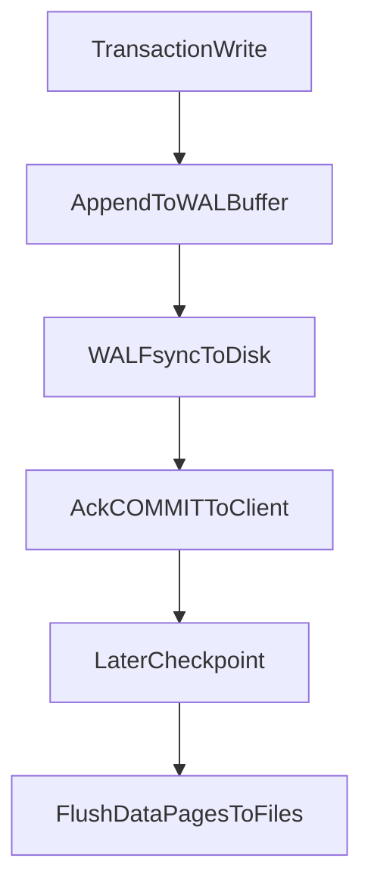
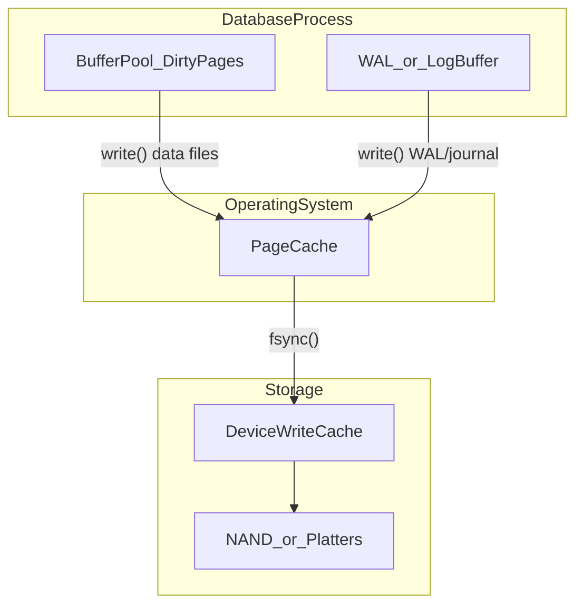

# Durability — Interview Notes (SQL, PostgreSQL, MongoDB)

> **Course:** Fundamentals of Database Engineering — Sec 2: ACID  
> **Goal:** Understand **durability** deeply enough to explain WAL, append-only logs, checkpoints, OS page cache, `fsync`, and how PostgreSQL, generic SQL (InnoDB), and MongoDB each implement durability — for a final-year CSE interview.

> **Prerequisite:** [8-what-is-a-transaction.md](8-what-is-a-transaction.md) §2.4 introduces durability at a high level (`COMMIT` = log durable, not data files). [9-Atomicity.md](9-Atomicity.md) covers crash recovery REDO/UNDO from the atomicity angle. [10-Isolation.md](10-Isolation.md) and [11.Consistency.md](11.Consistency.md) cover the other ACID letters. **This note goes deep only on Durability.**

---

## 1. One-Minute Interview Definition

**Durability** means once the database engine acknowledges `COMMIT`, that transaction's effects **survive** process crash, OS crash, and power loss. The payment must still be on the books after a blackout.

Think of a **restaurant cashier's carbon-copy receipt book**:

1. The waiter writes the order on a **scratch pad** (RAM).
2. The cashier copies it into the **receipt book** (WAL / journal).
3. The cashier **stamps** the receipt (`COMMIT` + **`fsync` of the log**).
4. Only **after** the stamp does the customer get "payment accepted."
5. Putting actual cash in the **drawer** (data files) happens later during **closing inventory** (checkpoint).

**Say this in an interview:**

> *"Durability does not mean every table page is on disk at commit time. It means the log record describing the change reached stable storage — or a majority of replicas — before the client got success. On crash, the engine loads the last checkpoint snapshot and REDOs the log from that point. COMMIT returned = log is durable; data files catch up later."*


---

## 2. Durability in Depth — What It Guarantees (and What It Does Not)

| Aspect | Explanation |
|--------|-------------|
| **Definition** | Committed transactions persist after failure; uncommitted work does not. |
| **Analogy** | After the receipt is **stamped**, a power cut must not erase the payment record. |
| **What the engine does** | Appends changes to a **Write-Ahead Log (WAL)** / **journal** / **redo log**, then **`fsync`s that log** before acking `COMMIT`. Flushes data pages later at **checkpoint**. |
| **Failure story** | Server crashes 2 seconds after `COMMIT`. On restart: find last checkpoint → replay log → all committed work restored even if data files were stale. |
| **What it does NOT do** | Durability does **not** guarantee the write is on **every replica** unless you configure replication write concern. Single-node `j: true` does not save you if that disk is destroyed — use replicas. |
| **Loss vs corruption** | Weaker settings (`synchronous_commit=off`, `innodb_flush_log_at_trx_commit=2`, MongoDB default ~100 ms journal) may **lose** the last few transactions on crash. They do **not** corrupt the database. |
| **Relation to A and I** | **Atomicity** shares the WAL for crash recovery. **Isolation** controls visibility while in flight. **Durability** controls what survives **after** commit. |

### Restaurant Analogy Mapping

| Real world | Database |
|------------|----------|
| Waiter's scratch pad (pencil) | DB buffer pool / shared buffers / WiredTiger cache |
| Manager's memory of tonight's totals | **OS page cache** — kernel thinks the write "succeeded" |
| Carbon-copy receipt book | WAL / redo log / journal (**append-only**) |
| Cashier **stamping** the receipt | `COMMIT` + **`fsync` of the log** |
| Photocopy of the whole ledger at 11 PM | **Async snapshot / checkpoint** |
| Cash in the drawer | Data files (`.ibd`, heap files, `.wt`) |
| Power cut | Crash — only stamped receipts survive |

**Key insight:** `write()` is **not** durability. `write()` copies bytes into the **OS page cache** and returns. Without `fsync`, a crash can erase "committed" work that never reached the disk platters.

---

## 3. Sequential Thinking — Which Question Is the Interviewer Asking?

Use this ladder **before** naming file paths or knobs:

```
Step 1 → Listen for the keyword
         • "after COMMIT / crash / power loss / fsync / WAL"
           → DURABILITY (ACID D)
         • "half-applied transfer / rollback"
           → ATOMICITY — see 9-Atomicity.md
         • "two transactions see each other's pencil work"
           → ISOLATION — see 10-Isolation.md

Step 2 → Separate COMMIT ack from data files
         • COMMIT ack = log durable (Process A — modern default)
         • Data files updated later at checkpoint
         • Never say "COMMIT writes table files to disk" without qualifying

Step 3 → Name the three cache layers
         • DB buffer pool (engine RAM)
         • OS page cache (kernel RAM)
         • Device write cache (disk/RAID firmware RAM)

Step 4 → Identify the durability technique
         • WAL / write-ahead rule
         • Append-only log (AOF pattern)
         • Async snapshot (checkpoint)

Step 5 → Pick the engine knob
         • PostgreSQL: fsync, wal_sync_method, synchronous_commit
         • InnoDB: innodb_flush_log_at_trx_commit, innodb_flush_method, doublewrite
         • MongoDB: writeConcern j, journal.commitIntervalMs, syncPeriodSecs
```

---

## 4. Three Durability Techniques — WAL, Append-Only Log, Async Snapshot

The course (and Hussein Nasser) frames durability around three techniques. All three modern engines use **all three together** — the names differ by engine.

### 4.1 Write-Ahead Log (WAL) — The Write-Ahead *Rule*

| Aspect | Explanation |
|--------|-------------|
| **Rule** | Never write a dirty **data page** to disk until the **WAL record** describing that change is already on **stable storage**. |
| **Analogy** | You cannot put cash in the drawer until a stamped receipt exists in the carbon-copy book. |
| **Recovery** | Last checkpoint + **REDO** (roll forward) all log records after it. PostgreSQL calls this "repeat history." |
| **Why fast** | Log is written **sequentially**; one `fsync` can commit many transactions (**group commit**). |
| **Interview gold: STEAL / NO-FORCE** | **STEAL:** dirty pages *may* go to disk before commit. **NO-FORCE:** committed pages *need not* be on data files at commit. Only the **log** must be durable. |



| Engine | WAL implementation | On-disk location |
|--------|-------------------|------------------|
| **PostgreSQL** | WAL segments | `pg_wal/` (16 MB files, recycled after checkpoint) |
| **InnoDB** | Redo log | Circular fixed-size files (`ib_logfile*` / redo capacity) |
| **MongoDB** | WiredTiger journal | `journal/WiredTigerLog.*` (~100 MB per file) |

### 4.2 Append-Only File (AOF) — Sequential Log, Never Overwrite In Place

**AOF** is the *pattern* Redis popularized by name. PostgreSQL, InnoDB, and MongoDB all implement it — they just call it WAL, redo log, or journal.

| Aspect | Explanation |
|--------|-------------|
| **Pattern** | Every change is **appended** to the end of a log file. Old bytes are never mutated in place. |
| **Analogy** | A receipt book where you only add new pages — you never erase old receipts, you just stop needing them after a checkpoint. |
| **Why it matters** | Sequential I/O is orders of magnitude faster than random page writes scattered across table files. |
| **Interview trap** | InnoDB redo is **circular** (fixed size, wraps around). It is still **append-only in behavior** — you append until full, checkpoint advances, then reuse. "Append-only" means the **I/O pattern**, not "file grows forever." |

| Engine | AOF analog | File shape |
|--------|------------|------------|
| PostgreSQL | WAL segments | Growing files in `pg_wal/`, archived or recycled |
| InnoDB | Redo log | Circular fixed-size — sequential append, wrap on checkpoint |
| MongoDB | Journal files | ~100 MB then new file; old files deleted after last checkpoint |

**Redis mapping (one paragraph, not a tutorial):** Redis **RDB** ≈ async snapshot (checkpoint). Redis **AOF** ≈ append-only log (WAL pattern). PostgreSQL WAL + checkpoint = Redis AOF + RDB combined inside one engine.

### 4.3 Asynchronous Snapshot (Checkpoint)

| Aspect | Explanation |
|--------|-------------|
| **Definition** | A **consistent snapshot** of data files written in the background so recovery does not replay the entire log history from the beginning of time. |
| **Analogy** | At 11 PM the manager photocopies the **whole ledger** and puts it in the safe. Between photocopies, only the receipt book (log) records new payments. |
| **"Async"** | Checkpoints run **while traffic continues** (fuzzy/online checkpoint). Commits do not wait for the full snapshot. |
| **Recovery formula** | Load last **snapshot** → replay **log/journal** from that snapshot's LSN/identifier forward. |

| Engine | Checkpoint mechanism | Default interval |
|--------|-------------------|------------------|
| **PostgreSQL** | Fuzzy checkpoint — flush dirty shared buffers while WAL continues | `checkpoint_timeout` = 5 min **or** `max_wal_size` = 1 GB |
| **InnoDB** | Fuzzy checkpoint — LSN recorded in redo log header | Continuous / adaptive |
| **MongoDB WiredTiger** | Checkpoint of all tables to `.wt` files | `storage.syncPeriodSecs` = **60 s** |

**Without journal between checkpoints:** MongoDB could lose up to ~60 s of writes. That is why journaling is **always enabled** since MongoDB 6.1 — checkpoints alone are not enough for OLTP durability.

---

## 5. Sequential Thinking — What Happens When You COMMIT?

Use this step order when an interviewer asks: *"Walk me through COMMIT internally."*

```
Step 1 → Modify pages in DB RAM (dirty pages in buffer pool / cache)
Step 2 → Append WAL/journal/redo record (still in engine log buffer / WAL buffers)
Step 3 → Client requests COMMIT
Step 4 → Group commit: multiple waiters may share ONE fsync of the log file
Step 5 → write() log bytes to OS page cache (if not O_DSYNC/O_SYNC)
Step 6 → fsync / fdatasync log file → flush OS cache + device write cache
Step 7 → Ack client "COMMIT succeeded"  ← THIS moment is durability (sync settings)
Step 8 → Later: checkpoint / bgwriter flushes dirty DATA pages to table files
Step 9 → Recycle or truncate WAL/journal files no longer needed for recovery
```

### Process A vs Process B (Interview Classic)

| | **Process A — Log commit (modern)** | **Process B — Force data files (naive)** |
|---|-------------------------------------|------------------------------------------|
| **On COMMIT** | `fsync` the **log only** | `fsync` every modified **data page** |
| **Used by** | PostgreSQL, InnoDB, MongoDB, Oracle, SQL Server | Rarely in production OLTP |
| **Throughput** | High — sequential log I/O + group commit | Terrible — random I/O per commit |
| **Recovery** | REDO from WAL | Less log replay needed, but commit latency kills TPS |

> **Never recommend Process B for OLTP.** Interviewers mention it to test whether you understand **why WAL was invented**.

---

## 6. Sequential Thinking — Crash 2 Seconds After COMMIT

Pointer: full REDO/UNDO walkthrough is in [9-Atomicity.md](9-Atomicity.md). Here is the durability-focused version:

```
Step 1 → Was a durable COMMIT record fsync'd to the log before crash?
         • YES → transaction is a WINNER — must survive recovery
         • NO  → transaction is a LOSER — never happened (even if client thought it committed)

Step 2 → Startup recovery begins
         • PostgreSQL: read pg_control → find last checkpoint REDO pointer
         • InnoDB: read redo log checkpoint LSN
         • MongoDB: find last checkpoint identifier in data files

Step 3 → REDO phase: replay log forward from checkpoint
         • Re-apply changes to data pages (including winners whose pages never reached disk)
         • PostgreSQL "repeats history" — even aborted txn changes get redone, then filtered

Step 4 → For each transaction: check for durable COMMIT in log
         • Missing commit record → ABORTED / invisible (PG clog, InnoDB undo, Mongo never journaled)

Step 5 → Database consistent again; clients reconnect
```

**Failure story to tell:**

> *"A bank transfer COMMIT returned. Two seconds later, the server loses power. On restart, PostgreSQL finds the WAL commit record was fsync'd before the ack. It loads the last checkpoint, REDOs WAL from that LSN, and the transfer is still there — even though the accounts table file on disk was stale. If synchronous_commit had been off and the WAL writer had not flushed yet, that transfer might be lost — but the database would not be corrupt."*

---

## 7. OS Page Cache — Why `write()` Is Not Enough

### 7.1 The Three Cache Layers

| Layer | What it is | Volatile? | Who controls flush? |
|-------|-----------|-----------|---------------------|
| **DB buffer pool** | Engine's copy of pages in RAM (shared buffers, InnoDB buffer pool, WiredTiger cache) | Yes | Checkpoint, bgwriter, eviction |
| **OS page cache** | Kernel's cache of file blocks after `write()` | Yes | Background writeback **or** `fsync` |
| **Device write cache** | Disk/RAID/NVMe firmware buffer | Often yes (unless PLP/BBU) | `fsync` / FLUSH CACHE EXT / FUA |



### 7.2 Why `fsync` Exists

POSIX `write()` **returns success** when data is copied into the **kernel page cache** — not when it reaches persistent media.

| System call | What it does | When DB uses it |
|-------------|--------------|-----------------|
| **`write()`** | Copy to OS page cache; mark dirty; return | Every log and data file write |
| **`fdatasync()`** | Flush **file data** to device; skip non-essential metadata (mtime) | PostgreSQL default on Linux (`wal_sync_method=fdatasync`) |
| **`fsync()`** | Flush data **and** metadata (inode size, etc.) | Fallback; required for directory entries after creating files |
| **`O_DSYNC` / `O_SYNC`** | Each `write()` waits for durability (like write+fdatasync per call) | `open_datasync`, `open_sync` WAL modes |

**After `fsync()` returns:** the write is durable — even if power is lost **immediately** afterward.

**Tiny Linux mental model (connect POSIX to engine knobs):**

```c
// Pseudocode — what the database relies on
int fd = open("pg_wal/00000001000000000000000001", O_WRONLY);

write(fd, wal_record, record_len);   // fast: copies to OS page cache only
                                       // CRASH HERE → record may be LOST

fsync(fd);                             // slow: blocks until device confirms durable
                                       // CRASH AFTER → record SURVIVES

// COMMIT ack to client happens AFTER fsync (when synchronous_commit=on)
```

### 7.3 `O_DIRECT` — Bypass OS Cache, Still Need `fsync`

| Setting | Effect | Trap |
|---------|--------|------|
| **`O_DIRECT`** | Data file writes skip OS page cache — avoids **double buffering** with InnoDB buffer pool | Does **not** bypass **device** write cache |
| **`innodb_flush_method=O_DIRECT`** | Recommended on Linux production | Still calls `fsync` on redo log |
| **`O_DIRECT` without fsync** | Benchmarks show thousands of "writes/sec" | Percona: those writes may only hit **drive write cache** — lost on power loss |

**Interview line:** *"`O_DIRECT` removes the OS from the path for data pages, but the disk firmware can still lie. Engines still `fsync` the log because that's what ACID durability actually means."*

### 7.4 Group Commit — One `fsync`, Many Transactions

When many sessions `COMMIT` at once, the engine batches them:

1. Txn A, B, C all append WAL records to the in-memory buffer.
2. One leader calls `fsync` once for the whole batch.
3. All three get success — they share the cost of one slow disk round-trip.

**Trap:** A series of commits on a **single connection** cannot benefit from group commit with other connections — they serialize on that session.

---

## 8. Engine-Specific Durability — PostgreSQL

### 8.1 Commit Path

| Step | What happens |
|------|--------------|
| 1 | Modify tuples in **shared buffers** (RAM) |
| 2 | Append WAL record to **WAL buffers** (RAM) |
| 3 | `COMMIT` → `XLogFlush()` — write WAL + **`issue_xlog_fsync`** |
| 4 | Return success to client |
| 5 | Later: **checkpointer** flushes dirty pages; writes checkpoint record |

**Key files:** `pg_wal/` (WAL), `pg_control` (checkpoint metadata), heap/index files (data).

### 8.2 Durability Knobs

| Parameter | Default | Meaning |
|-----------|---------|---------|
| **`fsync`** | `on` | Force WAL/data to disk via `fsync`/`fdatasync`. **Never off in production** except bulk load with planned re-sync. |
| **`wal_sync_method`** | `fdatasync` (Linux) | How to flush WAL: `fdatasync`, `fsync`, `open_datasync`, `open_sync`, `fsync_writethrough` |
| **`synchronous_commit`** | `on` | Wait for WAL flush before ack. `off` = ack early — may lose last ~3×`wal_writer_delay` txns, **no corruption**. |
| **`full_page_writes`** | `on` | After checkpoint, first page change logs **full 8 KB page image** in WAL — fixes **torn pages** (512-byte sector writes) |
| **`checkpoint_timeout`** | 5 min | Max time between checkpoints |
| **`max_wal_size`** | 1 GB | WAL volume trigger for checkpoint |
| **`checkpoint_flush_after`** | 256 kB (Linux) | Incremental flush during checkpoint to avoid one giant stall `fsync` |
| **`wal_writer_flush_after`** | 1 MB (Linux) | WAL writer incremental flush |

**Torn page problem:** PostgreSQL writes 8 KB pages; disks write 512-byte sectors. Power loss mid-write → half-old, half-new page. **`full_page_writes`** stores a complete page copy in WAL so REDO can restore it.

**Tip:** Run `pg_test_fsync` on new hardware to pick the fastest reliable `wal_sync_method`.

### 8.3 PostgreSQL Code — Bank Transfer + Durability Tuning

```sql
-- Inspect durability settings (interview: name these three)
SHOW fsync;                    -- on
SHOW wal_sync_method;          -- fdatasync (Linux)
SHOW synchronous_commit;       -- on

-- Financial transfer — default durable commit
BEGIN;
UPDATE accounts SET balance = balance - 100 WHERE id = 'Alice' AND balance >= 100;
UPDATE accounts SET balance = balance + 100 WHERE id = 'Bob';
COMMIT;   -- XLogFlush + fdatasync BEFORE "COMMIT" returns to client

-- Per-transaction: faster but may lose this txn on crash (not corrupt)
BEGIN;
SET LOCAL synchronous_commit = off;
UPDATE metrics SET counter = counter + 1 WHERE id = 'page_views';
COMMIT;   -- may return before WAL hits disk

-- See where WAL is (Logical Sequence Number)
SELECT pg_current_wal_lsn();

-- Admin: force checkpoint (NOT for normal app use — flushes dirty pages, writes checkpoint WAL record)
CHECKPOINT;

-- Contrast: UNLOGGED tables skip WAL for data — fast, but truncated/empty after crash
CREATE UNLOGGED TABLE session_cache (id INT PRIMARY KEY, data JSONB);
-- INSERT survives until crash; after restart, table is empty
```

### 8.4 Crash Recovery (Durability Angle)

```text
-- On postmaster restart after power loss:
-- 1. Read pg_control → last checkpoint REDO pointer (LSN)
-- 2. REDO: replay all WAL from that LSN forward ("repeat history")
-- 3. For each XID: durable COMMIT record in WAL? → winner. Else → aborted (clog)
-- 4. full_page_writes: if a data page was torn, restore full page image from WAL
-- 5. Database accepts connections — committed work survives
```

---

## 9. Engine-Specific Durability — Generic SQL (InnoDB / MySQL)

### 9.1 Commit Path

| Step | What happens |
|------|--------------|
| 1 | Modify rows in **InnoDB buffer pool** (RAM) |
| 2 | Append **redo log** record to **log buffer** (RAM) |
| 3 | `COMMIT` → flush log buffer → `write()` + **`fsync` redo** (if `innodb_flush_log_at_trx_commit=1`) |
| 4 | Return success |
| 5 | **Doublewrite buffer** → data pages to `.ibd` files at checkpoint/eviction |
| 6 | **Undo log** used for rollback (atomicity), not primary durability path |

### 9.2 Durability Knobs

| Parameter | Default | Meaning |
|-----------|---------|---------|
| **`innodb_flush_log_at_trx_commit`** | `1` | **`1`:** write + fsync redo every commit (ACID). **`2`:** write to OS cache on commit, fsync ~1/sec (OS crash may lose ~1s). **`0`:** flush ~1/sec from log buffer (fastest, least safe). |
| **`innodb_flush_method`** | `O_DIRECT` (8.4+) | **`fsync`:** double-buffered through OS cache. **`O_DIRECT`:** data files bypass OS cache; redo still fsync'd. |
| **`innodb_doublewrite`** | `ON` | Sequential copy of pages before in-place write — prevents **torn pages** (PG uses `full_page_writes` instead) |
| **`sync_binlog`** | `1` (recommended) | Binlog durability for replication/PITR — **separate** from InnoDB redo |
| **`innodb_redo_log_capacity`** | configurable | Size of circular redo log — affects checkpoint pressure |

**`innodb_flush_log_at_trx_commit=2` nuance:**

| Crash type | Data loss? |
|------------|------------|
| **mysqld process crash** | Often **no loss** — OS page cache still has redo bytes |
| **OS crash / power loss** | May lose up to ~1 second of commits |
| **Corruption?** | **No** — doublewrite + redo still protect page integrity |

### 9.3 InnoDB Code — Bank Transfer + Durability Inspection

```sql
-- Inspect durability posture (run in interview setup discussion)
SHOW VARIABLES WHERE Variable_name IN (
  'innodb_flush_log_at_trx_commit',  -- 1 = ACID
  'innodb_flush_method',             -- O_DIRECT recommended
  'innodb_doublewrite',              -- ON
  'sync_binlog'                      -- 1 for replication durability
);

-- Bank transfer — with default autocommit, EACH statement is its own transaction
-- and each COMMIT fsyncs redo (when innodb_flush_log_at_trx_commit=1)
START TRANSACTION;
UPDATE accounts SET balance = balance - 100 WHERE id = 'Alice' AND balance >= 100;
UPDATE accounts SET balance = balance + 100 WHERE id = 'Bob';
COMMIT;

-- Session-level (does NOT change global — safer for demos)
SET SESSION innodb_flush_log_at_trx_commit = 1;

-- NEVER casually on production without change management:
-- SET GLOBAL innodb_flush_log_at_trx_commit = 2;  -- accepts ~1s loss window on OS crash

-- Redo log status (MySQL 8.0+)
SHOW STATUS LIKE 'Innodb_redo_log%';
```

### 9.4 Doublewrite vs Full-Page Writes

| | **InnoDB doublewrite** | **PostgreSQL full_page_writes** |
|---|------------------------|--------------------------------|
| **Problem** | Torn 16 KB page across 512 B sectors | Same |
| **Fix** | Copy page to sequential doublewrite area, fsync, then write in place | Log entire page image in WAL on first post-checkpoint change |
| **Recovery** | Restore from doublewrite if in-place write was partial | Restore from WAL full-page image |

---

## 10. Engine-Specific Durability — MongoDB (WiredTiger)

### 10.1 Two-Tier Durability: Journal + Checkpoint

MongoDB WiredTiger uses **both**:

1. **Journal (WAL)** — records every write between checkpoints.
2. **Checkpoint (async snapshot)** — flushes all tables to `.wt` data files every **60 seconds** (`syncPeriodSecs`).

**Journaling always enabled since MongoDB 6.1** — you cannot disable it.

### 10.2 Commit Path

| Step | What happens |
|------|--------------|
| 1 | Modify documents in **WiredTiger cache** (RAM) |
| 2 | Append **journal record** (one per client write, includes index updates) |
| 3 | Journal buffered in memory (up to 128 kB aggregate) |
| 4 | Sync to disk when: **`j: true`**, **every 100 ms**, or **new ~100 MB journal file** |
| 5 | Ack client (timing depends on **writeConcern**) |
| 6 | Every 60 s: **checkpoint** writes consistent snapshot to data files |

**Recovery:**

1. Find last checkpoint identifier in data files.
2. Find matching record in journal.
3. Replay all journal operations after that point.

### 10.3 Durability Knobs

| Setting | Default | Meaning |
|---------|---------|---------|
| **`storage.journal.commitIntervalMs`** | 100 ms | Max time journal stays in memory before periodic sync |
| **`storage.syncPeriodSecs`** (`syncdelay`) | 60 s | Seconds between checkpoints |
| **`writeConcern.j`** | depends | `true` = ack only after journal fsync |
| **`writeConcern.w: "majority"`** | — | Majority of replica set members ack; with `writeConcernMajorityJournalDefault: true`, implies **`j: true`** |
| **`db.adminCommand({ fsync: 1 })`** | — | Flush storage layer to disk (backup/admin — **not** per-insert POSIX fsync) |
| **`db.fsyncLock()`** | — | Flush + block writes for filesystem-copy backup |

**Interview trap:** MongoDB **`fsync` command** ≠ **`writeConcern: { j: true }`**. Per-write durability is **`j`**. Admin `fsync` is for backups.

**Default behavior:** Without `j: true`, writes may sit in the journal buffer up to **100 ms** — **loss on hard shutdown**, not corruption.

### 10.4 MongoDB Code — Write Concern + Admin Fsync

```javascript
// Setup
db.accounts.insertOne({ _id: "Alice", balance: NumberDecimal("500.00") });
db.accounts.insertOne({ _id: "Bob",   balance: NumberDecimal("0.00") });

// Default-ish: acknowledged on primary, journal may not be synced yet (~100ms window)
db.accounts.updateOne(
  { _id: "Alice" },
  { $inc: { balance: NumberDecimal("-100.00") } },
  { writeConcern: { w: 1, j: false } }
);

// Financial: wait for journal on primary
db.accounts.updateOne(
  { _id: "Bob" },
  { $inc: { balance: NumberDecimal("100.00") } },
  { writeConcern: { w: 1, j: true } }   // fsync journal BEFORE ack
);

// Replica set: durable + survives primary failover (if majority holds)
db.accounts.updateOne(
  { _id: "Alice" },
  { $inc: { balance: NumberDecimal("-50.00") } },
  { writeConcern: { w: "majority", j: true } }
);

// Multi-document transfer (prefer embedding when possible)
const session = db.getMongo().startSession();
session.startTransaction({ writeConcern: { w: "majority", j: true } });
try {
  const s = session.getDatabase("bank");
  s.accounts.updateOne({ _id: "Alice" }, { $inc: { balance: NumberDecimal("-100") } });
  s.accounts.updateOne({ _id: "Bob" },   { $inc: { balance: NumberDecimal("100") } });
  session.commitTransaction();  // one journal record for whole txn
} catch (e) {
  session.abortTransaction();   // no journal record — cheapest rollback
}

// Inspect checkpoint interval (seconds)
db.adminCommand({ getParameter: 1, syncdelay: 1 });           // default 60
db.adminCommand({ getParameter: 1, journalCommitInterval: 1 }); // default 100 ms

// Admin backup: flush all pending writes (NOT per-insert durability)
db.adminCommand({ fsync: 1 });

// Backup with consistent filesystem copy
db.fsyncLock();
// ... cp / tar data directory + journal together ...
db.fsyncUnlock();
```

---

## 11. Sequential Thinking — "Interviewer Says write() Already Hit Disk"

```
Step 1 → Name three caches: DB buffer pool, OS page cache, device write cache
Step 2 → write() only moves data DB → OS page cache; returns immediately
Step 3 → fsync/fdatasync moves OS cache → device → media; blocks until done
Step 4 → O_DIRECT skips OS cache for data files but device cache still exists
Step 5 → Battery-backed RAID / NVMe with power-loss protection (PLP) makes fsync
         faster — but the engine still calls fsync; it does not trust write() alone
Step 6 → COMMIT ack timing is defined by engine knob, not by write() returning
```

---

## 12. Side-by-Side — Durability Path (All Three Engines)


| Concept | PostgreSQL | InnoDB (MySQL) | MongoDB (WiredTiger) |
|---------|------------|----------------|----------------------|
| Memory store | Shared buffers | Buffer pool | WiredTiger cache |
| Write-ahead log | WAL (`pg_wal/`) | Redo log | Journal (`journal/`) |
| Append-only pattern | WAL segments | Circular redo | ~100 MB journal files |
| Commit durability | WAL `fdatasync` (`synchronous_commit=on`) | Redo `fsync` (`flush_log_at_trx_commit=1`) | Journal sync (`j: true` or 100 ms) |
| Async snapshot | Checkpoint (5 min / 1 GB WAL) | Fuzzy checkpoint | Checkpoint (60 s) |
| Torn page fix | `full_page_writes` | Doublewrite buffer | WiredTiger checksums + journal |
| Weaker commit | `synchronous_commit=off` | `flush_log_at_trx_commit=2/0` | default ~100 ms, `j: false` |
| Admin flush | `CHECKPOINT` | InnoDB flush (internal) | `db.adminCommand({ fsync: 1 })` |
| Crash recovery | REDO WAL from checkpoint LSN | REDO redo from checkpoint LSN | Replay journal from checkpoint id |

---

## 13. Decision Guide — Which Durability Level When?

| Your requirement | Pick this |
|------------------|-----------|
| Bank transfers, orders, inventory | PG `synchronous_commit=on`; InnoDB `flush_log_at_trx_commit=1`; MongoDB `{ w: "majority", j: true }` |
| High-volume metrics / page views | PG `SET LOCAL synchronous_commit=off`; InnoDB `=2` **only if business accepts ~1s loss**; MongoDB `j: false` |
| Bulk ETL initial load | PG `UNLOGGED` tables or `fsync=off` + later `initdb --sync-only`; InnoDB `ALTER INSTANCE DISABLE INNODB REDO_LOG` (8.0+) for load only |
| Single-node MongoDB dev | `j: true` for anything you care about; default loses last ~100 ms on hard kill |
| Replica set production | **`w: majority` + `j: true`** — disk death on one node is not enough |
| Filesystem backup (`cp`/`tar`) | MongoDB `db.fsyncLock()`; PG use `pg_basebackup` or snapshot tools — not raw copy of live files |
| Interview "never do this" | `fsync=off` in production OLTP; `innodb_doublewrite=OFF`; disable MongoDB journal (removed in 6.1 anyway) |

---

## 14. How to Use This in an Interview

### 14.1 60-Second Spoken Answer

> *"Durability is the D in ACID: once COMMIT returns, the work survives crashes. Modern engines use Process A — modify data in memory, append a WAL or journal record, fsync the log, then ack the client. Data files are flushed later at checkpoint. That's why COMMIT is fast: sequential log I/O and group commit, not random page writes.*
>
> *write() only puts bytes in the OS page cache. fsync or fdatasync is what makes them durable — plus flushing the disk's own write cache. O_DIRECT avoids double buffering but still needs fsync on the log.*
>
> *PostgreSQL fsyncs WAL with fdatasync by default. InnoDB fsyncs redo when innodb_flush_log_at_trx_commit=1 and uses a doublewrite buffer for torn pages. MongoDB journals between 60-second checkpoints; j:true forces journal sync before ack, otherwise you may lose the last ~100 milliseconds on a hard shutdown — loss, not corruption.*
>
> *For money I use sync commit everywhere. For analytics counters I might relax to async commit with eyes open about the loss window."*

### 14.2 Answer Ladder — If They Go Deeper

| Question | Answer direction |
|----------|------------------|
| *"COMMIT vs data on disk?"* | COMMIT = log durable. Data pages flushed at checkpoint. REDO reconstructs gaps. |
| *"What is WAL?"* | Write-ahead log: change logged before page write. Enables REDO crash recovery. |
| *"WAL vs AOF vs snapshot?"* | WAL = rule. AOF = append-only log pattern (all engines). Snapshot = checkpoint for bounded recovery. |
| *"Why fsync?"* | `write()` stops at OS cache. fsync reaches stable storage. ACID D requires it (or equivalent O_DSYNC). |
| *"Group commit?"* | Many txns share one fsync — amortizes disk latency. |
| *"synchronous_commit=off?"* | Faster; may lose last few txns on crash; never corrupts. |
| *"innodb_flush_log_at_trx_commit=2?"* | Redo in OS cache on commit; fsync ~1/sec. OS crash loses ~1s. mysqld-only crash often OK. |
| *"MongoDB j:true vs default?"* | j:true = journal fsync before ack. Default = up to 100 ms buffered — hard shutdown may lose it. |
| *"MongoDB fsync command?"* | Admin flush for backups — not per-write durability. Use writeConcern.j for that. |
| *"Torn pages?"* | Partial sector write. PG: full_page_writes in WAL. InnoDB: doublewrite buffer. |
| *"STEAL / NO-FORCE?"* | Dirty pages may hit disk early (STEAL). Committed pages need not be on disk at commit (NO-FORCE). |
| *"Why not flush data pages every commit?"* | Random I/O kills OLTP TPS. WAL makes commits one sequential fsync. |
| *"Replica durability?"* | Single-node fsync is not enough if disk dies. w:majority + j:true across replica set. |

---

## 15. Cheat Sheet (Glance Before the Interview)

1. **Durability** = committed work survives crash; ack means **log** durable, not necessarily data files.
2. **Three caches** = DB buffer pool, OS page cache, device write cache.
3. **`write()` ≠ durable** — **`fsync`/`fdatasync`** (or `O_DSYNC`) makes it durable.
4. **WAL rule** = log record on stable storage **before** dirty data page write.
5. **AOF pattern** = append-only sequential log (PG WAL, InnoDB redo, Mongo journal).
6. **Checkpoint** = async snapshot of data files; bounds recovery replay window.
7. **Recovery** = last checkpoint + REDO log from that point.
8. **Group commit** = one fsync, many transactions.
9. **Loss ≠ corruption** — async commit / j:false may lose recent commits, not corrupt DB.
10. **Engine defaults:** PG sync WAL; InnoDB flush_log=1 + doublewrite; Mongo journal always on, checkpoint 60s, journal flush 100ms unless j:true.

---

## 16. Sources

- [PostgreSQL: Write-Ahead Logging (WAL)](https://www.postgresql.org/docs/current/wal-intro.html)
- [PostgreSQL: Reliability](https://www.postgresql.org/docs/current/wal-reliability.html)
- [PostgreSQL: WAL Configuration](https://www.postgresql.org/docs/current/wal-configuration.html)
- [PostgreSQL: Asynchronous Commit](https://www.postgresql.org/docs/current/wal-async-commit.html)
- [PostgreSQL: Write Ahead Log (runtime config)](https://www.postgresql.org/docs/current/runtime-config-wal.html)
- [MySQL: InnoDB and the ACID Model](https://dev.mysql.com/doc/refman/8.0/en/mysql-acid.html)
- [MySQL: InnoDB Redo Log](https://dev.mysql.com/doc/refman/8.0/en/innodb-redo-log.html)
- [MySQL: Doublewrite Buffer](https://dev.mysql.com/doc/refman/8.0/en/innodb-doublewrite-buffer.html)
- [MySQL: Optimizing InnoDB Transaction Management](https://dev.mysql.com/doc/refman/8.0/en/optimizing-innodb-transaction-management.html)
- [MongoDB: Journaling](https://www.mongodb.com/docs/manual/core/journaling/)
- [MongoDB: Write Concern](https://www.mongodb.com/docs/manual/reference/write-concern/)
- [MongoDB: fsync command](https://www.mongodb.com/docs/manual/reference/command/fsync/)
- [MongoDB: WiredTiger Storage Engine](https://www.mongodb.com/docs/manual/core/wiredtiger/)
- [Linux fsync(2) manual page](https://www.man7.org/linux/man-pages/man2/fsync.2.html)
- [Life of a Write — Linux Kernel Internals](https://kernel-internals.org/io/life-of-a-write/)
- [Percona: fsync Performance on Storage Devices](https://www.percona.com/blog/fsync-performance-storage-devices/)
- Course material: [8-what-is-a-transaction.md](8-what-is-a-transaction.md) §2.4, §4 (Process A vs B)
