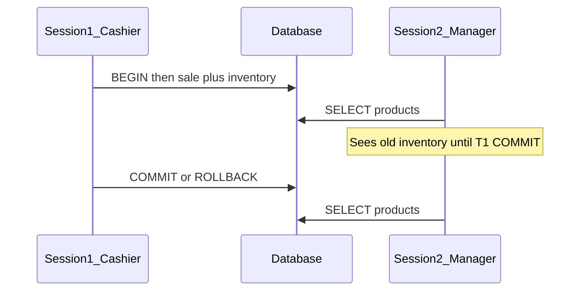

# ACID by Practical Examples — Lab Notes (SQL, PostgreSQL, MongoDB)

> **Course:** Fundamentals of Database Engineering — Sec 2: ACID  
> **Goal:** Reproduce every ACID letter with a warehouse checkout (`products` + `sales`), read the **exact result**, name **which letter that result proves**, then know how to **prevent that letter from breaking** in a real checkout API.

> **Prerequisite (theory):** [8-what-is-a-transaction.md](8-what-is-a-transaction.md) · [9-Atomicity.md](9-Atomicity.md) · [10-Isolation.md](10-Isolation.md) · [11.Consistency.md](11.Consistency.md) · [12.Durability.md](12.Durability.md)  
> **This file is a lab.** It does not re-teach WAL, SSI, or ARIES. It tells you **where to type**, **what you must see**, and **what to do later in production**.

---

## 1. One-Minute Interview Definition

A **checkout** is one transaction: insert a **sale** and decrement **inventory**. Either both become visible together, or neither does.

Think of a **warehouse with two cashiers**:

1. Cashier A writes a sale on a **scratch pad** (uncommitted).
2. Cashier B looks at the shelf. Isolation decides whether B sees A's pencil.
3. The **menu rules** say: you cannot sell a product that is not in the catalog, and stock cannot go negative. That is consistency.
4. If the lights go out **after** the receipt is stamped, the sale still exists. That is durability.
5. If cashier A spills coffee mid-checkout, the scratch pad is torn up — no orphan sale, no silent stock drop. That is atomicity.

**Say this in an interview:**

> *"I prove ACID with a products-and-sales checkout, not with slogans. Isolation is what a second session sees before COMMIT. Atomicity is that session never seeing a sale without a matching inventory drop. Consistency is FK and CHECK rejecting illegal warehouse states. Durability is COMMIT meaning the WAL or journal is on disk, not that table files were rewritten."*

---

## 2. Why the Original Demo Failed

This is the script that did **not** show ACID in the VS Code PostgreSQL extension. Each row is **expected vs actual**.

```sql
-- Original (broken) sketch
UPDATE products SET inventory = inventory - 10;   -- no WHERE, no BEGIN
\q                                                -- psql-only; not ROLLBACK
SELECT * FROM products;                           -- same session / already committed
COMMIT;                                           -- nothing left to commit
```

| Bug in the original | What actually happened | Why you could not "see" ACID |
|---------------------|------------------------|------------------------------|
| **No `BEGIN`** | PostgreSQL and MySQL **autocommit**: each statement is its own transaction and commits on success | Isolation and multi-statement atomicity never exist |
| **VS Code Database Client** | No transaction toolbar; autocommit; `\q` is ignored (it is a **psql** meta-command) | `BEGIN` in one Run often does not stay open on the next Run (**connection pool**) |
| **Same-session `SELECT`** | A session **always** sees its own uncommitted writes | Isolation is what **another** session does **not** see |
| **`UPDATE ... inventory - 10` with no `WHERE`** | Deducts 10 from **every** product | Not a checkout of Product 1 |
| **`\q` as "atomicity"** | If autocommit already committed, quit does nothing. If a txn is open, disconnect *may* roll back — that is **client** behavior | You did not prove the engine's atomicity |
| **Consistency = locking** | Locks/MVCC are **isolation tools**. Consistency is valid warehouse state (FK, CHECK, invariants) | Wrong letter |
| **No durability step** | Never inspected `fsync` / write concern | D was never tested |

**Lab rule:** Isolation and in-flight atomicity **must** be run in **two persistent terminals** (`psql` / `mysql` / `mongosh`). Do **not** use the VS Code SQL extension for Labs A and I.



---

## 3. How to Open Two Sessions (Do This First)

Label the windows **Session 1 = cashier** and **Session 2 = manager**. Leave both open. Do not close Session 1 in the middle of a `BEGIN`.

### 3.1 PostgreSQL — two `psql` windows

Connection (same as [posgres-podman-command.md](posgres-podman-command.md)): host `127.0.0.1`, port `5432`, user `sayantanPosgres`, database `Posgres`.

**Session 1 (Terminal A):**

```bash
psql -h 127.0.0.1 -p 5432 -U sayantanPosgres -d Posgres
```

**Session 2 (Terminal B) — new tab, same command:**

```bash
psql -h 127.0.0.1 -p 5432 -U sayantanPosgres -d Posgres
```

Or inside the container:

```bash
podman exec -it -e PGPASSWORD='P@ssw0rd' pg-dev \
  psql -U sayantanPosgres -d Posgres
```

Confirm you are two backends:

```sql
SELECT pg_backend_pid();
```

**SEE:** two **different** pid numbers. Same pid = you are in one session. **PROVES:** nothing yet — only that isolation *can* be tested.

### 3.2 Generic SQL (MySQL InnoDB) — two `mysql` windows

Connection (same as [mysql-connect-command.md](mysql-connect-command.md)): `127.0.0.1:3306`, user `root`, empty password.

```bash
mysql -h 127.0.0.1 -P 3306 -u root --protocol=TCP
```

Run it twice. Create a lab database once:

```sql
CREATE DATABASE IF NOT EXISTS acid_lab;
USE acid_lab;
```

### 3.3 MongoDB — replica set + two `mongosh` windows

Multi-document transactions **fail on standalone** with: `Transaction numbers are only allowed on a replica set member or mongos`.

Single-node replica set (Podman/Docker):

```bash
podman run -d --name mongo-rs -p 27017:27017 mongo:7 \
  mongod --replSet rs0 --bind_ip_all

podman exec -it mongo-rs mongosh --eval 'rs.initiate({_id:"rs0",members:[{_id:0,host:"localhost:27017"}]})'
```

**Session 1 and Session 2:**

```bash
mongosh "mongodb://127.0.0.1:27017/?replicaSet=rs0&directConnection=true"
```

```javascript
use acid_lab
```

### 3.4 Cookbook block (every step below uses this)

```
WHERE   → Session 1 (cashier)  |  Session 2 (manager)  |  engine
QUERY   → paste this
SEE     → this grid, row count, or ERROR
PROVES  → A | C | I | D  + why
```

### 3.5 Result → letter (decision table)

| If you see this | You just proved |
|-----------------|-----------------|
| Session 2 still has inventory **100** while Session 1 already shows **90** (txn open) | **Isolation** |
| After `ROLLBACK` / abort, Session 2 has **100** inventory and **0** sales (both gone) | **Atomicity** |
| After `COMMIT`, Session 2 has inventory **90** **and** exactly **one** matching sale | **Atomicity** (happy path) |
| `INSERT` pid `999` or inventory `-1000` is **rejected**; data unchanged | **Consistency** |
| `COMMIT` returns and `synchronous_commit` / `j: true` is on | **Durability** (configured; crash is mental) |
| Session 1 `SELECT` after its own `UPDATE` shows **90** | **Does not prove Isolation** — you always see your own writes |

---

## 4. Sequential Thinking — Before Every Lab

```
Step 1 → Name the letter you are trying to prove (A / C / I / D)
Step 2 → Open the right place: Session 1, Session 2, or a settings query
Step 3 → Paste the QUERY from the cookbook block
Step 4 → Compare your grid/error to SEE
         If mismatch: wrong session, autocommit, or you skipped reset
Step 5 → Read PROVES — that result is evidence for that letter
Step 6 → Read Prevent later — that is what you do in a checkout API
```

**Analogy map**

| Warehouse | Database |
|-----------|----------|
| Scratch pad (pencil) | Uncommitted sale + inventory update |
| Stamped receipt | `COMMIT` / `commitTransaction` |
| Torn slip | `ROLLBACK` / `abortTransaction` |
| Second cashier looking at the shelf | Session 2 |
| Menu rules (no ghost SKU, no negative stock) | FK, CHECK, `$jsonSchema` |
| Carbon-copy book surviving a blackout | WAL / InnoDB redo / WiredTiger journal |

---

## 5. Lab 0 — Setup (No ACID Letter Yet)

Reset **before every lab** so numbers stay 100 / 200 / 300 and `sales` is empty.

### 5.1 PostgreSQL — Session 1 only

**WHERE:** Session 1 (`psql`).

**QUERY:**

```sql
DROP TABLE IF EXISTS sales;
DROP TABLE IF EXISTS products;

CREATE TABLE products (
    pid        SERIAL PRIMARY KEY,
    name       TEXT NOT NULL,
    price      NUMERIC(10,2) NOT NULL CHECK (price > 0),
    inventory  INT NOT NULL CHECK (inventory >= 0),
    created_at TIMESTAMP NOT NULL DEFAULT CURRENT_TIMESTAMP,
    updated_at TIMESTAMP NOT NULL DEFAULT CURRENT_TIMESTAMP
);

CREATE TABLE sales (
    sale_id    SERIAL PRIMARY KEY,
    pid        INT NOT NULL REFERENCES products(pid),
    quantity   INT NOT NULL CHECK (quantity > 0),
    price      NUMERIC(10,2) NOT NULL CHECK (price > 0),
    created_at TIMESTAMP NOT NULL DEFAULT CURRENT_TIMESTAMP,
    updated_at TIMESTAMP NOT NULL DEFAULT CURRENT_TIMESTAMP
);

INSERT INTO products (name, price, inventory) VALUES
  ('Product 1', 100.99, 100),
  ('Product 2', 200.99, 200),
  ('Product 3', 300.99, 300);

SELECT pid, name, price, inventory FROM products ORDER BY pid;
SELECT count(*) AS sales_count FROM sales;
```

**SEE:**

```text
 pid |   name    | price  | inventory
-----+-----------+--------+-----------
   1 | Product 1 | 100.99 |       100
   2 | Product 2 | 200.99 |       200
   3 | Product 3 | 300.99 |       300

 sales_count
-------------
           0
```

**PROVES:** baseline only. If this grid is wrong, later letters cannot be judged.

**Reset between labs (PostgreSQL):**

```sql
TRUNCATE sales RESTART IDENTITY;
UPDATE products SET inventory = CASE pid
  WHEN 1 THEN 100 WHEN 2 THEN 200 WHEN 3 THEN 300 END;
```

### 5.2 Generic SQL (InnoDB) — Session 1 only

**WHERE:** Session 1 (`mysql`), database `acid_lab`.

**QUERY:**

```sql
DROP TABLE IF EXISTS sales;
DROP TABLE IF EXISTS products;

CREATE TABLE products (
    pid        INT AUTO_INCREMENT PRIMARY KEY,
    name       VARCHAR(100) NOT NULL,
    price      DECIMAL(10,2) NOT NULL CHECK (price > 0),
    inventory  INT NOT NULL CHECK (inventory >= 0),
    created_at TIMESTAMP NOT NULL DEFAULT CURRENT_TIMESTAMP,
    updated_at TIMESTAMP NOT NULL DEFAULT CURRENT_TIMESTAMP ON UPDATE CURRENT_TIMESTAMP
) ENGINE=InnoDB;

CREATE TABLE sales (
    sale_id    INT AUTO_INCREMENT PRIMARY KEY,
    pid        INT NOT NULL,
    quantity   INT NOT NULL CHECK (quantity > 0),
    price      DECIMAL(10,2) NOT NULL CHECK (price > 0),
    created_at TIMESTAMP NOT NULL DEFAULT CURRENT_TIMESTAMP,
    updated_at TIMESTAMP NOT NULL DEFAULT CURRENT_TIMESTAMP ON UPDATE CURRENT_TIMESTAMP,
    FOREIGN KEY (pid) REFERENCES products(pid)
) ENGINE=InnoDB;

INSERT INTO products (name, price, inventory) VALUES
  ('Product 1', 100.99, 100),
  ('Product 2', 200.99, 200),
  ('Product 3', 300.99, 300);

SELECT pid, name, price, inventory FROM products ORDER BY pid;
SELECT count(*) AS sales_count FROM sales;
```

**SEE:** same three inventory numbers and `sales_count = 0`.

**Reset between labs (MySQL):**

```sql
SET FOREIGN_KEY_CHECKS = 0;
TRUNCATE sales;
TRUNCATE products;
SET FOREIGN_KEY_CHECKS = 1;
INSERT INTO products (name, price, inventory) VALUES
  ('Product 1', 100.99, 100),
  ('Product 2', 200.99, 200),
  ('Product 3', 300.99, 300);
```

(MySQL `TRUNCATE products` with an FK from `sales` needs the checks toggle or `TRUNCATE sales` first then re-seed products without truncating if you prefer: `TRUNCATE sales;` then `UPDATE products SET inventory = ...`.)

Safer MySQL reset (keep product ids 1, 2, 3):

```sql
DELETE FROM sales;
ALTER TABLE sales AUTO_INCREMENT = 1;
UPDATE products SET inventory = CASE pid
  WHEN 1 THEN 100 WHEN 2 THEN 200 WHEN 3 THEN 300 END;
```

### 5.3 MongoDB — Session 1 only

**WHERE:** Session 1 (`mongosh`), `use acid_lab`.

**QUERY:**

```javascript
db.products.drop();
db.sales.drop();

db.createCollection("products", {
  validator: {
    $jsonSchema: {
      bsonType: "object",
      required: ["_id", "name", "price", "inventory"],
      properties: {
        name: { bsonType: "string" },
        price: { bsonType: "double", minimum: 0.01 },
        inventory: { bsonType: "int", minimum: 0 }
      }
    }
  }
});

db.products.insertMany([
  { _id: 1, name: "Product 1", price: 100.99, inventory: NumberInt(100) },
  { _id: 2, name: "Product 2", price: 200.99, inventory: NumberInt(200) },
  { _id: 3, name: "Product 3", price: 300.99, inventory: NumberInt(300) }
]);

db.products.find().sort({ _id: 1 });
db.sales.countDocuments();
```

**SEE:** three products; `sales` count `0`.

**Reset:**

```javascript
db.sales.deleteMany({});
db.products.updateOne({ _id: 1 }, { $set: { inventory: NumberInt(100) } });
db.products.updateOne({ _id: 2 }, { $set: { inventory: NumberInt(200) } });
db.products.updateOne({ _id: 3 }, { $set: { inventory: NumberInt(300) } });
```

---

## 6. Lab A — Atomicity (All or Nothing)

**Story:** Cashier sells 10 units of Product 1. Insert sale **and** decrement inventory. If anything fails, both must vanish.

**Analogy:** Tear up the whole order slip — do not leave "sale recorded, shelf unchanged."

Run **reset** first.

### 6.1 PostgreSQL — failure path (the proof)

#### Step A1 — cashier starts a checkout (scratch pad)

**WHERE:** Session 1 only. Do not run this in Session 2.

**QUERY:**

```sql
BEGIN;

INSERT INTO sales (pid, quantity, price)
VALUES (1, 10, 100.99);

UPDATE products
SET inventory = inventory - 10
WHERE pid = 1 AND inventory >= 10;

SELECT pid, name, inventory FROM products WHERE pid = 1;
SELECT sale_id, pid, quantity FROM sales;
```

**SEE (Session 1 only):**

```text
 pid |   name    | inventory
-----+-----------+-----------
   1 | Product 1 |        90

 sale_id | pid | quantity
---------+-----+----------
       1 |   1 |       10

UPDATE 1
INSERT 0 1
```

**PROVES:** nothing for Isolation yet. This is **your own** scratch pad. You always see your uncommitted writes.

#### Step A2 — manager looks at the shelf (still uncommitted)

**WHERE:** Session 2 only. Leave Session 1 sitting inside `BEGIN`.

**QUERY:**

```sql
SELECT pid, name, inventory FROM products WHERE pid = 1;
SELECT count(*) AS sales_count FROM sales;
```

**SEE:**

```text
 pid |   name    | inventory
-----+-----------+-----------
   1 | Product 1 |       100

 sales_count
-------------
           0
```

**PROVES: Isolation (bonus)** — Session 2 does not see pencil. If you see `90` here, you are in Session 1 or autocommit already committed. Stop and fix that before claiming Atomicity.

#### Step A3 — inject failure

**WHERE:** Session 1.

**QUERY:**

```sql
SELECT 1 / 0;
```

**SEE:**

```text
ERROR:  division by zero
```

Further SQL in this block (PostgreSQL) is rejected until rollback:

```text
ERROR:  current transaction is aborted, commands ignored until end of transaction block
```

**PROVES:** the engine marked the transaction **aborted**. Atomicity is about to discard **both** the sale and the decrement.

#### Step A4 — tear up the slip

**WHERE:** Session 1.

**QUERY:**

```sql
ROLLBACK;
```

**SEE:** `ROLLBACK`

**PROVES:** live rollback started. Confirm with Session 2.

#### Step A5 — manager confirms nothing stuck

**WHERE:** Session 2.

**QUERY:**

```sql
SELECT pid, inventory FROM products WHERE pid = 1;
SELECT count(*) AS sales_count FROM sales;
```

**SEE:** inventory **100**, sales **0**.

**PROVES: Atomicity.** The insert and the update vanished together. No orphan sale. No silent stock drop.

---

### 6.2 PostgreSQL — happy path (both become visible together)

Reset, then:

#### Step A6 — Session 1

```sql
BEGIN;

INSERT INTO sales (pid, quantity, price) VALUES (1, 10, 100.99);

UPDATE products
SET inventory = inventory - 10
WHERE pid = 1 AND inventory >= 10;

COMMIT;
```

**SEE:** `COMMIT`

#### Step A7 — Session 2

```sql
SELECT pid, inventory FROM products WHERE pid = 1;
SELECT sale_id, pid, quantity FROM sales;
```

**SEE:** inventory **90**, **one** sales row `(pid=1, quantity=10)`.

**PROVES: Atomicity (success path).** The pair appears as **one unit**. Session 2 never observed "sale without stock drop" or "stock drop without sale."

---

### 6.3 Generic SQL (InnoDB) — same story

Autocommit is on by default. You **must** `START TRANSACTION`.

**Failure path — Session 1:**

```sql
START TRANSACTION;

INSERT INTO sales (pid, quantity, price) VALUES (1, 10, 100.99);

UPDATE products
SET inventory = inventory - 10
WHERE pid = 1 AND inventory >= 10;

-- Session 2 should still see inventory 100, sales 0 (Isolation bonus)

-- Force a failure (FK): this statement errors
INSERT INTO sales (pid, quantity, price) VALUES (999, 1, 1.00);
-- ERROR 1452: Cannot add or update a child row: a foreign key constraint fails

ROLLBACK;
```

**Session 2 after ROLLBACK:**

```sql
SELECT pid, inventory FROM products WHERE pid = 1;
SELECT count(*) FROM sales;
```

**SEE:** `100` and `0`.

**PROVES: Atomicity.** InnoDB applied the **undo log** to reverse the sale insert and the inventory decrement.

**Happy path:** replace the bad insert with `COMMIT;` then Session 2 sees `90` and one sale.

---

### 6.4 MongoDB — multi-document failure + abort

Collections `products` and `sales` are **two documents**. Need a session transaction.

**WHERE:** Session 1 (`mongosh`). Session 2 is a **second** `mongosh` with **no** session (or a different session).

**Session 1 QUERY:**

```javascript
const s1 = db.getMongo().startSession();
s1.startTransaction({
  readConcern:  { level: "snapshot" },
  writeConcern: { w: "majority" }
});

const shop = s1.getDatabase("acid_lab");

shop.sales.insertOne({ pid: 1, quantity: 10, price: 100.99 });
shop.products.updateOne(
  { _id: 1, inventory: { $gte: 10 } },
  { $inc: { inventory: -10 } }
);

// Cashier sees own writes
shop.products.findOne({ _id: 1 });   // inventory: 90
shop.sales.find().toArray();         // one sale
```

**Session 2 QUERY (do not pass s1):**

```javascript
db.products.findOne({ _id: 1 });     // inventory: 100
db.sales.countDocuments();           // 0
```

**SEE:** Session 2 still **100** / **0**.

**PROVES: Isolation** (uncommitted txn invisible outside the session).

**Abort — Session 1:**

```javascript
s1.abortTransaction();
s1.endSession();
```

**Session 2 again:** still **100** / **0**.

**PROVES: Atomicity.** WiredTiger **freed the in-memory buffer**. No journal record for the aborted txn.

**Happy path:** `s1.commitTransaction()` instead of abort → Session 2 then sees `90` and one sale.

**Preferred production shape (single document — still Atomicity, no multi-doc txn):**

```javascript
db.products.updateOne(
  { _id: 1, inventory: { $gte: 10 } },
  {
    $inc: { inventory: -10 },
    $push: { sales: { quantity: 10, price: 100.99, at: new Date() } }
  }
);
```

One `updateOne` is always atomic. Filter miss → **zero** change (no half document).

---

### 6.5 Prevent Atomicity violations later (checkout API)

**Violation you just avoided:** sale row exists, inventory did not drop (or the reverse) — stock/money vanish.

| Do this | PostgreSQL / SQL | MongoDB |
|---------|------------------|---------|
| One txn for related writes | `BEGIN;` insert sale + `UPDATE ... WHERE pid=? AND inventory>=qty;` if rowcount ≠ 1 then `ROLLBACK;` `COMMIT;` | Prefer one document `$inc` + `$push`. Else `startTransaction` + abort on any failed step |
| Check affected rows | Never COMMIT if debit updated 0 rows | `modifiedCount !== 1` → abort |
| After an error | PostgreSQL: **must** `ROLLBACK` (block is dead) | `abortTransaction()`; retry `TransientTransactionError` |
| Keep txns short | No HTTP / user prompt inside `BEGIN` | 60s transaction limit |

**Never:** autocommit insert-sale then later update-inventory (the original script). **Never:** `\q` as rollback.

**Interview one-liner:** *"Atomicity is wrapping sale and stock in one transaction and rolling back if either step fails — not hoping two autocommit statements stay in sync."*

---

## 7. Lab C — Consistency (Valid Warehouse After Every Commit)

**Story:** The warehouse may only move from one **legal** state to another: real products, non-negative stock, `sold + remaining = original` for a checkout.

**Analogy:** You cannot sell a dish that is not on the menu, and you cannot end the night with negative chicken.

Reset first. Theory pointer: [11.Consistency.md](11.Consistency.md).

### 7.1 PostgreSQL

#### Step C1 — sale for a product that does not exist

**WHERE:** Session 1 (autocommit is fine — one illegal statement).

**QUERY:**

```sql
INSERT INTO sales (pid, quantity, price) VALUES (999, 1, 1.00);
```

**SEE:**

```text
ERROR:  insert or update on table "sales" violates foreign key constraint "sales_pid_fkey"
DETAIL:  Key (pid)=(999) is not present in table "products".
```

Then:

```sql
SELECT count(*) FROM sales;
```

**SEE:** `0`

**PROVES: Consistency.** The engine refused an invalid warehouse state. No ghost SKU sale.

#### Step C2 — stock cannot go negative

**WHERE:** Session 1.

**QUERY:**

```sql
UPDATE products SET inventory = inventory - 1000 WHERE pid = 1;
```

**SEE:**

```text
ERROR:  new row for relation "products" violates check constraint "products_inventory_check"
```

```sql
SELECT inventory FROM products WHERE pid = 1;
```

**SEE:** `100` (unchanged).

**PROVES: Consistency.** `CHECK (inventory >= 0)` is the menu rule.

#### Step C3 — business invariant after a correct checkout

**WHERE:** Session 1.

**QUERY:**

```sql
BEGIN;
INSERT INTO sales (pid, quantity, price) VALUES (1, 10, 100.99);
UPDATE products SET inventory = inventory - 10
  WHERE pid = 1 AND inventory >= 10;
COMMIT;

SELECT
  p.inventory AS remaining,
  coalesce(sum(s.quantity), 0) AS sold,
  p.inventory + coalesce(sum(s.quantity), 0) AS original_should_be_100
FROM products p
LEFT JOIN sales s ON s.pid = p.pid
WHERE p.pid = 1
GROUP BY p.inventory;
```

**SEE:** `remaining = 90`, `sold = 10`, `original_should_be_100 = 100`.

**PROVES: Consistency of the invariant** — but only because sale and decrement were **one transaction** (Atomicity is the **tool**; Consistency is the **outcome**). The original script (insert sales, then later a separate `UPDATE` of all products) could break this.

---

### 7.2 InnoDB — same three steps

```sql
INSERT INTO sales (pid, quantity, price) VALUES (999, 1, 1.00);
-- ERROR 1452 (FK)

UPDATE products SET inventory = inventory - 1000 WHERE pid = 1;
-- ERROR 3819: Check constraint 'products_chk_2' is violated  (name may vary)

SELECT inventory FROM products WHERE pid = 1;  -- still 100
```

Happy-path invariant query is the same `START TRANSACTION` / `COMMIT` + `SUM(quantity)`.

**PROVES:** same letter **C**. InnoDB enforces FK and CHECK (MySQL 8.0.16+). `NOT ENFORCED` CHECK is documentation only — do not use it for stock.

---

### 7.3 MongoDB — schema validation (no declarative FK)

#### Step C1 — negative inventory rejected

**WHERE:** Session 1.

**QUERY:**

```javascript
db.products.updateOne({ _id: 1 }, { $set: { inventory: NumberInt(-1) } });
```

**SEE:** `Document failed validation` (or write error). Inventory still `100`.

**PROVES: Consistency** via `$jsonSchema` `minimum: 0`.

#### Step C2 — ghost product sale is **not** blocked by the engine

```javascript
db.sales.insertOne({ pid: 999, quantity: 1, price: 1.00 });
// SUCCEEDS — MongoDB has no cross-collection FK
```

**SEE:** a sale for pid 999 exists.

**PROVES:** this is a **gap**, not a pass. Consistency here is **application-owned** unless you embed sales inside the product document.

Delete the ghost row before continuing:

```javascript
db.sales.deleteMany({ pid: 999 });
```

#### Step C3 — invariant with a correct atomic update

```javascript
db.products.updateOne(
  { _id: 1, inventory: { $gte: 10 } },
  {
    $inc: { inventory: -10 },
    $push: { sales: { quantity: 10, price: 100.99 } }
  }
);

const p = db.products.findOne({ _id: 1 });
p.inventory + p.sales.reduce((s, x) => s + x.quantity, 0);
// 100
```

**PROVES: Consistency** of `remaining + sold = original` **inside one document**.

---

### 7.4 Prevent Consistency violations later

**Violation you just blocked (or saw in Mongo without FK):** negative stock, sale for a missing product, `sold + remaining ≠ original`.

| Do this | PostgreSQL / SQL | MongoDB |
|---------|------------------|---------|
| Declare rules in the schema | FK on `sales.pid`, `CHECK (inventory >= 0)`, `CHECK (quantity > 0)`, `NUMERIC` not `float` | `$jsonSchema` `minimum: 0`; unique `_id`; **no FK** — embed or check in app |
| Atomic conditional decrement | `UPDATE ... SET inventory = inventory - :qty WHERE pid = :id AND inventory >= :qty` | `updateOne({ _id, inventory: { $gte: qty } }, { $inc: { inventory: -qty } })` |
| Two cashiers, one SKU | `SELECT ... FOR UPDATE` or `SERIALIZABLE` + retry `40001` | `findOneAndUpdate` with `$gte` |
| Cross-table invariant | One txn for sale + stock | Embed **or** multi-doc txn |

**Never:** `if (stock >= qty)` in the app then `SET inventory = <computed>` from a stale read. **Never:** skip FK because "the UI only lists real products."

**Interview one-liner:** *"CHECK and FK are the menu. Concurrent oversell still needs an atomic `WHERE inventory >= qty` — constraints alone do not serialize two cashiers."*

---

## 8. Lab I — Isolation (The Other Cashier Cannot See Pencil)

This is the demo that **failed in the VS Code extension**. Two terminals. Reset first.

**Analogy:** Cashier B must not count money Cashier A wrote in pencil and might erase.

### 8.1 PostgreSQL — dirty read prevented (default `READ COMMITTED`)

PostgreSQL treats `READ UNCOMMITTED` as `READ COMMITTED`. You **cannot** demo a dirty read on PostgreSQL. The interesting result is Session 2 still seeing **100**.

#### Step I1 — cashier writes pencil

**WHERE:** Session 1.

**QUERY:**

```sql
BEGIN;

INSERT INTO sales (pid, quantity, price) VALUES (1, 10, 100.99);

UPDATE products
SET inventory = inventory - 10
WHERE pid = 1 AND inventory >= 10;

SELECT inventory FROM products WHERE pid = 1;
```

**SEE (Session 1):** `90`

**PROVES:** **not Isolation.** Own writes are always visible.

#### Step I2 — manager reads the shelf

**WHERE:** Session 2. Session 1 still **inside** `BEGIN` (do not COMMIT yet).

**QUERY:**

```sql
SELECT pid, name, inventory FROM products WHERE pid = 1;
SELECT count(*) FROM sales;
```

**SEE:**

```text
 pid |   name    | inventory
-----+-----------+-----------
   1 | Product 1 |       100

 count
-------
     0
```

**PROVES: Isolation.** Uncommitted xmin is invisible to Session 2. If you see `90`, you ran this in Session 1 or autocommit committed Step I1.

#### Step I3 — stamp the receipt

**WHERE:** Session 1.

**QUERY:**

```sql
COMMIT;
```

**SEE:** `COMMIT`

**PROVES:** nothing until Session 2 re-reads.

#### Step I4 — manager sees committed truth

**WHERE:** Session 2.

**QUERY:** same `SELECT` as I2.

**SEE:** inventory **90**, sales count **1**.

**PROVES: Isolation ended for that txn** (pencil became ink) **and Atomicity** (pair visible together).

#### Step I5 — rollback path (repeat after reset)

Session 1: I1 then `ROLLBACK;`  
Session 2: still **100** / **0**.

**PROVES: Isolation + Atomicity.** Torn slip never became a shelf change.

---

### 8.2 PostgreSQL — optional: non-repeatable read vs Repeatable Read

Reset. This shows **Isolation level**, not dirty read.

**Session 1:**

```sql
BEGIN;  -- default READ COMMITTED
SELECT inventory FROM products WHERE pid = 1;   -- SEE: 100
-- pause here; run Session 2 completely
SELECT inventory FROM products WHERE pid = 1;   -- SEE: 90
COMMIT;
```

**Session 2 (between the two SELECTs):**

```sql
BEGIN;
UPDATE products SET inventory = inventory - 10 WHERE pid = 1;
COMMIT;
```

**SEE:** Session 1 first read **100**, second read **90**.

**PROVES: Isolation is tunable.** At Read Committed, a **non-repeatable read** is allowed (two committed truths in one txn). Not a dirty read.

Repeat Session 1 as:

```sql
BEGIN ISOLATION LEVEL REPEATABLE READ;
SELECT inventory FROM products WHERE pid = 1;   -- 100
-- Session 2 commits 90
SELECT inventory FROM products WHERE pid = 1;   -- still 100
COMMIT;
```

**SEE:** both reads **100**.

**PROVES:** stronger **Isolation** (snapshot frozen). Session 2's commit exists; this txn does not see it yet.

---

### 8.3 InnoDB — default Repeatable Read hides dirty reads too

Same I1–I5 with `START TRANSACTION` / `COMMIT`. Session 2 sees **100** until commit.

**Optional dirty-read demo (InnoDB only):**

**Session 2:**

```sql
SET SESSION TRANSACTION ISOLATION LEVEL READ UNCOMMITTED;
START TRANSACTION;
SELECT inventory FROM products WHERE pid = 1;
-- may see 90 while Session 1 has not committed
ROLLBACK;
```

**SEE:** possibly **90** (dirty).

**PROVES:** Isolation **failure** at RU. Do not use RU for checkout. Reset Session 2:

```sql
SET SESSION TRANSACTION ISOLATION LEVEL REPEATABLE READ;
```

---

### 8.4 MongoDB — second shell cannot see in-flight txn

**Session 1:** start txn, insert sale, `$inc` inventory (same as Lab A Session 1, **do not commit**).

**Session 2:**

```javascript
db.products.findOne({ _id: 1 });
db.sales.countDocuments();
```

**SEE:** `inventory: 100`, sales `0`.

**PROVES: Isolation.** Then `commitTransaction` → Session 2 sees `90` + one sale.

---

### 8.5 Prevent Isolation violations later

**Violation you just blocked:** dirty reads; two cashiers overselling the last 10 units (lost update — **not** fixed by isolation level alone).

| Do this | PostgreSQL / SQL | MongoDB |
|---------|------------------|---------|
| Dirty reads | PG RC default never dirty-reads; InnoDB default RR neither | Uncommitted txn data invisible outside the session |
| Stable checkout/report | `BEGIN ISOLATION LEVEL REPEATABLE READ;` or `SERIALIZABLE` | `readConcern: "snapshot"` + `w: "majority"` |
| Oversell (lost update) | `UPDATE ... WHERE inventory >= n` or `SELECT ... FOR UPDATE` | `$inc` with `$gte` — never read-modify-write in app |
| Write skew (two rows) | `SERIALIZABLE` + retry `40001`, or lock a sentinel row | Embed invariant or lock a sentinel document |

**Never:** prove isolation with `SELECT` in the **same** session as `UPDATE`. **Never:** isolation labs in the VS Code SQL extension. **Never:** hold `BEGIN` while waiting for a user click.

**Interview one-liner:** *"Isolation is the other session's SELECT before COMMIT. Preventing oversell is an atomic predicate update, not a higher isolation slogan."*

---

## 9. Lab D — Durability (COMMIT Survives Crash)

**Do not yank power.** You prove D by **inspecting the durability knobs**, committing a checkout, and stating what recovery would do. Depth: [12.Durability.md](12.Durability.md).

**Analogy:** After the receipt is stamped, a blackout must not erase the carbon-copy book (WAL / redo / journal). The cash drawer (data files) may still be messy until checkpoint.

### 9.1 PostgreSQL

#### Step D1 — inspect knobs

**WHERE:** Session 1.

**QUERY:**

```sql
SHOW fsync;
SHOW synchronous_commit;
SHOW wal_sync_method;
```

**SEE (healthy lab/prod defaults):**

```text
 fsync
--------
 on

 synchronous_commit
--------------------
 on

 wal_sync_method
-----------------
 fdatasync          -- typical on Linux; may differ on macOS
```

**PROVES: Durability is configured.** `COMMIT` will wait for WAL flush. If `synchronous_commit` is `off`, you are testing a **weaker** D (may lose last few txns on crash — **loss, not corruption**).

#### Step D2 — durable checkout

```sql
BEGIN;
INSERT INTO sales (pid, quantity, price) VALUES (1, 10, 100.99);
UPDATE products SET inventory = inventory - 10
  WHERE pid = 1 AND inventory >= 10;
COMMIT;
```

**SEE:** `COMMIT` returns to the client.

**PROVES:** engine ran `XLogFlush` / WAL `fsync` **before** ack (with those settings). Table files may still be dirty in shared buffers.

#### Step D3 — other session sees committed work

**WHERE:** Session 2.

```sql
SELECT inventory FROM products WHERE pid = 1;
SELECT count(*) FROM sales;
```

**SEE:** `90` and `1`.

**PROVES:** data is **committed** (necessary for D, not sufficient — that is visibility). Durability is the **crash story** next.

#### Step D4 — mental crash (read, do not run)

If power fails **2 seconds after COMMIT**:

1. PostgreSQL reads last checkpoint from `pg_control`.
2. **REDO** WAL from that LSN.
3. Durable `COMMIT` record exists → sale is a **winner**.
4. Inventory 90 and the sales row survive even if heap pages were stale on disk.

**PROVES: Durability** (interview explanation). Unlogged tables and `synchronous_commit=off` are the exceptions.

```sql
-- Do not use for checkout:
-- SET LOCAL synchronous_commit = off;
```

---

### 9.2 InnoDB

**QUERY:**

```sql
SHOW VARIABLES WHERE Variable_name IN (
  'innodb_flush_log_at_trx_commit',
  'innodb_doublewrite',
  'sync_binlog'
);
```

**SEE:** `innodb_flush_log_at_trx_commit = 1` for full ACID; `innodb_doublewrite = ON`.

Then the same `START TRANSACTION` checkout + `COMMIT`.

**Mental crash:** redo log fsync'd → recovery REDOs from checkpoint LSN → sale survives. Value `2` may lose ~1s on **OS** crash; process-only crash often still safe (redo in OS page cache).

**PROVES: Durability configured** at `1`.

---

### 9.3 MongoDB

**QUERY (checkout with explicit durability):**

```javascript
db.products.updateOne(
  { _id: 1, inventory: { $gte: 10 } },
  { $inc: { inventory: -10 } },
  { writeConcern: { w: "majority", j: true } }
);

db.sales.insertOne(
  { pid: 1, quantity: 10, price: 100.99 },
  { writeConcern: { w: "majority", j: true } }
);
```

Better: both inside one transaction with `writeConcern: { w: "majority", j: true }` (Lab A happy path).

**SEE:** acknowledged write; Session 2 `find` shows new inventory.

**Inspect:**

```javascript
db.adminCommand({ getParameter: 1, syncdelay: 1 });
// checkpoint ~60s
```

**Mental crash:** journal record with `j: true` was fsync'd → replay from last checkpoint. Default without `j: true` may sit in the journal buffer up to **~100 ms** — hard kill can **lose** that window, not corrupt.

**PROVES: Durability** only if write concern waited on the journal (and majority on a replica set).

---

### 9.4 Prevent Durability violations later

**Violation:** `COMMIT` returned, crash erased the sale.

| Do this | PostgreSQL / SQL | MongoDB |
|---------|------------------|---------|
| Money / inventory | `synchronous_commit=on`; InnoDB `innodb_flush_log_at_trx_commit=1` | `{ w: "majority", j: true }` |
| Disk death | Replication if you need more than one disk | Majority write concern |
| Weaker only for counters | `SET LOCAL synchronous_commit=off` for page views, **not** checkout | `j: false` only if losing ~100 ms is OK |

**Never:** `fsync=off` in production. **Never:** say "`COMMIT` wrote table files to disk" — it wrote the **log**.

**Interview one-liner:** *"Durability is WAL/journal fsync before ack. Checkpoints flush data files later. I keep sync commit on for checkout."*

---

## 10. Unified Checkout API Recipe (Never Violate ACID in a Service)

Paste this shape into a future order service. Same warehouse story.

```
1. Open txn          BEGIN / startTransaction
2. Decrement stock   WHERE inventory >= qty   /   $gte + $inc
3. If 0 rows         ROLLBACK, HTTP 409 Out of stock     (C + I)
4. Insert sale       same txn / $push on same document   (A)
5. Commit durable    default sync / w:majority,j:true    (D)
6. On error          ROLLBACK / abortTransaction
                     PG: ROLLBACK before retry (aborted block)
                     Mongo: retry TransientTransactionError
```

### PostgreSQL / SQL

```sql
BEGIN;

UPDATE products
SET inventory = inventory - 10,
    updated_at = CURRENT_TIMESTAMP
WHERE pid = 1 AND inventory >= 10;
-- application: if ROW_COUNT() <> 1 then ROLLBACK; -- 409

INSERT INTO sales (pid, quantity, price)
VALUES (1, 10, 100.99);

COMMIT;
```

### MongoDB (prefer embed)

```javascript
const r = db.products.updateOne(
  { _id: 1, inventory: { $gte: 10 } },
  {
    $inc: { inventory: -10 },
    $push: { sales: { quantity: 10, price: 100.99, at: new Date() } }
  },
  { writeConcern: { w: "majority", j: true } }
);
if (r.modifiedCount !== 1) {
  // 409 Out of stock — nothing half-applied
}
```

---

## 11. Side-by-Side — What You Should Have Seen

| Lab | Session 2 (or error) you must see | Letter |
|-----|-----------------------------------|--------|
| A failure | After rollback: inventory 100, sales 0 | **A** |
| A success | After commit: inventory 90 **and** 1 sale | **A** |
| C1 | FK/validation error; sales still 0 | **C** |
| C2 | CHECK/schema error; inventory still 100 | **C** |
| C3 | 90 + 10 = 100 | **C** |
| I2 (open txn) | inventory **100**, not 90 | **I** |
| I4 (after commit) | inventory 90 | **I** ended; **A** visible |
| D1 | `fsync`/`flush_log=1`/`j:true` | **D** configured |
| Same-session SELECT = 90 | — | **Not I** |

| Engine | Isolation default | Dirty read in this lab? | Multi-statement A |
|--------|-------------------|-------------------------|-------------------|
| PostgreSQL | READ COMMITTED | No (RU ≡ RC) | `BEGIN` ... `COMMIT` |
| InnoDB | REPEATABLE READ | No unless you set RU | `START TRANSACTION` |
| MongoDB | Snapshot in txn | No outside session | Session txn or one document |

---

## 12. How to Use This in an Interview

### 12.1 60-Second Spoken Answer

> *"I demonstrate ACID on a products-and-sales checkout. I open two sessions because isolation is what the other cashier sees. Before COMMIT, the manager still sees inventory 100 even though I already wrote 90 — that's isolation, not my own SELECT. If I divide by zero or hit a FK and ROLLBACK, both the sale and the stock change disappear — atomicity. FK and CHECK reject pid 999 and negative stock — consistency. I keep PostgreSQL synchronous_commit on, InnoDB flush_log at 1, and MongoDB majority plus j true so COMMIT means the log is durable. In production I wrap decrement-with-predicate and insert-sale in one transaction, and in MongoDB I prefer embedding the sale in the product document so I don't need a multi-document transaction."*

### 12.2 Answer Ladder

| Question | Answer direction |
|----------|------------------|
| *"Why didn't my VS Code demo work?"* | Autocommit, pooled connections, `\q` is not SQL, same-session SELECT, UPDATE without WHERE. |
| *"How do you prove Isolation?"* | Second session SELECT while first has open `BEGIN`. Must still see last committed inventory. |
| *"How do you prove Atomicity?"* | Fail mid-txn, ROLLBACK; second session has no sale and no stock drop. |
| *"How do you prove Consistency?"* | Illegal INSERT/UPDATE rejected; invariant `remaining + sold = original` after a wrapped checkout. |
| *"How do you prove Durability without a crash?"* | Show sync knobs, COMMIT, explain WAL/journal REDO. |
| *"How do you prevent oversell later?"* | `UPDATE ... WHERE inventory >= qty` / `$gte`+$inc, not app read-then-write. |
| *"MongoDB ACID?"* | Single-doc always atomic. Multi-doc needs replica set + session + retry. No SQL FK. |

---

## 13. Cheat Sheet

**Demo result → letter**

1. Session 2 sees 100 while Session 1 sees 90 (open txn) → **I**
2. After ROLLBACK, Session 2 still 100 and 0 sales → **A**
3. After COMMIT, Session 2 sees 90 **and** the sale → **A**
4. pid 999 / inventory -1000 rejected → **C**
5. `synchronous_commit=on` / `j: true` after COMMIT → **D**
6. Your own SELECT of 90 → **not I**

**Prevent later**

1. **A** — one txn; rowcount check; PG `ROLLBACK` after error; Mongo abort + retry.
2. **C** — FK, CHECK, `$jsonSchema`; never skip constraints because of UI.
3. **I** — two sessions to test; atomic predicate update to prevent oversell; RR/SERIALIZABLE or snapshot for stable views.
4. **D** — sync commit / flush_log=1 / `w:majority,j:true` for money.
5. **Checkout recipe** — begin → decrement if stock ≥ qty → insert sale → durable commit.
6. **Clients** — two `psql`/`mysql`/`mongosh`; not the VS Code SQL extension for I/A.
7. **MongoDB** — embed when you can; replica set for multi-doc txns.
8. **`float`** — do not use for money; `NUMERIC`/`DECIMAL`.
9. **`COMMIT`** — log durable, not data files flushed.
10. **Autocommit** — `BEGIN`/`START TRANSACTION` or you are not testing multi-statement ACID.

---

## 14. Sources

- [PostgreSQL tutorial: Transactions](https://www.postgresql.org/docs/current/tutorial-transactions.html)
- [PostgreSQL: BEGIN](https://www.postgresql.org/docs/current/sql-begin.html)
- [PostgreSQL: Transaction Isolation](https://www.postgresql.org/docs/current/transaction-iso.html)
- [PostgreSQL: Write-Ahead Logging](https://www.postgresql.org/docs/current/wal-intro.html)
- [PostgreSQL: Asynchronous Commit](https://www.postgresql.org/docs/current/wal-async-commit.html)
- [MySQL: START TRANSACTION, COMMIT, ROLLBACK](https://dev.mysql.com/doc/refman/8.4/en/commit.html)
- [MySQL: InnoDB autocommit, Commit, and Rollback](https://dev.mysql.com/doc/refman/8.4/en/innodb-autocommit-commit-rollback.html)
- [MySQL: InnoDB and the ACID Model](https://dev.mysql.com/doc/refman/8.4/en/mysql-acid.html)
- [MongoDB: Transactions](https://www.mongodb.com/docs/manual/core/transactions/)
- [MongoDB: Transactions in Applications](https://www.mongodb.com/docs/manual/core/transactions-in-applications/)
- [MongoDB: Production Considerations (replica set required)](https://www.mongodb.com/docs/manual/core/transactions-production-consideration/)
- [MongoDB: Convert Standalone to Replica Set](https://www.mongodb.com/docs/manual/tutorial/convert-standalone-to-replica-set/)
- [MongoDB: Journaling](https://www.mongodb.com/docs/manual/core/journaling/)
- [MongoDB: Write Concern](https://www.mongodb.com/docs/manual/reference/write-concern/)
- [Database Client (VS Code) — no transaction-mode UI](https://github.com/cweijan/vscode-database-client/issues/660)
- Lab connections: [posgres-podman-command.md](posgres-podman-command.md), [mysql-connect-command.md](mysql-connect-command.md)
