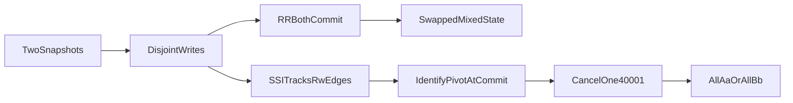
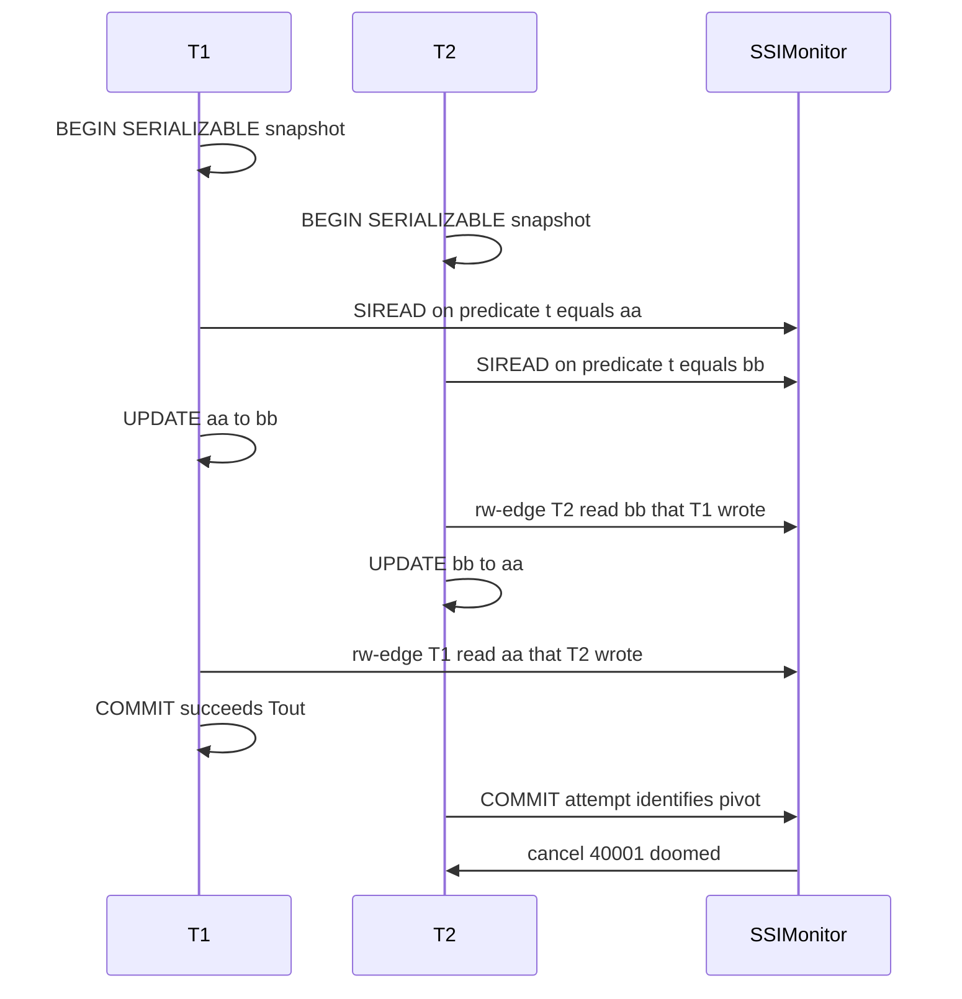
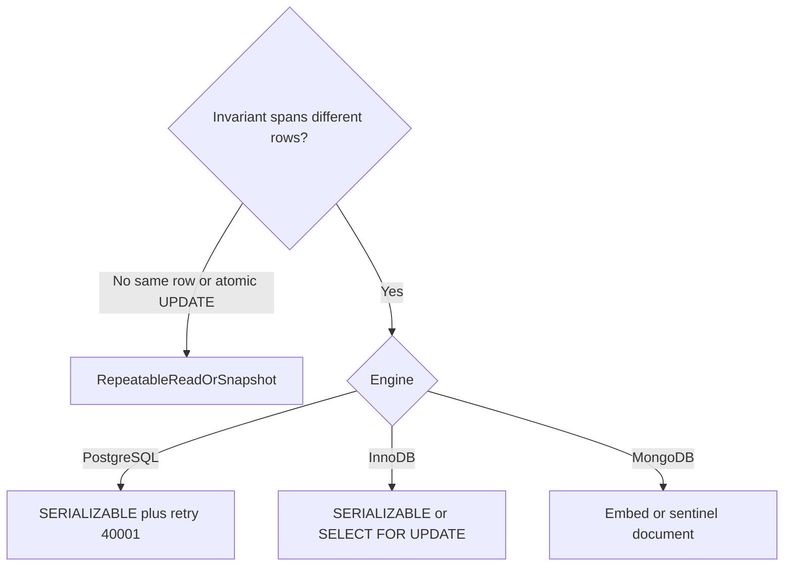

# Serializable vs Repeatable Read — Interview Notes (SQL, PostgreSQL, MongoDB)

> **Course:** Fundamentals of Database Engineering — Sec 2: ACID  
> **Goal:** Explain the **delta** between Repeatable Read and Serializable deeply enough to walk an interviewer through Hussein Nasser’s aa/bb swap, name the serialization anomaly, and show why PostgreSQL **cancels a COMMIT** when it identifies a **pivot** — then map the same idea to InnoDB and MongoDB.

> **Prerequisite:** [10-Isolation.md](10-Isolation.md) already covers dirty reads, non-repeatable reads, phantoms, MVCC snapshots, lost updates, and write skew at a survey level. [13-ACID-by-practical-examples.md](13-ACID-by-practical-examples.md) is the two-terminal lab cookbook. **This note answers only:** when is a frozen snapshot still not serial, and why does one `COMMIT` get cancelled?

> **Lecture slides:** [read.pdf](read.pdf) — page 1 is the swap under weaker isolation; page 2 is the same swap under Serializable. Hussein sometimes labels the weaker side “read committed / non-repeatable.” The interesting interview trap is **Repeatable Read**, not Read Committed: the snapshot is already frozen and the swap **still happens**.

---

## 1. One-Minute Interview Definition

**Repeatable Read** (in PostgreSQL: Snapshot Isolation) gives each transaction **one photocopy of the ledger**. Every `SELECT` in that transaction sees the same committed world. That kills dirty reads, non-repeatable reads, and — in PostgreSQL — phantoms on that snapshot.

**Serializable** adds one extra promise: the set of transactions that **successfully commit** must be equivalent to **some one-at-a-time order**. A frozen photocopy is not enough. Two photocopies can each be internally consistent and still tell a story that **no serial schedule** could produce.

Think of **two cashiers, each with a photocopy of the same tip jar**:

1. Cashier A’s photocopy shows three copper coins and three silver coins. A replaces every copper with silver.
2. Cashier B’s photocopy shows the same jar. B replaces every silver with copper.
3. They stamp different piles. The jar is still mixed — copper and silver **swapped**.
4. If they had worked **one after the other**, the jar would be **all copper** or **all silver**. Repeatable Read allowed a state that serial execution cannot produce. Serializable shreds one of the drafts at stamp time.

**Say this in an interview:**

> *"Repeatable Read freezes a snapshot so I never see mid-transaction committed changes to the rows I already read. Serializable additionally guarantees that whatever committed is equivalent to running those transactions one at a time. The classic gap is write skew: two transactions read the same snapshot, write disjoint rows, both look valid alone, and together they produce a state no serial order can explain — Hussein’s aa-to-bb / bb-to-aa swap. PostgreSQL Repeatable Read allows that. PostgreSQL Serializable runs the same snapshots, tracks read/write dependencies, identifies a pivot, and cancels one COMMIT with SQLSTATE 40001. The app retries. MongoDB snapshot transactions behave like Repeatable Read, not Serializable."*

---

## 2. Sequential Thinking — The aa/bb Swap From First Principles

Use this step order when an interviewer says: *"What’s the difference between Repeatable Read and Serializable?"* Do not start with lock types. Start with **possible final states**.

```
Step 1 → Start with a mixed batch (Hussein’s table)

         aa  bb  bb  bb  aa  aa
         three aa, three bb

Step 2 → Two concurrent transactions take SNAPSHOTS
         Each photocopy is identical: 3 aa + 3 bb
         PostgreSQL RR / SERIALIZABLE: snapshot at first statement
         MongoDB txn: snapshot at startTransaction (readConcern: snapshot)
         InnoDB RR: consistent nonlocking read from first SELECT

Step 3 → T1 rewrites only what ITS photocopy calls aa
         UPDATE items SET t = 'bb' WHERE t = 'aa';   -- touches 3 rows

         T2 rewrites only what ITS photocopy calls bb
         UPDATE items SET t = 'aa' WHERE t = 'bb';   -- touches the OTHER 3 rows

Step 4 → The write sets do NOT overlap
         No dirty write. No lost update on the same row.
         PostgreSQL RR will NOT raise:
           could not serialize access due to concurrent update
         That error is first-committer-wins on THE SAME row.
         This example is different rows. RR is silent.

Step 5 → Both COMMIT under Repeatable Read
         Final table: the three original aa became bb,
                      the three original bb became aa
         Still mixed. Just swapped.
         SERIAL executions cannot produce this:
           T1 then T2 → all aa
           T2 then T1 → all bb

Step 6 → Under Serializable the engine recorded the READ SETS
         T1 read (predicate t = 'aa'); T2 later wrote those rows → rw-edge
         T2 read (predicate t = 'bb'); T1 later wrote those rows → rw-edge
         Two consecutive rw-edges = dangerous structure
         The transaction in the middle is the PIVOT

Step 7 → PostgreSQL does NOT abort at the UPDATE
         UPDATEs succeed. Detection waits until COMMIT.
         One COMMIT succeeds (Tout). The other COMMIT identifies the pivot
         and is cancelled:
           ERROR: could not serialize access due to read/write dependencies
           SQLSTATE 40001

Step 8 → Application retries the cancelled transaction
         Retry sees the winner’s committed table.
         Now the WHERE matches a serial world → all aa or all bb.
```



**Key insight:** Repeatable Read asks *"did my photocopy stay stable?"* Serializable asks *"can these photocopies be ordered into a single story?"*

---

## 3. Lecture Example In Depth — Start State, Serial Outcomes, RR Outcome

### 3.1 The table (from [read.pdf](read.pdf))

| id | t  |
|----|----|
| 1  | aa |
| 2  | bb |
| 3  | bb |
| 4  | bb |
| 5  | aa |
| 6  | aa |

T1: change all `aa` → `bb`  
T2: change all `bb` → `aa`

### 3.2 What serial execution MUST produce

| Order | What happens | Final table |
|-------|----------------|-------------|
| **T1 then T2** | T1 turns every aa into bb → **all bb**. T2 then turns every bb into aa → **all aa**. | all `aa` |
| **T2 then T1** | T2 turns every bb into aa → **all aa**. T1 then turns every aa into bb → **all bb**. | all `bb` |

There is **no** serial order that ends mixed. If the committed database is still mixed, isolation was weaker than Serializable.

### 3.3 What Repeatable Read actually produces

| Time | T1 (RR) | T2 (RR) | Visible committed table |
|------|---------|---------|-------------------------|
| t0 | `BEGIN ISOLATION LEVEL REPEATABLE READ` | `BEGIN ISOLATION LEVEL REPEATABLE READ` | 3 aa, 3 bb |
| t1 | Snapshot: 3 aa, 3 bb | Snapshot: 3 aa, 3 bb | unchanged |
| t2 | `UPDATE ... SET t='bb' WHERE t='aa'` — 3 rows | | T1’s session sees its own writes |
| t3 | | `UPDATE ... SET t='aa' WHERE t='bb'` — other 3 rows | T2’s session sees its own writes |
| t4 | `COMMIT` | `COMMIT` | **swapped mix** — still 3 aa, 3 bb |

Each cashier is honest about **their photocopy**. Together they violate the only two legal serial endings.

**Warehouse analogy:** Two pickers each get a printout of the shelf. Picker A relabels every box marked `aa`. Picker B relabels every box marked `bb`. Because they never touch the same physical box, Repeatable Read thinks there is no fight. The warehouse is now the **swap**, not a complete relabel — which is what would have happened if one picker had waited for the other to finish.

### 3.4 What Serializable produces

Same UPDATEs. One `COMMIT` succeeds. The other `COMMIT` fails. After retry, the table is **all aa** or **all bb** — one of the two serial endings.

---

## 4. Why Repeatable Read Is Not Enough

Interviewers mix three different failures. Separate them.

| Pattern | Same rows written? | PostgreSQL Repeatable Read | PostgreSQL Serializable |
|---------|--------------------|----------------------------|-------------------------|
| **Dirty read** | n/a | Prevented (MVCC) | Prevented |
| **Non-repeatable read / phantom on snapshot** | n/a | Prevented (one snapshot) | Prevented |
| **Lost update on the same row** (two `UPDATE` the same id) | Yes | **Aborts** the second writer: `could not serialize access due to concurrent update` | Aborts (ww-conflict, even stronger) |
| **Write skew / serialization anomaly** (aa/bb, two doctors) | **No** — disjoint writes | **Both commit** | **One COMMIT cancelled** (`read/write dependencies`) |

### 4.1 Same-row conflict is NOT this lecture

```sql
-- Both transactions UPDATE the SAME row under REPEATABLE READ
-- Session 2 waits, then:
ERROR:  could not serialize access due to concurrent update
-- SQLSTATE 40001, but the REASON is first-committer-wins on one tuple
```

Hussein’s swap never hits this path. The row sets are disjoint. Repeatable Read has nothing to fight about.

### 4.2 Cross-row invariant IS this lecture

Classic siblings of aa/bb:

| Example | Each txn’s read | Each txn’s write | Broken invariant |
|---------|-----------------|------------------|------------------|
| **aa/bb swap** | rows matching `t='aa'` / `t='bb'` | the other color | result must be all aa or all bb |
| **Two doctors on call** | `COUNT(*) WHERE on_call` ≥ 1 | set **myself** off | at least one doctor remains |
| **PG docs `mytab`** | `SUM(value) WHERE class=1` | insert that sum into **class=2** | sums must match some serial order |
| **Batch header vs details** | header says “batch complete” | miss a detail row written concurrently | report is internally inconsistent |

**Interview sentence:**

> *"RR protects the photocopy. Serializable protects the story the photocopies tell together."*

PostgreSQL’s Repeatable Read is **stronger than ANSI Repeatable Read** (no phantoms) and **weaker than Serializable** (write skew remains). Before 9.1, asking for `SERIALIZABLE` in PostgreSQL **was** this Snapshot Isolation behavior. Today `REPEATABLE READ` is the legacy SI; `SERIALIZABLE` is SSI.

---

## 5. Why Pick Serializable Over Repeatable Read

Pick **Serializable** when correctness depends on a **predicate** — a count, a sum, a “all rows of this color”, an “at least one” — and the **writes land on different rows** than the ones that would collide under RR.

| Your requirement | Isolation / tool |
|------------------|------------------|
| Report must not change mid-transaction; no cross-row invariant | **Repeatable Read / Snapshot** |
| Two writers increment the **same** counter | Atomic `UPDATE col = col + n` / `$inc` — isolation level is secondary |
| Same row, read-modify-write in the app | `SELECT FOR UPDATE` or PG RR first-committer-wins + retry |
| **Invariant spans different rows** (aa/bb, doctors, class sums) | **Serializable**, or a **sentinel row** both transactions lock/update |
| High read, rare conflict, you hate blocking | PostgreSQL **SSI** (abort + retry) |
| Known hot range, contention is certain | InnoDB / PG **`SELECT FOR UPDATE`** (block up front) |
| MongoDB, same invariant | Embed in **one document**, or **sentinel document** both txns write — there is no SERIALIZABLE knob |

Skip Serializable when:

- Every check-then-act hits **one row** you can lock or update atomically.
- You will model the invariant as a **single document** (MongoDB) or a **constraint row**.
- The workload is read-mostly reporting: `REPEATABLE READ` or `SERIALIZABLE READ ONLY DEFERRABLE` (PostgreSQL) is enough; you do not need SSI bookkeeping on every OLTP write.

**Cost you are buying:**

| Approach | Extra cost | Extra protection |
|----------|------------|------------------|
| RR / snapshot | Almost none beyond MVCC | Frozen view; **not** serial history |
| PG SERIALIZABLE (SSI) | Predicate flags, some false-positive aborts, **must retry** | True serializable for committed txns |
| InnoDB SERIALIZABLE | Shared next-key locks on every plain `SELECT` → blocking, deadlocks | Pessimistic serializable |
| MongoDB snapshot txn | WiredTiger snapshot + fail-on-conflict on **same doc** | SI only; write skew remains |

**Hard rule for SSI:** every transaction that participates in the invariant must run at `SERIALIZABLE`. A Repeatable Read partner is **invisible** to the SSI graph. Mixing levels re-opens write skew.

---

## 6. Pivot Identification at COMMIT — Why the Cancel Happens on `COMMIT`, Not on `UPDATE`

This is the mechanism behind Hussein’s serializable demo and the phrase **“cancelled on identification as pivot during commit attempt.”**

### 6.1 Student picture first

Repeatable Read only notices **two pens on the same line**. Serializable also notices **two pens on different lines that logically depend on each other**.

It does that by remembering **what you read**, not only **what you wrote**. Those memories are **flags**, not waiting rooms. Nobody blocks. At stamp time (`COMMIT`), if the flags form a loop that no serial order can explain, one draft is shredded.

### 6.2 The three edge types (only one can point backwards)

Among concurrent snapshot transactions, PostgreSQL README-SSI distinguishes:

| Edge | Meaning | Can it oppose commit order? |
|------|---------|-----------------------------|
| **wr** | T2 read a version T1 wrote | No — T1 committed before T2’s snapshot |
| **ww** | T2 overwrote a version T1 wrote | No — T1 committed first |
| **rw** (rw-antidependency) | T1 read a version that T2 later overwrote, **or** T2 inserted a row T1’s predicate would have seen | **Yes** — T1 *appears* to have run first because it saw the world *before* T2’s write |

Write skew is a **cycle of rw-edges**: T1 read what T2 wrote, T2 read what T1 wrote, writes did not overlap.

### 6.3 Dangerous structure and the pivot

Every Snapshot Isolation anomaly contains two **adjacent** rw-edges:

```
Tin  --rw-->  Tpivot  --rw-->  Tout
```

- **Tin** — the reader on the inbound edge.
- **Tpivot** — the middle transaction: it has an **inbound** rw-edge **and** an **outbound** rw-edge. That is the **pivot**.
- **Tout** — the writer on the outbound edge.

For the aa/bb swap there are only two transactions, so each is Tin for one edge and Tout for the other; **each is a pivot** in a two-node cycle.

SSI does **not** search the whole serialization graph for cycles (expensive). It watches for this cheap pattern. If a pivot appears, it **may** abort. That can be a **false positive** (dangerous structure that is not actually on a cycle). It is **never** a false negative (an SI anomaly that SSI lets through).

### 6.4 Why the abort waits for COMMIT (Fekete Theorem 2.1)

The bare pivot test would shred too many drafts. The theorem PostgreSQL uses: in any dangerous structure that sits on a **real** cycle, **`Tout` commits first**.

So PostgreSQL:

1. Lets both UPDATEs run on snapshots (no extra blocking vs RR).
2. Records SIREAD flags on the read predicates.
3. When a write hits a flag, records an rw-conflict.
4. **Refuses to cancel anyone until the out-side partner has actually committed.**
5. On the remaining transaction’s `COMMIT` attempt, identifies the pivot, marks it **doomed** (`SXACT_FLAG_DOOMED`), and raises:

```text
ERROR:  could not serialize access due to read/write dependencies among transactions
-- SQLSTATE 40001  serialization_failure
```

That is why Hussein’s demo “works” until **commit**: the identification of the pivot is a **commit-time** check, not an `UPDATE`-time lock wait.

README-SSI also says PostgreSQL tries to cancel a transaction such that an **immediate retry** is unlikely to collide with the **same** set of partners — conceptually similar to first-committer-wins for write conflicts.



### 6.5 SIREAD locks are flags, not S2PL

| Property | InnoDB / SQL Server Serializable | PostgreSQL SSI |
|----------|----------------------------------|----------------|
| What “serializable” holds | Shared / next-key / key-range **locks until commit** | **SIReadLock** flags in `pg_locks` |
| Readers block writers? | Yes | **No** |
| Writers block readers? | Often | **No** (plain reads) |
| Failure mode | Wait, sometimes **deadlock** | **Abort + retry** (`40001`) |
| Visible in | `SHOW ENGINE INNODB STATUS` / lock waits | `pg_locks` where `mode = 'SIReadLock'` |

```sql
-- While two SERIALIZABLE transactions are open, in a third session:
SELECT locktype, relation::regclass, mode, granted, pid
FROM pg_locks
WHERE mode = 'SIReadLock';
```

False positives increase if predicate locks **escalate** from tuple → page → relation (`max_pred_locks_per_transaction` too small, or a sequential scan taking a relation-level SIREAD). That is a performance tuning topic, not a correctness hole.

### 6.6 How the three engines enforce “serializable” (or refuse to)

| Engine | How Serializable is enforced | What the app sees on aa/bb |
|--------|------------------------------|----------------------------|
| **PostgreSQL** | Optimistic **SSI** + non-blocking predicate flags | UPDATEs succeed; **one COMMIT cancelled** |
| **InnoDB** | Pessimistic: plain `SELECT` becomes `SELECT ... FOR SHARE`; next-key locks | Second session **blocks** (or deadlocks), then sees the winner |
| **MongoDB** | **Not offered.** Multi-doc txn = Snapshot Isolation | **Both commit**; swapped mix, same as PG RR |

---

## 7. Labs — Two Sessions, Same Recipe as Isolation

Use **two persistent terminals**. Isolation is what the **other** session sees. VS Code “Run SQL” pools connections and will lie to you.

Connections (same as the rest of Sec 2):

| Engine | How to open two sessions |
|--------|--------------------------|
| PostgreSQL | `psql -h 127.0.0.1 -p 5432 -U sayantanPosgres -d Posgres` twice — [posgres-podman-command.md](posgres-podman-command.md) |
| MySQL / InnoDB | `mysql -h 127.0.0.1 -P 3306 -u root --protocol=TCP` twice — [mysql-connect-command.md](mysql-connect-command.md) |
| MongoDB | replica set required; two `mongosh` windows — [13-ACID-by-practical-examples.md](13-ACID-by-practical-examples.md) §3.3 |

Confirm two backends: `SELECT pg_backend_pid();` / `SELECT CONNECTION_ID();` must differ.

### 7.0 Setup once (PostgreSQL / InnoDB)

```sql
DROP TABLE IF EXISTS items;
CREATE TABLE items (
  id INT PRIMARY KEY,
  t  CHAR(2) NOT NULL
);
INSERT INTO items (id, t) VALUES
  (1, 'aa'), (2, 'bb'), (3, 'bb'),
  (4, 'bb'), (5, 'aa'), (6, 'aa');
SELECT * FROM items ORDER BY id;
```

Reset between labs:

```sql
UPDATE items SET t = CASE id
  WHEN 1 THEN 'aa' WHEN 2 THEN 'bb' WHEN 3 THEN 'bb'
  WHEN 4 THEN 'bb' WHEN 5 THEN 'aa' WHEN 6 THEN 'aa'
END;
```

---

### Lab A — PostgreSQL Repeatable Read (anomaly ALLOWED)

Both sessions freeze the same photocopy. Disjoint writes. Both commit. Table stays mixed — swapped.

```sql
-- Session 1                                      -- Session 2
BEGIN ISOLATION LEVEL REPEATABLE READ;            BEGIN ISOLATION LEVEL REPEATABLE READ;

SELECT t FROM items ORDER BY id;
-- aa bb bb bb aa aa                              -- aa bb bb bb aa aa

UPDATE items SET t = 'bb' WHERE t = 'aa';
-- 3 rows                                         UPDATE items SET t = 'aa' WHERE t = 'bb';
                                                  -- 3 rows (the OTHER three)

SELECT t FROM items ORDER BY id;
-- all bb from T1's point of view                 -- all aa from T2's point of view

COMMIT;                                           COMMIT;

SELECT t FROM items ORDER BY id;
-- SWAPPED MIX: bb aa aa aa bb bb   (still 3 aa, 3 bb — not serial)
```

**SEE:** both commits succeed; committed table is still mixed.  
**PROVES:** Repeatable Read = Snapshot Isolation here. Frozen photocopies + disjoint writes ≠ serializable history.

---

### Lab B — PostgreSQL Serializable (one COMMIT cancelled — the pivot)

Same UPDATEs. Detection is at **COMMIT**.

```sql
-- Session 1                                      -- Session 2
BEGIN ISOLATION LEVEL SERIALIZABLE;               BEGIN ISOLATION LEVEL SERIALIZABLE;

UPDATE items SET t = 'bb' WHERE t = 'aa';         UPDATE items SET t = 'aa' WHERE t = 'bb';
-- UPDATE succeeds                                -- UPDATE succeeds  (no wait)

COMMIT;                                           COMMIT;
-- one of these COMMITs succeeds
-- the other raises:
-- ERROR:  could not serialize access due to
--         read/write dependencies among transactions
-- SQLSTATE: 40001
```

**Who loses?** The transaction whose `COMMIT` runs **after** the other has already committed as `Tout`. That is the pivot identification on the commit attempt.

**Retry the loser** (new `BEGIN ISOLATION LEVEL SERIALIZABLE`):

```sql
-- After reset-or-not: the winner already committed.
-- Retry of "change aa to bb" on an all-aa table → all bb.
-- Retry of "change bb to aa" on an all-bb table → all aa.
BEGIN ISOLATION LEVEL SERIALIZABLE;
UPDATE items SET t = 'bb' WHERE t = 'aa';  -- or the other statement
COMMIT;
SELECT t FROM items ORDER BY id;  -- ALL aa  or  ALL bb
```

**SEE:** first COMMIT ok; second COMMIT `40001`; retry yields a serial ending.  
**PROVES:** SSI cancelled on pivot identification at commit; app **must** retry.

Optional peek while both txns are still open (third session):

```sql
SELECT pid, mode, granted, relation::regclass
FROM pg_locks
WHERE mode = 'SIReadLock';
```

---

### Lab B2 — PostgreSQL docs `mytab` (second interview example)

If they have not seen aa/bb, use the official illustration of the **same** anomaly.

```sql
DROP TABLE IF EXISTS mytab;
CREATE TABLE mytab (class INT, value INT);
INSERT INTO mytab VALUES (1, 10), (1, 20), (2, 100), (2, 200);

-- Session A (SERIALIZABLE)                       -- Session B (SERIALIZABLE)
BEGIN ISOLATION LEVEL SERIALIZABLE;               BEGIN ISOLATION LEVEL SERIALIZABLE;

SELECT SUM(value) FROM mytab WHERE class = 1;
-- 30                                             SELECT SUM(value) FROM mytab WHERE class = 2;
                                                  -- 300
INSERT INTO mytab(class, value) VALUES (2, 30);   INSERT INTO mytab(class, value) VALUES (1, 300);

COMMIT;                                           COMMIT;
-- RR: both commit → sums 30 and 300 coexist, which no serial order produces
-- SERIALIZABLE: one COMMIT cancelled (read/write dependencies)
```

Serial order A then B would make B’s sum **330**. B then A would make A’s sum **330**. Committed 30+300 is write skew.

---

### Lab C — Generic SQL (InnoDB): RR allows the swap; SERIALIZABLE blocks

InnoDB default is Repeatable Read. Plain `SELECT` uses a snapshot. `UPDATE` locks the rows it actually writes. aa and bb are **different rows**, so RR still allows the swap — same as PostgreSQL RR.

```sql
-- Session 1                                      -- Session 2
SET SESSION TRANSACTION ISOLATION LEVEL REPEATABLE READ;
START TRANSACTION;                                SET SESSION TRANSACTION ISOLATION LEVEL REPEATABLE READ;
                                                  START TRANSACTION;

UPDATE items SET t = 'bb' WHERE t = 'aa';         UPDATE items SET t = 'aa' WHERE t = 'bb';
COMMIT;                                           COMMIT;

SELECT t FROM items ORDER BY id;
-- swapped mix again
```

**SERIALIZABLE in InnoDB is pessimistic**, not SSI. With autocommit off, every plain `SELECT` is treated as `SELECT ... FOR SHARE`. Next-key locks serialize the **read set**. The second transaction **waits** instead of committing a skew.

```sql
-- Session 1                                      -- Session 2
SET SESSION TRANSACTION ISOLATION LEVEL SERIALIZABLE;
START TRANSACTION;                                SET SESSION TRANSACTION ISOLATION LEVEL SERIALIZABLE;
                                                  START TRANSACTION;

SELECT * FROM items WHERE t = 'aa';               -- T2's SELECT ... WHERE t='bb' may wait
-- implicit FOR SHARE on matching index records   -- or T2's UPDATE waits on T1's locks
-- and gaps

UPDATE items SET t = 'bb' WHERE t = 'aa';
COMMIT;                                           -- T2 now proceeds on the serial world
                                                  UPDATE items SET t = 'aa' WHERE t = 'bb';
                                                  COMMIT;
-- result: all aa or all bb (blocking), not 40001
```

**Alternative at Repeatable Read** if you already know the hot predicate — lock it yourself:

```sql
START TRANSACTION;
SELECT * FROM items WHERE t IN ('aa', 'bb') FOR UPDATE;  -- next-key the range
UPDATE items SET t = 'bb' WHERE t = 'aa';
COMMIT;
```

**SEE:** RR + disjoint `UPDATE` → swap. SERIALIZABLE / `FOR UPDATE` → wait, then serial result.  
**PROVES:** InnoDB Serializable = S2PL-style shared range locks, **not** PostgreSQL’s commit-time pivot abort.

---

### Lab D — MongoDB: snapshot ≈ Repeatable Read; write skew ALLOWED

MongoDB has **no** `SERIALIZABLE` isolation level. A multi-document transaction with `readConcern: "snapshot"` and `w: "majority"` is **Snapshot Isolation**. WiredTiger aborts only when two transactions **write the same document** (fail-on-conflict). The aa/bb swap writes **different documents** → both commit.

Requires a **replica set** (standalone rejects transaction numbers).

```javascript
use acid_lab
db.items.drop()
db.items.insertMany([
  { _id: 1, t: "aa" }, { _id: 2, t: "bb" }, { _id: 3, t: "bb" },
  { _id: 4, t: "bb" }, { _id: 5, t: "aa" }, { _id: 6, t: "aa" }
])
```

```javascript
// Session 1                                              // Session 2
const s1 = db.getMongo().startSession()                   const s2 = db.getMongo().startSession()
s1.startTransaction({                                     s2.startTransaction({
  readConcern: { level: "snapshot" },                       readConcern: { level: "snapshot" },
  writeConcern: { w: "majority" }                           writeConcern: { w: "majority" }
})                                                        })
const c1 = s1.getDatabase("acid_lab").items               const c2 = s2.getDatabase("acid_lab").items

c1.updateMany({ t: "aa" }, { $set: { t: "bb" } })         c2.updateMany({ t: "bb" }, { $set: { t: "aa" } })
s1.commitTransaction()                                    s2.commitTransaction()

db.items.find().sort({ _id: 1 })
// swapped mix — both committed, like PostgreSQL RR
```

**Production workaround — sentinel document** both transactions write, so WiredTiger **does** see a write-write conflict:

```javascript
db.constraints.updateOne(
  { _id: "color_batch" },
  { $setOnInsert: { epoch: 0 } },
  { upsert: true }
)

async function swapAaToBb(client) {
  const session = client.startSession()
  session.startTransaction({
    readConcern: { level: "snapshot" },
    writeConcern: { w: "majority" }
  })
  const db = session.getDatabase("acid_lab")
  // Force a ww-conflict with the sibling transaction
  db.constraints.updateOne(
    { _id: "color_batch" },
    { $inc: { epoch: 1 } },
    { session }
  )
  db.items.updateMany({ t: "aa" }, { $set: { t: "bb" } }, { session })
  await session.commitTransaction()
  session.endSession()
}
```

Whichever transaction loses the sentinel write gets `WriteConflict` / `TransientTransactionError` and retries — **you** invented a pivot. The engine will not invent one for you.

**SEE:** snapshot txn allows the swap; sentinel turns it into fail-on-conflict + retry.  
**PROVES:** MongoDB multi-doc = SI, not SSI. Cross-document invariants need modeling (embed, sentinel, or single-doc `$inc`).

---

### Retry loop (PostgreSQL `40001` + MongoDB transient)

Serializable and MongoDB snapshot txns are **optimistic** at the conflict that matters. The application is part of isolation.

```javascript
async function runWithRetry(fn, maxRetries = 8) {
  for (let i = 0; i < maxRetries; i++) {
    try {
      return await fn();
    } catch (e) {
      const pgSer = e.code === "40001" || e.code === "40P01"; // serialization / deadlock
      const mongoSer = e.hasErrorLabel?.("TransientTransactionError");
      if ((!pgSer && !mongoSer) || i === maxRetries - 1) throw e;
    }
  }
}
```

```sql
-- psql mental model: never COMMIT and walk away after 40001
-- ROLLBACK;  BEGIN ISOLATION LEVEL SERIALIZABLE;  -- entire business txn again
```

Do **not** treat data you read in a transaction that later aborted as true — including read-only Serializable transactions (except `SERIALIZABLE READ ONLY DEFERRABLE`, which waits for a **safe** snapshot before reading).

---

## 8. Analogies You Can Reuse in an Interview

### 8.1 Two photocopies of the tip jar (aa/bb)

Two cashiers photocopy the jar (3 copper, 3 silver). One replaces every copper with silver. The other replaces every silver with copper. They never grab the same coin, so Repeatable Read stamps both receipts. The jar is still mixed — just swapped. Serial shifts would have emptied one metal completely. Serializable is the manager who rips up the second receipt at the stamp machine.

### 8.2 Two doctors, one on-call slot

Alice and Bob each read “one other person is on call.” Each sets **themselves** off. Zero remain. Each photocopy was consistent. The **story** is not serial. Same graph as aa/bb: disjoint writes, shared predicate.

### 8.3 Photocopy vs editor

| Isolation | Metaphor |
|-----------|----------|
| Read Committed | New photocopy **per sentence** — the jar can change between counts |
| Repeatable Read | **One** photocopy for the whole checkout |
| Serializable (PG SSI) | One photocopy **plus** an editor who shreds a draft if two photocopies cannot be ordered |
| InnoDB Serializable | Nobody gets a quiet photocopy; everyone holds the **page** they read until they leave |
| MongoDB snapshot txn | One photocopy; the editor only shreds if two pens hit the **same line** |

**Line to remember:** Repeatable Read protects the photocopy. Serializable protects the story the photocopies tell together.

---

## 9. How We Use This in Depth — Decision Guide



| Situation | Use |
|-----------|-----|
| Dashboard / export that must not flicker | RR / snapshot |
| Bank transfer of two known account ids | Atomic updates or `FOR UPDATE` those two rows; RR often enough |
| “At least N rows satisfy P” then update a **different** row | Serializable or lock the predicate |
| Hussein batch relabel (aa/bb) | Serializable (PG), SERIALIZABLE/`FOR UPDATE` (InnoDB), sentinel (MongoDB) |
| Read-only analytics on PG | `SERIALIZABLE READ ONLY DEFERRABLE` — only Serializable case that **blocks until a safe snapshot**, then no SSI aborts |
| Mixed RR + SERIALIZABLE partners | **Don’t** — SSI ignores non-serializable transactions |

Operational habits when you **do** choose PostgreSQL Serializable:

1. Generalized retry on `40001` (and usually `40P01` deadlocks).
2. Declare `READ ONLY` when you are not writing.
3. Keep transactions short; kill idle-in-transaction.
4. Prefer index scans over sequential scans so SIREAD stays fine-grained.
5. Drop redundant `FOR UPDATE` if SSI already covers the invariant — or keep `FOR UPDATE` and stay at RR if contention is a known hot row.

---

## 10. How to Use This in an Interview

### 10.1 60-second spoken answer

> *"Repeatable Read gives me a snapshot: I won’t see other transactions’ committed updates appear mid-flight, and in PostgreSQL I won’t see phantoms on that snapshot either — that’s Snapshot Isolation, which is stronger than the ANSI Repeatable Read minimum. Serializable means the transactions that commit are equivalent to running them one at a time. The gap is write skew. Hussein’s example is a table of aa and bb. One transaction turns aa into bb, the other turns bb into aa. They write disjoint rows, so Repeatable Read lets both commit and you get a swapped mix — a state no serial order can produce, because serial order would finish all aa or all bb. PostgreSQL Serializable uses SSI: same snapshots, plus non-blocking SIREAD flags on what you read. When those flags form a dangerous structure — Tin rw-edge into a pivot rw-edge into Tout — and Tout has already committed, the remaining COMMIT is cancelled with SQLSTATE 40001. That’s ‘cancelled on identification as pivot during the commit attempt.’ The app retries. InnoDB Serializable is the opposite style: plain SELECT becomes FOR SHARE and you wait. MongoDB snapshot transactions are Repeatable-Read-like; they will allow the swap unless I force a write-write on a sentinel document or embed the invariant in one document."*

### 10.2 Answer ladder — if they go deeper

| Question | Answer direction |
|----------|------------------|
| *"Isn’t Repeatable Read enough? The snapshot didn’t change."* | Enough for **one** transaction’s view. Not enough for **two** views that cannot be ordered. |
| *"PG Repeatable Read vs ANSI Repeatable Read?"* | PG RR = Snapshot Isolation: **no phantoms**. ANSI RR **allows** phantoms. PG RR still **allows write skew**. |
| *"Why no phantoms at PG RR but still not serializable?"* | Phantoms are “new rows in my range.” Write skew is “we updated **different** existing rows that together break an invariant.” Different phenomena. |
| *"Same as lost update?"* | No. Lost update = two writes to **one** row. PG RR already aborts that (`concurrent update`). aa/bb is **disjoint** writes. |
| *"Why abort at COMMIT, not UPDATE?"* | SSI is optimistic. `Tout` must commit first before a dangerous structure is real enough to cancel. Pivot identification is a **commit-time** check (`SXACT_FLAG_DOOMED`). |
| *"What is a pivot?"* | Middle node of `Tin --rw--> Tpivot --rw--> Tout`. Has an inbound **and** outbound rw-antidependency. |
| *"SSI vs SELECT FOR UPDATE?"* | SSI: no reader/writer blocking, rare abort + retry, some false positives. `FOR UPDATE`: block up front, no surprise abort, worse concurrency on hot ranges. |
| *"Can MongoDB do Serializable?"* | No write-skew detector. Snapshot + fail-on-conflict **same document** only. Use embed / sentinel / `$inc`. |
| *"False positives?"* | SSI may abort a txn that was not actually on a cycle. Never lets a real SI anomaly through. Escalated relation-level SIREAD increases aborts. |
| *"SQLSTATE?"* | `40001` serialization_failure. Retry the **whole** transaction, not the last statement. |
| *"InnoDB RR default — safe for aa/bb?"* | No. Disjoint `UPDATE`s still swap. Need SERIALIZABLE or locking reads on the predicate. |
| *"Must every txn be SERIALIZABLE?"* | For SSI to protect an invariant, **yes** — RR partners are not in the conflict graph. |

### 10.3 Cheat sheet (glance before the interview)

1. **RR** = one photocopy. **Serializable** = photocopies must form a serial story.
2. Hussein aa/bb: serial endings are **all aa** or **all bb**; RR ending is **swapped mix**.
3. Disjoint writes → no `concurrent update`; that error is **same-row** RR, not this lecture.
4. The missing phenomenon is **serialization anomaly / write skew**, not dirty or non-repeatable read.
5. PostgreSQL Serializable = **SSI** on top of SI (since 9.1). Pre-9.1 `SERIALIZABLE` **was** today’s RR.
6. **Pivot** = middle of two adjacent **rw** edges. Cancelled on **COMMIT** after `Tout` committed.
7. Error: `could not serialize access due to read/write dependencies` / `40001`. Retry.
8. SIREAD = non-blocking flag (`pg_locks`), not InnoDB next-key wait.
9. InnoDB Serializable = implicit `FOR SHARE` + next-key; you **block**, you don’t SSI-abort.
10. MongoDB snapshot txn ≅ PG RR. No SSI. Sentinel or embed to manufacture a ww-conflict.

---

## 11. Sources

- Hussein Nasser — [Serializable vs Repeatable Read Isolation Level](https://www.youtube.com/watch?v=KoULlXKK1H8) (aa/bb swap demo; lecture slides in [read.pdf](read.pdf))
- [PostgreSQL: Transaction Isolation (13.2)](https://www.postgresql.org/docs/current/transaction-iso.html) — RR = SI; SERIALIZABLE = SSI; `mytab` sum example; `40001`
- [PostgreSQL: Serialization Failure Handling (13.5)](https://www.postgresql.org/docs/current/mvcc-serialization-failure-handling.html)
- [PostgreSQL README-SSI](https://github.com/postgres/postgres/blob/master/src/backend/storage/lmgr/README-SSI) — dangerous structure, pivot, `Tout` commits first, SIREAD
- Ports & Grittner (VLDB 2012) — *Serializable Snapshot Isolation in PostgreSQL*
- Cahill, Röhm, Fekete (SIGMOD 2008) — *Serializable Isolation for Snapshot Databases*
- Fekete et al. (TODS 2005) — *Making Snapshot Isolation Serializable* (Theorem 2.1, pivot)
- Berenson, Bernstein, Gray, Melton, O’Neil & O’Neil (SIGMOD 1995) — *A Critique of ANSI SQL Isolation Levels* (why SI ≠ Serializable; write skew A5B)
- [InnoDB: Transaction Isolation Levels](https://dev.mysql.com/doc/refman/8.0/en/innodb-transaction-isolation-levels.html) — SERIALIZABLE ⇒ `FOR SHARE`; mix of locking vs nonlocking reads
- [InnoDB: Phantom Rows / Next-Key Locking](https://dev.mysql.com/doc/refman/8.0/en/innodb-next-key-locking.html)
- [MongoDB: Transactions](https://www.mongodb.com/docs/manual/core/transactions/)
- [MongoDB: Read Concern snapshot](https://www.mongodb.com/docs/manual/reference/read-concern-snapshot/)
- [WiredTiger: Isolation levels](https://source.wiredtiger.com/mongodb-6.0/explain_isolation.html) — snapshot default; write skew defined as SI ≠ serializable
- [MongoDB: Formal methods — isolation of distributed transactions](https://www.mongodb.com/company/blog/engineering/formal-methods-beyond-correctness-isolation-permissiveness-distributed-transactions) — snapshot readConcern = SI, not serializable
