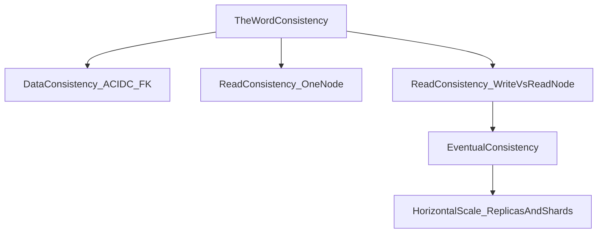
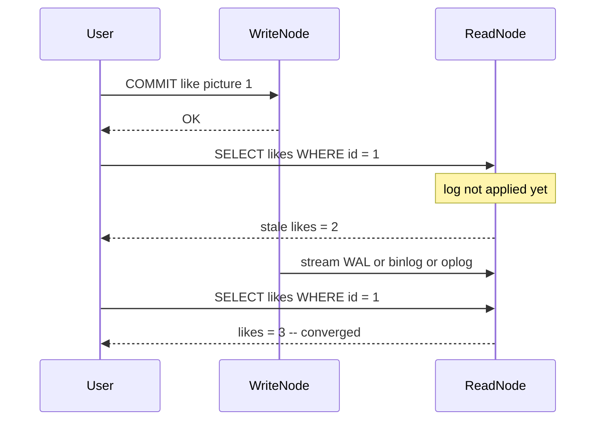
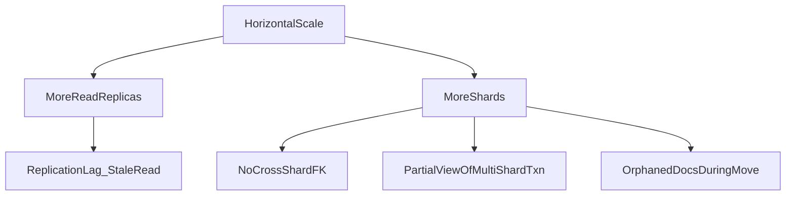
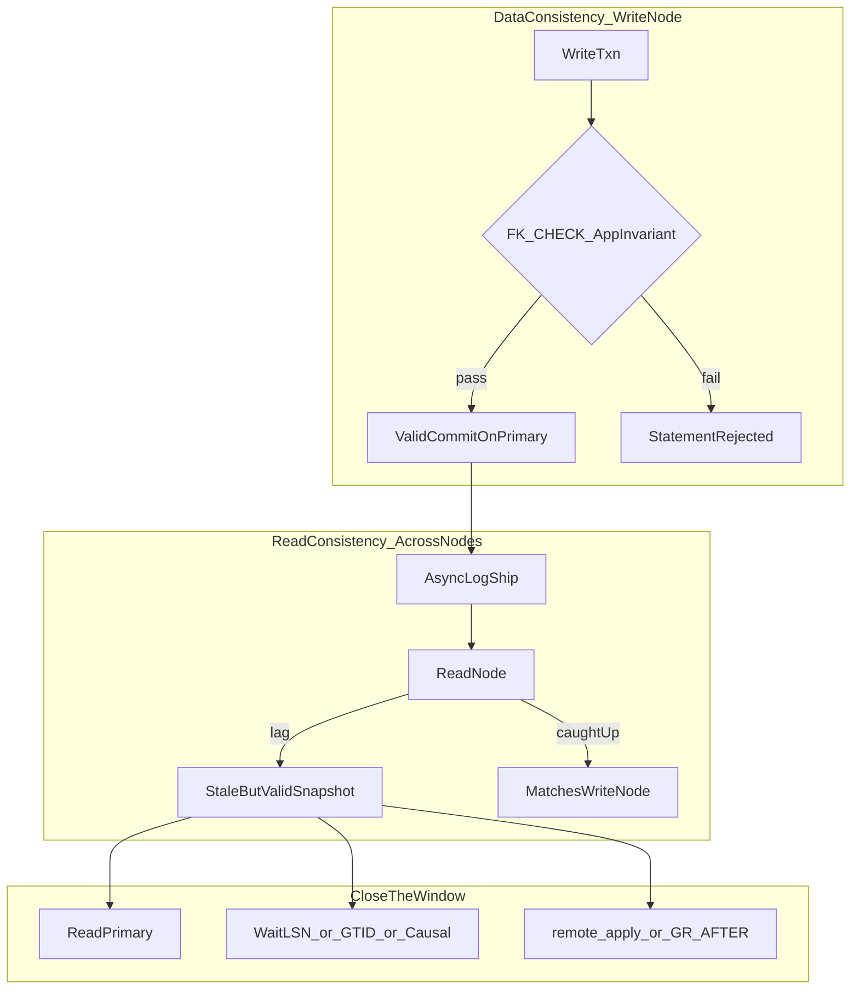

# Eventual Consistency — Interview Notes (SQL, PostgreSQL, MongoDB)

> **Course:** Fundamentals of Database Engineering — Sec 2: ACID  
> **Goal:** Explain **consistency of data** (referential integrity + user invariants), **consistency of a read** across a **write node vs a read node**, how **eventual consistency** is the default once you add copies, how **horizontal scaling** opens a lag window, and which knobs close it — deeply enough for a final-year CSE interview, with working snippets for PostgreSQL, generic SQL (InnoDB), and MongoDB.

> **Prerequisite:** [11.Consistency.md](11.Consistency.md) already covers ACID-C vs read-C vs replica-C on a **single node** (CHECK, letter-swap, isolation). [9-Atomicity.md](9-Atomicity.md) and [10-Isolation.md](10-Isolation.md) cover all-or-nothing and snapshots. **This note answers only:** after a commit, will *another node* see it, and what happens when you scale out.

> **Lecture slides:** [ACID-Updated.pdf](ACID-Updated.pdf) pp. 25–31 — Consistency in Data (FK + user rules, pictures/likes), Consistency in Reads (Update X / Read X), Eventual consistency. Hussein’s punch line: **relational and NoSQL both suffer** once the system is more than one node.

---

## 1. One-Minute Interview Definition

**Eventual consistency is not a replacement for foreign keys.** It is the contract of a **copied** database: after a write commits on the write node, every replica **converges** to that committed state if no newer writes arrive. Until the copy is applied, a read node can return **stale but internally valid** data.

The lecture asks one question:

> *If a transaction committed a change, will a new transaction immediately see the change?*

| Where you read | Immediate? | Name |
|----------------|------------|------|
| **Same node that committed** (write node / primary) | Yes — subject to isolation ([11.Consistency.md](11.Consistency.md)) | Strong / linearizable-on-that-node |
| **Another node** (hot standby, MySQL replica, MongoDB secondary) | Not necessarily | **Eventual consistency** |

Think of a **university library**:

1. **Data consistency (ACID C + FK):** HQ catalog rules. You cannot check out a book that does not exist. A denormalized “copies available” counter that disagrees with the shelf is a **user invariant** bug, not a replica bug.
2. **Read consistency on one node:** One photocopy of the catalog at 11:00 AM — covered in [11.Consistency.md](11.Consistency.md).
3. **Write node vs read node:** HQ stamps the catalog. Campus kiosks get a truck of photocopies later. You just returned a book at HQ; the kiosk still shows it checked out. **Every letter on the kiosk page is valid. The page is yesterday.**
4. **Eventual consistency:** The truck keeps coming. Given enough time and no new stamps, every kiosk matches HQ.
5. **Horizontal scaling:** More kiosks (read replicas) and more branch libraries that each own different shelves (shards). More trucks. FKs still hold **where the write landed**. They do **not** span branches unless you design for that.

**Say this in an interview:**

> *"Eventual consistency is the default once you have a write node and a read node. The primary enforces PK, FK, CHECK — that is ACID data consistency and it does not go away. Replication streams the WAL, binlog, or oplog asynchronously, so a replica can miss a just-committed write. That is a stale read, not a broken constraint. PostgreSQL docs literally call hot-standby data eventually consistent with the primary. MySQL async replication and MongoDB secondary + readConcern local are the same idea. To close the window you route reads to the primary, wait for apply (PG remote_apply / MySQL WAIT_FOR_EXECUTED_GTID_SET / MongoDB causal session with majority R+W), or accept lag for feeds and catalogs. Sharding adds a second problem: no cross-shard FK, and a multi-shard read without a distributed snapshot can see half a transfer."*



---

## 2. Sequential Thinking — Which Inconsistency Is the Interviewer Asking?

Use this ladder **before** naming `remote_apply` or `readConcern`. Do not start with CAP.

```
Step 1 → Which inconsistency?

         • "orphan child row", "FK", "likes=5 but two like-rows", "picture 4 does not exist"
           → DATA consistency (ACID C + referential integrity). Eventual consistency does NOT fix this.
         • "I wrote then read and missed my write", "replica lag", "secondary is stale"
           → READ consistency across write node vs read node
         • "Alice debited on shard 1, Bob not credited on shard 2", "orphaned docs after chunk move"
           → SHARD / horizontal data-scale inconsistency

Step 2 → Where did the write COMMIT?
         Primary / source / replica-set primary = source of truth for constraints.
         FK, CHECK, unique indexes run HERE (or on the shard that owns the key).

Step 3 → Where did the read go?
         Same node        → strong (isolation still applies — see 11)
         Replica/secondary → lag window = eventual
         Other shard      → may be a different commit horizon; need snapshot txn

Step 4 → Is the lag acceptable?
         Feed, product catalog, analytics     → yes, eventual is the feature
         "Show my just-saved profile", checkout, money, inventory → no

Step 5 → Pick the knob
         • PostgreSQL: route to primary | synchronous_commit=remote_apply | wait on replay LSN
         • InnoDB:     route to source  | WAIT_FOR_EXECUTED_GTID_SET | group_replication_consistency
         • MongoDB:    primary reads    | causal session + majority R+W | linearizable (single-doc, primary)
```

**Key insight:** Data-C is a **rule**. Read-C across nodes is a **clock**. Eventual consistency answers the clock. It never answers “may Edmond like a picture that does not exist?”

---

## 3. Lecture In Depth — Consistency in Data (Pictures / Likes)

From [ACID-Updated.pdf](ACID-Updated.pdf): Hussein’s tables.

### 3.1 Valid start state

| pictures | | |
|----------|--|--|
| **id (PK)** | **blob** | **likes** |
| 1 | xx | 2 |
| 2 | xx | 1 |

| picture_likes | |
|---------------|--|
| **user (PK)** | **picture_id (PK)(FK)** |
| Jon | 1 |
| Edmond | 1 |
| Jon | 2 |

Rules that hold:

- Every `picture_id` in `picture_likes` exists in `pictures` — **referential integrity**.
- `pictures.likes` equals the count of matching like-rows — **user-defined invariant**. FK cannot see this; it is denormalized.

### 3.2 Spot the inconsistency (slide “Spot inconsistency in this data”)

| pictures | | |
|----------|--|--|
| **id** | **blob** | **likes** |
| 1 | xx | **5** |
| 2 | xx | 1 |

| picture_likes | |
|---------------|--|
| **user** | **picture_id** |
| Jon | 1 |
| Edmond | 1 |
| Jon | 2 |
| Edmond | **4** |

Two **different** data bugs:

| Bug | What is wrong | Who should have stopped it |
|-----|----------------|----------------------------|
| **A. Broken FK** | Edmond likes picture `4`. There is no picture 4. | `FOREIGN KEY (picture_id) REFERENCES pictures(id)` |
| **B. Broken counter** | Picture 1 claims `likes = 5` but only two rows point at it. | App + one transaction (or a trigger). **Not** an FK. |

**Analogy:** A library card that names book #4 when HQ never catalogued #4 is a **referential** crime. A shelf sign that says “5 copies” when two copies sit on the shelf is a **count** crime. Eventual consistency is a kiosk that still shows yesterday’s valid catalog — a **third** crime.

### 3.3 How we maintain data consistency (tools)

Hussein’s slide lists: defined by the user, referential integrity (foreign keys), atomicity, isolation.

| Tool | What it stops | What it does not stop |
|------|---------------|------------------------|
| **PRIMARY KEY / UNIQUE** | Two pictures with id 1 | Stale replica reads |
| **FOREIGN KEY** | Child row whose parent is missing; optional `ON DELETE CASCADE` / `RESTRICT` | Denormalized `likes` drifting from row count |
| **CHECK / `$jsonSchema`** | Row-local rules (`likes >= 0`) | Cross-table counts |
| **Atomicity** | Insert like-row without incrementing counter **inside one txn** ([9-Atomicity.md](9-Atomicity.md)) | Replica lag after COMMIT |
| **Isolation** | Two concurrent likes both reading `likes=2` and writing `3` ([10-Isolation.md](10-Isolation.md)) | Read of an old committed snapshot on another node |
| **App / trigger** | `likes` matching `COUNT(*)` | Network copies of the row |

**Interview line:** *"A foreign key is the database’s way of saying the child cannot exist without the parent. It is checked on the write node at insert/update/delete. Eventual consistency never substitutes for it. A denormalized like-counter is a second invariant — keep the increment in the same transaction as the like-row, or stop denormalizing."*

---

## 4. Data Consistency — Code (Three Engines)

Shared story: pictures + likes. Same schema idea in SQL and MongoDB.

### 4.1 PostgreSQL — FK, CASCADE, deferred check, counter in one txn

```sql
CREATE TABLE pictures (
  id    INT PRIMARY KEY,
  blob  TEXT NOT NULL,
  likes INT NOT NULL DEFAULT 0 CHECK (likes >= 0)
);

CREATE TABLE picture_likes (
  user_name  TEXT NOT NULL,
  picture_id INT  NOT NULL,
  PRIMARY KEY (user_name, picture_id),
  FOREIGN KEY (picture_id) REFERENCES pictures(id)
    ON DELETE CASCADE           -- delete picture → likes rows go with it
);

INSERT INTO pictures (id, blob, likes) VALUES (1, 'xx', 0), (2, 'xx', 0);

-- Valid like: child + denormalized counter in ONE transaction
BEGIN;
INSERT INTO picture_likes VALUES ('Jon', 1);
UPDATE pictures SET likes = likes + 1 WHERE id = 1;
COMMIT;

-- Bug A: FK rejects orphan child
INSERT INTO picture_likes VALUES ('Edmond', 4);
-- ERROR:  insert or update on table "picture_likes" violates foreign key constraint

-- Bug B: FK is silent if you only bump the counter
UPDATE pictures SET likes = 5 WHERE id = 1;   -- succeeds; invariant is now a lie
-- Fix: never update likes except in the same txn as the like-row
--      or drop the column and SELECT count(*) FROM picture_likes WHERE picture_id = $1
```

Deferred FK — insert parent and child in one txn, check at COMMIT (not per statement):

```sql
CREATE TABLE picture_likes_deferred (
  user_name  TEXT NOT NULL,
  picture_id INT  NOT NULL,
  PRIMARY KEY (user_name, picture_id),
  FOREIGN KEY (picture_id) REFERENCES pictures(id)
    DEFERRABLE INITIALLY DEFERRED
);

BEGIN;
SET CONSTRAINTS ALL DEFERRED;
INSERT INTO picture_likes_deferred VALUES ('Jon', 99);  -- parent 99 not there yet
INSERT INTO pictures (id, blob, likes) VALUES (99, 'yy', 1);
COMMIT;   -- FK checked here; both rows exist → OK
```

**Interview line:** *"PostgreSQL FK is the referential-integrity tool. DEFERRABLE only delays UNIQUE/PK/FK/EXCLUDE until COMMIT. CHECK is still immediate and row-local — it cannot count other tables. The likes counter is an application invariant inside the same transaction."*

---

### 4.2 Generic SQL / InnoDB — FK (InnoDB only), RESTRICT, CHECK

```sql
CREATE TABLE pictures (
  id    INT PRIMARY KEY,
  blob  TEXT NOT NULL,
  likes INT NOT NULL DEFAULT 0 CHECK (likes >= 0)   -- MySQL 8.0.16+
) ENGINE=InnoDB;

CREATE TABLE picture_likes (
  user_name  VARCHAR(64) NOT NULL,
  picture_id INT NOT NULL,
  PRIMARY KEY (user_name, picture_id),
  CONSTRAINT fk_likes_picture
    FOREIGN KEY (picture_id) REFERENCES pictures(id)
      ON DELETE RESTRICT        -- refuse DELETE of a picture that still has likes
) ENGINE=InnoDB;

START TRANSACTION;
INSERT INTO picture_likes VALUES ('Jon', 1);
UPDATE pictures SET likes = likes + 1 WHERE id = 1;
COMMIT;

-- Orphan child → errno 1452
INSERT INTO picture_likes VALUES ('Edmond', 4);

-- Delete parent while children exist → errno 1451 (RESTRICT)
DELETE FROM pictures WHERE id = 1;
```

MyISAM parses FK clauses and **ignores** them. Interview trap: *“FOREIGN KEY only does work on InnoDB.”*

**Interview line:** *"InnoDB enforces referential integrity like PostgreSQL. ON DELETE RESTRICT vs CASCADE is a product decision: social apps often cascade; banking ledgers often restrict. CHECK still does not keep likes in sync with row count."*

---

### 4.3 MongoDB — no declarative FK

MongoDB will happily store `{ user: "Edmond", picture_id: 4 }` with no picture 4. You pick a **pattern**.

**Pattern 1 — Embed (best default when likes stay bounded):** one document, one atomic write. There is no child collection to orphan.

```javascript
db.pictures.insertOne({
  _id: 1,
  blob: "xx",
  likes: [
    { user: "Jon" },
    { user: "Edmond" }
  ]
});

// Atomic "like" — $addToSet prevents duplicate users
db.pictures.updateOne(
  { _id: 1, "likes.user": { $ne: "Sara" } },
  { $addToSet: { likes: { user: "Sara" } } }
);

// Count is derived: likes.length — no denormalized field to drift
```

**Pattern 2 — Two collections + schema validation + unique index (still not an FK):**

```javascript
db.createCollection("pictures", {
  validator: {
    $jsonSchema: {
      bsonType: "object",
      required: ["_id", "blob"],
      properties: {
        _id:  { bsonType: "int" },
        blob: { bsonType: "string" },
        likes: { bsonType: "int", minimum: 0 }
      }
    }
  }
});

db.picture_likes.createIndex({ user: 1, picture_id: 1 }, { unique: true });

// $lookup JOINs at read time — it does NOT reject invalid inserts
db.picture_likes.aggregate([
  { $lookup: {
      from: "pictures",
      localField: "picture_id",
      foreignField: "_id",
      as: "pic"
  }},
  { $match: { pic: { $eq: [] } } }   // orphans — app must find and delete these
]);
```

**Pattern 3 — Multi-document transaction (replica set required):** check parent, insert child, bump counter, all or nothing.

```javascript
const s = db.getMongo().startSession();
s.startTransaction({
  readConcern:  { level: "snapshot" },
  writeConcern: { w: "majority" }
});
const pics  = s.getDatabase("test").pictures;
const likes = s.getDatabase("test").picture_likes;

const parent = pics.findOne({ _id: 1 });
if (!parent) { s.abortTransaction(); throw new Error("no picture"); }

likes.insertOne({ user: "Jon", picture_id: 1 });
pics.updateOne({ _id: 1 }, { $inc: { likes: 1 } });
s.commitTransaction();
```

**Interview line:** *"$lookup is a join, not a foreign key. Embedding gives single-document atomicity — MongoDB’s native data-consistency superpower. Cross-collection integrity is application-level or a snapshot transaction. Eventual consistency on a secondary is a different layer."*

---

## 5. Lecture In Depth — Consistency in Reads (Write Node vs Read Node)

Slide: **Update X → Read X → X.** Hussein: *if a transaction committed a change, will a new transaction immediately see it? Affects the system as a whole. Relational and NoSQL databases suffer from this. Eventual consistency.*

### 5.1 Five scenarios (same picture, different wiring)

Assume `COMMIT` of “Jon likes picture 1” already returned success to the client.

| # | Topology | Does the next read see the like? |
|---|----------|----------------------------------|
| 1 | **Single node** — next `SELECT` / `find` on the same primary | **Yes** (isolation still applies: a Repeatable Read txn that started earlier will not — see [11.Consistency.md](11.Consistency.md)) |
| 2 | **Async replica** — load balancer sent the GET to a hot standby / secondary | **Maybe not.** WAL/binlog/oplog not replayed yet |
| 3 | **Read-your-writes fail** | User posts a comment, page reload hits a lagging replica, comment missing. User thinks the save failed |
| 4 | **Monotonic-read fail** | Request 1 hits replica A (has the like). Request 2 hits replica B (older). Time goes **backward** |
| 5 | **Failover / local read** | Primary died before the write reached a majority. New primary never saw it. `readConcern: local` can show a write that later **rolls back** |

**Analogy:** You deposit cash at the **branch computer** (write node). You walk to the **ATM on another street** (read node) and check the balance. The ATM is not lying — it is reading last night’s tape. Given time, the tape catches up. That is eventual consistency. It is **not** the same as the teller booking a deposit without a customer account (FK).



### 5.2 Sequential thinking — the write-then-read bug

```
Step 1 → Client got COMMIT = success. Data-C on the write node is already done.
         FK passed. Counter txn committed. The row is valid at HQ.

Step 2 → Next HTTP request is a READ. Load balancer picks a node.
         If it is the write node → user sees the like.
         If it is a replica     → user may not.

Step 3 → This is NOT isolation. Isolation is concurrent txns on ONE engine.
         This is replication lag. Two engines, one logical database.

Step 4 → If the product cannot tolerate a missing like on refresh:
         do not send that read to a replica (sticky primary),
         or wait until the replica has applied the write’s LSN/GTID/opTime,
         or use sync replication that waits for apply, not just flush.

Step 5 → If the product is a public feed, lag of 100ms–a few seconds is the
         whole point of read replicas — cheaper reads, write node stays lean.
```

---

## 6. How Eventual Consistency Is Achieved (Mechanism)

Default in PostgreSQL streaming replication, MySQL replication, and MongoDB replica sets: **asynchronous log shipping**. The write node does **not** wait for every reader to apply.

### 6.1 The copy pipeline (all three engines)

```
Write node:  change pages in memory → append log → COMMIT (fsync log) → client OK
Copy path:   log bytes travel the network → replica receives → replica APPLIES → new snapshots see it
Lag window:  client OK  ……  apply on replica
```

| Engine | Log | Receive | Apply (when a replica read sees the write) |
|--------|-----|---------|--------------------------------------------|
| **PostgreSQL** | WAL | `wal_receiver` | Replay. PostgreSQL docs: standby data is **eventually consistent** with the primary. Visibility after the **commit record is replayed**. New snapshots (per statement at RC, per txn at RR). |
| **InnoDB / MySQL** | Binary log (written at COMMIT) | IO thread → relay log | SQL applier thread(s). Semi-sync waits for **receipt into relay log**, not apply — reads can still be stale. |
| **MongoDB** | Oplog | Secondary tails the primary | Apply. `readConcern: "local"` + `readPreference: secondary` is the textbook eventual read. |

Measure lag (ops interviews love this):

```sql
-- PostgreSQL (run on primary)
SELECT application_name, state, sync_state,
       pg_wal_lsn_diff(pg_current_wal_lsn(), replay_lsn) AS replay_lag_bytes
FROM pg_stat_replication;

-- PostgreSQL (run on standby)
SELECT pg_last_wal_receive_lsn(), pg_last_wal_replay_lsn();
```

```sql
-- MySQL replica
SHOW REPLICA STATUS\G
-- Seconds_Behind_Source is coarse (whole seconds, can lie during lock waits)
-- Prefer GTID: @@GLOBAL.gtid_executed vs source’s gtid_executed
```

```javascript
// MongoDB
rs.printSecondaryReplicationInfo();
db.printSecondaryReplicationInfo();
```

### 6.2 What eventual consistency **solves** — and what it does not

| Lecture problem | Does eventual consistency solve it? |
|-----------------|-------------------------------------|
| Edmond likes picture 4 | **No.** FK / app check on the **write node**. Copies will faithfully replicate the *orphan* if you never declared an FK. |
| `likes = 5` vs two like-rows | **No.** That invariant is wrong on the primary; replicas copy the lie. |
| Read on another node misses a committed like | **Yes, eventually.** Given no new writes, apply catches up and every node’s read of that committed state matches the write node. |
| System must keep serving reads while a node is down | **Yes — that is why we chose it.** CAP: prefer availability + partition tolerance, delay consistency. |

**Interview trap:** *“Eventual consistency means the data can be wrong.”* Correct it: the **committed** data on the write node is as right as your constraints. The **read** on a copy can be **behind**. If the primary itself accepted invalid data (no FK), every copy will be invalid too — that is not eventual consistency; that is missing data-C.

### 6.3 Vogels session guarantees (name these)

Werner Vogels, *Eventually Consistent*: the storage can be eventually consistent globally, while a **client session** still feels sane.

| Guarantee | Plain English | Failure without it |
|-----------|---------------|--------------------|
| **Read-your-writes** | After I write X, *I* never read an older X | Saved profile vanishes on refresh |
| **Monotonic reads** | Once I saw version *n*, I never see *n−1* | Like appears, then disappears |
| **Monotonic writes** | My writes are applied in the order I issued them | Hard to program; most SQL/MongoDB primaries already serialize per primary |
| **Writes-follow-reads** | If I wrote after reading X, that write is after X in the global order | Causal inversion |

Practical combo: **read-your-writes + monotonic reads** (session / sticky). Map to knobs in §8.

**Analogy:** Newspapers. One typesetting desk, many printing plants. Plants are eventually consistent with the desk. Your personal subscription (sticky session) always gets the latest edition you already opened — you never get yesterday’s paper after today’s.

---

## 7. Horizontal Scaling Introduces Inconsistency

Vertical scale = bigger box. Horizontal scale = more boxes. Two axes, two inconsistency stories.



### 7.1 Axis A — Read scale (replicas)

You add hot standbys / read replicas so `SELECT` / `find` does not drown the writer.

| What stays true | What breaks |
|-----------------|-------------|
| Schema, FK, CHECK still enforced on the **primary** | Replica is usually **read-only** — it cannot create *new* FK violations |
| Every committed row will **eventually** appear | Replica can serve a **deleted parent** or a **missing child** for milliseconds to minutes — stale *view*, valid *as of an older commit* |
| More replicas ⇒ more lag surfaces | Load balancer without session stickiness ⇒ monotonic-read failures |

**Analogy:** More campus kiosks. HQ still refuses book #4. Kiosk 7 might still list a book you returned at HQ one second ago.

### 7.2 Axis B — Data scale (shards / partitions)

One logical database, rows live on different machines (MongoDB sharded cluster; Citus / app-sharded PostgreSQL; Vitess). MySQL **Group Replication** is still one logical dataset — it is replica-style HA, not table sharding.

| Problem | Why scaling caused it | What it looks like |
|---------|----------------------|-------------------|
| **No cross-shard FK** | A child on shard B cannot cheaply lock a parent on shard A on every insert | `picture_likes` on shard B, `pictures` on shard A — Edmond can like id 4 |
| **Split view of one transfer** | No global snapshot unless you ask for one | Alice −$100 applied on shard 1; Bob +$100 not yet visible on shard 2; `SUM(balance)` is wrong **right now**, converges later |
| **Orphaned documents** (MongoDB) | Chunk migration copies range to the new shard, then range-deleter removes the donor copy | Temporary duplicates / extras until `numOrphanedDocs → 0` |
| **Denormalized counter across shards** | `pictures.likes` on shard A, like-rows on shard B | Same lecture Bug B, now with network delay |

MongoDB sharded transactions: **`readConcern: "snapshot"` + `writeConcern: { w: "majority" }`** is the consistent snapshot **across shards**. `local` / `majority` without snapshot are not a global point-in-time.

**Interview line:** *"Replicas copy the same schema later. Shards split the schema now. Replicas give you stale-but-complete pictures. Shards can give you a complete-looking query that mixed two commit horizons unless you take a distributed snapshot. Cross-shard foreign keys are an application protocol, not a CREATE TABLE clause."*

---

## 8. How We Solve Them — Decision Table + Code

Same story everywhere: **like a picture on the write node, then read `likes` on a read node.**

### 8.1 Which knob when?

| Symptom | PostgreSQL | InnoDB / MySQL | MongoDB |
|---------|------------|----------------|---------|
| Stale replica read | Route to primary; or `synchronous_commit = remote_apply` + `synchronous_standby_names`; or wait until replay LSN ≥ write LSN | Route to source; `WAIT_FOR_EXECUTED_GTID_SET(...)`; Group Replication `AFTER` / `BEFORE` | `readPreference: "primary"`; causal session + majority R+W; `linearizable` (single-doc, primary) |
| Read-your-writes | Sticky primary or `remote_apply` | Sticky source or wait GTID | Causal session (on by default) + majority R+W |
| Monotonic reads | Sticky replica, or always primary | Sticky replica, or always source | Causal session + majority; or sticky secondary |
| Money / inventory / checkout | Do **not** read a replica | Do **not** read a replica | Do **not** use `secondary` + `local` |
| Cross-table invariant | FK + one txn; Serializable if concurrent | FK + one txn | Embed, or snapshot txn |
| Cross-shard invariant | Avoid, or Citus-aware design (no distributed SSI) | N/A unless app-sharded | Snapshot txn; pick a shard key so related docs share a shard |

---

### 8.2 PostgreSQL — `remote_apply` vs wait-for-LSN

`synchronous_commit` values are **not** all about reads:

| Value | Waits for | Stops stale replica reads? |
|-------|-----------|------------------------------|
| `off` / `local` | Local WAL (or not even that) | No |
| `on` (default, with sync standby) | Standby **flushed** WAL to disk | **No** — flushed ≠ replayed |
| `remote_write` | Standby wrote WAL to kernel | **No** |
| **`remote_apply`** | Standby **replayed** commit; visible to new queries | **Yes**, on those synchronous standbys |

Without `synchronous_standby_names` set, `remote_*` silently degrades to local. Interview gold.

```sql
-- On primary: make THIS transaction visible on the sync standby before COMMIT returns
-- Requires: synchronous_standby_names = 'standby1'  (or ANY 1 (standby1,standby2))
SHOW synchronous_commit;
SHOW synchronous_standby_names;

BEGIN;
SET LOCAL synchronous_commit TO remote_apply;
INSERT INTO picture_likes VALUES ('Jon', 1);
UPDATE pictures SET likes = likes + 1 WHERE id = 1;
COMMIT;
-- A SELECT on that standby now sees the like (simple causal load-balancing — PG docs)
```

Wait-for-LSN pattern when you stay **async** globally but need one read-your-write:

```sql
-- Session on PRIMARY after COMMIT
SELECT pg_current_wal_insert_lsn();   -- e.g. 0/16B4A50  → pass to the next request

-- Session on STANDBY before the user-facing SELECT
SELECT pg_last_wal_replay_lsn();
-- App loops / waits until replay_lsn >= write_lsn, then:
SELECT id, likes FROM pictures WHERE id = 1;
```

Trade-off: `remote_apply` adds **commit latency** (wait for replay). LSN-wait adds **read latency** only on the requests that need it. Feeds stay async.

---

### 8.3 InnoDB / MySQL — GTID wait and Group Replication

Semi-sync is a **durability** knob (source waits until at least one replica **received** the event). The replica can still be behind on **apply**. Stale `SELECT` is still possible.

```sql
-- After COMMIT on the SOURCE, capture GTIDs this session just produced
SELECT @@GLOBAL.gtid_executed;          -- or @@SESSION.gtid_executed depending on setup
-- App stores the GTID set in the user’s request (cookie / header)

-- On the REPLICA, before serving the read:
SELECT WAIT_FOR_EXECUTED_GTID_SET('3E11FA47-71CA-11E1-9E33-C80AA9429562:1-5', 5);
-- 0 = those GTIDs are applied; 1 = timeout
-- Then the SELECT is at least as new as the write
SELECT id, likes FROM pictures WHERE id = 1;
```

Group Replication (one logical dataset, several members) — `group_replication_consistency` (session or global):

```sql
-- Default historically: EVENTUAL — neither reads nor writes wait; stale member reads OK
SET SESSION group_replication_consistency = 'EVENTUAL';

-- This WRITE waits until its effects are applied on other members
-- → later reads on any member see this write or newer (read-your-writes for everyone after)
SET SESSION group_replication_consistency = 'AFTER';
START TRANSACTION;
INSERT INTO picture_likes VALUES ('Jon', 1);
UPDATE pictures SET likes = likes + 1 WHERE id = 1;
COMMIT;

-- This READ waits until this member has applied all preceding transactions
SET SESSION group_replication_consistency = 'BEFORE';
SELECT likes FROM pictures WHERE id = 1;
```

| Value | Idea |
|-------|------|
| `EVENTUAL` | No wait. Classic eventual. |
| `BEFORE` | Read/write waits to see a fresh snapshot on **this** member first. |
| `AFTER` | Write waits until **others** have applied it. |
| `BEFORE_AND_AFTER` | Both. |

**Interview line:** *"MySQL semi-sync is not read-your-writes. WAIT_FOR_EXECUTED_GTID_SET is. Group Replication EVENTUAL is the lecture’s default; AFTER/BEFORE are the paid-with-latency upgrades."*

---

### 8.4 MongoDB — local secondary (eventual) vs causal majority

**Eventual (default-ish):** write `w: 1` on primary, read `local` on a secondary.

```javascript
// WRITE — acknowledged by primary only
db.pictures.updateOne(
  { _id: 1 },
  { $inc: { likes: 1 } },
  { writeConcern: { w: 1 } }
);

// READ on a secondary — may miss the increment
db.getMongo().setReadPref("secondary");
db.pictures.findOne({ _id: 1 });   // readConcern local by default
```

**Causal session + majority** — Vogels read-your-writes / monotonic reads across secondaries:

```javascript
const session = db.getMongo().startSession({ causalConsistency: true });
const pics = session.getDatabase("test").pictures;

pics.updateOne(
  { _id: 1 },
  { $inc: { likes: 1 } },
  { writeConcern: { w: "majority" } }
);

// Same session, secondary: driver waits until this secondary’s majority snapshot
// includes the write’s operationTime
pics.findOne(
  { _id: 1 },
  {
    readPreference: "secondary",
    readConcern: { level: "majority" }
  }
);
session.endSession();
```

Only **majority** reads + **majority** writes in a causally consistent session give all four causal guarantees. `local` + `w: 1` in a “causal” session does **not**.

**Linearizable** (strongest, narrowest): primary, single document, may wait. Not for secondary reads, not for multi-doc.

**Sharded snapshot** (horizontal data-scale):

```javascript
session.startTransaction({
  readConcern:  { level: "snapshot" },
  writeConcern: { w: "majority" }
});
// finds/aggregates see one cluster-wide majority snapshot — not a mash of two shards
session.commitTransaction();
```

Orphans after a chunk move (ops interview):

```javascript
db.getSiblingDB("admin").aggregate([{ $shardedDataDistribution: {} }]);
// wait until numOrphanedDocs is 0; cleanupOrphaned waits for the range deleter
```

**Interview line:** *"Read preference is where the query goes. Read concern is how stale that node may be. Secondary + local is eventual. Causal session + majority R+W is read-your-writes on a secondary. Linearizable is ‘this document, this primary, now.’ Snapshot transactions are the cross-shard photocopy."*

---

## 9. Engine Comparison — What COMMIT Actually Waited For

| | PostgreSQL replica | MySQL replica | MongoDB secondary |
|--|--------------------|---------------|-------------------|
| **Default copy** | Async WAL stream | Async binlog | Async oplog |
| **Docs name** | “Eventually consistent with the primary” | Eventual until you wait / Group Replication | Eventual under `local` |
| **Flush ≠ visible** | `synchronous_commit=on` | Semi-sync ACK | `w: majority` still needs apply on **this** secondary for a local read |
| **Visible on replica** | Replay (`remote_apply` or wait LSN) | Applier (`WAIT_FOR_EXECUTED_GTID_SET`) | Apply + majority snapshot (causal) |
| **FK on copies** | Enforced on primary; replica replays already-checked rows | Same | Never had FK; copies whatever primary accepted |
| **Cross-shard snapshot** | Not in vanilla PG | Not in vanilla replica | `readConcern: snapshot` txn |

**CAP footnote (one paragraph):** ACID-C on the primary is “invariants after this COMMIT.” CAP consistency / linearizability is “every read in the cluster sees the latest write or errors.” Eventual consistency is the usual choice when you add nodes for **availability** and **read scale**. Do not say “MongoDB is eventually consistent, PostgreSQL is strongly consistent” — a PostgreSQL hot standby is eventually consistent too. The **default topology** differs; the **physics of copies** does not.

---

## 10. Side-by-Side — Data-C vs Read-C vs Scale



---

## 11. How to Use This in an Interview

### 11.1 Decision guide

| Your requirement | Pick this |
|------------------|-----------|
| Child cannot exist without parent | SQL `FOREIGN KEY`. MongoDB: embed, or check in a snapshot txn |
| `likes` column matches like-rows | Same transaction as the insert; or drop the column |
| Public feed can be 200ms behind | Async replica / `secondaryPreferred` / `EVENTUAL` — this is the win |
| User must see their own save | Sticky primary, or PG `remote_apply`, or MySQL GTID wait, or MongoDB causal + majority |
| Never go backward in time for one user | Sticky replica or causal/monotonic session |
| Transfer visible as a whole across shards | MongoDB snapshot txn; or don’t split the two accounts across shards |
| Bank-grade single-row latest value | MongoDB `linearizable` on primary; or don’t use a replica |

### 11.2 60-second spoken answer

> *"Hussein splits consistency into data and reads. Data consistency is valid state to valid state on the write node — PK, FK, CHECK, plus application invariants like a likes counter matching like-rows. A foreign key stops Edmond liking picture 4. It does not stop a replica from serving yesterday’s likes count.*
>
> *Read consistency across nodes is the lecture question: after COMMIT, will a new transaction immediately see the change? On the primary, yes. On an async replica, not necessarily. PostgreSQL hot standby, MySQL replication, and MongoDB secondaries all ship a log and apply later — that is eventual consistency. Relational and NoSQL both have it once you add a second node.*
>
> *Horizontal scaling makes it worse: more replicas mean more lag surfaces; shards drop cross-shard FKs and can mix two commit horizons unless you take a snapshot transaction.*
>
> *You close the window by not reading replicas for money, or by waiting for apply — PostgreSQL remote_apply or replay LSN, MySQL WAIT_FOR_EXECUTED_GTID_SET or Group Replication AFTER, MongoDB causal session with majority read and write concern. Eventual consistency is the feature that lets the system scale. It is not a substitute for constraints."*

### 11.3 Answer ladder — if they go deeper

| Question | Answer direction |
|----------|------------------|
| *What is eventual consistency?* | Copies converge to the last committed write if writes stop. Reads during the window can be stale. |
| *Does it replace FK?* | No. FK is data-C on the writer. Eventual is a replica clock. |
| *Write node vs read node?* | COMMIT on primary; SELECT on replica may miss it until WAL/binlog/oplog apply. |
| *Pictures/likes lecture bugs?* | Picture 4 = missing FK. likes=5 vs two rows = denormalized invariant. Replica showing old likes = lag. |
| *PG remote_apply vs on?* | `on` waits for standby **flush**. Only `remote_apply` waits for **replay** so a replica SELECT sees the row. Needs `synchronous_standby_names`. |
| *MySQL semi-sync vs GTID wait?* | Semi-sync = durability (received). `WAIT_FOR_EXECUTED_GTID_SET` = visibility (applied). |
| *MongoDB causal vs linearizable?* | Causal + majority = session order even on secondaries. Linearizable = one document, primary, real-time latest majority write. |
| *How does sharding break FK?* | Parent and child can live on different machines; no cheap cluster-wide REFERENCES. Embed or same shard key or app check. |
| *MongoDB snapshot on shards?* | Only `readConcern: snapshot` in a txn (with majority commit) is a consistent cross-shard photocopy. |
| *CAP vs ACID C?* | ACID C = invariants after commit on a database. CAP-C = latest write visible cluster-wide. Eventual ≈ AP. |
| *Does PG Serializable on primary protect standby reads?* | No. SSI is local. Standby reads are as of replayed WAL. |

---

## 12. Cheat Sheet (Glance Before the Interview)

1. **Eventual consistency ≠ broken FK.** Writer still enforces rules; copies can be **behind**.
2. **Lecture question:** committed write visible to a **new** txn? Same node yes; other node **eventually**.
3. **Pictures/likes:** missing picture 4 = FK. `likes=5` vs two rows = app invariant. Stale kiosk = replica lag.
4. **FK** = child cannot exist without parent (`ON DELETE CASCADE` / `RESTRICT`). MongoDB has none — embed or txn-check.
5. **Mechanism:** async WAL / binlog / oplog. Apply, not receive, makes a replica **read** catch up.
6. **Vogels:** read-your-writes + monotonic reads are the session guarantees people actually want.
7. **Replicas** scale reads and create lag. **Shards** split data and drop cross-shard FK / global snapshot unless you opt in.
8. **PG:** `remote_apply` + `synchronous_standby_names`, or wait `pg_last_wal_replay_lsn()`.
9. **MySQL:** `WAIT_FOR_EXECUTED_GTID_SET`; GR `EVENTUAL` vs `AFTER` / `BEFORE`. Semi-sync ≠ apply.
10. **MongoDB:** `secondary` + `local` = eventual. Causal + majority R+W = read-your-writes. Snapshot txn = cross-shard photocopy.

---

## 13. Sources

- [PostgreSQL: Hot Standby (26.4) — “eventually consistent with the primary”](https://www.postgresql.org/docs/current/hot-standby.html)
- [PostgreSQL: Log-Shipping Standby Servers — synchronous replication, `remote_apply`](https://www.postgresql.org/docs/current/warm-standby.html)
- [PostgreSQL: `synchronous_commit`](https://www.postgresql.org/docs/current/runtime-config-wal.html)
- [PostgreSQL: Constraints](https://www.postgresql.org/docs/current/ddl-constraints.html)
- [MySQL: `WAIT_FOR_EXECUTED_GTID_SET`](https://dev.mysql.com/doc/en/gtid-functions.html)
- [MySQL: Group Replication consistency guarantees](https://dev.mysql.com/doc/refman/8.0/en/group-replication-configuring-consistency-guarantees.html)
- [MySQL: InnoDB foreign keys](https://dev.mysql.com/doc/refman/8.0/en/innodb-foreign-key-constraints.html)
- [MongoDB: Read Isolation, Consistency, and Recency](https://www.mongodb.com/docs/manual/core/read-isolation-consistency-recency/)
- [MongoDB: Causal Consistency and Read and Write Concerns](https://www.mongodb.com/docs/manual/core/causal-consistency-read-write-concerns/)
- [MongoDB: Read Concern `"local"`](https://www.mongodb.com/docs/manual/reference/read-concern-local/)
- [MongoDB: Transactions (snapshot across shards)](https://www.mongodb.com/docs/manual/core/transactions/)
- [Werner Vogels: Eventually Consistent — Revisited](https://www.allthingsdistributed.com/2008/12/eventually_consistent.html)
- Course material: [ACID-Updated.pdf](ACID-Updated.pdf) slides 25–31 (data vs reads, pictures/likes, Update X / Read X)
