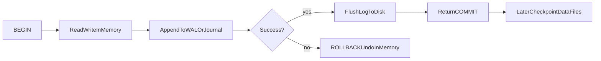

# What Is a Transaction? — Interview Notes (SQL, PostgreSQL, MongoDB)

> **Course:** Fundamentals of Database Engineering — Sec 2: ACID  
> **Goal:** Understand transactions deeply enough to explain them in a final-year CSE interview.

---

## 1. One-Minute Interview Definition

A **transaction** is a **single logical unit of work** — one or more database operations that must succeed **together** or fail **together**. There is no partial success.

Think of a **group dinner bill**:

1. Four friends order food. The rule is: **either everyone pays their share and the bill is closed, or nobody pays and the order is cancelled.**
2. You cannot have Alice charged but Bob not charged for the same meal.
3. Once the cashier stamps the receipt, a power cut must **not** erase the payment.

That dinner bill is a transaction. Databases use the same idea for bank transfers, order placement, inventory updates, and any multi-step write that must stay correct under crashes and concurrency.

---

## 2. ACID Properties — In Depth

ACID = **Atomicity, Consistency, Isolation, Durability**. These are the four guarantees a transactional database engine tries to provide.

### 2.1 Atomicity — All or Nothing

| Aspect | Explanation |
|--------|-------------|
| **Definition** | Every operation inside the transaction either completes fully, or the entire transaction is rolled back as if it never happened. |
| **Analogy** | The whole table pays the bill, or the waiter tears up the order slip. No one leaves having paid half. |
| **What the engine does** | Keeps an **undo log** (or marks writes as aborted). On `ROLLBACK` or crash before commit, it reverses in-memory changes. On `COMMIT`, all changes become permanent as one unit. |
| **Failure story** | Transfer $100 from Alice to Bob: debit succeeds, credit fails → atomicity rolls back the debit. Balance stays correct. |
| **Say this in an interview** | *"Atomicity means the transaction is indivisible. Either all statements commit or none do. The engine uses undo information so partial work is never left visible after rollback or crash."* |

---

### 2.2 Consistency — Valid State to Valid State

| Aspect | Explanation |
|--------|-------------|
| **Definition** | A transaction moves the database from one **valid** state to another **valid** state, respecting constraints (PK, FK, CHECK, NOT NULL, business rules). |
| **Analogy** | The restaurant cash drawer must still match the menu rules — you cannot sell a dish that does not exist, or end with negative inventory. |
| **What the engine does** | Enforces schema constraints at statement or commit time. **Important nuance:** the engine guarantees constraint enforcement; **your application** must write transactions that preserve business invariants (e.g., total money in the system). |
| **Failure story** | Two withdrawals of $80 from a $100 account run concurrently without proper isolation → balance goes negative. That violates consistency even if each SQL statement alone is valid. |
| **Say this in an interview** | *"Consistency means invariants hold before and after the transaction. The DB enforces declared constraints; the app must design transactions so business rules like 'balance ≥ 0' are preserved, often with isolation levels or locking."* |

---

### 2.3 Isolation — Concurrent Transactions Don't Interfere

| Aspect | Explanation |
|--------|-------------|
| **Definition** | Concurrent transactions behave as if they run in some serial order; intermediate uncommitted states are hidden according to the chosen isolation level. |
| **Analogy** | Two tables paying at the same time should not grab each other's change from the tip jar. Each table sees a consistent view of the bill until payment is final. |
| **What the engine does** | Uses **locks**, **MVCC (Multi-Version Concurrency Control)**, or both to control visibility of in-flight changes. |
| **Failure story** | Transaction A reads a balance, B updates and commits, A reads again and sees a different value → **non-repeatable read**. |

#### SQL Standard Isolation Levels (ISO/IEC 9075)

| Isolation Level | Dirty Read | Non-Repeatable Read | Phantom Read |
|-----------------|------------|---------------------|--------------|
| **Read Uncommitted** | Possible | Possible | Possible |
| **Read Committed** | Prevented | Possible | Possible |
| **Repeatable Read** | Prevented | Prevented | Possible |
| **Serializable** | Prevented | Prevented | Prevented |

**Phenomena explained simply:**

- **Dirty read** — reading another transaction's uncommitted data.
- **Non-repeatable read** — reading the same row twice, getting different committed values.
- **Phantom read** — re-running a range query returns new rows another transaction inserted.

**PostgreSQL note:** default is `READ COMMITTED`. PostgreSQL treats `READ UNCOMMITTED` as `READ COMMITTED`. Its `REPEATABLE READ` also prevents phantom reads in practice.

**Say this in an interview:** *"Isolation is tunable. Most OLTP systems use Read Committed for speed. Financial or inventory-critical flows may need Repeatable Read or Serializable, trading concurrency for correctness."*

---

### 2.4 Durability — Committed Survives Crash

| Aspect | Explanation |
|--------|-------------|
| **Definition** | Once a transaction is committed, its effects persist even after power loss, OS crash, or database restart. |
| **Analogy** | After the receipt is stamped (committed), a blackout must not erase the payment record. |
| **What the engine does** | Writes changes to a **Write-Ahead Log (WAL)** or **journal** and **flushes that log to stable storage** before telling the client "success." Actual table/data files may be updated later. |
| **Failure story** | Server crashes 2 seconds after `COMMIT`. On restart, the engine replays the WAL/journal and restores all committed work. |
| **Say this in an interview** | *"Durability does not mean every table page is on disk at commit time. It means the log record describing the change is on disk (or on a majority of replicas). Recovery replays the log after a crash."* |

---

## 3. How a Transaction Is Made — Step by Step

### The Engine's Mental Model (Sequential Thinking)

Use this order when an interviewer asks *"What happens when I COMMIT?"*

```
Step 1 → BEGIN / START TRANSACTION
Step 2 → Read required pages into memory (buffer pool / cache)
Step 3 → Apply changes in memory (dirty pages)
Step 4 → Append description of each change to WAL/journal (in memory first)
Step 5 → Isolation rules hide uncommitted work from other sessions
Step 6 → COMMIT: flush WAL/journal to disk (fsync) — then return success
Step 7 → Later: checkpoint/background writer flushes dirty data pages to data files
Step 8 → Crash recovery: find last checkpoint, REDO log records after it
```

### Analogy Mapping

| Real World | PostgreSQL | MongoDB (WiredTiger) |
|------------|------------|----------------------|
| Waiter's scratch pad | Shared buffers (RAM) | WiredTiger cache (RAM) |
| Carbon-copy receipt book | WAL (Write-Ahead Log) | Journal files |
| Stamping the receipt | `COMMIT` + WAL fsync | `commitTransaction` + journal sync |
| Putting cash in the drawer | Checkpoint → data files | Checkpoint → `.wt` data files |

### Transaction Lifecycle Diagram



### Detailed Steps

1. **Begin** — Explicit (`BEGIN`) or implicit (autocommit: each single statement is its own mini-transaction).
2. **Pin/read pages** — If the target page is not in memory, read it from disk into the buffer pool/cache.
3. **Modify in memory** — Update the in-memory copy. Page becomes **dirty** (changed but not yet written to data files).
4. **Log the change** — Engine appends a WAL/journal record: *"page X, offset Y, old → new"*. This enables crash recovery (REDO).
5. **Isolation enforcement** — Other transactions see or don't see your changes based on isolation level and MVCC snapshot.
6. **Commit** — Flush WAL/journal buffers to disk. Only **after** the log is durable does the engine acknowledge `COMMIT` to the client.
7. **Background flush** — Dirty pages are written to table/data files during **checkpoints** or by background writers. Old log files can be recycled.
8. **Crash recovery** — On restart: load last checkpoint, replay WAL/journal from that point forward (REDO unapplied changes).

> **Key interview insight:** `COMMIT` returned ≠ table files updated on disk.  
> `COMMIT` returned = **log is durable**; data files catch up later.

---

## 4. Two Commit Processes — Memory vs Disk

Modern databases almost always use **Process A**. Process B is the naive/historical approach interviewers mention to test whether you understand WAL.

---

### Process A — In-Memory Work, Log Commit to Disk (Modern Default)

**How it works:**

1. Transaction modifies data **in RAM** (shared buffers / WiredTiger cache).
2. Each change is recorded in the **WAL/journal** (also in RAM first).
3. On `COMMIT`, only the **log is flushed to disk** (`fsync`).
4. **Dirty data pages stay in memory** until a later checkpoint or background flush.

**Used by:** PostgreSQL (default sync commit), MongoDB WiredTiger, MySQL InnoDB, Oracle, SQL Server.

#### Advantages

| Advantage | Why |
|-----------|-----|
| **High throughput** | WAL/journal is written **sequentially** — much faster than random data-page writes. |
| **Group commit** | One `fsync` can commit many concurrent small transactions. |
| **Crash-safe without syncing every page** | REDO from WAL reconstructs any dirty page not yet flushed. |
| **Point-in-time recovery** | Archived WAL enables backup + replay to any moment (PostgreSQL). |
| **Lower commit latency** | Client waits for a small sequential log write, not full table rewrite. |

#### Disadvantages

| Disadvantage | Why |
|--------------|-----|
| **Extra disk space for logs** | WAL/journal files grow between checkpoints. |
| **Recovery time** | More WAL since last checkpoint = longer crash recovery. |
| **Misleading mental model** | Developers think `COMMIT` = data on disk; it often means log on disk only. |
| **Async variants lose recent commits** | `synchronous_commit=off` or delayed journal flush can lose last N transactions on crash (not corruption — **loss**, not **corruption**). |

---

### Process B — Force Data Files to Disk on Every Commit

**How it works:**

Every commit also flushes all modified **table/index/data pages** to their on-disk files immediately (or relies only on periodic checkpoints with no durable log).

**Used by:** Rarely in production OLTP. Sometimes discussed as a naive design or in specialized engines. Some NoSQL systems with checkpoint-only durability approximate this.

#### Advantages

| Advantage | Why |
|-----------|-----|
| **Data files always current** | No gap between "committed" and "on disk in data files." |
| **Conceptually simple** | What you write is what is on disk — easy to explain. |
| **Smaller recovery replay window** | If pages are synced, less log replay needed. |

#### Disadvantages

| Disadvantage | Why |
|--------------|-----|
| **Random I/O on every commit** | Table pages scatter across disk — extremely slow for OLTP. |
| **Terrible TPS for small transactions** | Each `COMMIT` waits for multiple page flushes. |
| **High latency** | `fsync` on many random pages >> one sequential log write. |
| **Torn pages** | Partial page writes on crash still need full-page writes or doublewrite protection. |

---

### Weaker Variants — Don't Confuse These with Process A

| Variant | Behavior | Trade-off |
|---------|----------|-----------|
| **Async commit** (PostgreSQL `synchronous_commit=off`) | Returns success before WAL hits disk; WAL writer flushes later | Faster; may lose last ~few transactions on crash |
| **Delayed journal flush** (MongoDB default ~100ms) | Journal buffered in memory; synced periodically unless `j: true` | Hard shutdown may lose buffered writes |
| **Unlogged tables** (PostgreSQL) | No WAL for table data | Fast writes; table truncated/emptied after crash |
| **In-memory storage engine** (MongoDB Enterprise) | No journal; data in RAM only | `j: true` acks immediately; durability via replica majority |
| **Checkpoint-only durability** | Survives only if change made it into last checkpoint (~60s in MongoDB) | Simple but large data-loss window |

### When Would You Pick Each? (Interview Answer)

- **Bank transfers, orders, inventory** → Process A with **synchronous commit** + **majority write concern** (`w: majority, j: true`).
- **High-volume analytics, session counters, caches** → Process A with **async commit** or unlogged tables; accept possible loss of last few writes.
- **Never recommend Process B for OLTP** unless the interviewer is explicitly asking about the historical naive approach or why WAL was invented.

---

## 5. Code Snippets — Same Bank Transfer in Three Dialects

### Scenario

Transfer **$100** from account `Alice` to account `Bob`. Both accounts must exist; Alice must have enough balance. All-or-nothing.

---

### 5.1 SQL (Portable / ISO SQL)

```sql
-- Start a transaction
START TRANSACTION;
-- Alternative syntaxes:
-- BEGIN;                  -- PostgreSQL, MySQL
-- BEGIN TRANSACTION;      -- SQL Server

-- Step 1: Debit Alice (with balance check)
UPDATE accounts
SET balance = balance - 100.00
WHERE name = 'Alice' AND balance >= 100.00;

-- Check that exactly one row was updated
-- (In application code: if rows_affected != 1, ROLLBACK)

-- Step 2: Credit Bob
UPDATE accounts
SET balance = balance + 100.00
WHERE name = 'Bob';

-- If both succeed:
COMMIT;

-- If anything failed:
-- ROLLBACK;


-- Set isolation level for a critical transfer
SET TRANSACTION ISOLATION LEVEL SERIALIZABLE;
START TRANSACTION;
-- ... transfer statements ...
COMMIT;


-- Savepoint pattern (partial rollback inside a transaction)
START TRANSACTION;

INSERT INTO audit_log (event) VALUES ('transfer started');

SAVEPOINT before_transfer;

UPDATE accounts SET balance = balance - 100.00 WHERE name = 'Alice';

-- Oops — something went wrong with Bob's account
ROLLBACK TO SAVEPOINT before_transfer;  -- undoes Alice debit only

-- audit_log insert is still alive
COMMIT;
```

---

### 5.2 PostgreSQL

```sql
-- PostgreSQL default isolation: READ COMMITTED

BEGIN;

UPDATE accounts
SET balance = balance - 100.00
WHERE name = 'Alice' AND balance >= 100.00;

-- In psql you can check:
-- SELECT NOT FOUND;  -- or use GET DIAGNOSTICS in PL/pgSQL

UPDATE accounts
SET balance = balance + 100.00
WHERE name = 'Bob';

COMMIT;


-- Demonstrating atomicity: second statement fails → first is rolled back
BEGIN;

UPDATE accounts SET balance = balance - 100.00 WHERE name = 'Alice';

-- This will fail (e.g., violates a constraint or bad SQL)
UPDATE accounts SET balance = balance + 100.00 WHERE name = 'NonExistentUser';

-- ERROR → entire transaction aborted
ROLLBACK;

-- Alice's balance is unchanged — atomicity preserved


-- Savepoints
BEGIN;
UPDATE accounts SET balance = balance - 50.00 WHERE name = 'Alice';
SAVEPOINT sp1;
UPDATE accounts SET balance = balance + 50.00 WHERE name = 'Bob';
-- If needed:
ROLLBACK TO SAVEPOINT sp1;
COMMIT;


-- Durability tuning (per transaction)
BEGIN;
SET LOCAL synchronous_commit = on;   -- default: wait for WAL fsync (safest)
-- SET LOCAL synchronous_commit = off;  -- faster, may lose recent commits on crash
UPDATE accounts SET balance = balance - 100.00 WHERE name = 'Alice';
UPDATE accounts SET balance = balance + 100.00 WHERE name = 'Bob';
COMMIT;

-- CHECKPOINT is admin-only — forces immediate WAL checkpoint (not for normal use)
-- CHECKPOINT;
```

**What happens under the hood on `COMMIT` in PostgreSQL:**

1. Changes live in **shared buffers** (RAM).
2. WAL records describe each change in **WAL buffers** (RAM).
3. `COMMIT` triggers `XLogFlush()` — WAL written and `fsync`'d to disk.
4. Client receives "COMMIT" success.
5. Dirty pages flushed later by **background writer** or **checkpoint**.

---

### 5.3 MongoDB

MongoDB has **two levels** of atomicity. Prefer the simpler one when possible.

#### Option A — Single-Document Atomic Update (Preferred)

One document update is **always atomic**. No explicit transaction needed if you embed related data.

```javascript
// Atomic debit+credit inside ONE document (embedded accounts array)
db.bank.updateOne(
  {
    _id: "bank_main",
    "accounts.name": "Alice",
    "accounts.balance": { $gte: 100 }
  },
  {
    $inc: {
      "accounts.$[alice].balance": -100,
      "accounts.$[bob].balance": 100
    }
  },
  {
    arrayFilters: [
      { "alice.name": "Alice" },
      { "bob.name": "Bob" }
    ]
  }
);
// Single-document = atomic by design. Fast. No transaction overhead.
```

#### Option B — Multi-Document ACID Transaction (MongoDB 4.0+)

Use when updates span **multiple documents, collections, or databases**.

```javascript
// mongosh / Node.js style

const session = db.getMongo().startSession();

try {
  session.startTransaction({
    readConcern:  { level: "snapshot" },
    writeConcern: { w: "majority" }   // implies j: true by default on replica sets
  });

  const accounts = session.getDatabase("bank").accounts;

  // Debit Alice
  const debitResult = accounts.updateOne(
    { name: "Alice", balance: { $gte: 100 } },
    { $inc: { balance: -100 } }
  );

  if (debitResult.modifiedCount !== 1) {
    throw new Error("Insufficient funds or Alice not found");
  }

  // Credit Bob
  accounts.updateOne(
    { name: "Bob" },
    { $inc: { balance: 100 } }
  );

  session.commitTransaction();
  print("Transfer committed.");
} catch (error) {
  session.abortTransaction();
  print("Transfer rolled back: " + error.message);
} finally {
  session.endSession();
}
```

#### Production Retry Logic (Required for Multi-Doc Transactions)

MongoDB transactions can fail with transient errors. Always retry:

```javascript
async function commitWithRetry(session) {
  try {
    await session.commitTransaction();
  } catch (error) {
    if (error.hasErrorLabel("UnknownTransactionCommitResult")) {
      // Commit result unknown — retry commit
      return commitWithRetry(session);
    }
    throw error;
  }
}

async function runTransactionWithRetry(txnFunc, session) {
  while (true) {
    session.startTransaction({
      readConcern:  { level: "snapshot" },
      writeConcern: { w: "majority" },
      readPreference: "primary"
    });
    try {
      await txnFunc(session);
      await commitWithRetry(session);
      break;
    } catch (error) {
      await session.abortTransaction();
      if (error.hasErrorLabel("TransientTransactionError")) {
        continue; // retry whole transaction
      }
      throw error;
    }
  }
}
```

**What happens under the hood on `commitTransaction` in MongoDB:**

1. Changes applied in **WiredTiger cache** (RAM).
2. **Journal records** describe each write (buffered in memory).
3. Commit triggers journal sync (especially with `j: true` / `w: majority`).
4. Client receives commit acknowledgment.
5. **Checkpoint (~every 60s)** flushes dirty cache pages to `.wt` data files.
6. Crash recovery: find last checkpoint → replay journal entries after it.

---

## 6. Side-by-Side: PostgreSQL vs MongoDB Durability Path

```mermaid
flowchart TB
  subgraph pg [PostgreSQL]
    pgBegin[BEGIN] --> pgMem[ModifySharedBuffers]
    pgMem --> pgWal[AppendWALRecord]
    pgWal --> pgCommit[COMMIT]
    pgCommit --> pgFsync[WALFsyncToDisk]
    pgFsync --> pgAck[ReturnSuccessToClient]
    pgAck --> pgCkpt[CheckpointLater]
    pgCkpt --> pgData[FlushDirtyPagesToDataFiles]
  end

  subgraph mongo [MongoDB WiredTiger]
    mgStart[startTransaction] --> mgMem[ModifyWiredTigerCache]
    mgMem --> mgJour[AppendJournalRecord]
    mgJour --> mgCommit[commitTransaction]
    mgCommit --> mgSync[JournalSyncToDisk]
    mgSync --> mgAck[ReturnSuccessToClient]
    mgAck --> mgCkpt[CheckpointEvery60s]
    mgCkpt --> mgData[FlushDirtyPagesToWtFiles]
  end
```



| Concept | PostgreSQL | MongoDB (WiredTiger) |
|---------|------------|----------------------|
| Memory store | Shared buffers | WiredTiger cache |
| Write-ahead log | WAL (`pg_wal/`) | Journal (`journal/WiredTigerLog.*`) |
| Commit durability | WAL `fsync` on sync commit | Journal sync on `j: true` / ~100ms interval |
| Data file flush | Checkpoint / bgwriter | Checkpoint ~60 seconds |
| Crash recovery | REDO WAL from last checkpoint | Replay journal after last checkpoint |
| Default isolation | READ COMMITTED | Snapshot (for transactions) |
| Single-op atomicity | Per statement in autocommit | Per document always |

---

## 7. How to Use This in an Interview

### 60-Second Spoken Answer

> *"A transaction is a logical unit of work where all operations succeed together or fail together — the ACID properties guarantee this.*
>
> *Atomicity means all-or-nothing via undo logs. Consistency means constraints and business rules hold before and after. Isolation controls what concurrent transactions see — tuned via isolation levels from Read Committed to Serializable. Durability means once committed, data survives crashes — achieved by writing to a Write-Ahead Log and flushing it to disk before acknowledging the client.*
>
> *The key insight most candidates miss: COMMIT does not mean table files are on disk. It means the WAL or journal is durable. Actual data pages are flushed later during checkpoints. This log-first design gives sequential I/O and group commit, which is why modern databases are fast.*
>
> *In PostgreSQL I use BEGIN/COMMIT with synchronous_commit for financial data. In MongoDB, I prefer single-document atomic updates via schema design, and only use multi-document transactions when truly needed, with retry logic for transient errors and majority write concern for durability."*

### If They Go Deeper — Answer Ladder

| Question | Answer direction |
|----------|------------------|
| *"What is a dirty read?"* | Reading uncommitted data from another transaction. Prevented at Read Committed and above. |
| *"What happens on COMMIT internally?"* | Flush WAL/journal → ack client → dirty pages flushed later at checkpoint. |
| *"WAL vs data files?"* | WAL = receipt book (durable at commit). Data files = cash drawer (updated later). |
| *"synchronous_commit=off?"* | Faster commits; may lose last few transactions on crash; never corrupts. |
| *"MongoDB j: true?"* | Forces journal sync before ack; hard shutdown won't lose that write. |
| *"When not to use MongoDB transactions?"* | When you can embed data in one document — denormalize instead; transactions add latency and require retry logic. |
| *"Why not flush data pages every commit?"* | Random I/O on every commit destroys OLTP throughput; WAL makes commits sequential and fast. |

---

## 8. Cheat Sheet (Glance Before the Interview)

1. **Transaction** = logical unit of work; all succeed or all fail.
2. **ACID** = Atomicity, Consistency, Isolation, Durability.
3. **COMMIT** = log durable, **not** necessarily data files on disk.
4. **WAL / Journal** = write-ahead log; enables REDO crash recovery.
5. **Checkpoint** = flush dirty memory pages to data files; recycle old log.
6. **Process A (modern)** = memory work + log commit → fast, safe.
7. **Process B (naive)** = force data files every commit → slow, random I/O.
8. **Isolation levels** = Read Uncommitted → Read Committed → Repeatable Read → Serializable.
9. **PostgreSQL default** = READ COMMITTED; sync WAL on commit.
10. **MongoDB** = single-doc atomic always; multi-doc needs session + transaction + retry; prefer embedding over transactions.

---

## 9. Sources

- [PostgreSQL: Write-Ahead Logging (WAL)](https://www.postgresql.org/docs/current/wal-intro.html)
- [PostgreSQL: Asynchronous Commit](https://www.postgresql.org/docs/current/wal-async-commit.html)
- [PostgreSQL: Transaction Isolation](https://www.postgresql.org/docs/current/transaction-iso.html)
- [MongoDB: Journaling](https://www.mongodb.com/docs/manual/core/journaling/)
- [MongoDB: WiredTiger Storage Engine & Checkpoints](https://www.mongodb.com/docs/manual/core/wiredtiger/)
- [MongoDB: Transactions in Applications](https://www.mongodb.com/docs/manual/core/transactions-in-applications/)
- ISO/IEC 9075 (SQL Standard) — transaction isolation framework
