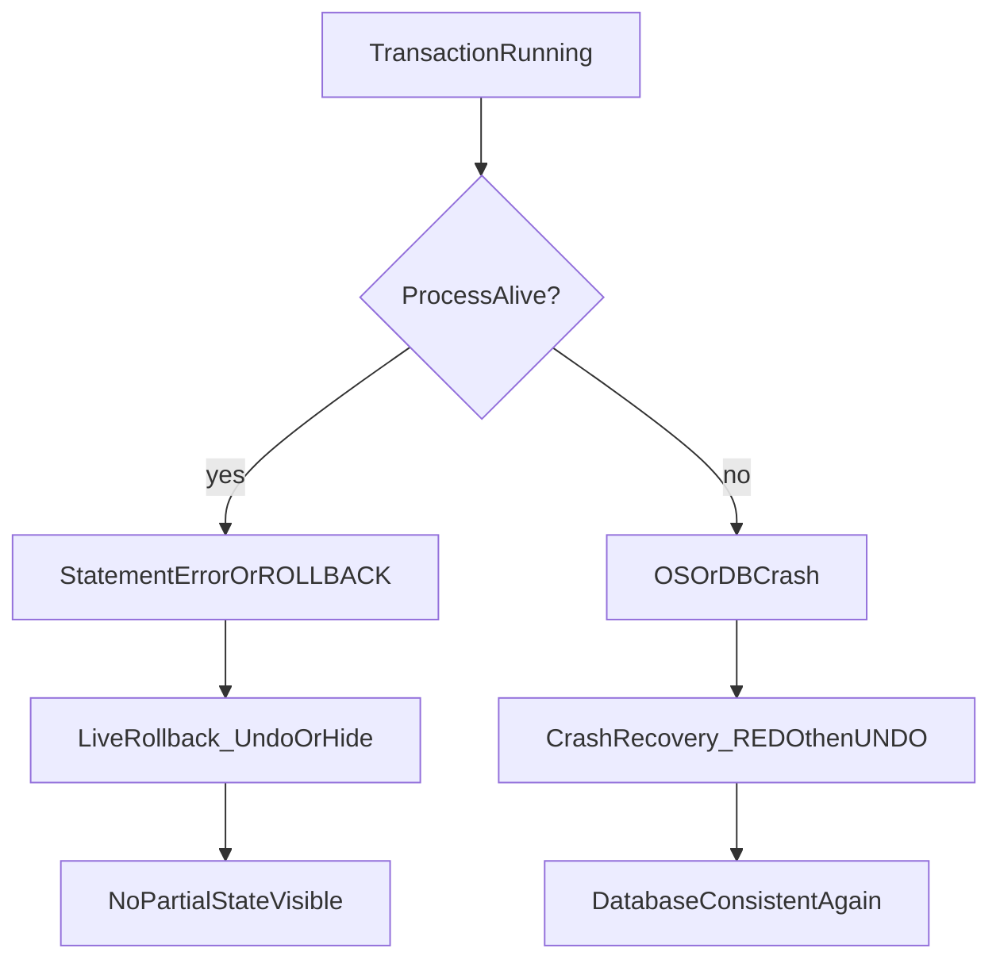
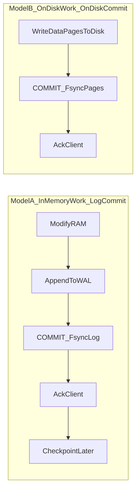
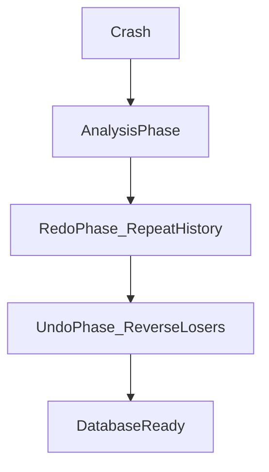
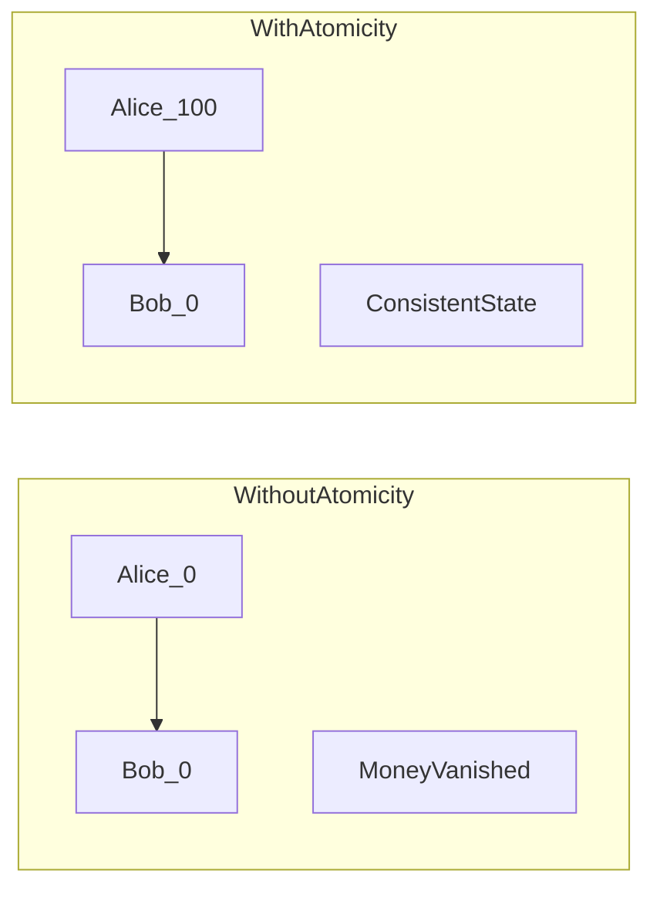
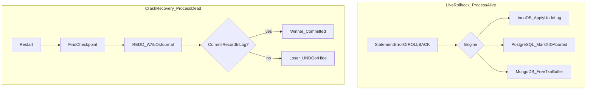

# Atomicity — Interview Notes (SQL, PostgreSQL, MongoDB)

> **Course:** Fundamentals of Database Engineering — Sec 2: ACID  
> **Goal:** Understand atomicity and rollback deeply enough to explain them in a final-year CSE interview — including statement failure, crash recovery, in-memory vs on-disk commit models, and how each engine removes inconsistency.

> **Prerequisite:** [8-what-is-a-transaction.md](8-what-is-a-transaction.md) covers what a transaction is and the two commit processes at a high level. **This note goes deep only on Atomicity and rollback.**

---

## 1. One-Minute Interview Definition

**Atomicity** means a transaction is **indivisible**. Either **every** operation inside it succeeds and becomes visible together, or the database behaves as if the transaction **never started**. There is no partial success — no half-applied bank transfer, no half-placed order.

Think of a **group dinner bill**:

1. Four friends order food. The rule is: **either everyone pays and the bill is closed, or nobody pays and the order is cancelled.**
2. You cannot have Alice charged but Bob not charged for the same meal.
3. If the waiter spills soup mid-payment, the slip is **torn up** — nobody is charged.
4. If the lights go out **before** the cashier stamps the receipt, the payment is **void** when the restaurant reopens.
5. If the lights go out **after** the receipt is stamped, the payment stands — the carbon-copy receipt book (WAL/journal) proves it.

**Say this in an interview:**

> *"Atomicity means the transaction is indivisible. Either every change becomes visible together, or the database looks as if the transaction never started. The engine never leaves a half-applied transfer, even if a statement fails or the process dies."*

---

## 2. Atomicity in Depth — What It Guarantees (and What It Does Not)

| Aspect | Explanation |
|--------|-------------|
| **Definition** | All operations in a transaction succeed as one unit, or none of them take effect. |
| **Analogy** | The whole table pays the bill, or the waiter tears up the order slip. No one leaves having paid half. |
| **What the engine does** | Keeps **undo information** (undo log, MVCC versions, or in-memory txn buffers). On `ROLLBACK` or crash before commit, it reverses or hides partial work. |
| **Failure story** | Transfer $100 from Alice to Bob: debit succeeds, credit fails → atomicity rolls back the debit. Balance stays correct. |
| **What it does NOT do** | Atomicity does **not** enforce business rules like "total money in the system is conserved." That is **Consistency**. Atomicity only prevents **partial application** of a transaction. |
| **Visibility vs durability** | After rollback, other sessions must not see partial changes (**visibility**). After crash recovery, committed work must still exist (**durability** — covered in lecture 10, but atomicity and durability share the WAL/journal). |

### The ATM Analogy (Statement Fail vs Crash)

Imagine an ATM dispensing cash during a transfer:

| Event | What atomicity requires |
|-------|-------------------------|
| **Statement fails** (e.g., Bob's account not found) | ATM **retracts** the cash it was about to dispense. Alice's account is unchanged. Process is still alive — explicit `ROLLBACK` or engine undo. |
| **Crash before COMMIT** | Power cut mid-transfer. On restart, if there is **no durable commit record** in the log, the transfer **never happened**. |
| **Crash after COMMIT** | Receipt is in the log book. Recovery **replays** the commit. Transfer stands even if data files were not yet updated. |

### Pencil vs Ink Analogy (In-Memory vs Log Commit)

| Real-world | Database |
|------------|----------|
| Writing in **pencil** on a scratch pad | Changes in **buffer pool / shared buffers / WiredTiger cache** (RAM) |
| Stamping the receipt in the **carbon-copy book** | `COMMIT` + **WAL/journal fsync** to disk |
| Putting cash in the **drawer** | **Checkpoint** → data files on disk (happens later) |
| Writing in **ink directly on the ledger** (Model B) | Force every data page to disk on each statement — slow, error-prone |

---

## 3. Two Failure Modes You Must Distinguish in Interviews

Interviewers often blur these. **Separate them clearly.**



### Failure Mode 1 — Query / Statement Fails (Process Still Alive)

The database server is running. A SQL error, constraint violation, or explicit `ROLLBACK` occurs.

| Engine | What happens | How inconsistency is avoided |
|--------|--------------|------------------------------|
| **Generic SQL / InnoDB** | Statement error → transaction marked for rollback. **Undo-log before-images** reverse already-written buffer/data changes. Savepoints allow partial undo. | Alice's debit is physically undone using the undo record; Bob is never credited. Other sessions never see a committed half-transfer. |
| **PostgreSQL** | First error **aborts the whole transaction block**. Further SQL is rejected: `current transaction is aborted, commands ignored until end of transaction block`. You **must** `ROLLBACK` (or `ROLLBACK TO SAVEPOINT`). Heap tuples are **not** physically rewritten. XID is marked `ABORTED` in `pg_xact` (clog). Visibility treats those tuples as if they never existed. `VACUUM` later reclaims space. | New Alice row version exists but is invisible because `xmin` is aborted. No other snapshot can read it. |
| **MongoDB** | Single-document write is already atomic — a failed `updateOne` either applied fully or not at all. Multi-document: catch error → `abortTransaction()`. WiredTiger **marks in-memory writes aborted / frees the txn's log buffer**. Nothing is written to the journal for an aborted txn. Server may also auto-abort (write conflict, 60s limit, cache pressure, `TransactionTooLargeForCache`). | Uncommitted multi-doc changes were never visible outside the session. Abort discards them. |

**PostgreSQL interview gotcha:** after `SELECT 1/0;` you cannot just continue and `COMMIT`. The block is dead until `ROLLBACK`.

### Failure Mode 2 — DB / OS Crash (Process Dies)

Recovery is **not** the same as live `ROLLBACK`. On restart, the engine runs **crash recovery** — not your application's catch block.

| Step | What the engine does |
|------|----------------------|
| 1 | Find the last **checkpoint** (last known consistent snapshot of data files). |
| 2 | **REDO** (roll forward): replay WAL/journal records after the checkpoint — restore committed work that never reached data files. |
| 3 | **UNDO / treat-as-aborted**: any transaction with **no durable commit record** is a **loser** — its effects are reversed or treated as invisible. |

---

## 4. Sequential Thinking — What Happens When a Statement Fails

Use this step order when an interviewer asks: *"Alice is debited, then Bob's update fails — walk me through it."*

```
Step 1 → BEGIN / START TRANSACTION (explicit or implicit autocommit per statement)
Step 2 → Engine assigns a transaction ID (XID in PostgreSQL, txn handle in WiredTiger)
Step 3 → Statement 1 (debit Alice): modify data IN MEMORY; log the change to WAL/journal buffer
Step 4 → Statement 2 (credit Bob): FAILS (constraint, missing row, syntax error, etc.)
Step 5 → Engine marks transaction as ABORTED / must rollback
Step 6 → Live rollback path:
         • InnoDB: apply undo-log before-images to reverse Alice's debit
         • PostgreSQL: mark XID ABORTED in clog; Alice's new tuple version becomes invisible
         • MongoDB: abortTransaction() frees in-memory buffer; no journal record written
Step 7 → Client receives error; must ROLLBACK (PostgreSQL) or catch + abortTransaction (MongoDB)
Step 8 → Other sessions NEVER saw Alice's debit (it was never committed)
Step 9 → Final state: Alice = original balance, Bob = unchanged — atomicity preserved
```

### Library Checkout Card Analogy (PostgreSQL MVCC Rollback)

- The **book** (heap tuple) with Alice's new balance sits on the shelf.
- The **checkout card** (`pg_xact` / clog) says the transaction ID is **VOID** (aborted).
- Any reader checking visibility sees the card and **ignores** that book copy.
- **VACUUM** is the librarian who eventually throws away void copies to reclaim shelf space.

Rollback in PostgreSQL is **cheap** (status flip), but **space reclamation is deferred**.

---

## 5. Sequential Thinking — What Happens When the DB Crashes

Use this when they ask: *"Power fails mid-transaction — what happens on restart?"*

```
Step 1 → Crash occurs at some unknown point (mid-statement, after debit, before COMMIT, etc.)
Step 2 → On restart, engine enters CRASH RECOVERY (not normal operation)
Step 3 → Read pg_control / checkpoint metadata → find last checkpoint LSN
Step 4 → REDO phase: scan WAL/journal forward from checkpoint
         • Replay ALL logged changes — including those from transactions that will ultimately abort
         • This "repeats history" to reconstruct exact page state at moment of crash
Step 5 → For each transaction: look for durable COMMIT record in WAL/journal
         • Found  → transaction is a WINNER (committed)
         • Missing → transaction is a LOSER (aborted — never got durable commit)
Step 6 → UNDO / abort losers:
         • InnoDB (ARIES): undo pass using undo log + compensation log records (CLRs)
         • PostgreSQL: no per-row undo; clog marks losers ABORTED; MVCC hides their tuples
         • MongoDB: uncommitted work was RAM-only; journal has only committed txn records
Step 7 → Database is consistent; connections accepted; no partial committed transfer visible
```

**Key interview insight:** crash recovery **replays forward first** (REDO), then undoes losers. You do not simply "delete partial work" — you reconstruct state, then decide winners vs losers.

---

## 6. Two Commit Models — In-Memory vs On-Disk

Modern databases almost always use **Model A**. Model B is the naive/historical approach interviewers mention to test whether you understand why WAL was invented.



---

### Model A — In-Memory Transaction, Disk Commit of the Log (Modern Default)

**How it works:**

1. Transaction modifies data **in RAM** (shared buffers / WiredTiger cache).
2. Each change is recorded in the **WAL/journal** (also in RAM first).
3. On `COMMIT`, only the **log is flushed to disk** (`fsync`).
4. **Dirty data pages stay in memory** until a later checkpoint or background flush.

**Used by:** PostgreSQL, MySQL InnoDB, MongoDB WiredTiger, Oracle, SQL Server.

#### How rollback works in Model A

| Situation | Rollback mechanism |
|-----------|-------------------|
| **Live ROLLBACK** | Discard or hide in-memory changes. Cheap. |
| **InnoDB live rollback** | Apply undo-log before-images (may need to undo pages already "stolen" to disk). |
| **PostgreSQL live rollback** | Mark XID `ABORTED` in clog. Leave heap versions. VACUUM later. |
| **MongoDB live abort** | Free WiredTiger's in-memory operation buffer. **No journal record** for aborted txn. |
| **Crash rollback (losers)** | No durable commit record → transaction never committed. REDO then UNDO/hide. |

#### Advantages (for atomicity + performance)

| Advantage | Why |
|-----------|-----|
| **Cheap abort** | PostgreSQL/MongoDB abort is mostly a status flip or buffer free — no rewriting every data page. |
| **High throughput** | WAL/journal is written **sequentially** — much faster than random data-page writes. |
| **Group commit** | One `fsync` can commit many concurrent small transactions. |
| **Crash-safe without syncing every page** | REDO from WAL reconstructs any dirty page not yet flushed. |
| **No torn committed pages** | Log-first design + full-page images (PostgreSQL) prevent half-written committed data. |

#### Disadvantages

| Disadvantage | Why |
|--------------|-----|
| **Extra disk space for logs** | WAL/journal files grow between checkpoints. |
| **Recovery time** | More WAL since last checkpoint = longer crash recovery. |
| **Misleading mental model** | Developers think `COMMIT` = data on disk; it often means **log on disk only**. |
| **Deferred cleanup** | PostgreSQL aborted tuples bloat heap until VACUUM. |
| **Async variants lose recent commits** | `synchronous_commit=off` or delayed journal flush can lose last N transactions on crash (loss, not corruption). |

---

### Model B — On-Disk Transaction, On-Disk Commit (Naive / Historical)

**How it works:**

1. Each statement writes **table/index pages to disk** immediately.
2. `COMMIT` = fsync those random data pages (or set a commit flag on disk).
3. Live rollback must **physically rewrite disk pages** back to old values → needs an undo log anyway.

**Used by:** Rarely in production OLTP. Discussed as the naive design that motivated WAL.

#### How rollback works in Model B

| Situation | Rollback mechanism |
|-----------|-------------------|
| **Live ROLLBACK** | Second disk rewrite of every page changed — **heavy random I/O**. |
| **Crash mid-transaction** | **Torn / half-written pages** on disk. Recovery is slow and error-prone unless you still have a log. |

#### Advantages

| Advantage | Why |
|-----------|-----|
| **Conceptually simple** | What you write is what is on disk — easy to explain. |
| **Data files always current** | No gap between "committed" and "on disk in data files." |
| **Smaller replay window** | If pages are synced, less log replay needed. |

#### Disadvantages

| Disadvantage | Why |
|--------------|-----|
| **Random I/O on every commit AND rollback** | Table pages scatter across disk — extremely slow for OLTP. |
| **Terrible TPS for small transactions** | Each `COMMIT` and each `ROLLBACK` waits for multiple page flushes. |
| **High latency** | `fsync` on many random pages >> one sequential log write. |
| **Torn pages** | Partial page writes on crash still need full-page writes or doublewrite protection. |
| **Still need a log for safety** | You pay the cost of logging **and** forcing data pages — worst of both worlds. |

---

### STEAL / NO-FORCE (Systems-Level Vocabulary)

Say these if the interviewer goes deep on recovery theory:

| Policy | Meaning | Model A? |
|--------|---------|----------|
| **STEAL** | Uncommitted dirty pages **may** be written to data files before commit | Yes — InnoDB steals; PostgreSQL can; WiredTiger **visibility-checks** so uncommitted work is not persisted at checkpoint |
| **NO-FORCE** | Committed pages need **not** be on data files at commit — only the log must be durable | Yes — this is Model A's core idea |
| **FORCE** | Every committed page must be on disk at commit | Model B tendency — slow |
| **NO-STEAL** | Uncommitted pages never written to data files | Simpler rollback, but limits buffer management |

**Interview one-liner:** *"Modern OLTP uses STEAL + NO-FORCE: dirty pages can leave memory early, but commit only waits for the log — not every data page."*

---

## 7. Engine Internals — How Each Database Implements Atomicity

### 7.1 Generic SQL / InnoDB / ARIES (The "Relational Engine" Answer)

When an interviewer asks *"How does a SQL database undo on crash?"* — answer with **ARIES** (Analysis, Redo, Undo), which InnoDB implements.

**Live rollback (statement fail or explicit ROLLBACK):**

1. InnoDB maintains an **undo log** with **before-images** of changed rows.
2. On rollback, undo records are applied in reverse order — physically restoring old values.
3. Undo logs also support **MVCC consistent reads** (other transactions see old versions).

**Crash recovery (ARIES three phases):**



| Phase | What happens |
|-------|--------------|
| **Analysis** | Scan WAL from last checkpoint. Build list of **active transactions (ATT)** and **dirty pages (DPT)** at crash time. |
| **Redo** | Replay **all** logged changes forward — including uncommitted ones — to reconstruct exact page state at crash. |
| **Undo** | For each **loser** (no commit record): apply undo log in reverse. Write **Compensation Log Records (CLRs)** so a crash during undo is also recoverable. |

**InnoDB logs:**

| Log | Role in atomicity |
|-----|-------------------|
| **Redo log** | Records **after-images** of changes. Enables REDO of committed work not yet on data pages. |
| **Undo log** | Records **before-images**. Enables live rollback and crash UNDO of losers. |

**PostgreSQL vs InnoDB trade-off:**

| | InnoDB | PostgreSQL |
|---|--------|------------|
| Live rollback cost | Physical undo — more work now | O(1) status flip — cheap now |
| Space after abort | Reclaimed immediately | Aborted tuples remain until VACUUM |
| Crash undo | Full ARIES undo pass with CLRs | REDO + treat missing commit as abort; MVCC hides tuples |

---

### 7.2 PostgreSQL — WAL + MVCC + Clog (No Traditional Undo Log)

PostgreSQL achieves atomicity differently from InnoDB — **no per-row undo log for rollback**.

**Key structures:**

| Structure | Role |
|-----------|------|
| **Shared buffers** | In-memory copy of data pages |
| **WAL (pg_wal/)** | Write-ahead log — every change logged before page write |
| **Heap tuples with xmin/xmax** | MVCC row versions; each version tagged with creating/ending transaction ID |
| **pg_xact (clog / commit log)** | Compact bitmap: for each XID, status = IN_PROGRESS / COMMITTED / ABORTED |
| **Hint bits** | Cached commit status on tuple headers to speed visibility checks |

**Live rollback path:**

1. `ROLLBACK` or statement error → mark XID as **ABORTED** in clog (and WAL abort record — but abort records are **not force-flushed**; missing commit after crash = abort anyway).
2. **No heap pages rewritten.** Alice's new tuple version stays on disk but is **invisible** to all snapshots.
3. `VACUUM` eventually removes dead tuple versions.

**Crash recovery path:**

1. Find last checkpoint in WAL.
2. **REDO**: replay all WAL records forward ("repeat history") — including changes from transactions that will abort.
3. For each XID: if no **durable COMMIT record** was flushed before crash → treat as **ABORTED**.
4. No separate undo pass over rows — MVCC + clog handle visibility.

**Why abort records are not force-flushed:**

> After a crash, PostgreSQL assumes any transaction without a flushed commit record was aborted. So abort WAL records do not need the same durability guarantee as commit records — this is a deliberate optimization.

**Say this in an interview:**

> *"PostgreSQL uses MVCC for atomicity instead of a traditional undo log. Rollback is cheap — flip the XID to ABORTED in the clog and the new row versions become invisible. Crash recovery REDOs the WAL, then treats any transaction without a durable commit as aborted. VACUUM reclaims the dead tuples later."*

---

### 7.3 MongoDB — Single-Document Atomicity + WiredTiger Multi-Document Transactions

MongoDB has **two levels** of atomicity. Prefer the simpler one.

#### Level 1 — Single-Document Atomicity (Always Available)

Every write to a **single document** is atomic by design. No explicit transaction needed if you embed related data.

- WiredTiger applies the entire document modification as one unit.
- Failed update = document unchanged.
- This is the **preferred** MongoDB pattern — schema design over distributed transactions.

#### Level 2 — Multi-Document ACID Transactions (4.0+ Replica Sets, 4.2+ Sharded)

Use when updates span **multiple documents, collections, or databases**.

**WiredTiger transaction internals:**

| Concept | Behavior |
|---------|----------|
| **In-memory buffer** | All writes collected in RAM during the transaction |
| **Commit** | Entire set of operations written as **one commit log record** to the journal |
| **Abort / rollback** | Buffer is **freed** — nothing written to journal. Cheapest rollback of the three engines. |
| **Visibility** | Changes invisible outside the session until `commitTransaction()` |
| **Checkpoint (~60s)** | Flushes dirty cache pages to `.wt` data files |
| **Crash recovery** | Find last checkpoint → replay journal from that point → only **committed** records exist in journal |

**Auto-abort triggers (production gotchas):**

| Trigger | Result |
|---------|--------|
| Write conflict with concurrent txn | One txn aborted; retry needed |
| Transaction exceeds ~60 seconds | Aborted |
| WiredTiger cache pressure | Aborted with write conflict error |
| Transaction too large for cache | `TransactionTooLargeForCache` |
| Network / primary failover | May need retry with `UnknownTransactionCommitResult` |

**Say this in an interview:**

> *"MongoDB single-document writes are always atomic — I prefer embedding data to avoid transaction overhead. For multi-document atomicity, WiredTiger holds all writes in memory, writes one journal record on commit, and on abort simply frees the buffer with no disk write. Crash recovery replays the journal from the last checkpoint — uncommitted work was RAM-only and is gone."*

---

## 8. How Rollback Removes Inconsistency — Same Story, Three Engines

**Scenario:** Transfer $100 from Alice (balance 100) to Bob (balance 0). Debit Alice succeeds. Credit Bob fails (or crash before commit).



| Outcome | Alice | Bob | Problem? |
|---------|-------|-----|----------|
| **Without atomicity** | 0 | 0 | **Yes** — $100 vanished from the system |
| **With atomicity (rollback)** | 100 | 0 | **No** — as if transfer never started |

### Per-engine resolution

| Engine | What happened internally | Final visible state |
|--------|-------------------------|---------------------|
| **InnoDB** | Undo log restores Alice's before-image (balance = 100). Bob never credited. | Alice = 100, Bob = 0 |
| **PostgreSQL** | Alice's new tuple (balance = 0) exists but xmin is ABORTED — invisible. Old tuple (balance = 100) still visible. | Alice = 100, Bob = 0 |
| **MongoDB (one doc)** | Single `updateOne` with both `$inc` operations — failure means **neither** applied. | Alice = 100, Bob = 0 |
| **MongoDB (multi-doc)** | `abortTransaction()` discards both in-memory writes. Crash before commit: nothing in journal. | Alice = 100, Bob = 0 |

**Total money invariant:** atomicity ensures you never get "Alice debited, Bob not credited" visible to any client. **Consistency** (separate ACID property) ensures total money is preserved as a business rule — atomicity is the mechanism; consistency is the outcome when your transaction logic is correct.

---

## 9. Code Snippets — Bank Transfer + Failure Demos

### Scenario

Transfer **$100** from account `Alice` to account `Bob`. Both must exist; Alice must have enough balance. All-or-nothing.

---

### 9.1 SQL (Portable / ISO SQL + InnoDB-style)

```sql
-- ============================================================
-- SUCCESS PATH: explicit transaction
-- ============================================================
START TRANSACTION;

UPDATE accounts
SET balance = balance - 100.00
WHERE name = 'Alice' AND balance >= 100.00;
-- In application code: if rows_affected != 1, ROLLBACK

UPDATE accounts
SET balance = balance + 100.00
WHERE name = 'Bob';
-- In application code: if rows_affected != 1, ROLLBACK

COMMIT;


-- ============================================================
-- FAILURE PATH: second statement fails → entire txn rolled back
-- (InnoDB: undo log reverses Alice's debit)
-- ============================================================
START TRANSACTION;

UPDATE accounts SET balance = balance - 100.00 WHERE name = 'Alice';
-- Succeeds: Alice debited in buffer pool; undo record created

UPDATE accounts SET balance = balance + 100.00 WHERE name = 'NonExistentUser';
-- FAILS: 0 rows or constraint error

-- Engine marks transaction for rollback
ROLLBACK;
-- InnoDB applies undo log → Alice's balance restored to 100
-- Other sessions never saw the debit (was never committed)


-- ============================================================
-- SAVEPOINT: partial rollback inside a transaction
-- ============================================================
START TRANSACTION;

INSERT INTO audit_log (event) VALUES ('transfer started');
-- audit_log insert is part of the transaction

SAVEPOINT before_transfer;

UPDATE accounts SET balance = balance - 100.00 WHERE name = 'Alice';
-- Something wrong with Bob's side:
ROLLBACK TO SAVEPOINT before_transfer;
-- Alice debit undone; audit_log insert still alive

COMMIT;
-- audit_log row is committed; transfer did not happen


-- ============================================================
-- CRASH RECOVERY (not SQL you run — what the engine does on restart)
-- ============================================================
-- 1. Find last checkpoint LSN in redo log
-- 2. REDO: replay all changes from checkpoint forward
-- 3. UNDO: for each txn without COMMIT record, apply undo log in reverse
-- 4. Result: Alice = 100 if transfer never committed; Alice/Bob updated if it did
```

**Under the hood on statement failure (InnoDB):**

1. Debit logged to **redo log**; **undo log** stores Alice's old balance.
2. Credit fails → transaction marked aborted.
3. `ROLLBACK` applies undo records in reverse order.
4. Buffer pool pages restored; other sessions see original balances.

---

### 9.2 PostgreSQL

```sql
-- ============================================================
-- SUCCESS PATH
-- ============================================================
BEGIN;

UPDATE accounts
SET balance = balance - 100.00
WHERE name = 'Alice' AND balance >= 100.00;

UPDATE accounts
SET balance = balance + 100.00
WHERE name = 'Bob';

COMMIT;


-- ============================================================
-- FAILURE PATH: aborted transaction block (PostgreSQL-specific!)
-- ============================================================
BEGIN;

UPDATE accounts SET balance = balance - 100.00 WHERE name = 'Alice';
-- Succeeds: new tuple version in shared buffers; WAL record appended

UPDATE accounts SET balance = balance + 100.00 WHERE name = 'NonExistentUser';
-- ERROR: e.g., violates FK or 0 rows if you check in app

-- You CANNOT continue with more SQL in this block:
-- ERROR: current transaction is aborted, commands ignored until end of transaction block

ROLLBACK;
-- XID marked ABORTED in clog; Alice's new tuple invisible; old tuple still readable
-- No physical rewrite of heap pages


-- ============================================================
-- SAVEPOINTS
-- ============================================================
BEGIN;

UPDATE accounts SET balance = balance - 50.00 WHERE name = 'Alice';
SAVEPOINT sp1;
UPDATE accounts SET balance = balance + 50.00 WHERE name = 'Bob';
ROLLBACK TO SAVEPOINT sp1;
COMMIT;


-- ============================================================
-- psql convenience: ON_ERROR_ROLLBACK (interactive only)
-- Creates implicit SAVEPOINT before each statement
-- ============================================================
-- \set ON_ERROR_ROLLBACK on
-- BEGIN;
-- UPDATE accounts SET balance = balance - 100.00 WHERE name = 'Alice';
-- SELECT 1/0;  -- fails but txn survives (rolls back to savepoint)
-- UPDATE accounts SET balance = balance + 100.00 WHERE name = 'Bob';
-- COMMIT;


-- ============================================================
-- CRASH RECOVERY (engine startup — not user SQL)
-- ============================================================
-- 1. Read pg_control → last checkpoint
-- 2. REDO WAL from checkpoint (repeat history, including aborted txn changes)
-- 3. No durable COMMIT record → txn treated as ABORTED in clog
-- 4. MVCC visibility hides aborted tuples; VACUUM reclaims later
-- 5. If COMMIT record was fsync'd before crash → transfer is durable (REDO applies it)
```

**Under the hood on `ROLLBACK` in PostgreSQL:**

1. Changes live in **shared buffers** (RAM) as new tuple versions.
2. WAL records describe each change.
3. `ROLLBACK` → XID status = **ABORTED** in clog. **No heap rewrite.**
4. Visibility check: any tuple with `xmin = aborted_xid` is ignored.
5. `VACUUM` eventually removes dead tuples.

---

### 9.3 MongoDB

#### Option A — Single-Document Atomic Update (Preferred)

```javascript
// Atomic debit+credit inside ONE document (embedded accounts array)
// No transaction overhead — WiredTiger guarantees single-doc atomicity

db.bank.updateOne(
  {
    _id: "bank_main",
    "accounts.name": "Alice",
    "accounts.balance": { $gte: 100 }
  },
  {
    $inc: {
      "accounts.$[alice].balance": -100,
      "accounts.$[bob].balance": 100
    }
  },
  {
    arrayFilters: [
      { "alice.name": "Alice" },
      { "bob.name": "Bob" }
    ]
  }
);

// If filter fails (Alice insufficient funds) → NO change at all
// If update succeeds → BOTH increments applied atomically
// Crash recovery: journal replays committed write from last checkpoint
```

#### Option B — Multi-Document ACID Transaction

```javascript
const session = db.getMongo().startSession();

try {
  session.startTransaction({
    readConcern:  { level: "snapshot" },
    writeConcern: { w: "majority" }   // j: true implied on replica sets
  });

  const accounts = session.getDatabase("bank").accounts;

  // Debit Alice
  const debitResult = accounts.updateOne(
    { name: "Alice", balance: { $gte: 100 } },
    { $inc: { balance: -100 } }
  );

  if (debitResult.modifiedCount !== 1) {
    throw new Error("Insufficient funds or Alice not found");
  }

  // Credit Bob — simulate failure
  accounts.updateOne(
    { name: "NonExistentUser" },
    { $inc: { balance: 100 } }
  );

  session.commitTransaction();
} catch (error) {
  // Live rollback: WiredTiger frees in-memory operation buffer
  // No journal record written for this transaction
  session.abortTransaction();
  print("Transfer rolled back: " + error.message);
} finally {
  session.endSession();
}


// ============================================================
// PRODUCTION RETRY LOGIC (required for multi-doc transactions)
// ============================================================
async function commitWithRetry(session) {
  try {
    await session.commitTransaction();
  } catch (error) {
    if (error.hasErrorLabel("UnknownTransactionCommitResult")) {
      return commitWithRetry(session);  // commit result unknown — retry
    }
    throw error;
  }
}

async function runTransactionWithRetry(txnFunc, session) {
  while (true) {
    session.startTransaction({
      readConcern:  { level: "snapshot" },
      writeConcern: { w: "majority" },
      readPreference: "primary"
    });
    try {
      await txnFunc(session);
      await commitWithRetry(session);
      break;
    } catch (error) {
      await session.abortTransaction();
      if (error.hasErrorLabel("TransientTransactionError")) {
        continue;  // retry whole transaction
      }
      throw error;
    }
  }
}


// ============================================================
// CRASH RECOVERY (WiredTiger startup — not user code)
// ============================================================
// 1. Find last valid checkpoint in .wt data files
// 2. Locate corresponding journal record
// 3. Replay all journal entries after checkpoint
// 4. Uncommitted multi-doc txn had NO commit record in journal → gone
// 5. Committed txn's journal record replayed → transfer durable
```

**Under the hood on `abortTransaction` in MongoDB:**

1. All writes held in **WiredTiger cache** as in-memory operation buffer.
2. `abortTransaction()` → buffer **freed**; writes marked aborted.
3. **No journal record** written for aborted transaction.
4. Other sessions never saw the changes (snapshot isolation).
5. On crash before commit: same outcome — RAM contents lost, journal has no commit record.

---

## 10. Side-by-Side Comparison

| Concept | Generic SQL / InnoDB | PostgreSQL | MongoDB (WiredTiger) |
|---------|---------------------|------------|----------------------|
| **Live rollback mechanism** | Undo log (physical reverse) | Clog: mark XID ABORTED; MVCC hides tuples | Free in-memory txn buffer |
| **Crash recovery** | ARIES: Analysis → Redo → Undo | Redo WAL; no commit = abort; no row undo pass | Replay journal from checkpoint |
| **Undo log?** | Yes (before-images) | No (MVCC + clog instead) | No (abort = discard buffer) |
| **Redo log?** | Yes (redo log) | Yes (WAL) | Yes (journal) |
| **STEAL behavior** | Yes — dirty pages may reach disk early | Yes — with WAL REDO safety | Visibility-checked at checkpoint |
| **Cost of abort** | Medium (apply undo records) | Low (O(1) status flip) | Lowest (free buffer) |
| **Space after abort** | Reclaimed immediately | Dead tuples until VACUUM | N/A (RAM only) |
| **Single-op atomicity** | Per statement in autocommit | Per statement in autocommit | Per **document** always |
| **What others see during txn** | Depends on isolation level | Uncommitted tuples invisible (MVCC) | Uncommitted changes invisible |
| **Commit = data on disk?** | No — log durable first | No — WAL fsync first | No — journal sync first |

### Rollback vs Crash Recovery Diagram



---

## 11. How to Use This in an Interview

### 60-Second Spoken Answer

> *"Atomicity means all-or-nothing. Either every operation in a transaction succeeds together, or the database behaves as if the transaction never started.*
>
> *There are two failure modes. If a statement fails while the server is running, the engine does a live rollback — InnoDB uses an undo log to physically reverse changes, PostgreSQL marks the transaction ID as aborted and hides the new row versions with MVCC, and MongoDB frees WiredTiger's in-memory buffer with no journal write.*
>
> *If the database crashes, recovery is different — not your catch block. The engine finds the last checkpoint, REDOs the WAL or journal forward to reconstruct page state, then treats any transaction without a durable commit record as aborted. InnoDB also runs a full undo pass on losers; PostgreSQL relies on MVCC visibility instead.*
>
> *Modern databases use in-memory work with log commit to disk — STEAL and NO-FORCE — because forcing every data page to disk on each commit or rollback would destroy OLTP performance. The key insight: COMMIT means the log is durable, not that data files are updated. Actual pages flush at checkpoint.*
>
> *In MongoDB I prefer single-document atomic updates via schema design. Multi-document transactions work but need retry logic and majority write concern."*

### If They Go Deeper — Answer Ladder

| Question | Answer direction |
|----------|------------------|
| *"What is atomicity?"* | Indivisible unit of work; all succeed or none; no partial state visible after rollback or crash recovery. |
| *"Statement fails mid-transaction?"* | Live rollback: undo log (InnoDB), abort XID (PostgreSQL), free buffer (MongoDB). Other sessions never saw uncommitted work. |
| *"Crash before COMMIT?"* | Recovery: REDO log from checkpoint; no commit record = loser; undo or treat as invisible. |
| *"Difference between rollback and crash recovery?"* | Rollback = process alive, explicit or on error. Crash recovery = restart, REDO then undo/hide losers. |
| *"Why doesn't PostgreSQL rewrite rows on rollback?"* | MVCC: new versions become invisible when XID marked ABORTED. Cheaper than physical undo. VACUUM cleans up. |
| *"Why does InnoDB still have an undo log?"* | Physical undo for rollback + consistent reads for MVCC + ARIES crash undo with CLRs. |
| *"Why is MongoDB abort cheapest?"* | All writes in RAM; abort = free buffer, no disk I/O, no journal entry. |
| *"In-memory txn, disk commit?"* | Model A: modify RAM, fsync WAL/journal on COMMIT, checkpoint data files later. Fast, safe. |
| *"On-disk txn, disk commit?"* | Model B: force data pages every time. Slow random I/O; torn pages; still need undo log. Never use for OLTP. |
| *"STEAL / NO-FORCE?"* | STEAL = dirty uncommitted pages may reach disk. NO-FORCE = commit only waits for log, not data pages. |
| *"Does atomicity preserve total money?"* | It prevents partial application. Preserving total money is a **consistency** invariant your transaction logic must enforce. |
| *"PostgreSQL: can I COMMIT after an error?"* | No. Block is aborted until `ROLLBACK`. Use savepoints or `ON_ERROR_ROLLBACK` in psql. |
| *"When not to use MongoDB multi-doc transactions?"* | When you can embed data in one document — denormalize; transactions add latency and require retries. |

---

## 12. Cheat Sheet (Glance Before the Interview)

1. **Atomicity** = all-or-nothing; no partial success visible after rollback or crash recovery.
2. **Two failure modes** = statement error (live rollback) vs crash (recovery: REDO → undo/hide losers).
3. **Model A (modern)** = in-memory work + log commit to disk (STEAL + NO-FORCE).
4. **Model B (naive)** = force data pages every commit/rollback — slow, torn pages, still need undo.
5. **InnoDB** = undo log (live rollback) + redo log (crash REDO) + ARIES undo pass on losers.
6. **PostgreSQL** = no undo log; MVCC + clog; rollback = mark XID ABORTED; VACUUM reclaims dead tuples.
7. **MongoDB** = single-doc atomic always; multi-doc abort = free RAM buffer, no journal write.
8. **COMMIT** = log durable, **not** necessarily data files on disk.
9. **Crash recovery** = checkpoint → REDO forward → treat missing commit as abort.
10. **Prefer MongoDB embedding** over multi-doc transactions when possible.

---

## 13. Sources

- [PostgreSQL tutorial: Transactions](https://www.postgresql.org/docs/current/tutorial-transactions.html)
- [PostgreSQL: Write-Ahead Logging (WAL)](https://www.postgresql.org/docs/current/wal-intro.html)
- [PostgreSQL: WAL Internals](https://www.postgresql.org/docs/current/wal-internals.html)
- [PostgreSQL: Asynchronous Commit](https://www.postgresql.org/docs/current/wal-async-commit.html)
- [PostgreSQL: Transaction Isolation](https://www.postgresql.org/docs/current/transaction-iso.html)
- [How Postgres Makes Transactions Atomic — Brandur](https://brandur.org/postgres-atomicity)
- [MongoDB: Transactions](https://www.mongodb.com/docs/manual/core/transactions/)
- [MongoDB: Transactions in Applications](https://www.mongodb.com/docs/manual/core/transactions-in-applications/)
- [MongoDB: Journaling](https://www.mongodb.com/docs/manual/core/journaling/)
- [MongoDB: WiredTiger Storage Engine](https://www.mongodb.com/docs/manual/core/wiredtiger/)
- [MySQL: InnoDB Undo Logs](https://dev.mysql.com/doc/refman/8.4/en/innodb-undo-logs.html)
- [MySQL: InnoDB Redo Log](https://dev.mysql.com/doc/refman/8.4/en/innodb-redo-log.html)
- [ARIES: A Transaction Recovery Method (Mohan et al.)](https://dl.acm.org/doi/10.1145/128765.128770)
- [CMU 15-445: Database Crash Recovery](https://15445.courses.cs.cmu.edu/spring2026/notes/23-recovery.pdf)
- [WiredTiger: Transactions Architecture](http://source.wiredtiger.com/develop/arch-transaction.html)
- [WiredTiger: Logging Architecture](http://source.wiredtiger.com/develop/arch-logging.html)
