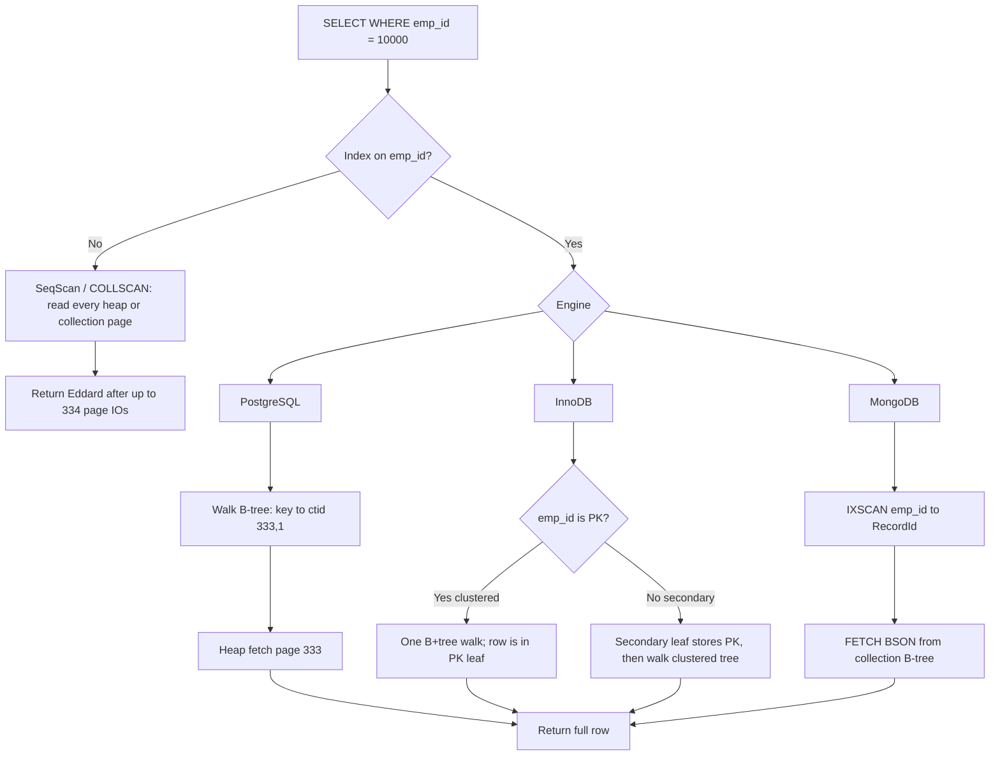
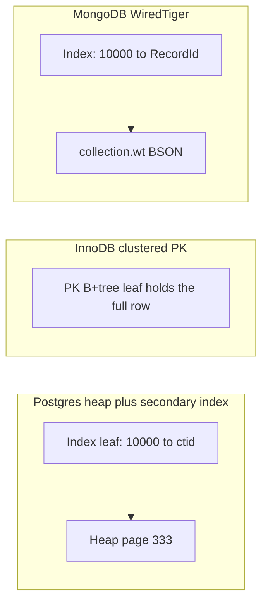

# How Tables and Indexes Are Stored on Disk — Interview Notes (SQL, PostgreSQL, MongoDB)

> **Course:** Fundamentals of Database Engineering — Sec 3: Understanding the Database Internals  
> **Lecture:** How tables and indexes are stored on disk, and how they are queried  
> **Goal:** After this note you can draw the on-disk layout, count IOs for a lookup, and explain heap vs clustered vs WiredTiger in a final-year CSE interview.

---

## 1. One-Minute Interview Definition

A table on disk is **not a spreadsheet**. It is a **file of fixed-size pages**. The engine never fetches “one row from disk.” It fetches **one or more pages** in an **IO**. An **index** is a **separate (usually B-tree) structure** whose leaves store `key → pointer`. That pointer tells the engine **exactly which heap page** to lift, so a point query pays a handful of IOs instead of reading every page.

Think of a **city library warehouse**:

1. Full books live in **crates** (pages). A forklift cannot pick a single page of a book; it must lift the whole crate.
2. One forklift trip is an **IO** — slow and expensive. RAM is a cart already at the desk.
3. The **card catalog** (index) is thin: “Eddard, employee 10000 → aisle 333, slot 1000.” You walk the catalog, then lift **one** crate.
4. Without the catalog you walk **every crate** until you find Eddard.

That is storage and querying. PostgreSQL, MySQL InnoDB, and MongoDB WiredTiger all use this idea; they disagree on **what the pointer is** and **whether the table itself is a B-tree**.

---

## 2. Sequential Thinking — Reconstruct the Engine

Use this order when an interviewer asks *“How is a table stored, and what happens on `SELECT … WHERE emp_id = 10000`?”*

```
Step 1 → Logical table (the spreadsheet the SQL/Mongo client sees)
Step 2 → Physical row identity (row_id / ctid / PK / RecordId)
Step 3 → Pack rows into fixed-size pages (unit of IO)
Step 4 → Heap / collection file = unordered (or RecordId-ordered) array of those pages
Step 5 → Index = smaller B-tree of (key → pointer into the heap/collection)
Step 6 → No index  → sequential scan: read every heap page
Step 7 → With index → walk index pages, then fetch exactly one heap/collection page
Step 8 → Engine twist: clustered (InnoDB) vs heap+ctid (Postgres) vs RecordId B-tree (MongoDB)
```

### Analogy Mapping

| Real world (library) | Idea | PostgreSQL | MySQL InnoDB | MongoDB (WiredTiger) |
|----------------------|------|------------|--------------|----------------------|
| Spreadsheet of titles | Logical table / collection | `emp` heap relation | `emp` table | `emp` collection |
| Inventory sticker on a crate slot | Row identity | `ctid` `(block, offset)` | Clustered **primary key** | Hidden **RecordId** (64-bit) |
| One crate the forklift lifts | Page | 8 KB (`BLCKSZ`) | 16 KB default | ~32 KB leaf (`leaf_page_max`) |
| Forklift trip | IO | Read into shared buffers | Read into buffer pool | Read into WiredTiger cache |
| Warehouse of full books | Heap / data file | Heap file (`base/<db>/<filenode>`) | Clustered B+tree **is** the table | `collection-*.wt` keyed by RecordId |
| Card catalog | Secondary index | B-tree of `key → ctid` | B+tree of `key → PK value` | B-tree of `key → RecordId` (`index-*.wt`) |
| Books shelved in catalog order | Clustered / IOT | Not the default (`CLUSTER` is one-shot) | **Always** — table = PK B+tree | Optional clustered collection on `_id` |

---

## 3. Storage Concepts from the Lecture — In Depth

The lecture’s running example is the `EMP` table. We use it for every later simulation.

### 3.1 Logical Table

What you write in SQL is a **relation**: named columns, rows, types. Disk does not store a grid. It stores **bytes in pages**.

```text
emp_id    emp_name    emp_dob       emp_salary
  2000    Hussein     1/2/1988      $100,000
  3000    Adam        3/2/1977      $200,000
  4000    Ali         5/2/1982      $300,000
```

For IO math the lecture switches to a denser key (`emp_id` = 10, 20, …, 10000) so 1001 rows pack into pages of 3 rows:

```text
row_id  emp_id  emp_name   …   page
     1      10  Hussein        0
     2      20  Adam           0
     3      30  Ali            0
     4      40  …              1
   ...
  1000   10000  Eddard       333
  1001   10010  …            333
```

| Aspect | Explanation |
|--------|-------------|
| **Definition** | A table is a logical relation. On disk it is one or more **relation files** of pages, plus optional forks (FSM, VM, TOAST) and separate **index files**. |
| **Analogy** | The public catalog listing (“Employee 10000 is Eddard”) vs the warehouse that actually holds the book. |
| **What the engine does** | Maps the name `emp` to a file: Postgres `pg_class.relfilenode` → `base/<dboid>/<filenode>`. MongoDB `_mdb_catalog` → `collection-<ident>.wt`. |
| **Cost story** | `SELECT *` always means “read heap/collection pages.” An index can only skip heap IOs if it **covers** the query (all needed columns already in the index) **and** visibility allows it. |
| **Say this in an interview** | *"The logical table is what SQL sees. Physically it is a file of pages. Indexes are other files (or, in InnoDB, the table file is itself a B+tree)."* |

**PostgreSQL — see the file:**

```sql
CREATE TABLE emp (
  emp_id     int,
  emp_name   text,
  emp_dob    date,
  emp_salary numeric
);

SELECT
  pg_relation_filepath('emp') AS heap_file,   -- e.g. base/16384/16385
  pg_relation_size('emp')     AS heap_bytes,
  (pg_relation_size('emp') / current_setting('block_size')::int) AS heap_pages;
```

**MongoDB — collection is a WiredTiger table:**

```javascript
db.createCollection("emp");
db.emp.insertMany([
  { emp_id: 10,    emp_name: "Hussein", emp_salary: 100000 },
  { emp_id: 20,    emp_name: "Adam",    emp_salary: 200000 },
  { emp_id: 10000, emp_name: "Eddard",  emp_salary: 250000 }
]);
// On disk: dbPath/collection-<ident>.wt  +  index-<ident>.wt for _id
```

---

### 3.2 Row_ID — Internal Identity, Not `emp_id`

`emp_id` is **your** key. **Row identity** is what the engine uses to find bytes on a page.

| Aspect | Explanation |
|--------|-------------|
| **Definition** | A system-maintained locator for a physical row version. The lecture calls it `row_id` / tuple_id. |
| **Analogy** | Not the book’s ISBN (`emp_id`). The sticker: “warehouse aisle 333, slot in crate 1000.” |
| **PostgreSQL** | `ctid` = `(block_number, offset_number)`. Offset is the **line-pointer index** on that 8 KB page, not a byte offset. Visible as a system column: `SELECT ctid, * FROM emp;` |
| **MySQL InnoDB** | There is no heap address. The **primary key value is the row identity**. No PK → first `UNIQUE NOT NULL` index; else a hidden **6-byte** row ID. Secondary indexes store that PK (or hidden id), not a disk pointer. |
| **MongoDB** | Collection B-tree key is a hidden **64-bit RecordId**. `_id` is a **separate unique index** mapping `_id → RecordId` (unless you created a clustered collection). |
| **Say this in an interview** | *"Postgres indexes point at ctid in the heap. InnoDB secondary indexes point at the PK, then you walk the clustered tree. MongoDB secondary indexes point at RecordId, then you fetch the BSON document. Those three sentences are the whole architecture."* |

```sql
-- PostgreSQL: ctid is (page, line pointer)
SELECT ctid, emp_id, emp_name FROM emp WHERE emp_id = 10000;
-- example: (333,1)  →  page 333, first line pointer on that page
```

**Lecture encoding of an index leaf:** `10000 (1000, 333)` means *key `emp_id=10000` lives at row_id 1000 on heap page 333*.

---

### 3.3 Page — The Unit of Storage and IO

| Aspect | Explanation |
|--------|-------------|
| **Definition** | A fixed-size block. Tables and indexes are **arrays of pages**. You never IO a single row. |
| **Analogy** | The crate. Want one book? Lift the crate; the other books in it come along “for free.” |
| **Sizes** | PostgreSQL **8 KB** (compile-time `BLCKSZ`). InnoDB **16 KB** default (`innodb_page_size`). WiredTiger leaf **~32 KB** (`leaf_page_max`), internal pages **~4 KB**. |
| **Lecture math** | 1001 rows, 3 rows/page → `1001 / 3 ≈ 334` pages, numbered **0 … 333**. Last employee `emp_id=10000` is on **page 333**. |
| **Row vs column store** | Row store packs a whole row into the page (OLTP). Column store packs one column’s values across pages (analytics). Same “page” idea; different packing. This lecture is **row store**. |
| **Say this in an interview** | *"The I/O unit is the page. 8 KB in Postgres, 16 KB in InnoDB. A point query that misses cache still pays for the whole page, which is why locality and indexes dominate OLTP performance."* |

```text
Page 0                          Page 1                 …    Page 333
┌─────────────────────────┐     ┌──────────────┐           ┌──────────────────┐
│ 1,10,Hussein,…          │     │ 4,40,…       │           │ 1000,10000,Eddard│
│ 2,20,Adam,…             │     │ 5,50,…       │           │ 1001,10010,…     │
│ 3,30,Ali,…              │     │ 6,60,…       │           │                   │
└─────────────────────────┘     └──────────────┘           └──────────────────┘
```

---

### 3.4 IO — Why Everything Is About Pages

| Aspect | Explanation |
|--------|-------------|
| **Definition** | An input/output request that moves **one or more pages** between disk (or OS cache) and the database cache. |
| **Analogy** | One forklift trip. You minimize trips, not “rows touched in CPU.” |
| **What the engine does** | Check **buffer pool / shared buffers / WiredTiger cache**. Hit → no disk. Miss → read the page (often via the **OS page cache** first). Sequential scans can read **several pages per syscall** (Postgres `effective_io_concurrency`, OS readahead). |
| **You cannot IO one row** | The extra rows on the page are free. That is **spatial locality**. It also means a random point lookup of 100 scattered rows can mean **100 page IOs**. |
| **Cost story** | SSD random read is tens to hundreds of microseconds; RAM is nanoseconds. A 334-page scan vs 3–4 page index walk is the difference between “fine” and “timeout” at 10M rows. |
| **Say this in an interview** | *"We optimize IOs. An index exists to turn ‘read every page’ into ‘read a few index pages plus one heap page.’ If those pages are already in cache, the query is CPU-bound, not disk-bound."* |

Two caches, say this clearly:

1. **Database cache** — Postgres shared buffers, InnoDB buffer pool, WiredTiger cache (often ~50% of RAM minus 1 GB in MongoDB).
2. **OS page cache** — the kernel may still hold the file pages. A “disk IO” from the DB’s point of view might be satisfied by the OS without touching the SSD.

---

### 3.5 Heap — Where the Full Rows Live

| Aspect | Explanation |
|--------|-------------|
| **Definition** | The data structure (really: the **file of pages**) that holds **complete rows**. In Postgres the heap is **unordered**: a new row goes into any page with free space (tracked by the Free Space Map). |
| **Analogy** | The warehouse of full books, dumped into crates as they arrive. Not sorted by title. |
| **Why scans hurt** | To find `emp_id = 10000` you may read **all 334 pages**. That is a **sequential scan** / `COLLSCAN`. |
| **Why indexes exist** | The index answers: *do not scan the warehouse; lift crate 333.* |
| **InnoDB exception** | InnoDB has **no unordered heap**. The table **is** the clustered B+tree. “Heap” in the lecture still means “where the full row bytes live” — in InnoDB that is the **leaf of the PK**. |
| **MongoDB default** | Documents live in a B-tree keyed by **RecordId** (append-ish), not by `_id`. Full BSON is in `collection-*.wt`. That file plays the heap’s role. |
| **Say this in an interview** | *"Heap means the main row store. Postgres heap is unordered pages. Traversing it is O(pages). Indexes exist to name the page."* |

---

### 3.6 Index — A Smaller Structure of Pointers (Usually a B-tree)

| Aspect | Explanation |
|--------|-------------|
| **Definition** | A **separate** on-disk structure (except clustered/IOT cases) that stores **part of the data** (the indexed columns) plus a **pointer** to the rest. |
| **Analogy** | Card catalog. Each card is tiny. The book is in the warehouse. |
| **What a leaf stores (lecture)** | `emp_id → (row_id, page)` e.g. `10000 (1000, 333)`. |
| **Still paged** | Index pages also cost IO. A B-tree of height 3 is typically **3 index IOs** if nothing is cached (root often stays in RAM). |
| **Smaller is faster** | Narrow keys → more keys per page → shorter trees → more of the index fits in memory. |
| **Postgres** | **All indexes are secondary**, including the primary key. Leaves hold **heap TIDs** (`ctid`). |
| **InnoDB** | PK is **clustered** (row lives in the leaf). Other indexes store **PK columns** as the pointer. |
| **MongoDB** | B-tree (WiredTiger). `_id` index maps `_id → RecordId`. Secondary: indexed field(s) + RecordId. |
| **Say this in an interview** | *"An index does not replace the table. It tells you which page of the table to read. The popular structure is a B-tree because it stays balanced, supports equality and ranges, and matches page-sized nodes."* |

```text
Index on EMP_ID (also stored as pages)

Page 0 of index          Page 1 of index           Page N of index
10 (1,0) | 20 (2,0) |    100 (10,3) | 110 (11,3)   …  10000 (1000,333)
30 (3,0) | 40 (4,1) |

        IO1: find 10000 (1000, 333) in the index
        IO2: heap page 333 → row 1000 Eddard
```

B-tree in one breath: **sorted, balanced, multi-way tree**. Internal nodes hold separator keys + child page numbers. Leaves hold keys + row pointers and are **siblings-linked** for range scans (`emp_id BETWEEN 40 AND 90`). Height grows with `log_f(N)` where `f` (fanout) is hundreds of keys per 8 KB page — so a billion-row index is still only **3–4 levels**.

---

## 4. Simulation 1 — Query With No Index (Heap Scan)

Lecture query:

```sql
SELECT * FROM EMP WHERE EMP_ID = 10000;
```

**No index on `emp_id`.** The planner has one honest option: **read the heap.**

### Sequential thinking

```
1. Open the emp heap file
2. Read page 0 into cache → check 3 rows → no 10000
3. Read page 1 → no
4. …
5. Read page 333 → found Eddard (or, if 10000 were missing, you still paid for every page)
6. Return the row
```

**IO cost (cold cache, lecture numbers):** up to **334 heap IOs**. Postgres sequential scan is sequential I/O (prefetch helps), but you still **examine every page**. At 10 million rows this is the classic interview “why is this slow?” story.

**CPU still filters rows:** the page gives you 3 rows “for free,” then the executor checks `emp_id = 10000` in memory. Disk paid for the crate; CPU paid for looking at each book in the crate.

### PostgreSQL — reproduce

```sql
DROP TABLE IF EXISTS emp;
CREATE TABLE emp (
  emp_id     int,
  emp_name   text,
  emp_dob    date,
  emp_salary numeric
);

-- 1001 rows: emp_id = 10, 20, …, 10010  (row 1000 has emp_id = 10000)
INSERT INTO emp (emp_id, emp_name, emp_dob, emp_salary)
SELECT
  i * 10,
  'emp_' || i,
  DATE '1980-01-01' + (i % 365),
  100000 + i
FROM generate_series(1, 1001) AS i;

ANALYZE emp;

EXPLAIN (ANALYZE, BUFFERS, FORMAT TEXT)
SELECT * FROM emp WHERE emp_id = 10000;
```

What you should see:

- `Seq Scan on emp`
- `Filter: (emp_id = 10000)`
- `Buffers: shared read=N` covering essentially **all heap pages** (exact `N` depends on tuple width; with 3 huge rows/page in the lecture it was 334; real 8 KB pages hold **many** more skinny rows, so page count is smaller — the **principle** is the same).

Force a tiny page occupancy to mimic the lecture (optional, for teaching):

```sql
-- Fill pages with padding so few rows fit (demonstration only)
ALTER TABLE emp ALTER COLUMN emp_name TYPE char(2000);
-- re-insert / VACUUM FULL, then EXPLAIN again — heap page count jumps
```

### MongoDB twin — `COLLSCAN`

```javascript
db.emp.drop();
const docs = [];
for (let i = 1; i <= 1001; i++) {
  docs.push({
    emp_id: i * 10,
    emp_name: "emp_" + i,
    emp_salary: 100000 + i
  });
}
db.emp.insertMany(docs);
// Do NOT create an index on emp_id. _id index does not help this filter.

db.emp.find({ emp_id: 10000 }).explain("executionStats");
```

Read the explain:

- `winningPlan.stage` (or `queryPlan.stage` in newer versions) → **`COLLSCAN`**
- `totalDocsExamined` ≈ **1001**
- `totalKeysExamined` = **0** (no useful index)

**Say this in an interview:** *"Without an index the engine performs a sequential scan of the heap or collection. Cost is proportional to table size in pages, not to the one row you wanted."*

---

## 5. Simulation 2 — Same Query With a B-tree Index

Create the lecture index: **index on `EMP_ID`**, leaves like `10000 (1000, 333)`.

### Sequential thinking

```
1. Walk the B-tree (root → internal → leaf) comparing emp_id
2. IO1 (or a few): land on the leaf entry  10000 → (row_id 1000, page 333)
3. IO2: request heap/collection page 333 only
4. On that page, use the line pointer / RecordId to pull the full row
5. Apply visibility (MVCC) and return Eddard
```

If the **root and internals are cached** (they almost always are — they are tiny), a warm point query is often **one heap IO**. That is the whole point of indexing.

```text
Index leaf (page N)                         Heap
… | 9980 (998,333) | 9990 (999,333) |       Page 333
     10000 (1000,333)  ------------------>  row 1000 Eddard $250,000
```

### PostgreSQL — Index Scan + heap fetch

```sql
CREATE INDEX emp_emp_id_idx ON emp (emp_id);

EXPLAIN (ANALYZE, BUFFERS, FORMAT TEXT)
SELECT * FROM emp WHERE emp_id = 10000;
```

Typical plan:

```text
Index Scan using emp_emp_id_idx on emp
  Index Cond: (emp_id = 10000)
  Buffers: shared hit=N  -- index pages + 1 heap page
```

`SELECT *` **must** visit the heap: the index does not store `emp_name`, `emp_dob`, `emp_salary`. That heap visit is the lecture’s **IO2**.

**Covering / index-only** (skip the heap when the visibility map says the page is all-visible):

```sql
EXPLAIN (ANALYZE, BUFFERS)
SELECT emp_id FROM emp WHERE emp_id = 10000;
-- Index Only Scan  (after VACUUM so the visibility map bit is set)
```

### MongoDB twin — `IXSCAN` then `FETCH`

```javascript
db.emp.createIndex({ emp_id: 1 });

db.emp.find({ emp_id: 10000 }).explain("executionStats");
```

You want:

- `IXSCAN` on `emp_id_1` → get **RecordId**
- `FETCH` → load BSON from the collection table
- `totalKeysExamined` ≈ 1, `totalDocsExamined` ≈ 1

**Covered query** (no FETCH of the full document if the index has every projected field):

```javascript
db.emp.find({ emp_id: 10000 }, { _id: 0, emp_id: 1 }).explain("executionStats");
// PROJECTION_COVERED / totalDocsExamined = 0 when the index covers
```

---

## 6. Teaching Simulator — Count the IOs Yourself

Not a real engine. It uses the **lecture numbers**: 1001 rows, 3 rows per page, query `emp_id = 10000`.

```python
"""Lecture-scale IO model: heap scan vs sorted index leaf + one heap page."""
import math

N_ROWS = 1001
ROWS_PER_PAGE = 3
TARGET = 10000  # emp_id

# emp_id = 10, 20, ..., 10010  → row_id 1..1001 (1-based, as in the lecture)
rows = []
for row_id in range(1, N_ROWS + 1):
    emp_id = row_id * 10
    page = (row_id - 1) // ROWS_PER_PAGE
    rows.append({"row_id": row_id, "emp_id": emp_id, "page": page, "name": f"emp_{row_id}"})

n_pages = max(r["page"] for r in rows) + 1  # pages 0..333 → 334 pages
assert n_pages == math.ceil(N_ROWS / ROWS_PER_PAGE)

heap = {}
for r in rows:
    heap.setdefault(r["page"], []).append(r)

# Index leaf: sorted (emp_id → (row_id, page))  — lecture: 10000 (1000, 333)
index_leaf = [(r["emp_id"], r["row_id"], r["page"]) for r in rows]


def heap_scan(emp_id):
    ios, examined = 0, 0
    for page_no in range(n_pages):
        ios += 1  # one IO per heap page
        for rec in heap[page_no]:
            examined += 1
            if rec["emp_id"] == emp_id:
                return rec, ios, examined
    return None, ios, examined


def index_lookup(emp_id):
    # Binary search on the in-memory leaf models "we already found the leaf".
    # Real B-tree also pays height IOs (root + internals). Count them separately.
    lo, hi = 0, len(index_leaf) - 1
    comparisons = 0
    while lo <= hi:
        mid = (lo + hi) // 2
        comparisons += 1
        key, row_id, page = index_leaf[mid]
        if key == emp_id:
            btree_height_ios = 3  # typical: root + 1 internal + leaf (cold)
            heap_ios = 1          # lecture IO2: fetch page 333 only
            rec = next(r for r in heap[page] if r["row_id"] == row_id)
            return rec, btree_height_ios + heap_ios, comparisons
        if key < emp_id:
            lo = mid + 1
        else:
            hi = mid - 1
    return None, 0, comparisons


found_s, io_s, rows_s = heap_scan(TARGET)
found_i, io_i, cmp_i = index_lookup(TARGET)

print(f"pages={n_pages}  target={found_s}")
print(f"heap scan:  IOs={io_s}  rows_examined={rows_s}")
print(f"index path: IOs={io_i} (3 index + 1 heap)  key_comparisons={cmp_i}")
# Expected: heap scan IOs=334, index path IOs=4
```

**Warm-cache version (what production looks like):** root+internals stay in RAM → **1 heap IO**. Say that out loud; interviewers love the cache nuance.

---

## 7. How a PostgreSQL Heap Page Is Laid Out

Official layout: every table and index file is an array of **8 KB** pages. A heap page has five parts:

```text
Offset 0
┌──────────────────────────────────────────┐
│ PageHeaderData          (24 bytes)       │  pd_lsn, checksum, pd_lower,
│                                          │  pd_upper, pd_special, …
├──────────────────────────────────────────┤
│ Line pointers ItemIdData (4 bytes each)  │  grow downward from the header
│  lp 1, lp 2, lp 3, …                     │  (offset, length, flags)
├──────────────────────────────────────────┤
│           unallocated free space         │  pd_lower → pd_upper
├──────────────────────────────────────────┤
│ Tuples packed from the bottom up         │  HeapTupleHeader + user columns
│  …  tuple 3, tuple 2, tuple 1            │
├──────────────────────────────────────────┤
│ Special space                            │  empty on heap (pd_special = 8192)
└──────────────────────────────────────────┘
Offset 8192
```

**Why line pointers matter:** `ctid = (page_number, line_pointer_index)`. Indexes store that pair. When VACUUM compact **moves the tuple bytes** inside the page, only the 4-byte line pointer’s offset changes. **Index entries stay valid.** That is also why **HOT** (Heap-Only Tuple) updates can chain a new version on the same page without updating every index.

Tuple header (`HeapTupleHeaderData`, ~23 bytes) includes `t_xmin` / `t_xmax` (MVCC), `t_ctid` (points at newer version after UPDATE), null bitmap, then user data. Wide values go to **TOAST**.

**Inspect a real page:**

```sql
CREATE EXTENSION IF NOT EXISTS pageinspect;

SELECT lp, lp_off, lp_len, t_xmin, t_xmax, t_ctid
FROM heap_page_items(get_raw_page('emp', 0));

SELECT ctid, emp_id FROM emp LIMIT 5;
```

B-tree index pages reuse the same page header but fill **special space** with sibling links (left/right page numbers) for range scans. Page 0 of an index is usually a **metapage**.

**Say this in an interview:** *"Postgres ctid is page number plus line-pointer slot, not a byte offset. That indirection lets the heap compact a page without rewriting indexes."*

---

## 8. Clustered Index vs Heap — The Lecture’s Punchline

The PDF “Notes” slide is the interview trap. Three engines, three pointer stories.

| | PostgreSQL | MySQL InnoDB | MongoDB (default WiredTiger) |
|---|---|---|---|
| **Table organization** | Unordered **heap** of pages | **Clustered B+tree** on the PK (index-organized table) | B-tree keyed by hidden **RecordId** |
| **What the PK is** | Just another secondary B-tree → `ctid` | **The table itself** — row bytes live in PK leaves | Separate `_id` unique index → RecordId |
| **Secondary pointer** | 6-byte `ctid` | **Full PK value** (then a second tree walk) | RecordId |
| **Default page** | 8 KB | 16 KB | ~32 KB leaf |
| **PK / `_id` lookup** | Index + **heap fetch** | **One** B+tree walk, row is already in the leaf | `_id` index + **collection fetch** |
| **Secondary lookup** | Index + heap fetch | Secondary → PK → clustered leaves | Index → RecordId → collection |
| **If you omit a PK** | Legal; still a heap | InnoDB **invents** a clustered key (UNIQUE NOT NULL, else hidden 6-byte id) | Always have `_id` |

### 8.1 PostgreSQL — all indexes are secondary

```text
emp_emp_id_idx (B-tree)              emp heap
leaf: 10000 → ctid (333,1)  ------>  page 333, line 1 → full tuple
```

`CLUSTER emp USING emp_emp_id_idx` **rewrites** the heap once in index order. New inserts break that order. It is **not** a clustered index.

### 8.2 MySQL InnoDB — the table *is* the PK B+tree

```sql
CREATE TABLE emp (
  emp_id     INT PRIMARY KEY,          -- clustered key
  emp_name   VARCHAR(64),
  emp_email  VARCHAR(128),
  emp_salary DECIMAL(12,2),
  INDEX idx_email (emp_email)          -- secondary: email + emp_id
) ENGINE=InnoDB;
```

**PK lookup** `WHERE emp_id = 10000`: walk the clustered tree; the leaf **is** the row. Often **one tree walk** (the lecture: clustered / IOT).

**Secondary lookup** `WHERE emp_email = 'a@b.com'`:

```
1. Walk idx_email  →  get emp_id = 10000
2. Walk clustered PK tree  →  full row
```

Two B+tree descents. **Keep the PK short** (prefer `BIGINT` auto-increment, not a wide UUID as clustered key): every secondary index **copies the PK**. A 36-byte UUID PK bloats every secondary leaf.

```sql
EXPLAIN SELECT * FROM emp WHERE emp_id = 10000;
-- type: const / ref on PRIMARY  → clustered access

EXPLAIN SELECT * FROM emp WHERE emp_email = 'eddard@ex.com';
-- secondary idx_email, then PRIMARY (bookmark lookup)
```

**Covering secondary index** avoids step 2:

```sql
EXPLAIN SELECT emp_email, emp_id FROM emp WHERE emp_email = 'eddard@ex.com';
-- Using index  (index-only)
```

### 8.3 MongoDB — RecordId heap + `_id` catalog (default)

```text
index emp_id_1                 collection-*.wt
emp_id 10000 → RecordId 42  →  key 42, value { BSON document }
```

`_id` is **not** the on-disk order of documents. Insert order / RecordId is.

**Clustered collection** (MongoDB 5.3+): documents stored in `_id` order in **one** WiredTiger file — conceptually closer to InnoDB.

```javascript
db.createCollection("emp_clustered", {
  clusteredIndex: { key: { _id: 1 }, unique: true, name: "emp clustered key" }
});
```

**Say this in an interview:** *"InnoDB always clusters on the PK; secondary indexes store the PK and do a second lookup. Postgres never clusters by default; every index stores a heap ctid. MongoDB’s default is closer to Postgres: a RecordId points at the document, and `_id` is just another unique index."*

---

## 9. PostgreSQL on Disk — Files and the Query Path

### 9.1 Files under `PGDATA`

```text
PGDATA/
  base/
    <database_oid>/          -- pg_database.oid
      <relfilenode>          -- heap pages of emp
      <relfilenode>_fsm      -- Free Space Map (where to INSERT)
      <relfilenode>_vm       -- Visibility Map (index-only scans)
      <toast_relfilenode>    -- oversized attributes
      <index_relfilenode>    -- emp_emp_id_idx pages
```

```sql
SELECT
  c.relname,
  c.relkind,                    -- r = table, i = index, t = toast
  pg_relation_filepath(c.oid) AS path,
  pg_size_pretty(pg_relation_size(c.oid)) AS fork_main,
  pg_size_pretty(pg_table_size(c.oid))    AS table_plus_toast_vm_fsm,
  pg_size_pretty(pg_indexes_size(c.oid))  AS all_indexes
FROM pg_class c
WHERE c.relname IN ('emp', 'emp_emp_id_idx');
```

### 9.2 What happens on `SELECT * FROM emp WHERE emp_id = 10000`

```
1. Parser / rewriter
2. Planner: seq scan vs index scan vs bitmap scan
   - cheap unique index + high selectivity → Index Scan
   - low selectivity (many matches) → Bitmap Index Scan + Bitmap Heap Scan
     (sorts TIDs so heap IOs become sequential)
3. Executor asks the buffer manager for index pages (root → leaf)
4. Leaf yields ctid (333,1)
5. Buffer manager: is heap page 333 in shared_buffers?
     yes → pin, no disk
     no  → read 8 KB from the relation file (maybe OS cache)
6. Follow line pointer 1, reconstruct the tuple, check xmin/xmax vs snapshot
7. Return columns to the client
```

### 9.3 Bitmap scan — the “many matches” cousin

Point query `= 10000` is an Index Scan (one ctid). Range `emp_id < 5000` might match hundreds of heap pages in random ctid order. Postgres builds a **bitmap of pages/rows**, sorts them, then reads the heap **in page order**. That is still “index + heap,” but IO is sequential. Mention it if they ask *“is index always nested loop random IO?”*

---

## 10. MongoDB on Disk — WiredTiger

### 10.1 What files exist

```text
dbPath/   (often /data/db)
  _mdb_catalog.wt          -- namespace → ident (which collection-*.wt)
  WiredTiger.wt            -- engine metadata
  collection-<uuid>.wt     -- documents: key = RecordId, value = BSON
  index-<uuid>.wt          -- each index, including _id
  journal/WiredTigerLog.*  -- durability (see Sec 2)
```

Default collection table (simplified):

| Piece | Key | Value |
|-------|-----|-------|
| Collection table | RecordId (`int64`) | BSON document |
| `_id` index | `_id` | RecordId |
| `{ emp_id: 1 }` | `(emp_id, RecordId)` | empty / metadata |

Non-unique secondary keys append RecordId so every index entry stays unique inside WiredTiger.

### 10.2 Query path for `{ emp_id: 10000 }`

```
1. Planner: COLLSCAN vs IXSCAN on emp_id_1
2. IXSCAN walks the index B-tree (compressed on disk, prefix-compressed in cache)
3. Leaf yields RecordId
4. FETCH: look up RecordId in the collection B-tree, decompress block, return BSON
5. If the query projects only indexed fields → covered, skip FETCH
```

### 10.3 Cache vs on-disk (interview-level difference from Postgres)

Postgres shared buffers hold a **page image** very close to the 8 KB disk page.

WiredTiger **does not**. On read: decompress → in-memory **skip list** of rows. On write-back (**reconciliation** at eviction or checkpoint ~60s): pick visible versions → compact cells → compress (default **Snappy** on collections) → new disk block. **Copy-on-write** at the block layer: it does not overwrite the old block in place.

```javascript
// Secondary index + explain
db.emp.createIndex({ emp_id: 1 });
printjson(db.emp.find({ emp_id: 10000 }).explain("executionStats"));

// Clustered collection (documents stored in _id order, one WT file)
db.createCollection("emp_iot", {
  clusteredIndex: { key: { _id: 1 }, unique: true }
});
```

**Say this in an interview:** *"MongoDB WiredTiger stores each collection and each index as its own B-tree file. Documents are not ordered by _id by default; they are ordered by RecordId. A query on emp_id is IXSCAN then FETCH, which is the same two-step story as a Postgres index scan plus heap fetch."*

---

## 11. SQL (InnoDB) — Clustered vs Secondary in Code

```sql
-- InnoDB: emp_id is BOTH the PK and the clustering key
CREATE TABLE emp (
  emp_id     INT NOT NULL,
  emp_name   VARCHAR(64) NOT NULL,
  emp_email  VARCHAR(128) NOT NULL,
  emp_salary DECIMAL(12,2),
  PRIMARY KEY (emp_id),
  KEY idx_email (emp_email)
) ENGINE=InnoDB;

INSERT INTO emp VALUES
  (10,    'Hussein', 'h@ex.com', 100000),
  (20,    'Adam',    'a@ex.com', 200000),
  (10000, 'Eddard',  'e@ex.com', 250000);

-- PK path: one B+tree  (row lives in the leaf)
EXPLAIN FORMAT=TRADITIONAL
SELECT * FROM emp WHERE emp_id = 10000;

-- Secondary path: idx_email → emp_id → clustered leaf
EXPLAIN FORMAT=TRADITIONAL
SELECT * FROM emp WHERE emp_email = 'e@ex.com';

-- Covering: no clustered lookup
EXPLAIN
SELECT emp_email FROM emp WHERE emp_email = 'e@ex.com';
```

Do **not** add `KEY (emp_id)` when `emp_id` is already `PRIMARY KEY` — that duplicates the clustered tree.

Random UUID as PK → inserts scatter across leaf pages → page splits → fragmentation. Sequential INT/BIGINT PK → append to the right edge. That is the standard InnoDB PK-design interview.

---

## 12. Side-by-Side Query Path — `emp_id = 10000`





---

## 13. How to Use This in an Interview

### 60-Second Spoken Answer

> *"Tables are not stored as spreadsheets. They are files of fixed-size pages — 8 KB in Postgres, 16 KB in InnoDB. The engine IOs pages, never single rows. The heap is where the full row lives. In Postgres that heap is unordered, so a lookup without an index is a sequential scan of every page.*
>
> *An index is a smaller B-tree of keys plus pointers. For `WHERE emp_id = 10000` you walk the index to an entry like `10000 → page 333`, then you read only that heap page. Two kinds of IO: index pages, then one data page. If the index is cached, it is often a single heap read.*
>
> *The architectural fork: InnoDB clusters the table on the primary key, so a PK lookup is one tree walk and secondary indexes store the PK and do a second lookup — keep PKs short. Postgres has no clustered table by default; every index, including the PK, points at a ctid. MongoDB WiredTiger is closer to Postgres: documents sit in a B-tree keyed by RecordId, `_id` is a separate unique index, and a secondary index does IXSCAN then FETCH."*

### If They Go Deeper — Answer Ladder

| Question | Answer direction |
|----------|------------------|
| *"Why can’t the DB read one row from disk?"* | Disk and filesystems operate on blocks. The DB’s block is the page. Extra rows on the page are free (locality) and also the reason random IOs hurt. |
| *"What is ctid?"* | Postgres tuple ID: `(block_number, line_pointer_index)` on the heap. Indexes store it. Not `emp_id`. Can change if the row moves to another page (UPDATE without HOT). |
| *"Why keep InnoDB PKs short?"* | Every secondary index leaf stores a copy of the PK. Wide UUID PKs bloat all indexes and make secondary lookups heavier. |
| *"Is a Postgres PRIMARY KEY clustered?"* | No. It is a unique B-tree of `key → ctid`. `CLUSTER` is a one-time rewrite. |
| *"What is a covering index / index-only scan?"* | Query columns ⊆ index columns. InnoDB: skip clustered lookup. Postgres: skip heap if the visibility map says the page is all-visible (`VACUUM` helps). MongoDB: projection covered, `docsExamined = 0`. |
| *"Index scan still does heap IO — when?"* | Always for `SELECT *` on a non-clustered / non-covering index. The index has the key, not the payload. |
| *"MongoDB `_id` vs RecordId?"* | `_id` is the user-visible unique key (separate index). RecordId is the collection B-tree key. They are the same physical order only for **clustered collections**. |
| *"B-tree vs hash index?"* | B-tree: equality **and** ranges, sorted leaves, the default. Hash: equality only (Postgres hash indexes exist but B-tree is the workhorse). |
| *"What is a bitmap index scan?"* | Postgres collects many ctids from the index, sorts by page, heap-reads sequentially — good for moderately selective ranges. |
| *"TOAST?"* | Postgres overflow storage for huge attributes. The heap tuple holds a pointer; another table stores chunks. Extra IO if you `SELECT` those columns. |

### Common Mistakes (avoid these)

1. **“Indexes store the full row.”** Only clustered PK leaves (InnoDB) or covering indexes / index-only scans do. Default secondary indexes store **keys + pointers**.
2. **“Postgres PK is clustered like InnoDB.”** It is not.
3. **“MongoDB stores documents in `_id` order.”** Default is RecordId order; `_id` is another B-tree.
4. **“An index makes every query O(1).”** B-tree is O(log N) page walks, plus heap/collection fetch, plus MVCC visibility.
5. **“Fewer rows always means fewer IOs.”** A 2 KB row vs a 20 byte row changes **rows per page**. IO is pages. Wide rows → more pages → worse scans.
6. **“CREATE INDEX is free.”** Index pages take disk and RAM, slow writes (every INSERT/UPDATE of indexed columns maintains the tree), and must stay consistent.

---

## 14. Cheat Sheet (Glance Before the Interview)

1. **Page** = IO unit. Postgres 8 KB, InnoDB 16 KB, WiredTiger leaf ~32 KB.
2. **Heap** = full rows. Postgres: unordered pages. Scan = O(pages).
3. **Index** = B-tree of `key → pointer`. Smaller, still paged, often cached.
4. **Lecture lookup:** `10000 (1000, 333)` → index IO then **heap page 333 only**.
5. **No index:** Seq Scan / COLLSCAN of all pages (334 in the toy model).
6. **Postgres pointer** = `ctid` (block, line pointer). All indexes are secondary.
7. **InnoDB pointer** = PK value. Table **is** the clustered B+tree. Secondary = two walks.
8. **MongoDB pointer** = RecordId. `_id` index is separate unless clustered collection.
9. **Covering / index-only** = skip the heap/document when the index has every needed field (Postgres also needs the visibility map).
10. **Optimize IOs**, not row counts. Buffer pool / WT cache / OS cache decide whether those IOs hit disk.
11. **Short InnoDB PKs**; random UUIDs as clustered keys scatter inserts.
12. **`EXPLAIN (ANALYZE, BUFFERS)`** / `explain("executionStats")` — prove Seq Scan vs Index Scan / COLLSCAN vs IXSCAN+FETCH.

---

## 15. Sources

- Lecture PDF: *How tables and indexes are stored on disk and how they are queried* (Hussein Nasser, Fundamentals of Database Engineering, Sec 3)
- [PostgreSQL: Database Page Layout](https://www.postgresql.org/docs/current/storage-page-layout.html)
- [PostgreSQL: Database File Layout](https://www.postgresql.org/docs/current/storage-file-layout.html)
- [PostgreSQL: Index-Only Scans and Covering Indexes](https://www.postgresql.org/docs/current/indexes-index-only-scans.html)
- [PostgreSQL: B-Tree Indexes](https://www.postgresql.org/docs/current/btree.html)
- [PostgreSQL: pageinspect](https://www.postgresql.org/docs/current/pageinspect.html)
- [MySQL: InnoDB Clustered and Secondary Indexes](https://dev.mysql.com/doc/refman/8.4/en/innodb-index-types.html)
- [MySQL: InnoDB Row Formats](https://dev.mysql.com/doc/refman/8.4/en/innodb-row-format.html)
- [MongoDB: Indexes](https://www.mongodb.com/docs/manual/indexes/)
- [MongoDB: WiredTiger Storage Engine](https://www.mongodb.com/docs/manual/core/wiredtiger/)
- [MongoDB: Clustered Collections](https://www.mongodb.com/docs/manual/core/clustered-collections/)
- [WiredTiger: Tuning page size and compression](https://source.wiredtiger.com/mongodb-6.0/tune_page_size_and_comp.html)
