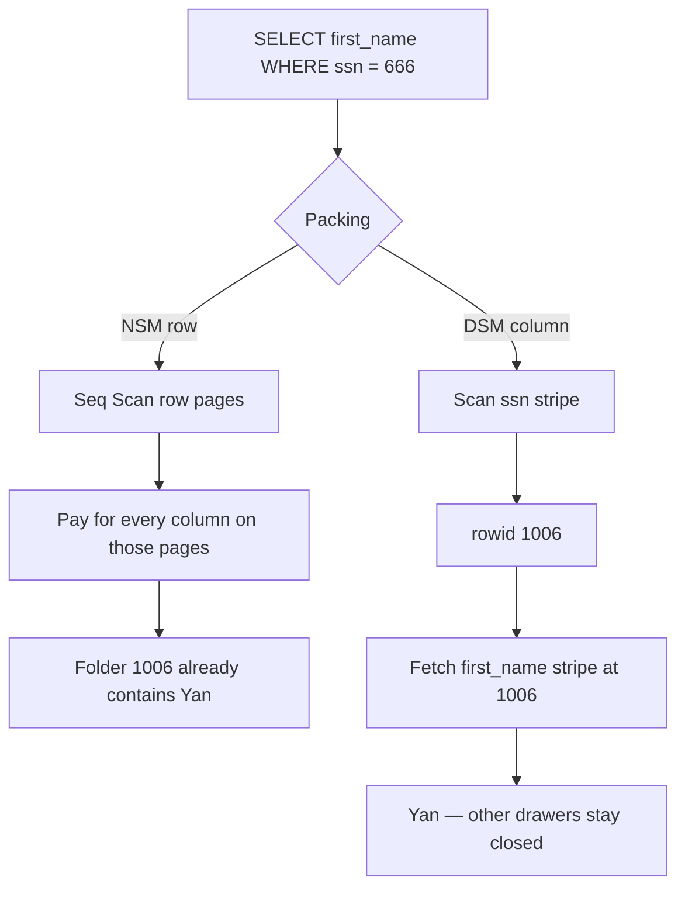
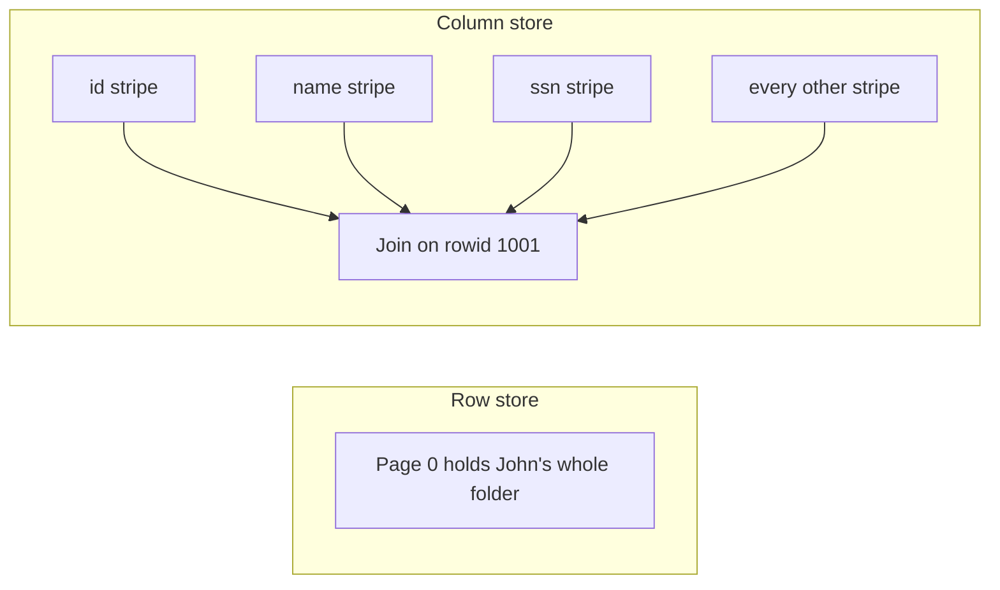
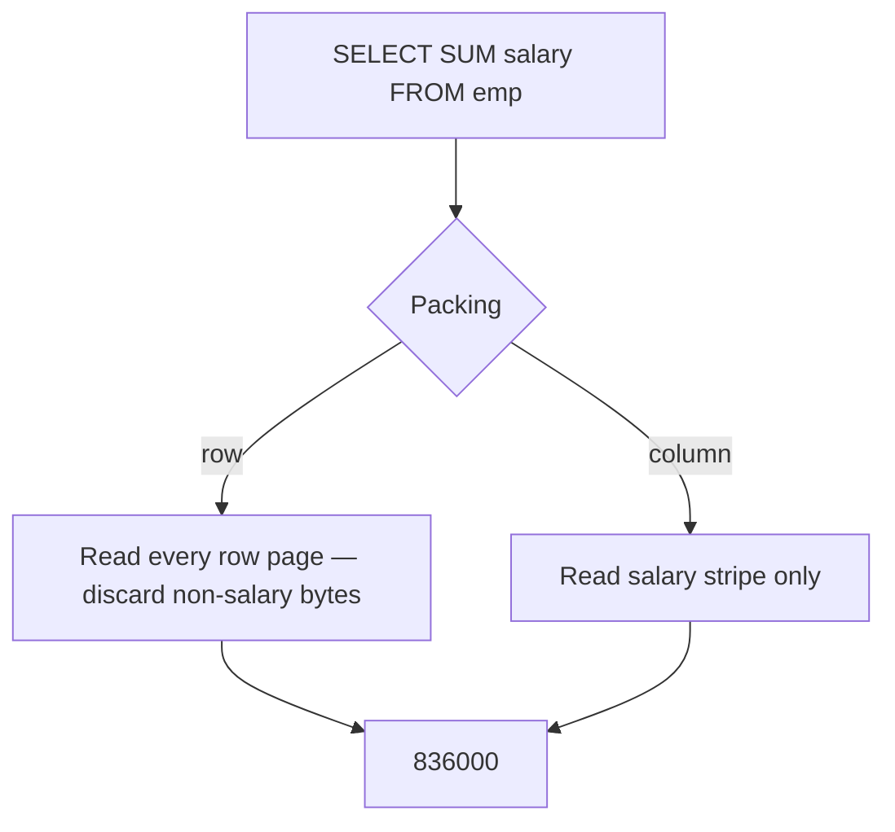
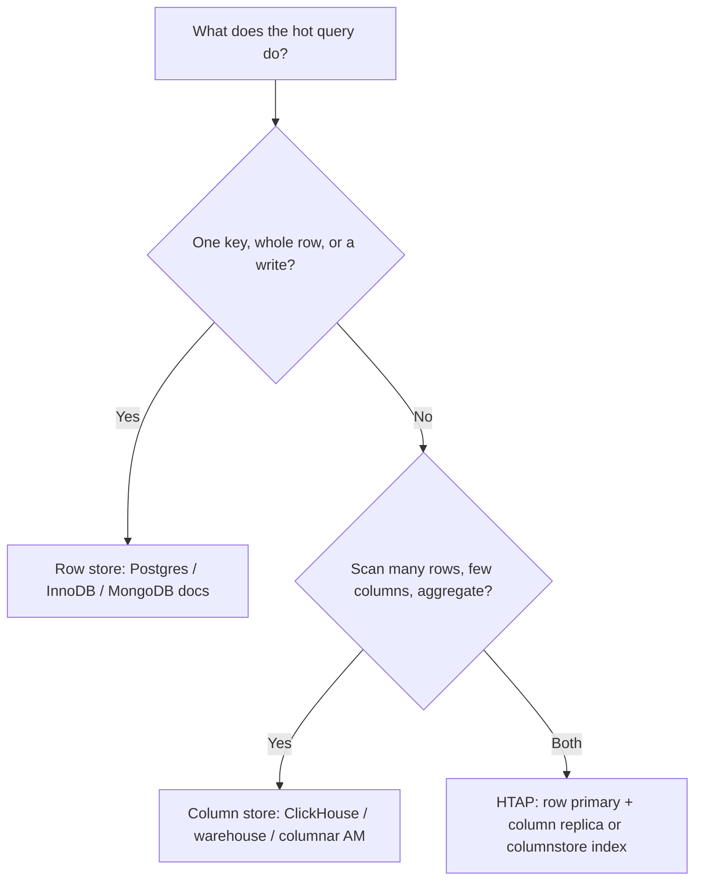
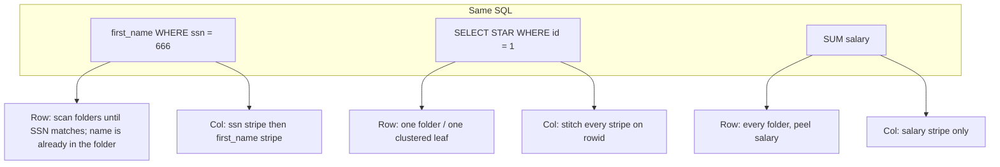
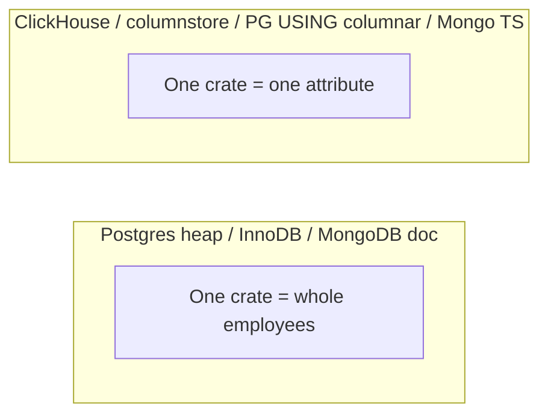

# Row-Based vs Column-Based Databases — Interview Notes (SQL, PostgreSQL, MongoDB)

> **Course:** Fundamentals of Database Engineering — Sec 3: Understanding the Database Internals  
> **Lecture:** Row-oriented vs column-oriented storage (OLTP vs OLAP)  
> **Goal:** After this note you can draw NSM vs DSM on disk, count IOs for the lecture’s three queries, pick a store from the workload, and name which engines are row, column, hybrid, or *wide-column-but-not-columnar* in a final-year CSE interview.

Lecture 17 asked *how a table is paged and indexed*. This lecture asks the next question: **what is packed inside each page?** Same forklift (IO). Different crate contents.

---

## 1. One-Minute Interview Definition

A logical table is still a grid of rows and columns. On disk it is **not** a spreadsheet. It is **bytes in pages**. The engine still never fetches “one cell from disk.” It fetches **one or more pages** in an **IO**.

The architectural fork is **how those bytes are packed**:

- **Row-oriented (row store, NSM — n-ary storage model):** one page holds **several complete rows**. One forklift trip returns John Smith’s name, SSN, salary, title — everything.
- **Column-oriented (column store, DSM — decomposition storage model):** one page holds **many values of one column**. One forklift trip returns a strip of salaries, or a strip of SSNs — not a person.

Neither is “faster.” **Point lookups and single-row writes** win on a row store (OLTP). **Scans and aggregations over a few columns of a wide table** win on a column store (OLAP). The same SQL, opposite winners.

Think of an **HR department**:

1. **Personnel file (row store).** One folder per employee. Name, SSN, salary, title, join date live together. Ask “give me John Smith’s full file” → lift **one** folder. Ask “what is the company payroll?” → open **every** folder, skip everything except the salary slip.
2. **Payroll drawers (column store).** One drawer of all salaries, one drawer of all names, one drawer of all SSNs. Ask “what is the company payroll?” → open **the salary drawer only**. Ask “give me John Smith’s full file” → walk **every** drawer and staple the slips that share his `rowid`.
3. The **forklift still lifts crates** (pages), exactly as in lecture 17. The crate is no longer “three whole employees.” In a column store it is “a few thousand salaries.”

PostgreSQL heap, MySQL InnoDB, and MongoDB regular collections are **row-shaped**. ClickHouse, Snowflake, Redshift, and Postgres *columnar table access methods* are **column-shaped**. MongoDB time series collections use an **internal columnar bucket format**. Cassandra is **not** a column store — that is the most common interview trap in this topic.

---

## 2. Sequential Thinking — Reconstruct the Layout

Use this order when an interviewer asks *“Row store vs column store — how do they work, and which one do I pick?”*

```
Step 1  → Same logical table (the spreadsheet the client sees)
Step 2  → Decide packing: NSM (row) vs DSM (column)
Step 3  → Page is still the IO unit (crate / forklift from lecture 17)
Step 4  → Row page: mixed types, whole tuples, cheap SELECT *
Step 5  → Column file/stripe: homogeneous values + rowid, cheap SUM(col)
Step 6  → Query A (ssn filter + first_name): row scan wastes columns; column store reads 2 files
Step 7  → Query B (SELECT * by id): row store wins; column store stitches every column
Step 8  → Query C (SUM salary): column store reads salary only
Step 9  → Writes: one heap page + WAL vs many column segments / delta + merge
Step 10 → Engine map: Postgres heap / InnoDB / MongoDB docs
           vs ClickHouse / SQL Server columnstore / MongoDB time series
```

### Analogy Mapping

| Real world (HR + warehouse) | Idea | Row store | Column store |
|-----------------------------|------|-----------|--------------|
| Spreadsheet of employees | Logical table | `emp` relation / collection | Same SQL / same schema |
| One personnel folder | Full tuple | Heap tuple / InnoDB PK leaf / BSON doc | Reconstruct by `rowid` from every column |
| One payroll drawer | One attribute across people | A column buried inside each folder | A file / stripe / segment of that column |
| Inventory sticker | Row identity | `ctid` / PK / RecordId | Same `rowid` stored (or implied) next to each value |
| Crate the forklift lifts | Page | 8 KB Postgres / 16 KB InnoDB / ~32 KB WT leaf — **mixed columns** | Column page / granule / stripe — **one type** |
| Forklift trip | IO | Shared buffers / buffer pool / WT cache | Same caches; you just touch fewer (or more) files |
| Open every folder for payroll | Full-table aggregation | Seq Scan / COLLSCAN of **all** row pages | Read **only** the salary stripe |
| Staple every slip for one person | `SELECT *` | One page already has the row | Open **every** column file, join on `rowid` |
| New hire paperwork | Single-row INSERT | Append one tuple to one page + WAL | Append (or buffer) into **each** column segment |

---

## 3. Storage Concepts — Working Principle In Depth

The lecture’s running example is this `emp` table. We use it for every later simulation. **No indexes** — the lecture wants you to see the *layout*, not the B-tree.

```text
rowid  id  first_name  last_name  ssn  salary    dob        title  joined
1001   1   John        Smith      111  101000    1/1/1991   eng    1/1/2011
1002   2   Kary        White      222  102000    2/2/1992   mgr    2/1/2012
1003   3   Norman      Freeman    333  103000    3/3/1993   mkt    3/1/2013
1004   4   Nole        Smith      444  104000    4/4/1994   adm    4/1/2014
1005   5   Dar         Sol        555  105000    5/5/1995   adm    5/1/2015
1006   6   Yan         Thee       666  106000    6/6/1996   mkt    6/1/2016
1007   7   Hasan       Ali        777  107000    7/7/1997   acc    7/1/2017
1008   8   Ali         Bilal      888  108000    8/8/1998   acc    8/1/2018
```

Toy IO model (same spirit as lecture 17): **3 full rows fit in a row-store page** → 8 rows occupy **3 pages** (page 0: rows 1001–1003, page 1: 1004–1006, page 2: 1007–1008). For the column store, **each column is its own stripe**; 8 values of one integer column fit in **1 page**. Nine attributes ⇒ **9 column pages**.

---

### 3.1 NSM — Row Store (N-ary Storage Model)

| Aspect | Explanation |
|--------|-------------|
| **Definition** | Store the **n attributes of a tuple together**, then the next tuple, then the next. A page is a crate of **whole people**. |
| **Analogy** | Personnel folders on a shelf. Lift one crate → you get three complete employee files. |
| **What the engine does** | PostgreSQL heap: insert a tuple into any page with free space (FSM). InnoDB: insert into the clustered PK B+tree leaf. MongoDB: insert a BSON document into the RecordId B-tree. All three are **row-shaped payloads**. |
| **Cost story** | Finding one person by scanning is `O(pages)`. Once you have the page, **every column is free**. `SELECT *` and `UPDATE salary` of one row are cheap. `SUM(salary)` is expensive: you pay for names, SSNs, dates you will throw away. |
| **Say this in an interview** | *"A row store packs the whole tuple into the page. One IO gives you all columns of a few rows. That is why OLTP — get the order, update the balance — lives here."* |

Lecture encoding of a row-store file (`|||` is a page boundary):

```text
Page 0
1001,1,John,Smith,111,101000,1/1/1991,eng,1/1/2011
1002,2,Kary,White,222,102000,2/2/1992,mgr,2/1/2012
1003,3,Norman,Freeman,333,103000,3/3/1993,mkt,3/1/2013
|||
Page 1
1004,4,Nole,Smith,444,104000,4/4/1994,adm,4/1/2014
1005,5,Dar,Sol,555,105000,5/5/1995,adm,5/1/2015
1006,6,Yan,Thee,666,106000,6/6/1996,mkt,6/1/2016
|||
Page 2
1007,7,Hasan,Ali,777,107000,7/7/1997,acc,7/1/2017
1008,8,Ali,Bilal,888,108000,8/8/1998,acc,8/1/2018
```

Academic name: **NSM** (n-ary storage model). “N-ary” means the record is stored as an n-field struct, not as n separate arrays.

```text
Row-store page (Postgres 8 KB heap page, simplified)

┌ PageHeader ┬ line pointers ┬ free ┬ tuple 1003 ┬ tuple 1002 ┬ tuple 1001 ┐
│            │ (3)(2)(1)     │      │ Norman…    │ Kary…      │ John…      │
└────────────┴───────────────┴──────┴────────────┴────────────┴────────────┘
     one crate = three whole folders
```

---

### 3.2 DSM — Column Store (Decomposition Storage Model)

| Aspect | Explanation |
|--------|-------------|
| **Definition** | Store **one attribute across many rows** together. Reconstruct a person by joining every column on `rowid`. |
| **Analogy** | Payroll drawers. The salary drawer is a long strip of numbers. John’s salary is the slip whose sticker says `1001`. |
| **What the engine does** | ClickHouse: one compressed file per column per sorted *part*. Postgres Hydra/Citus/pgColumnar: stripes of ~150k rows, chunks of ~10k, min/max per chunk. SQL Server columnstore: rowgroups of ~1M rows, each column a compressed segment, plus a **deltastore** for fresh inserts. Snowflake/BigQuery/Redshift: columnar files (often Parquet-like) in object storage. MongoDB time series: buckets that store metrics in a columnar layout internally. |
| **Cost story** | `SUM(salary)` reads **one** stripe. `SELECT first_name WHERE ssn = 666` reads **two** stripes (ssn, then first_name) and stitches on `rowid`. `SELECT *` reads **every** stripe — the column store’s worst query. |
| **Say this in an interview** | *"A column store packs one attribute’s values into the page. I/O scales with columns the query touches, not with table width. That is why OLAP — SUM, GROUP BY, dashboards on wide fact tables — lives here."* |

Lecture encoding (`value:rowid` vectors, one line per column):

```text
id         1:1001, 2:1002, 3:1003, 4:1004, 5:1005, 6:1006, 7:1007, 8:1008
first_name John:1001, Kary:1002, Norman:1003, Nole:1004, Dar:1005, Yan:1006, Hasan:1007, Ali:1008
last_name  Smith:1001, White:1002, Freeman:1003, Smith:1004, Sol:1005, Thee:1006, Ali:1007, Bilal:1008
ssn        111:1001, 222:1002, 333:1003, 444:1004, 555:1005, 666:1006, 777:1007, 888:1008
salary     101000:1001, 102000:1002, 103000:1003, 104000:1004, 105000:1005, 106000:1006, 107000:1007, 108000:1008
title      eng:1001, mgr:1002, mkt:1003, adm:1004, adm:1005, mkt:1006, acc:1007, acc:1008
… dob, joined the same way
```

Academic name: **DSM** (decomposition storage model). C-Store / MonetDB / Vertica popularized it for warehouses. Parquet and ORC are the **file-format** version of the same idea.

```text
Column-store stripes (one crate per attribute)

 id stripe          ssn stripe         salary stripe        first_name stripe
┌─────────────┐    ┌─────────────┐    ┌──────────────┐    ┌──────────────────┐
│ 1,2,3,4,…   │    │ 111,222,…   │    │ 101000,…     │    │ John,Kary,…      │
│ all rowids  │    │ all rowids  │    │ all rowids   │    │ all rowids       │
└─────────────┘    └─────────────┘    └──────────────┘    └──────────────────┘
     SUM(salary) lifts only the salary crate
```

**Late materialization:** keep columns separate as long as possible. Filter on `ssn`, then fetch `first_name` only for surviving `rowid`s, then — if the user asked `SELECT *` — fetch the rest. Do **not** rebuild full rows at the start of the scan.

---

### 3.3 The Page Is Still the IO Unit

Lecture 17’s rule does not change. Disk and filesystems operate on **blocks**. The database’s block is the **page** (or, in warehouses, a granule / stripe / rowgroup — same idea: you cannot IO one integer).

| Aspect | Row store | Column store |
|--------|-----------|--------------|
| What fills the page | Whole tuples, mixed types | Values of **one** type |
| Neighbors on the page | Other columns of the same people | Other **people’s** values of the same column |
| Locality that is “free” | Extra columns of those rows | Extra rows of that column |
| Wasted bytes on `SUM(salary)` | Names, SSNs, dates, titles | Almost none |
| Wasted bytes on `SELECT * WHERE id = 1` | The other 2 rows on the page (tiny) | Every other column’s pages |

**Say this in an interview:** *"We still optimize IOs. The question is which bytes share a page. Row store: columns of a row. Column store: rows of a column."*

---

### 3.4 Why Compression Loves Columns

| Aspect | Explanation |
|--------|-------------|
| **Definition** | Encode a byte stream with fewer bits by exploiting **repetition and predictability**. |
| **Analogy** | A drawer of only salaries is “101000, 102000, 103000…” — a sorted-ish list of numbers. A personnel folder is “John, 111, 101000, eng, 1/1/1991” — a jumble. The jumble does not compress. |
| **Codecs that fire on columns** | **Dictionary:** `eng, mgr, mkt, adm, acc` → 1-byte codes. **RLE:** `adm, adm` or a million `status = 'active'` → `(value, count)`. **Delta:** timestamps and sequential ids → store differences. **Gorilla / XOR:** floating metrics in time series. Stack them: dictionary then RLE on low-cardinality strings can hit **30×**. |
| **Why row pages stall** | An 8 KB heap page interleaves int32, text, date, numeric. LZ4/zlib find *some* byte-level redundancy. Typical ratio **1.5–3×**. Column stripes of one type, often sorted by the table’s order key, hit **5–10×** typical, more on low-cardinality. |
| **Cost story** | Compression is not a “nice extra.” It is **I/O reduction**. Reading 40 MB compressed is faster than reading 400 MB raw, even after CPU decode — analytics is I/O bound. The CPU then runs **vectorized** (SIMD) on decoded column batches. |
| **Say this in an interview** | *"Columns compress because neighbors share a type and often a value. Row pages mix types, so codecs stall. That is why warehouses are columnar even before you talk about ‘reading only three of fifty columns.’"* |

Zone maps / min-max / storage indexes sit on top: each chunk stores `min(salary)`, `max(salary)`. `WHERE salary > 1e9` **skips** the chunk without decompressing it. Row-store heap pages can do a weak version of this (Postgres BRIN); column stores do it by default.

---

### 3.5 I/O Math — 3 of 50 Columns

Take a 50-column fact table, 8 bytes per column on average, 1 million rows. Raw size ≈ **400 MB** (ignore headers).

A dashboard query that aggregates **3 columns** over all rows:

| Layout | Bytes read (before compression) | Intuition |
|--------|----------------------------------|-----------|
| Row store | ~400 MB (100%) | Every page holds the other 47 columns. Seq Scan has no choice. |
| Column store | ~24 MB (3/50 ≈ 6%) | Open three column files. Skip forty-seven. |

After columnar compression (say 8× on those numeric columns) the gap is often **50–100×**, not 16×. This is the Redshift / ClickHouse textbook calculation. **Access pattern beats data size:** 1 TB of PK lookups belongs in Postgres; 10 GB of `GROUP BY` dashboards belongs in a column store.

---

### 3.6 Writes — The Other Half of the Tradeoff

| Aspect | Row store | Column store |
|--------|-----------|--------------|
| **INSERT one employee** | Find a heap page with space (or append to PK leaf). One page dirty. One WAL record. | Touch **every** column file, or buffer into a **delta row store** and merge later. |
| **UPDATE salary of row 1001** | Rewrite that tuple (Postgres: new version + `ctid`; InnoDB: in-place or overflow). Other columns stay. | Rewrite the salary **segment** (thousands of other salaries ride along), or mark-delete + insert, or patch a delta. |
| **Bulk load 10M rows** | Possible, but each row maintains indexes + WAL. Thousands of rows/sec/node is typical for commit-heavy OLTP. | Append a compressed **part** / rowgroup. Millions of rows/sec/node on ClickHouse-class engines. |
| **Concurrency** | Thousands of point transactions/sec. MVCC on row versions. | Tens to thousands of **analytical** queries/sec. Single-row ACID is the weak spot. |

SQL Server’s clustered columnstore makes this concrete: new rows land in a **deltastore** (a hidden B-tree rowstore). When the delta grows (~1M rows), it compresses into a columnar rowgroup. Deletes are a bitmap of row IDs, not in-place edits. ClickHouse is the same idea with immutable **parts** and background merges.

**Say this in an interview:** *"A row store commits one folder. A column store either rewrites a whole drawer-segment or cheats with a small row-shaped delta and merges later. That is why OLTP writes stay in Postgres/InnoDB, and warehouses prefer append-mostly bulk loads."*

---

## 4. Simulation 1 — `SELECT first_name FROM emp WHERE ssn = 666`

Lecture query. **No index.** Find Yan (rowid 1006).

### 4.1 Row store

You must **see** `ssn` to test the predicate. `ssn` is buried inside each personnel folder, so you open folders until you hit 666. Pages 0 and 1 are read (Yan is on page 1). Page 2 is unread if you stop at the first match; a full scan of a heap still reads page 2 unless the engine can prove uniqueness. **Once the folder is open, `first_name` is already there.** You never open a second structure.

```text
IO1  page 0  John 111, Kary 222, Norman 333   → miss
IO2  page 1  Nole 444, Dar 555, Yan 666       → hit, first_name = Yan
     (page 2 unread only if we stop; heap Seq Scan usually reads all 3)
Bytes paid: names, last names, salaries, dates, titles you did not ask for
```

### 4.2 Column store

Open the **ssn drawer**. Scan `111,222,…,666` → `rowid 1006`. Open the **first_name drawer**, pick the slip labeled 1006 → `Yan`. Two column IOs. Last names, salaries, titles **never leave disk**.

```text
IO1  ssn stripe        → 666:1006
IO2  first_name stripe → Yan:1006
```

### 4.3 Who wins?

**Column store**, unless the table is tiny (both fit in one page anyway) or you have a B-tree on `ssn` (then *both* become point lookups — lecture 17 — and the row store fetches one heap page with the full row). The lecture’s point is the **scan with no index**.



---

## 5. Simulation 2 — `SELECT * FROM emp WHERE id = 1`

Lecture query. Full personnel file for John.

### 5.1 Row store

John is on **page 0**. One IO (or a few if you seq-scan without stopping). The crate **is** the answer: all nine attributes in the tuple.

This is the row store’s home ground — **OLTP point read**. With a PK/index on `id` (lecture 17), it is one index walk + one heap/leaf page. Without an index, you may scan until `id = 1`, but you still only **materialize** one folder.

### 5.2 Column store

`id` stripe → `1:1001`. Then you must open **first_name, last_name, ssn, salary, dob, title, joined** (and rowid if stored separately) and staple slips labeled 1001. **Nine column IOs** in the toy model. On a 200-column warehouse table this is brutal.

Engines try to help (skip compressed segments via min/max on `id`, vectorized stitch). The physics does not change: **`SELECT *` is the column store’s worst query.**



**Who wins?** **Row store.** Say this out loud: *the query that needs the whole person wants the person packed together.*

---

## 6. Simulation 3 — `SELECT SUM(salary) FROM emp`

Lecture query. Payroll total. No `WHERE`.

### 6.1 Row store

Every page, every folder, peel out salary, add, throw the rest away. **3 page IOs** in the toy model; **all 334 pages** in lecture 17’s 1001-row heap. At 50 columns and a billion rows this is the dashboard that times out on Postgres.

### 6.2 Column store

Lift the **salary crate only**. Add 101000+…+108000. **1 page IO** in the toy model. On a real engine: one compressed column file, SIMD addition on batches of 8/16/32 values, zone maps unused because there is no filter — still orders of magnitude less I/O than NSM.

```text
Row:   SUM  ←  page0[John…Kary…Norman] + page1[Nole…Dar…Yan] + page2[Hasan…Ali]
Column: SUM  ←  [101000, 102000, 103000, 104000, 105000, 106000, 107000, 108000]
```

**Who wins?** **Column store**, and this is the query you should quote first in an interview. Aggregation over one (or a few) columns **is** OLAP.



**Same SQL, opposite winners.** That sentence is the lecture.

| Query | Row store | Column store | Winner |
|-------|-----------|--------------|--------|
| `first_name WHERE ssn = 666` | Scan row pages (waste columns) | 2 column stripes | Column (no index) |
| `SELECT * WHERE id = 1` | 1 row page | All column stripes | **Row** |
| `SUM(salary)` | All row pages | 1 salary stripe | **Column** |

---

## 7. Pros, Cons, and the Decision Rule

Lecture slide 17, expanded.

### 7.1 Row-based

**Pros**

- Optimal for **read-modify-write of one row** (checkout, like, transfer).
- **`SELECT *` and wide projections** are cheap once the row is found.
- High **concurrency**; MVCC/locking at row granularity.
- Indexes (lecture 17) turn point queries into a handful of IOs.
- Compression is “fine,” not the product.

**Cons**

- **Aggregation** over one column still reads the whole tuple width.
- **Compression** is weak (mixed types on the page).
- Wide tables (50–400 columns) make every Seq Scan a memory-bandwidth tax.
- Analytics on the OLTP primary is how you take production down.

### 7.2 Column-based

**Pros**

- **Amazing for aggregation**, `GROUP BY`, time windows, dashboards.
- **Compresses greatly** (dictionary / RLE / delta); storage and I/O drop together.
- I/O scales with **columns touched**, not table width.
- Vectorized execution maps cleanly onto SIMD.
- Chunk min/max skipping.

**Cons**

- **Writes are slower** (segment rewrite or delta+merge). Point `UPDATE`/`DELETE` hurt.
- **`SELECT *` and wide joins** that need many columns pay many files.
- Point lookup of one person **stitches** columns; often 10–100× slower than a B-tree + heap (pgColumnar-style AMs have shown ~200× slower UUID point lookups vs heap).
- Bulk insert is the happy path; streaming one-row-at-a-time is not.
- Some SQL features lag (FKs, logical replication, tuple locks on Postgres columnar AMs).

### 7.3 When to choose which

Pick **row** when:

- Dominant shape is **point lookup** by key (`GET /users/42`, `SELECT * FROM orders WHERE id = …`).
- **Single-row INSERT/UPDATE/DELETE** is steady-state, not an exception.
- You need **row-level ACID** (ledgers, inventory, bookings).
- Concurrency is **thousands of small transactions/sec**.
- Tables are **narrow**, or queries usually need **most** columns.

Pick **column** when:

- Queries scan **millions of rows** and touch a **handful** of columns.
- **`SUM` / `AVG` / `COUNT` / `GROUP BY`** dominate the read path.
- Data is **append-mostly** (events, facts, metrics, logs).
- **Storage cost** at TB+ scale matters.
- You can tolerate seconds of freshness (or you run a delta/HTAP pipeline).

**Decision in one line:** *access pattern, not data size.* A 1 TB user table with PK lookups stays in Postgres. A 10 GB events table with `GROUP BY day` belongs in a column store (or a columnar replica).



---

## 8. Which Databases Use Which

Four buckets. Mixing them is the interview.

### 8.1 Row / NSM — OLTP defaults

| Engine | Why it is a row store |
|--------|------------------------|
| **PostgreSQL** (`USING heap`, the default) | Heap pages of full tuples. `default_table_access_method = heap`. |
| **MySQL / MariaDB InnoDB** | Clustered PK B+tree **leaves hold the full row**. |
| **SQLite** | B-tree of complete records. |
| **Oracle** (default table) | Row pieces in blocks; classic OLTP. |
| **SQL Server rowstore** | Heap or clustered B-tree of rows. |
| **MongoDB regular collections** | Each document is a **BSON blob** (all fields together) in WiredTiger `BTREE_ROW`. |

### 8.2 Column / DSM — OLAP defaults

| Engine | Why it is a column store |
|--------|---------------------------|
| **ClickHouse** | MergeTree: one compressed file per column per part; sparse PK; vectorized. |
| **DuckDB** | In-process analytics; columnar vectors; reads Parquet natively. |
| **Snowflake / BigQuery / Amazon Redshift** | Cloud warehouses; columnar micro-partitions / blocks; massively parallel scans. |
| **Vertica / MonetDB** | Classic C-Store descendants. |
| **Apache Parquet / ORC** | **File formats**, not databases — but they **are** DSM on disk. Spark/Hive/DuckDB/BigQuery all scan them column-wise. |

### 8.3 Hybrid / HTAP — both layouts on purpose

| Engine | Pattern |
|--------|---------|
| **SQL Server** | Clustered **columnstore** = the table *is* columnar. Nonclustered columnstore = extra columnar index on a **rowstore** table (real-time analytics). Deltastore absorbs fresh rows. |
| **Oracle In-Memory** | Dual format: row in the buffer cache **and** in-memory columnar units (IMCU). |
| **MySQL HeatWave** | InnoDB row primary + distributed in-memory **columnar** accelerator for analytics. |
| **SAP HANA / TiDB / PolarDB-X** | Row for TP, column replica or CCI for AP. |
| **PostgreSQL table AM** | `CREATE TABLE … USING columnar` (Hydra, Citus columnar, pgColumnar). Not in **vanilla** Postgres. Timescale **compresses** old chunks into a column-major layout. |
| **MongoDB time series** (5.0+) | Writable view over an internal collection that stores measurements in a **columnar bucket** format (zstd by default). |

HTAP in one breath: *a row store for the truth of now, a column store for the questions about many rows, plus a pipeline (delta merge, log replica, or dual-write) that keeps them close enough.* Hybrids rarely beat a specialist at either extreme.

### 8.4 Wide-column — the naming trap

**Cassandra, HBase, Bigtable, ScyllaDB are not column-oriented analytics engines.**

They are **sparse row stores**. A partition key picks a node; clustering columns sort rows **inside** that partition; each row may have different cells (hence “wide”). Writes are LSM appends. Reads are “give me this partition / this key.” That is **OLTP-shaped key-value**, not `SUM(salary) GROUP BY title` over a billion rows.

| | Wide-column (Cassandra) | True columnar (ClickHouse) |
|--|-------------------------|----------------------------|
| On disk | Rows (possibly wide, sparse) in SSTables | One file per **attribute** |
| Fast path | Point / slice by partition key | Scan / aggregate few columns |
| Slow path | `ALLOW FILTERING` aggregations | Single-row `SELECT *` |
| Cousin | MongoDB / Dynamo-style KV | Parquet / Redshift |

**Say this in an interview:** *"Wide-column means flexible columns per row. Column-oriented means values of one column stored together. Cassandra is the first. ClickHouse is the second. I will not mix them."*

### 8.5 Second trap — WiredTiger “column-store”

WiredTiger (MongoDB’s engine) has a file format literally named **column-store** (`BTREE_COL_VAR` / `BTREE_COL_FIX`). That format means: keys are **implied record numbers**, values may use RLE. It is a **recno table**, not “each BSON field in its own file.” MongoDB collections use **row-store** (`BTREE_ROW`): explicit keys, BSON values. Do not cite WiredTiger column-store as evidence that MongoDB is an OLAP columnar database.

---

## 9. PostgreSQL — Heap Is Row; Columnar Is Opt-In

Vanilla PostgreSQL is a **row store**. Every `CREATE TABLE` without `USING` gets the **heap** table access method (`default_table_access_method = heap` since PG 12). Heap pages are NSM: full tuples, `ctid`, TOAST for wide values — lecture 17.

Postgres *can* speak DSM because **table access methods are pluggable** (PG 12+). Hydra, Citus Columnar, and pgColumnar register an AM named `columnar`. That is an **extension**, not `CREATE TABLE` in stock PostgreSQL.

### 9.1 Row store — heap (what you actually run)

```sql
-- Default: USING heap  (you may omit it)
CREATE TABLE emp (
  rowid       int PRIMARY KEY,
  id          int NOT NULL,
  first_name  text NOT NULL,
  last_name   text NOT NULL,
  ssn         int  NOT NULL,
  salary      numeric(12,2) NOT NULL,
  dob         date NOT NULL,
  title       text NOT NULL,
  joined      date NOT NULL
);  -- USING heap

INSERT INTO emp VALUES
  (1001, 1, 'John',   'Smith',   111, 101000, '1991-01-01', 'eng', '2011-01-01'),
  (1002, 2, 'Kary',   'White',   222, 102000, '1992-02-02', 'mgr', '2012-02-01'),
  (1003, 3, 'Norman', 'Freeman', 333, 103000, '1993-03-03', 'mkt', '2013-03-01'),
  (1004, 4, 'Nole',   'Smith',   444, 104000, '1994-04-04', 'adm', '2014-04-01'),
  (1005, 5, 'Dar',    'Sol',     555, 105000, '1995-05-05', 'adm', '2015-05-01'),
  (1006, 6, 'Yan',    'Thee',    666, 106000, '1996-06-06', 'mkt', '2016-06-01'),
  (1007, 7, 'Hasan',  'Ali',     777, 107000, '1997-07-07', 'acc', '2017-07-01'),
  (1008, 8, 'Ali',    'Bilal',   888, 108000, '1998-08-08', 'acc', '2018-08-01');

-- Prove it is heap, and that a tuple is a whole row on one page
SELECT c.relname,
       a.amname AS access_method,          -- 'heap'
       pg_size_pretty(pg_relation_size('emp')) AS heap_bytes
FROM pg_class c
JOIN pg_am a ON a.oid = c.relam
WHERE c.relname = 'emp';

SELECT ctid, id, first_name, ssn, salary FROM emp;
-- ctid (0,1) (0,2) (0,3) …  →  same page = same crate of whole folders
```

The three lecture queries on heap — **Seq Scan**, because we built no index on `ssn` / `id`:

```sql
EXPLAIN (ANALYZE, BUFFERS)
SELECT first_name FROM emp WHERE ssn = 666;
-- Seq Scan on emp  (rows=1)
-- Buffers: shared hit/read = all heap pages
-- Filter: (ssn = 666)  ← CPU peels ssn out of each tuple

EXPLAIN (ANALYZE, BUFFERS)
SELECT * FROM emp WHERE id = 1;
-- Seq Scan (or Index Scan if PK on id is used — PRIMARY KEY made a B-tree)
-- Either way the *payload* is a full heap tuple. One page has every column.

EXPLAIN (ANALYZE, BUFFERS)
SELECT SUM(salary) FROM emp;
-- Aggregate  ←  Seq Scan on emp
-- Reads every heap page. first_name/ssn/title ride along unused.
```

Drop the PK if you want the lecture’s “no index” id lookup to Seq Scan; keep it if you want to show “row store + index = OLTP.”

```sql
-- Covering index is NOT a column store.
-- It is still NSM: a second B-tree of (ssn, first_name) → ctid.
-- Great for Query A; useless as a warehouse.
CREATE INDEX emp_ssn_name ON emp (ssn) INCLUDE (first_name);

EXPLAIN (ANALYZE, BUFFERS)
SELECT first_name FROM emp WHERE ssn = 666;
-- Index Only Scan  (visibility map permitting)
```

**Say this in an interview:** *"A covering index duplicates a few columns in a B-tree. A column store stores every column as its own compressed array. I will not call an INCLUDE index a column store."*

### 9.2 Column store — table access method (extension)

Stock PostgreSQL **cannot** run this without Hydra / Citus Columnar / pgColumnar installed. On those builds:

```sql
SHOW default_table_access_method;   -- heap  (vanilla)
-- Hydra cloud default DB may be 'columnar'; new DBs are still heap.

CREATE TABLE emp_row (
  id int, first_name text, ssn int, salary numeric, title text
) USING heap;

CREATE TABLE emp_col (
  id int, first_name text, ssn int, salary numeric, title text
) USING columnar;

INSERT INTO emp_col SELECT * FROM emp_row;   -- bulk: builds compressed stripes

EXPLAIN (ANALYZE, BUFFERS)
SELECT SUM(salary) FROM emp_col;
-- Custom Scan (ColumnarScan)  — reads salary chunk(s), not whole tuples

EXPLAIN (ANALYZE, BUFFERS)
SELECT * FROM emp_col WHERE id = 1;
-- Still a scan of columnar stripes + stitch. Point lookup is the slow path.

-- Hot/cold hybrid: today's rows in heap, last year in columnar partitions
CREATE TABLE emp_part (id int, salary numeric, joined date) PARTITION BY RANGE (joined);
CREATE TABLE emp_hot  PARTITION OF emp_part FOR VALUES FROM ('2026-01-01') TO ('2027-01-01') USING heap;
CREATE TABLE emp_cold PARTITION OF emp_part FOR VALUES FROM ('2024-01-01') TO ('2026-01-01') USING columnar;
```

What to remember about Postgres columnar AMs:

- Stripes (~150k rows) → chunks (~10k) with **min/max/count** per column (Hydra docs).
- **Bulk INSERT** builds efficient stripes; one-row inserts create tiny stripes — `VACUUM`/compact later.
- Indexes are often **unnecessary** and can make analytics **slower**.
- Common gaps: **no foreign keys**, **no logical replication**, limited tuple locks. Do not put your ledger here.
- pgColumnar-class benchmarks: narrow `GROUP BY` faster than heap; **indexed UUID point lookup ~200× slower**. That number is the NSM vs DSM tradeoff in one measurement.

TimescaleDB is the other Postgres-shaped answer: **row chunks while hot**, then a compression policy rewrites old chunks into **column-major** form (delta-of-delta, Gorilla, dictionary). Same decision rule: OLTP-ish recent data, OLAP-ish history.

```sql
-- Timescale: conceptual — extension required
SELECT add_compression_policy('sensor_hypertable', INTERVAL '7 days');
```

---

## 10. SQL (InnoDB) — Row Store, Plus a Hybrid Sidebar

### 10.1 MySQL InnoDB is NSM

The table **is** the clustered primary-key B+tree. A leaf holds the **full row** (lecture 17). Secondary indexes store `key → PK`. There is no column-per-file layout.

```sql
CREATE TABLE emp (
  rowid       INT NOT NULL,
  id          INT NOT NULL,
  first_name  VARCHAR(32) NOT NULL,
  last_name   VARCHAR(32) NOT NULL,
  ssn         INT NOT NULL,
  salary      DECIMAL(12,2) NOT NULL,
  dob         DATE NOT NULL,
  title       VARCHAR(16) NOT NULL,
  joined      DATE NOT NULL,
  PRIMARY KEY (id),
  KEY idx_ssn (ssn)
) ENGINE=InnoDB;

INSERT INTO emp VALUES
  (1001, 1, 'John',   'Smith',   111, 101000, '1991-01-01', 'eng', '2011-01-01'),
  (1002, 2, 'Kary',   'White',   222, 102000, '1992-02-02', 'mgr', '2012-02-01'),
  (1003, 3, 'Norman', 'Freeman', 333, 103000, '1993-03-03', 'mkt', '2013-03-01'),
  (1004, 4, 'Nole',   'Smith',   444, 104000, '1994-04-04', 'adm', '2014-04-01'),
  (1005, 5, 'Dar',    'Sol',     555, 105000, '1995-05-05', 'adm', '2015-05-01'),
  (1006, 6, 'Yan',    'Thee',    666, 106000, '1996-06-06', 'mkt', '2016-06-01'),
  (1007, 7, 'Hasan',  'Ali',     777, 107000, '1997-07-07', 'acc', '2017-07-01'),
  (1008, 8, 'Ali',    'Bilal',   888, 108000, '1998-08-08', 'acc', '2018-08-01');

-- Query B: PK → clustered leaf already has SELECT *
EXPLAIN
SELECT * FROM emp WHERE id = 1;
-- type: const  key: PRIMARY  — one B+tree walk, full row in the leaf

-- Query A: secondary idx_ssn → PK → clustered leaf (then first_name)
EXPLAIN
SELECT first_name FROM emp WHERE ssn = 666;
-- type: ref  key: idx_ssn  Extra: Using index  (if covering) or lookup PK

-- Query C: must visit every clustered leaf — all columns ride along
EXPLAIN
SELECT SUM(salary) FROM emp;
-- type: ALL  or index scan of PRIMARY  — still NSM, still payroll-by-opening-every-folder
```

HeatWave (Oracle MySQL Cloud) does **not** turn InnoDB into a column store. It **offloads** analytical queries to a separate in-memory columnar cluster. InnoDB remains the row system of record.

### 10.2 T-SQL sidebar — SQL Server columnstore (not MySQL)

SQL Server is the textbook **hybrid**. Do not paste this into MySQL.

```sql
-- Clustered columnstore: the table's *primary* storage is DSM (warehouse fact table)
CREATE TABLE emp_fact (
  id int NOT NULL,
  first_name varchar(32),
  ssn int,
  salary decimal(12,2),
  title varchar(16),
  joined date
);
CREATE CLUSTERED COLUMNSTORE INDEX cci_emp_fact ON emp_fact;
-- Inserts land in a deltastore (row B-tree), then compress into ~1M-row groups.

-- HTAP: keep OLTP as rowstore, add a nonclustered columnstore for dashboards
CREATE TABLE emp_oltp (
  id int NOT NULL PRIMARY KEY CLUSTERED,
  first_name varchar(32),
  ssn int,
  salary decimal(12,2),
  title varchar(16)
);
CREATE NONCLUSTERED COLUMNSTORE INDEX ncci_emp ON emp_oltp
  (id, salary, title);   -- analytics on salary/title without leaving the OLTP table
```

Microsoft’s own guidance: rowstore for **seeks**; columnstore for **scans** of large fact tables. Same lecture.

---

## 11. MongoDB — Documents Are Rows; Time Series Is Columnar

### 11.1 Regular collection = row-shaped BSON

A document is a **personnel folder**: all fields in one BSON blob. WiredTiger stores that blob as the **value** in a `BTREE_ROW` keyed by RecordId. A `COLLSCAN` reads **whole documents** even if you only need `salary`. Projection happens **after** the document is in cache — it does not turn MongoDB into ClickHouse.

```javascript
db.emp.drop();
db.emp.insertMany([
  { rowid: 1001, id: 1, first_name: "John",   last_name: "Smith",   ssn: 111, salary: 101000, title: "eng" },
  { rowid: 1002, id: 2, first_name: "Kary",   last_name: "White",   ssn: 222, salary: 102000, title: "mgr" },
  { rowid: 1003, id: 3, first_name: "Norman", last_name: "Freeman", ssn: 333, salary: 103000, title: "mkt" },
  { rowid: 1004, id: 4, first_name: "Nole",   last_name: "Smith",   ssn: 444, salary: 104000, title: "adm" },
  { rowid: 1005, id: 5, first_name: "Dar",    last_name: "Sol",     ssn: 555, salary: 105000, title: "adm" },
  { rowid: 1006, id: 6, first_name: "Yan",    last_name: "Thee",    ssn: 666, salary: 106000, title: "mkt" },
  { rowid: 1007, id: 7, first_name: "Hasan",  last_name: "Ali",     ssn: 777, salary: 107000, title: "acc" },
  { rowid: 1008, id: 8, first_name: "Ali",    last_name: "Bilal",   ssn: 888, salary: 108000, title: "acc" }
]);

// Query A — COLLSCAN reads full documents, then projects first_name
db.emp.find({ ssn: 666 }, { first_name: 1, _id: 0 }).explain("executionStats");
// winningPlan.stage: COLLSCAN   docsExamined: 8   nReturned: 1

db.emp.createIndex({ ssn: 1 });
db.emp.find({ ssn: 666 }, { first_name: 1, _id: 0 }).explain("executionStats");
// IXSCAN + FETCH  — FETCH still loads the whole BSON folder (unless covered)

// Query B — whole folder is the native unit
db.emp.find({ id: 1 }).explain("executionStats");

// Query C — still examines full documents; $sum does not skip other fields on disk
db.emp.aggregate([
  { $group: { _id: null, payroll: { $sum: "$salary" } } }
]).explain("executionStats");
// docsExamined: 8  — payroll-by-opening-every-folder
```

A **covered** index (`{ ssn: 1, first_name: 1 }`) can avoid FETCH for Query A. That is lecture 17’s covering index, **not** a column store.

### 11.2 Time series collections = columnar buckets (MongoDB 5.0+)

Official docs: time series collections use an **underlying columnar storage format**, store data in time order, reduce disk and I/O, and improve WiredTiger cache use. Default compression is **zstd** (regular collections default to **snappy**). MongoDB treats them as writable **non-materialized views** over an internal bucket collection.

This is MongoDB’s honest DSM-ish path — **for time-stamped measurements**, not for `emp` HR files.

```javascript
db.createCollection("weather", {
  timeseries: {
    timeField: "timestamp",
    metaField: "sensor",
    granularity: "seconds"
  }
  // MongoDB 6.3+: bucketMaxSpanSeconds / bucketRoundingSeconds instead of granularity
});

db.weather.insertMany([
  {
    timestamp: ISODate("2026-08-19T12:00:00Z"),
    sensor: { id: "A1234", city: "New York" },
    temperature: 25.4,
    humidity: 48.2,
    pressure: 1012.5
  },
  {
    timestamp: ISODate("2026-08-19T12:00:10Z"),
    sensor: { id: "A1234", city: "New York" },
    temperature: 25.5,
    humidity: 48.0,
    pressure: 1012.4
  }
]);

// Analytics-shaped: one metric across time — this is why the bucket is columnar
db.weather.aggregate([
  { $match: { "sensor.id": "A1234" } },
  { $group: {
      _id: { $dateTrunc: { date: "$timestamp", unit: "hour" } },
      avgTemp: { $avg: "$temperature" }
  } }
]);
```

Limits that prove it is not a general column store: unordered / non-time data does not belong here; updates are restricted (often **metaField only**); you drop time series collections before some downgrades.

**Say this in an interview:** *"MongoDB documents are row-oriented. Time series is the exception: measurements are bucketed in a columnar layout so AVG(temperature) does not drag every other field the way a COLLSCAN on a regular collection would."*

---

## 12. Side-by-Side — The Lecture’s Three Queries





---

## 13. How to Use This in an Interview

### 60-Second Spoken Answer

> *"The logical table is the same. The difference is packing. A row store — Postgres heap, InnoDB, MongoDB documents — writes the whole tuple into a page. One IO returns a few complete rows. That is OLTP: get the user, update the order, SELECT star. Compression is weak because types are mixed.*
>
> *A column store — ClickHouse, Redshift, Snowflake, SQL Server columnstore, Postgres USING columnar — writes one column’s values together. One IO returns thousands of salaries. SUM, GROUP BY, and dashboards on wide fact tables read only the columns they need and compress 5 to 10 times better. SELECT star and single-row updates are the expensive path; writes often go through a delta and merge.*
>
> *The three lecture queries with no index: filter plus one projected column favors columns; SELECT star by id favors rows; SUM of one column favors columns. I pick the store from the query shape, not from the data size. And Cassandra is wide-column, not columnar — that is a sparse row store."*

### If They Go Deeper — Answer Ladder

| Question | Answer direction |
|----------|------------------|
| *"What are NSM and DSM?"* | NSM = n-ary storage: n fields of a tuple stored together (row). DSM = decomposition: each attribute is its own array, stitched by rowid (column). |
| *"Why can’t we just IO one column of one row?"* | Disk/OS/DB still move **pages**. The win is **who your neighbors are** on that page. |
| *"Why do columns compress?"* | Homogeneous type + runs of similar values → dictionary, RLE, delta. Row pages interleave types. Quote **1.5–3× vs 5–10×** (up to ~30× low-cardinality). |
| *"3 of 50 columns?"* | Row scan reads ~100% of bytes. Column scan reads ~6% before compression. That is the warehouse argument. |
| *"Is a covering index a column store?"* | No. It is a second B-tree of a few columns. A column store is the **primary** (or replica) layout of **all** attributes as arrays. |
| *"Is Postgres a column store?"* | **Heap is row.** Columnar is a **table access method** from extensions (Hydra, Citus, pgColumnar) or Timescale compressed chunks. Vanilla `CREATE TABLE` is NSM. |
| *"Is MongoDB a column store?"* | Regular collections: **document/row**. Time series: **columnar buckets**. WiredTiger’s “column-store” format is recno keys — not OLAP. |
| *"Cassandra vs ClickHouse?"* | Cassandra: partition-key OLTP, sparse wide **rows**. ClickHouse: compressed **columns**, vectorized aggregations. Naming overlap only. |
| *"Why are column writes slow?"* | A salary update sits in a segment with thousands of other salaries (rewrite) or in a **deltastore** that must merge. Row update dirties one tuple page. |
| *"What is HTAP?"* | Keep a row system of record and a column replica/index (SQL Server NCCI, Oracle In-Memory, HeatWave, dual-write to ClickHouse). Freshness vs isolation is the product. |
| *"Vectorized execution?"* | Process **batches** of one column (SIMD) instead of one row at a time (tuple-at-a-time volcano). Natural twin of DSM. |
| *"Late materialization?"* | Filter and aggregate on raw columns; build full rows only for the survivors. Avoids stitching 50 columns for rows you will discard. |
| *"PAX / hybrid page?"* | Some systems pack **columnar mini-pages inside a row page** (PAX). Interview bonus; the industry split is still NSM vs DSM files. |

### Common Mistakes (avoid these)

1. **“Column store is always faster.”** On `SELECT * WHERE id = 1` it is slower. Quote the lecture.
2. **“Cassandra is a column store like ClickHouse.”** Wide-column ≠ columnar.
3. **“Postgres/MongoDB are columnar.”** Heap and BSON are row-shaped. Columnar is opt-in (AM / time series).
4. **“WiredTiger column-store means MongoDB is OLAP columnar.”** Recno B-tree, not per-field files.
5. **“An index makes a row store a column store.”** Indexes are pointers (lecture 17). Layout is packing.
6. **“Just run analytics on the OLTP primary.”** Seq Scan of NSM at warehouse volume is how you page out the buffer pool.
7. **“Column stores are bad at writes, so they cannot ingest fast.”** They are bad at **single-row** writes. They are excellent at **bulk append**.
8. **“More columns on a row page is free for SUM.”** Extra columns are free for `SELECT *`, expensive for aggregation.

---

## 14. Cheat Sheet (Glance Before the Interview)

1. **Same table, different packing.** NSM = whole tuples on a page. DSM = one column’s values on a page.
2. **IO unit is still the page.** Neighbors change: extra columns vs extra rows.
3. **Lecture Query A** (`first_name WHERE ssn = 666`, no index): column reads 2 stripes; row scans folders.
4. **Lecture Query B** (`SELECT * WHERE id = 1`): **row wins** — the folder *is* the answer.
5. **Lecture Query C** (`SUM(salary)`): **column wins** — open the salary drawer only.
6. **OLTP → row. OLAP → column.** Access pattern beats data size.
7. **Compression:** row ~1.5–3×; column ~5–10× (30× low-cardinality) because types are homogeneous.
8. **3-of-50-col scan:** ~100% vs ~6% of bytes before compression.
9. **Writes:** row = one page + WAL. Column = segment rewrite or delta+merge. Bulk append favors columns.
10. **Postgres = heap (row).** `USING columnar` is an extension AM. Timescale compresses old chunks column-major.
11. **InnoDB = clustered row.** SQL Server **columnstore** is the hybrid to name. MongoDB **docs = row**; **time series = columnar buckets**.
12. **Traps:** Cassandra wide-column; WiredTiger recno “column-store”; covering index ≠ column store.
13. **HR analogy:** personnel folder vs payroll drawer. Forklift still lifts crates.
14. **Prove it:** `EXPLAIN (ANALYZE, BUFFERS)` / `explain("executionStats")` — Seq Scan of tuples vs ColumnarScan / COLLSCAN of documents vs time-series bucket read.

---

## 15. Sources

- Lecture PDF: *Row-Based vs Column-Based Databases* (Hussein Nasser, Fundamentals of Database Engineering, Sec 3)
- Previous note: [17-How-tables-and-indexes-are-stored-in-a-disk.md](17-How-tables-and-indexes-are-stored-in-a-disk.md) (pages, IO, heap, indexes)
- [PostgreSQL: Database Page Layout](https://www.postgresql.org/docs/current/storage-page-layout.html)
- [PostgreSQL: Table Access Method Interface](https://www.postgresql.org/docs/current/tableam.html)
- [PostgreSQL: TOAST](https://www.postgresql.org/docs/current/storage-toast.html)
- [PostgreSQL: `default_table_access_method`](https://www.postgresql.org/docs/current/runtime-config-client.html#GUC-DEFAULT-TABLE-ACCESS-METHOD)
- [Hydra: row vs column tables](https://github.com/hydradatabase/docs/blob/main/columnar/organize/data-modeling/row-vs-column-tables.md)
- [MySQL: InnoDB Clustered and Secondary Indexes](https://dev.mysql.com/doc/refman/8.4/en/innodb-index-types.html)
- [SQL Server: Columnstore indexes overview](https://learn.microsoft.com/en-us/sql/relational-databases/indexes/columnstore-indexes-overview)
- [MongoDB: Time Series Collections](https://www.mongodb.com/docs/manual/core/timeseries-collections/)
- [MongoDB: WiredTiger Storage Engine](https://www.mongodb.com/docs/manual/core/wiredtiger/)
- [WiredTiger: Row Store and Column Store](https://source.wiredtiger.com/develop/arch-row-column.html) (the recno trap)
- [ClickHouse: Row-oriented vs column-oriented](https://clickhouse.com/resources/engineering/row-vs-column-database)
- [AWS Redshift: Columnar storage](https://docs.aws.amazon.com/redshift/latest/dg/c_columnar_storage_disk_mem_mgmnt.html)
- [Databricks: Transactional vs analytical databases](https://www.databricks.com/blog/transactional-vs-analytical-database)
