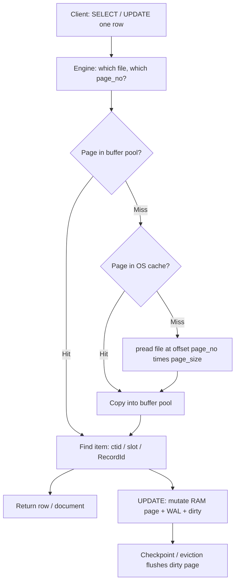
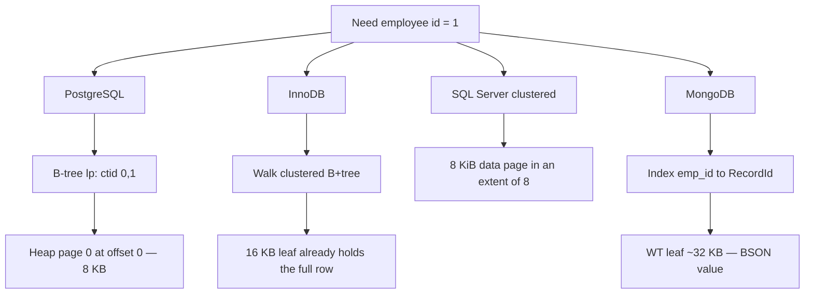

# Database Pages — Interview Notes (SQL, PostgreSQL, MongoDB)

> **Course:** Fundamentals of Database Engineering — Sec 3: Understanding the Database Internals  
> **Lecture / article:** Database Pages — a deep dive (Hussein Nasser)  
> **Goal:** After this note you can draw a page, compute `offset = page_no * page_size`, walk the buffer-pool read/write path, contrast SQL Server extents vs Postgres `ctid` vs WiredTiger leaves, and explain HOT — in a final-year CSE interview.

Lecture 17 said *the crate is the IO unit*. Lecture 18 said *what you pack in the crate changes OLTP vs OLAP*. This note opens the crate: **header, item pointers, tuples, special space, how the forklift addresses the warehouse file, and the cart (buffer pool) that keeps crates at the desk.**

---

## 1. One-Minute Interview Definition

A **page** (also: block, in some engines) is a **fixed-size byte array**. Tables, collections, rows, columns, indexes, sequences, documents, and graph edges all **end as bytes in a page**. The engine never fetches “one row from disk.” It fetches **one or more pages** in an **IO**.

That design does two jobs:

1. **Separates the storage engine from the frontend.** SQL / BSON / Cypher decide *what* a row or document is. The engine only knows *pages*: read, write, checksum, cache.
2. **Makes IO, caching, and recovery uniform.** One code path for heap pages, index pages, TOAST pages, undo pages: pin a page, copy it, WAL it, flush it.

Think of a **city library warehouse** (same as lecture 17):

1. Books live in **crates** (pages). A forklift cannot pick a single page of a book; it lifts the **whole crate**.
2. One forklift trip is an **IO**. The **cart at the desk** is the **buffer pool** — crates already in RAM.
3. The warehouse building is a **file**: crate 0, then crate 1, then crate 2, laid end to end. Address of crate `N` is `N × crate_size`.
4. Inside a crate: a **sticker sheet** (item IDs / slot array) plus the **books** (tuples / documents). Indexes store *sticker numbers*, not byte offsets, so the librarian can slide books around without reprinting the card catalog.

**Defaults to quote:** PostgreSQL / SQL Server / Oracle **8 KB**. MySQL InnoDB **16 KB**. MongoDB WiredTiger **leaf ~32 KB** (`leaf_page_max`), internal pages **~4 KB** (`internal_page_max`).

---

## 2. Sequential Thinking — Read and Write a Row

Use this order when an interviewer asks *“What happens when I `SELECT` / `UPDATE` one row?”*

```
Step 1  → Logical row / document (what the client asked for)
Step 2  → Find which page holds it (index → pointer, or seq scan)
Step 3  → Disk address: file + offset = page_no * page_size, length = page_size
Step 4  → Ask the OS to read that range. OS page cache hit? Else SSD/HDD.
Step 5  → Copy the page into the DB buffer pool / shared buffers / WT cache
Step 6  → Walk item IDs / slot array / RecordId to the bytes of that row
Step 7  → WRITE: mutate the in-memory page, append WAL, mark dirty; flush later
Step 8  → Neighbors on the page come along “for free” (locality). That is lectures 17 and 18.
```



### Analogy Mapping

| Real world | Idea | PostgreSQL | SQL Server / InnoDB | MongoDB WiredTiger |
|------------|------|------------|---------------------|--------------------|
| Spreadsheet row | Logical record | Heap tuple the SQL client sees | Data row | BSON document |
| Warehouse file of crates | Relation / data file | `base/<db>/<filenode>` | `.mdf` / `.ndf` pages; InnoDB `.ibd` | `collection-*.wt` (B-tree blocks) |
| One crate | Page | 8 KB (`BLCKSZ`) | 8 KiB (SQL Server); 16 KB (InnoDB) | On-disk leaf `leaf_page_max` ~32 KB |
| Sticker on a slot | Item identity | `ctid` = `(block, lp)` | Slot array index | RecordId (collection B-tree key) |
| Cart at the desk | DB cache | `shared_buffers` | Buffer pool | WiredTiger cache + eviction |
| Loading dock | OS page cache | Kernel cache of the heap file | Same | Same (plus WT’s own cache) |
| Forklift trip | IO | `pread` 8192 bytes | 8192 / 16384 bytes | Reconciled leaf (often compressed) |
| Nightly restock | Flush dirty pages | Checkpointer / bgwriter | Checkpoint | Reconciliation + eviction |
| Shipping log | WAL / redo | WAL (`pg_wal`) | T-log / InnoDB redo | Journal + WT log |

---

## 3. A Pool of Pages — Buffer Pool

The article’s first punchline: **databases read and write in pages**, and they keep a **pool of those pages in RAM**.

| Aspect | Explanation |
|--------|-------------|
| **Definition** | A fixed (or bounded) region of process memory that holds **copies of disk pages**. Postgres: **shared buffers**. InnoDB / SQL Server: **buffer pool**. WiredTiger: **cache** (in-memory page format ≠ on-disk format). |
| **Analogy** | The library **cart**. The warehouse is disk. You do not send the forklift for every sentence you read. You keep a few crates at the desk. When the cart is full, you send a crate back (evict / flush if dirty). |
| **Read path** | Locate `(file, page_no)` → pool hit? Return. Miss → OS `pread(fd, buf, page_size, offset)` → OS may satisfy from **its** cache without touching SSD → copy into a pool frame → pin → parse items. |
| **Write path** | Pin the page in the pool → change bytes in RAM → append a **WAL / redo / journal** record (durability) → mark the frame **dirty**. The page can take **more writes** before a checkpointer / eviction **flushes** it. That **amortizes IO**. |
| **Range-scan win** | One IO returns every row that shares the page. **Narrow rows → more rows per crate → more work per forklift trip.** That is why indexes that cluster related keys (InnoDB PK, Postgres `CLUSTER`, range scans) matter. |
| **Say this in an interview** | *"I never IO a row. I pin a page in the buffer pool. WAL makes the change durable before the dirty page needs to hit the data file. Two caches: the engine’s pool and the OS page cache."* |

**Two caches — say both, every time:**

1. **Database cache** — shared buffers / buffer pool / WT cache. The engine’s own frames, with pin counts, dirty bits, LSNs.
2. **OS page cache** — the kernel may already hold the file. A “disk IO” from the engine’s point of view can be a memcpy from kernel RAM.

Deletes and inserts use the same machinery (find a page with space, or allocate a new one). Implementation differs: Postgres **Free Space Map**, SQL Server **PFS + IAM**, InnoDB **page directory + splits**, WiredTiger **in-memory insert then reconcile**.

```sql
-- PostgreSQL
SHOW shared_buffers;          -- typical: 25% of RAM, often 128MB default in a laptop build
SHOW block_size;              -- 8192  (compile-time BLCKSZ)
SHOW effective_io_concurrency;
```

```sql
-- MySQL InnoDB
SHOW VARIABLES LIKE 'innodb_buffer_pool_size';
SHOW VARIABLES LIKE 'innodb_page_size';          -- 16384 unless you rebuilt the instance
SHOW VARIABLES LIKE 'innodb_flush_log_at_trx_commit';
```

```javascript
// MongoDB — not a classic "N frames of 32KB"; cache holds in-memory pages
db.serverStatus().wiredTiger.cache;
// useful keys: "bytes currently in the cache",
//              "tracked dirty bytes in the cache",
//              "pages evicted by application threads"
```

**Eviction / replacement (so you can name it):** Postgres shared buffers use a **clock-sweep** (usage count), not textbook LRU. InnoDB buffer pool is LRU-ish with a **young/old** split so scans do not wipe the working set. WiredTiger has an **eviction server** plus worker threads; if they lag, **your query thread** reconciles pages (`pages evicted by application threads` in `serverStatus`).

**Cost story:** SSD random read is tens to hundreds of microseconds; RAM is nanoseconds. A 334-page seq scan vs one cached heap page is the difference between “fine” and “timeout.” The pool exists so the second `SELECT` of a neighbor row is **free**.

---

## 4. Page Content — What You Pack

Hussein: *what you store in pages is up to you.* The packing is lecture 18. The **goal is a useful page read** — as much work as possible from one forklift trip. If you lift many crates for tiny work, **remodel** (narrower rows, better clustering, covering index, columnar replica).

| Packing | What a page holds | Workload that loves it |
|---------|-------------------|------------------------|
| **Row store (NSM)** | Whole tuples, one after another | OLTP: `SELECT *`, single-row UPDATE |
| **Column store (DSM)** | Many values of **one** column | OLAP: `SUM(salary)` |
| **Document** | Compressed BSON (row-shaped payload) | Point get of a whole document |
| **Graph** | Adjacency packed so a page walk is a graph walk | Traversal depth vs breadth (tune locality) |

```text
Row page (OLTP crate)                    Column stripe (OLAP crate)
┌─────────────────────────────┐          ┌──────────────────────────┐
│ John,111,101000,eng,…       │          │ 101000,102000,103000,…   │
│ Kary,222,102000,mgr,…       │          │  (salaries only)         │
│ Norman,333,103000,mkt,…     │          └──────────────────────────┘
└─────────────────────────────┘            one IO = payroll, not people
  one IO = three whole employees
```

Document engines (MongoDB regular collections) **compress documents and store them in pages like row stores**. Graph engines pack edges so a page read advances the traversal. Same crate; different books.

**Say this in an interview:** *"The page is the IO quantum. Packing is a data-modeling decision: neighbors on the page should be the bytes the next query needs."*

---

## 5. Small vs Large Pages

| | Smaller pages | Larger pages |
|--|---------------|--------------|
| Cold read / write | Closer to media block size; less amplification for a **random point** lookup | More bytes per IO; slower cold miss if you needed one row |
| Header overhead | High: 24–96 B header on a 4 KB page wastes a bigger **fraction** | Low: same header on 32 KB is cheap |
| Page splits | More frequent (B-tree leaves fill faster) | Fewer splits, bigger split cost |
| Range scans | More IOs to walk a range | Better sequential transfer (WiredTiger’s reason for 32 KB leaves) |
| Cache density | More frames, finer eviction | One “hot” oversized page can waste RAM |

**Of course it gets messy near the SSD** (NVMe zones, KV namespaces). Interview-level: know the **defaults** and that they are **not free knobs**.

| Engine | Default page | How you change it |
|--------|--------------|-------------------|
| PostgreSQL | 8 KB | **Compile-time** `BLCKSZ` (recompile; 32 KB max in practice). Not a `postgresql.conf` toggle. |
| SQL Server | 8 KiB | Fixed. You do not pick 16 KB data pages. |
| Oracle | 8 KB typical | Block size at tablespace create (multiple block sizes possible). |
| MySQL InnoDB | 16 KB | `innodb_page_size` at **instance init** (4/8/16/32/64 KB). Cannot change later. |
| MongoDB WiredTiger | Leaf **32 KB**, internal **4 KB** | Per-table `leaf_page_max` / `internal_page_max`. In-memory pages can grow to `memory_page_max` (default 5 MB) before split/reconcile. |

**Say this in an interview:** *"Defaults work for most OLTP. I quote 8 / 16 / 32 KB so the interviewer knows I have touched three engines. I do not casually retune BLCKSZ."*

---

## 6. How Pages Are Stored on Disk

One common design: **one file per table (or tablespace), an array of fixed-size pages.** Page 0, then page 1, then page 2. To read from disk you need **filename, offset, length**. This layout gives you all three.

```text
offset = page_number * page_size
length = page_size          (or N * page_size for a multi-page read)
```

**Worked example** (article; **arithmetic corrected**): table `test`, page size **8 KB = 8192** bytes. Read **pages 2 through 9** (8 pages).

```text
offset = 2 * 8192 = 16384 bytes     -- not 16484
length = 8 * 8192 = 65536 bytes
```

The article’s “16484” is a slip; `2 × 8192 = 16384`. Use the formula, not the typo.

```text
File: test (or Postgres relfilenode)

 byte 0          8192         16384        24576              81920
 ┌─ page 0 ─┬─ page 1 ─┬─ page 2 ─┬─ page 3 ─┬ … ┬─ page 9 ─┐
 │          │          │◄── read 8 pages, 64 KB ──────────►│
 └──────────┴──────────┴──────────┴──────────┴────┴─────────┘
```

**Every engine is different after this sentence:**

- **PostgreSQL heap:** almost exactly this — `base/<dboid>/<filenode>` is an array of 8 KB pages. `get_raw_page('emp', 2)` is page 2. Forks: FSM, VM, TOAST are extra files.
- **SQL Server:** pages numbered 0…n inside `.mdf`/`.ndf`, but **extents** (8 contiguous pages) are the allocation unit. Page 0 of a file is the file header, then PFS/GAM/SGAM metadata pages at fixed intervals.
- **InnoDB:** pages live in a **tablespace** (`.ibd`). The clustered index is a B+tree of 16 KB pages, not an unordered heap array. Offset is still `page_no * 16384` inside the space, but you find `page_no` by walking the B+tree, not by “row 1000 / 3.”
- **MongoDB WiredTiger:** `collection-*.wt` is a **B-tree file managed by a block manager**. On-disk “pages” are reconciled leaves (compressed, often not a trivial `page_no * 32KB` heap). In-memory pages are a **different format**. Do not draw a Postgres-style heap file and label it MongoDB.

```sql
-- PostgreSQL: prove the array-of-pages story
CREATE TABLE emp (
  emp_id int, emp_name text, emp_salary numeric
);
INSERT INTO emp SELECT g, 'n' || g, g * 100
FROM generate_series(1, 1000) g;

SELECT
  pg_relation_filepath('emp') AS file,           -- base/16384/16385
  current_setting('block_size')::int AS page_bytes,
  pg_relation_size('emp') / current_setting('block_size')::int AS n_pages;

-- Logical pointer: page number + line pointer (not a byte offset)
SELECT ctid, emp_id FROM emp WHERE emp_id = 1;
-- ctid (0,1)  →  file offset 0 * 8192, then item 1 on that page
```

**Say this in an interview:** *"If I know page number and page size, I know the file offset. Postgres heaps are that simple. InnoDB and WiredTiger still IO pages, but the file is a B-tree of pages, not an append-only heap array."*

---

## 6.1 Simulation — Count the IOs Yourself

Reuse lecture 17’s density: **3 rows per 8 KB page**, employees `emp_id` 10, 20, … on pages 0, 1, 2, …. Eddard (`emp_id = 10000`) is **page 333**.

**Read `SELECT * FROM emp WHERE emp_id = 10000` with an index** (lecture 17):

```text
IO 1..h   index pages  (root often already in the pool → 0 disk)
IO h+1    heap page 333 at offset 333 * 8192 = 2,727,936
          length 8192
          OS cache? skip SSD. Pool hit? skip OS too.
Result    whole crate 333 — Eddard plus the other 2 rows on that page “for free”
```

**Read pages 2 through 9** of `test` (article example, 8 KB pages) — a sequential prefetch / bitmap heap scan flavor:

```text
one pread:  offset 16384, length 65536
up to 8 pool frames filled
if the scan is truly sequential, OS readahead may have pulled them already
```

**Write `UPDATE emp SET salary = salary + 1 WHERE emp_id = 10000`:**

```text
1. Pin heap page 333 in shared_buffers / buffer pool (read it if missing).
2. Append WAL: "on this page, this tuple, new salary"  →  fsync WAL (settings permitting).
3. Mutate the in-memory page; mark dirty.  Do NOT wait for the data file.
4. Later: checkpointer / bgwriter / eviction writes page 333 back at offset 2,727,936.
5. Postgres HOT: if the new tuple fits on 333 and indexed cols unchanged → no index WAL.
   Else: new page, index updates, more dirty pages.
```

**Deletes / inserts:** same pin-mutate-WAL-dirty loop. Insert needs a page with free space (Postgres **FSM**; SQL Server **IAM + PFS**; InnoDB may **split** a full leaf).


That is the article: *the page can remain in memory so it may receive more writes before it is flushed, minimizing IOs.*

---

## 7. SQL Server — Pages and Extents

Microsoft’s guide ([Page and Extent Architecture](https://learn.microsoft.com/en-us/sql/relational-databases/pages-and-extents-architecture-guide)): the disk space of a data file is divided into **pages numbered 0…n**. **All I/O against data files is at page granularity.** Transaction logs (`.ldf`) are **not** paged — they are variable-size log records.

### 7.1 The 8 KiB data page

Every page is **8 KiB**. Each begins with a **96-byte header** (page number, page type, object/index IDs, …). Rows grow from just after the header toward the end. A **slot array** grows from the **end** toward the start. Each slot is **2 bytes**: byte offset of that row from the start of the page.

```text
SQL Server data page (8 KiB) — rows down, slots up

Offset 0
┌────────────────────────────────────────┐
│ Page header (96 bytes)                 │  page id, type, object, …
├────────────────────────────────────────┤
│ Row 0                                  │
│ Row 1                                  │  not necessarily key order on disk
│ Row 2                                  │
│ …                                      │
├────────────────────────────────────────┤
│            free space                  │
├────────────────────────────────────────┤
│ Slot array  …  slot2  slot1  slot0     │  each 2 bytes, logical order
└────────────────────────────────────────┘
Offset 8192
```

Rows on a page may be **physically unordered** (deletes punch holes; inserts reuse them). The slot array stays in **logical** order (e.g. clustered key order). That is the same idea as Postgres line pointers: **identity is a slot, not a frozen byte offset.**

**8,060-byte in-row limit.** A single row’s in-row data + overhead must fit. LOB types (`varchar(max)`, `xml`, …) spill to **Text/LOB** pages (`LOB_DATA`) with a 16-byte pointer in-row. Variable columns that together exceed 8,060 go to **`ROW_OVERFLOW_DATA`** (24-byte pointer). Clustered index **keys** cannot live in overflow.

### 7.2 Page types

| Page type | Stores |
|-----------|--------|
| **Data** | Rows (in-row data) |
| **Text/LOB** | Large object bytes |
| **Index** | B-tree structures |
| **GAM / SGAM** | Which extents are free / mixed-with-space |
| **PFS** | Per-page alloc + free-space buckets |
| **IAM** | Extents belonging to one allocation unit (heap/index partition) |
| **BCM** | Extents touched by bulk ops since last log backup |
| **DCM** | Extents changed since last full backup (differential backup) |

Book analogy from the docs: most pages are **content**; some are **table of contents** (allocation maps).

### 7.3 Extents — 8 pages, 64 KiB

An **extent** is **eight physically contiguous pages** (64 KiB). Every page belongs to an extent. Two kinds:

- **Uniform:** all eight pages owned by **one** object (one table/index).
- **Mixed:** up to **eight objects** share the eight pages (one page each).

SQL Server **2016+** uses **uniform extents** for user databases and `tempdb` (except the first eight pages of an IAM chain). Mixed was the old small-table default (and `master`/`msdb`/`model` still behave the old way).

**GAM:** 1 bit per extent in a ~4 GiB interval (~64,000 extents); `1` = free, `0` = allocated. **SGAM:** `1` = mixed extent that still has a free page. Combined:

| Extent state | GAM | SGAM |
|--------------|-----|------|
| Free, unused | 1 | 0 |
| Uniform, or mixed and full | 0 | 0 |
| Mixed with at least one free page | 0 | 1 |

Allocate a uniform extent: find GAM `1`, set `0`. Find a mixed hole: scan SGAM for `1`. Allocate a new mixed extent: GAM `1→0` and SGAM `0→1`. Free an extent: GAM `1`, SGAM `0`.

**PFS:** 1 **byte** per page (allocated? empty / 1–50% / 51–80% / 81–95% / 96–100% full). Repeats every **8,088 pages** (page 1, 8088, 16176, …). Heaps use PFS to find a hole; **B-tree indexes do not** — the insert point is the key, and a full leaf **splits**.

**File start (after page 0 = file header):** PFS, then GAM, then SGAM, then data. New PFS/GAM/SGAM pages appear at their intervals as the file grows.

**Proportional fill:** in a filegroup, allocate from files in proportion to free space so files stay similarly full.

**IAM:** bitmap of extents owned by an allocation unit (`IN_ROW_DATA`, `LOB_DATA`, `ROW_OVERFLOW_DATA`). IAM pages **chain** if the object spans files or 4 GiB intervals. Heaps: IAM → candidate extents → PFS → page with room.

**DCM / BCM** sit on the same 4 GiB GAM interval: DCM = extents dirty since last **full backup** (differential backups read this, not the whole file). BCM = extents touched by **bulk-logged** ops since last log backup (only matters in bulk-logged recovery).

```sql
-- T-SQL (not MySQL): peek at a page header (SQL Server 2019+)
SELECT *
FROM sys.dm_db_page_info(DB_ID(), FILE_ID('PRIMARY'), 1, 'DETAILED');
-- page_type_desc, object_id, index_id, …

-- Unsupported legacy (know the name, prefer dm_db_page_info):
-- DBCC PAGE ( dbname, fileid, pageid, printopt )
```

```sql
CREATE TABLE emp (
  id         INT NOT NULL PRIMARY KEY,
  first_name VARCHAR(32) NOT NULL,
  ssn        INT NOT NULL,
  salary     DECIMAL(12,2) NOT NULL
);
-- Clustered PK: data pages *are* the leaf of the B-tree (like InnoDB).
-- Heap (no clustered index): unordered data pages, IAM+PFS find free space.
```

**Say this in an interview:** *"SQL Server IOs 8 KB pages. It allocates 64 KB extents. GAM/PFS/IAM are the table of contents for those extents. The slot array is their ctid."*

---

## 8. PostgreSQL Page Layout

Official: [Database Page Layout](https://www.postgresql.org/docs/current/storage-page-layout.html). Every table and index is an array of **usually 8 kB** pages. Sequences and TOAST tables use the same format. Heap AM **always** uses this layout; index AMs reuse the header and put extra bytes in **special space**.

### 8.1 Five parts of a page

| Part | Size | Role |
|------|------|------|
| **PageHeaderData** | **24 bytes** | LSN, checksum, flags, `pd_lower`, `pd_upper`, `pd_special`, page size/version, `pd_prune_xid` |
| **ItemIdData** | **4 bytes each** | `(offset, length, flags)` — the sticker. Grows from the header into free space. |
| **Free space** | variable | `pd_lower` → `pd_upper`. New ItemIds from the start; new tuples from the end. |
| **Items** | variable | Heap tuples packed **backwards** from `pd_upper`. |
| **Special space** | variable | Empty on heap (`pd_special = page size`). B-tree: **left/right sibling** links. |

`PageHeaderData` fields (interview-level, from the docs):

| Field | Bytes | Meaning |
|-------|-------|---------|
| `pd_lsn` | 8 | WAL LSN of the last change to this page (recovery / checksum) |
| `pd_checksum` | 2 | If data checksums are on |
| `pd_flags` | 2 | Flag bits |
| `pd_lower` | 2 | Start of free space (just after the last ItemId) |
| `pd_upper` | 2 | End of free space (just before the last tuple) |
| `pd_special` | 2 | Start of special space |
| `pd_pagesize_version` | 2 | Size + layout version (version 4 since 8.3) |
| `pd_prune_xid` | 4 | Oldest unpruned `xmax` — hint that HOT pruning may pay off |

When `pd_lower` meets `pd_upper`, the page is full (for new ItemIds + tuples). An ItemId is **never moved until freed**, which is why its **index** is a stable `ctid` component even after compaction.

```text
Postgres heap page (BLCKSZ = 8192)

Offset 0
┌──────────────────────────────────────────────┐
│ PageHeaderData (24 B)                        │  pd_lsn, pd_checksum,
│                                              │  pd_lower, pd_upper, pd_special
├──────────────────────────────────────────────┤
│ ItemId lp1, lp2, lp3, …  (4 B each)          │  grow downward
├──────────────────────────────────────────────┤
│              unallocated free space          │  pd_lower → pd_upper
├──────────────────────────────────────────────┤
│ … tuple 3, tuple 2, tuple 1                  │  grow upward from pd_upper
│ HeapTupleHeader (~23 B) + null bitmap + cols │
├──────────────────────────────────────────────┤
│ Special (empty on heap)                      │  B-tree: sibling page numbers
└──────────────────────────────────────────────┘
Offset 8192
```

**Why ItemIds exist:** `ctid` / `ItemPointer` = **(page number, index of the ItemId)**. The 4-byte sticker **does not move** when VACUUM slides tuple bytes to compact the hole. **Indexes keep pointing at the same lp.** That indirection is also what **HOT** rides on.

Hussein’s criticism: *1000 items × 4 B = 4 KB, half the page wasted on pointers.* Treat it fairly:

- The **ceiling** is real: each item costs 4 B of directory.
- You **cannot** store 1000 useful heap rows on 8 KB. `HeapTupleHeaderData` is **23 bytes** before user columns, plus alignment, plus ItemId. A skinny `int` row is still tens of bytes. Typical packing is tens to low hundreds of tuples per page, so ItemIds are hundreds of bytes, not 4 KB.
- The 4 B pointer is the price of **stable index identities** and **in-page compaction**.

**Row vs tuple vs item** (article — say this in MVCC interviews):

- **Row** — what SQL sees (`emp_id = 1`).
- **Tuple** — one physical version on a page (`xmin`/`xmax`).
- **Item** — that tuple as addressed by an ItemId. One row can have **many tuples** (live + old snapshots + dead). Ten versions ≠ ten user rows.

### 8.2 HeapTupleHeader

| Field | Role |
|-------|------|
| `t_xmin` / `t_xmax` | Insert / delete XID (MVCC visibility) |
| `t_cid` | Command ID |
| `t_ctid` | This version, or **newer** version after UPDATE (HOT chain) |
| `t_infomask` / `t_infomask2` | Flags, attribute count, HOT bits |
| `t_hoff` | Offset to user data (aligned) |

Null bitmap if `HEAP_HASNULL`. User columns follow `t_hoff`. `varlena` values may be **inline, compressed, or TOAST**.

Index **page 0** is typically a **metapage**. Leaf pages fill special space with sibling links so `BETWEEN` walks leaves without climbing to the root every step.

### 8.3 HOT — Heap-Only Tuple

[HOT](https://www.postgresql.org/docs/current/storage-hot.html): if `UPDATE` fits the **new version on the same page** and **indexed columns did not change**, Postgres:

1. Writes the new tuple on that page.
2. Sets `t_ctid` of the old tuple to the new lp.
3. Marks old `HEAP_HOT_UPDATED`, new `HEAP_ONLY_TUPLE`.
4. **Does not maintain indexes.** Indexes still point at the **root** lp of the chain.

If the new version **does not fit**, HOT fails: new page, **all indexes updated** (cold update). `fillfactor` < 100 leaves air for HOT.

Analogy: the card catalog still says “crate 0, sticker 2.” Inside the crate, sticker 2 now says “see sticker 7.” You did not reprint every catalog card.

```sql
CREATE EXTENSION IF NOT EXISTS pageinspect;

CREATE TABLE emp (
  emp_id     int PRIMARY KEY,
  emp_name   text,
  emp_salary numeric  -- not indexed: HOT-friendly
);
INSERT INTO emp VALUES (1, 'John', 101000);

SELECT ctid, emp_id, emp_salary FROM emp;
-- (0,1)

UPDATE emp SET emp_salary = 102000 WHERE emp_id = 1;
SELECT ctid, emp_id, emp_salary FROM emp;
-- still (0,1) from SQL’s view of the live row; chain is on the page

SELECT lp, lp_off, lp_len, t_xmin, t_xmax, t_ctid,
       heap_tuple_infomask_flags(t_infomask, t_infomask2) AS flags
FROM heap_page_items(get_raw_page('emp', 0));
-- old lp: HEAP_HOT_UPDATED, t_ctid → new lp
-- new lp: HEAP_ONLY_TUPLE  (no extra index entry)
```

**Say this in an interview:** *"ctid is page plus line-pointer slot, not a byte offset. HOT is an in-page UPDATE that leaves indexes alone. That is why fillfactor and not indexing every column matter."*

---

## 9. InnoDB 16 KB Page (SQL / MySQL)

InnoDB’s default page is **16 KB** (`innodb_page_size`). Everything — clustered rows, secondary indexes, undo — is pages in a tablespace. The table **is** the clustered B+tree; a data page is an **index leaf** holding **full rows** (lecture 17).

```text
InnoDB INDEX page (16 KB, simplified)

Offset 0
┌────────────────────────────────────────────┐
│ FIL header (~38 B)                         │  page no, space id, checksum,
│                                            │  LSN, type, prev/next page
├────────────────────────────────────────────┤
│ Page header                                │  heap top, n records, direction
├────────────────────────────────────────────┤
│ Infimum  (virtual −∞ key)                  │  always there
│ Supremum (virtual +∞ key)                  │
├────────────────────────────────────────────┤
│ User records (PK order, singly linked)     │
├────────────────────────────────────────────┤
│                 free space                 │
├────────────────────────────────────────────┤
│ Page directory (2-byte slots, binary search)│  grows up from the trailer
├────────────────────────────────────────────┤
│ FIL trailer (8 B) checksum + LSN           │  must match header (torn write)
└────────────────────────────────────────────┘
Offset 16384
```

- **Infimum / supremum:** sentinels. User records form a linked list from infimum to supremum in PK order.
- **Page directory:** slots for binary search inside the page (every few records).
- **Prev/next** in the FIL header link **leaf siblings** — range scan without climbing.
- A row must **fit on a page** (with overflow pages for long columns). That is the 8 KB-class limit scaled to 16 KB, plus `ROW_FORMAT`.
- **Torn pages:** the 8-byte trailer LSN/checksum must match the header after a crash. InnoDB also has a **doublewrite buffer** so a half-written 16 KB page can be recovered. SQL Server has **torn-page detection** / checksums. Postgres checksums are optional (`data_checksums`).

Same `emp` insert still dirties **one leaf page** plus undo/redo — NSM write path from lecture 18.

```sql
SHOW VARIABLES LIKE 'innodb_page_size';   -- 16384

CREATE TABLE emp (
  id         INT NOT NULL PRIMARY KEY,
  first_name VARCHAR(32) NOT NULL,
  ssn        INT NOT NULL,
  salary     DECIMAL(12,2) NOT NULL,
  KEY idx_ssn (ssn)
) ENGINE=InnoDB;

EXPLAIN SELECT * FROM emp WHERE id = 1;
-- clustered leaf page already has the full row

EXPLAIN SELECT SUM(salary) FROM emp;
-- type ALL: every leaf page, every column rides along (lecture 18)
```

**Say this in an interview:** *"InnoDB pages are 16 KB B+tree nodes with infimum/supremum and a trailer checksum. The buffer pool caches those pages. I still never IO a single row."*

---

## 10. MongoDB WiredTiger — Pages, Cache, Eviction

Regular collections store **compressed BSON documents on leaf pages**, row-store style (`BTREE_ROW`). WiredTiger is **not** a Postgres heap file.

Three sizes that matter ([WiredTiger: Tuning page size](https://source.wiredtiger.com/mongodb-6.0/tune_page_size_and_comp.html)):

| Knob | Default | Meaning |
|------|---------|---------|
| `leaf_page_max` | **32 KB** | Max **on-disk** leaf after reconciliation; then split |
| `internal_page_max` | **4 KB** | Internal (keys only); sized for CPU cache |
| `memory_page_max` | **5 MB** | Max **in-memory** page before split/reconcile |

**In-memory format ≠ on-disk format.** Dirty in-RAM pages **reconcile** into on-disk pages; the **block manager** writes **allocation_size** chunks (optional block compression: snappy default on collections). **Eviction** (LRU-ish workers) keeps the cache under `eviction_target` (~80%); at `eviction_trigger` (~95%) **application threads** help evict — that is the latency spike interview.

**Overflow:** keys/values too large for the page live **off-page**, extra IO, and overflow values are **not cached** like normal values.

Do **not** confuse this with WiredTiger’s recno **column-store** file format (lecture 18 trap) or with MongoDB **time series** columnar buckets.

```javascript
db.emp.drop();
db.emp.insertMany([
  { emp_id: 1, emp_name: "John", salary: 101000 },
  { emp_id: 2, emp_name: "Kary", salary: 102000 }
]);

db.emp.find({ emp_id: 1 }).explain("executionStats");
// IXSCAN _id or COLLSCAN → FETCH whole BSON from a leaf page in WT cache

db.emp.createIndex({ emp_id: 1 });
db.emp.find({ emp_id: 1 }, { emp_name: 1, _id: 0 }).explain("executionStats");

printjson(db.serverStatus().wiredTiger.cache);
// "maximum bytes configured"  (~50% of RAM − 1GB typical)
// "pages currently held in the cache"
// "tracked dirty bytes in the cache"
```

Optional per-collection (advanced; defaults are fine):

```javascript
db.createCollection("emp_bigleaf", {
  storageEngine: {
    wiredTiger: {
      configString: "leaf_page_max=64KB,internal_page_max=16KB"
    }
  }
});
```

**Say this in an interview:** *"MongoDB still IOs pages. WiredTiger leaves default to 32 KB. The cache holds a different in-memory shape; eviction and reconciliation replace a simple dirty-frame flush. COLLSCAN still reads whole documents off those leaves."*

---

## 11. Side-by-Side — Same `emp` Row, Three Pages



```text
Addressing recap

Postgres     offset = blockno * 8192     item = line pointer on that page
SQL Server   page in file, slot array    extent = 8 pages for allocation
InnoDB       page in tablespace * 16384  infimum → … → supremum
WiredTiger   block manager + leaf image  RecordId is the B-tree key
```

---

## 12. How to Use This in an Interview

### 60-Second Spoken Answer

> *"Everything in a database becomes a fixed-size page — 8 KB in Postgres and SQL Server, 16 KB in InnoDB, about 32 KB for a WiredTiger leaf. The engine never reads a row from disk; it reads a page into a buffer pool. The OS may already have that page in its cache.*
>
> *On disk a heap is often just an array of pages, so offset equals page number times page size. Inside the page, Postgres uses 4-byte line pointers and SQL Server a slot array so indexes can name a slot while the engine slides bytes during compaction. HOT is Postgres keeping an UPDATE on the same page so indexes do not change.*
>
> *SQL Server allocates those pages in 64 KB extents and tracks them with GAM and PFS. InnoDB’s page is a B+tree node with infimum and a trailer checksum. MongoDB reconciles a different in-memory page onto disk and evicts with background threads. Packing — row versus column — is a separate lecture; the IO quantum is still the page."*

### If They Go Deeper — Answer Ladder

| Question | Answer direction |
|----------|------------------|
| *"Why not IO one row?"* | Disk, filesystem, and checksums operate on blocks. Extra rows on the page are locality (and the reason random IOs hurt). |
| *"Buffer pool vs OS cache?"* | Engine frames (pins, dirty, LSN) vs kernel file cache. A pool miss can still avoid the SSD. |
| *"WAL vs data file?"* | Log is sequential and must hit disk at commit (depending on sync settings). Dirty pages flush later. That is how you batch writes. |
| *"What is ctid?"* | `(block_number, line_pointer_index)`. Not `emp_id`. Not a byte offset. Can change if the row moves pages (non-HOT UPDATE). |
| *"Slot array vs ItemId?"* | Same idea: directory of offsets at one edge of the page. SQL Server slots 2 B; Postgres ItemIds 4 B (offset+length+flags). |
| *"What is an extent?"* | SQL Server: 8 contiguous 8 KB pages (64 KB). Allocation bitmap unit (GAM). Postgres allocates in different units (typically 8 KB pages + FSM); do not say “Postgres extents” unless you mean something else (e.g. Oracle). |
| *"HOT?"* | Same-page UPDATE, indexed columns unchanged → chain via `t_ctid`, skip index maintenance. Needs free space (`fillfactor`). |
| *"Row vs tuple vs item?"* | User row; MVCC version; page slot pointing at that version. One row, many tuples. |
| *"8,060 bytes?"* | SQL Server in-row max. LOB/overflow pointers. Not Postgres (TOAST) and not InnoDB’s exact number. |
| *"Can I set Postgres to 32 KB pages?"* | Only by **compiling** `BLCKSZ`. Not `ALTER SYSTEM`. |
| *"WiredTiger 32 KB vs 5 MB?"* | 32 KB is **on-disk leaf max**. 5 MB is **in-memory** `memory_page_max` before split/reconcile. |
| *"Covering index vs page packing?"* | Covering avoids a heap fetch (lecture 17). Packing decides which bytes share an IO (this lecture + 18). |
| *"ItemIds waste half the page?"* | Only in the 1000-empty-slot thought experiment. Tuple headers ~23 B cap how many items you can have. |

### Common Mistakes (avoid these)

1. **“The database reads one row from disk.”** It reads a **page**.
2. **“ctid is a byte offset.”** It is a **line-pointer index**.
3. **Using the article’s 16484.** `2 × 8192 = 16384`.
4. **“Postgres page size is in postgresql.conf.”** `block_size` is **read-only**, set at compile.
5. **Calling Cassandra / WT column-store “pages of columns”** without the lecture 18 distinction.
6. **Drawing MongoDB as a heap file of 32 KB slots.** Block manager + reconciliation.
7. **“SQL Server mixed extents always.”** 2016+ user DBs default **uniform**.
8. **Ignoring the OS cache** when explaining “why was it fast the second time?”
9. **Confusing WAL durability with data-page flush.** Commit ≠ checkpoint.
10. **Saying HOT updates indexes.** HOT is the path that **does not**.

---

## 13. Cheat Sheet (Glance Before the Interview)

1. **Page = IO unit.** Postgres/SQL Server 8 KB, InnoDB 16 KB, WT leaf ~32 KB.
2. **Buffer pool** holds pages in RAM; **WAL** then **dirty flush**. Two caches: engine + OS.
3. **`offset = page_no × page_size`.** Pages 2–9 at 8 KB → offset **16384**, length **65536**.
4. **Pack neighbors you will read together** (row vs column vs document).
5. **Postgres:** 24 B header, 4 B ItemIds, tuples from the end, `ctid = (block, lp)`, HOT.
6. **SQL Server:** 96 B header, 2 B slots, **extent = 8 pages**, GAM/PFS/IAM.
7. **InnoDB:** 16 KB index page, infimum/supremum, FIL trailer checksum, clustered leaf = row.
8. **MongoDB:** WT cache + eviction; on-disk leaf 32 KB; BSON is row-shaped.
9. **Small vs large pages:** header fraction vs cold-IO vs splits. Defaults are there for a reason.
10. **Row ≠ tuple ≠ item.** MVCC versions share a user row; items are slots.
11. **Prove it:** `pageinspect` / `ctid`, `sys.dm_db_page_info`, `innodb_page_size`, `wiredTiger.cache`.
12. **Indexes store page+slot (or PK, or RecordId)** so the engine can compact bytes inside the crate.

---

## 14. Sources

- Hussein Nasser, *Database Pages — A deep dive* (course article; crate/buffer-pool/HOT narrative)
- Lectures: [17-How-tables-and-indexes-are-stored-in-a-disk.md](17-How-tables-and-indexes-are-stored-in-a-disk.md), [18-Row-based-and-Coloumn-based-database.md](18-Row-based-and-Coloumn-based-database.md)
- [SQL Server: Page and Extent Architecture Guide](https://learn.microsoft.com/en-us/sql/relational-databases/pages-and-extents-architecture-guide)
- [PostgreSQL: Database Page Layout](https://www.postgresql.org/docs/current/storage-page-layout.html)
- [PostgreSQL: Heap-Only Tuples (HOT)](https://www.postgresql.org/docs/current/storage-hot.html)
- [PostgreSQL: pageinspect](https://www.postgresql.org/docs/current/pageinspect.html)
- [PostgreSQL: Database File Layout](https://www.postgresql.org/docs/current/storage-file-layout.html)
- [WiredTiger: Tuning page size and compression](https://source.wiredtiger.com/mongodb-6.0/tune_page_size_and_comp.html)
- [WiredTiger: Eviction](https://source.wiredtiger.com/develop/arch-eviction.html)
- [MongoDB: WiredTiger Storage Engine](https://www.mongodb.com/docs/manual/core/wiredtiger/)
- [MySQL: InnoDB disk I/O and page size](https://dev.mysql.com/doc/refman/8.4/en/innodb-parameters.html#sysvar_innodb_page_size)
